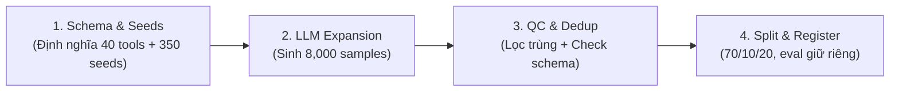

# [CONCEPT & GUIDELINE] Chiến lược & Quy trình Tạo Bộ Dữ liệu CustomTools-VI (~8,000 samples)

> **Hướng dẫn tổng quan dành cho Team**: Tài liệu này tập trung vào **Ý tưởng cốt lõi, Phương pháp luận, Quy chuẩn Dữ liệu và Workflow sinh/kiểm định data**. Có thể áp dụng trên bất kỳ thư viện, repository hoặc ngôn ngữ lập trình nào.

---

## 1. Ý tưởng Cốt lõi (Core Idea)

Dữ liệu dịch từ tiếng Anh (Glaive, xLAM) giải quyết được khả năng hiểu Tool Calling tổng quát, nhưng **bị hổng hoàn toàn ở ngữ cảnh Việt Nam** (tên quán ăn, địa danh 63 tỉnh thành, format tiền VNĐ, Shopee/Grab, CCCD, BHYT, từ lóng tiếng Việt...).

### Mục tiêu bộ CustomTools-VI
- Tạo **8,000 mẫu dữ liệu chuẩn JSON Schema** thuộc 40 tools / 10 nhóm chức năng thuần Việt.
- Tỉ lệ mẫu: **60% Positive (4,800 mẫu có gọi tool)** + **40% Negative (3,200 mẫu KHÔNG gọi tool)**.
- Tỉ lệ phân chia: **5,600 Train** / **800 Val** (`400 seen + 400 unseen`) /
  **1,600 Test** (`800 seen + 800 unseen`).
- **Mục đích đánh giá**:
  - `Train (5,600 mẫu)`: Chỉ tập train được đưa vào E5 để model học ngữ cảnh VN.
  - `Val (800 mẫu)`: Dùng model selection/diagnostic, không trộn vào training.
  - `Test (1,600 mẫu)`: **Giữ riêng** làm bộ benchmark chuyên biệt kiểm chứng năng lực tiếng Việt (đo chỉ số ArgA & Tool Accuracy trước và sau khi thêm data VN).

---

## 2. Tổng quan 10 Nhóm Tool (40 Tools)

| STT | Nhóm chức năng (`feature_group`) | Số Tool | Ví dụ tiêu biểu |
|---|---|---|---|
| 1 | 🍜 Ẩm thực & Đặc sản | 4 | Tìm phở/bún bò theo vùng, đặt món, công thức món VN |
| 2 | 🗺️ Du lịch & Địa danh | 4 | Vé máy bay/xe khách nội địa (Vietjet, VNA, Phương Trang), đặt phòng, địa điểm |
| 3 | 💰 Tài chính & Ngân hàng | 4 | Chuyển khoản (Vietcombank, BIDV...), tra tỉ giá, lãi suất vay, thanh toán hóa đơn |
| 4 | 🏫 Giáo dục Việt Nam | 4 | Tra điểm chuẩn ĐH, lịch thi THPT QG/ĐGNL/IELTS, tìm gia sư, học bổng |
| 5 | 🏥 Y tế & Sức khỏe | 4 | Đặt lịch khám BHYT/Bệnh viện Chợ Rẫy/ĐHYD, tra cứu thuốc, nhà thuốc |
| 6 | 🛒 Thương mại điện tử | 4 | Tìm đồ Shopee/Lazada/Tiki, tra đơn GHN/GHTK, so sánh giá, mã giảm giá |
| 7 | 🚗 Giao thông & Di chuyển | 4 | Đặt xe Grab/Be/XanhSM, kiểm tra phạt nguội biển số xe, tuyến xe buýt |
| 8 | 📋 Hành chính công | 4 | Tra tiến độ CCCD, thủ tục hành chính, bảng giá đất, tính thuế TNCN |
| 9 | 🎭 Giải trí & Lịch âm | 4 | Đổi lịch âm/dương (Mùng 1 Tết), tử vi 12 con giáp, vé sự kiện, bài hát karaoke |
| 10 | 🌾 Nông nghiệp & Thời tiết | 4 | Dự báo thời tiết tỉnh/thành, tra giá nông sản (cà phê, sầu riêng), lịch mùa vụ |

---

## 3. Cấu trúc Master Schema Chuẩn (Canonical Master Schema)

Dữ liệu xuất ra ở định dạng **JSON Lines (.jsonl)**, mỗi dòng khớp **100% cấu trúc Master Schema của hệ thống**:

### 3.1 Mẫu Positive Sample (Có gọi 1 hoặc nhiều tools)

```json
{
  "id": "custom_vi_00001",
  "source": "custom_vi",
  "query": "Tìm quán bún bò Huế ngon ở quận Bình Thạnh giá dưới 50k",
  "function_calls": [
    {
      "name": "find_restaurant",
      "arguments": {
        "location": "quận Bình Thạnh",
        "cuisine": "bún bò Huế",
        "price_max_vnd": 50000
      }
    }
  ],
  "tools": [
    {
      "name": "find_restaurant",
      "description": "Tìm quán ăn gần theo vị trí, loại món và khoảng giá.",
      "feature_group": "Ẩm thực & Đặc sản",
      "parameters": {
        "type": "object",
        "properties": {
          "location": {
            "type": "string",
            "description": "Quận/Huyện hoặc địa chỉ cụ thể"
          },
          "cuisine": {
            "type": "string",
            "description": "Loại món ăn (phở, bún bò, lẩu...)"
          },
          "price_max_vnd": {
            "type": "number",
            "description": "Mức giá tối đa tính bằng VNĐ"
          }
        },
        "required": ["location"]
      }
    }
  ],
  "metadata": {"split": "train"}
}
```

### 3.2 Mẫu Negative Sample (KHÔNG gọi tool)

```json
{
  "id": "custom_vi_00042",
  "source": "custom_vi",
  "query": "Hôm nay thời tiết ở Sài Gòn dễ chịu thật đấy!",
  "function_calls": [],
  "tools": [
    {
      "name": "get_weather_forecast",
      "description": "Dự báo thời tiết theo tỉnh thành.",
      "feature_group": "Nông nghiệp & Thời tiết",
      "parameters": {
        "type": "object",
        "properties": {
          "province": {"type": "string", "description": "Tên tỉnh thành"}
        },
        "required": ["province"]
      }
    }
  ],
  "metadata": {"split": "test_unseen"}
}
```

### 3.3 Quy tắc Master Schema Bắt buộc

| Trường | Kiểu | Mô tả / Quy định |
|---|---|---|
| `id` | `string` | Chuỗi định danh duy nhất (VD: `custom_vi_00001`) |
| `source` | `string` | Cố định là `"custom_vi"` |
| `query` | `string` | Câu hỏi/câu nói tiếng Việt của người dùng |
| `function_calls` | `array` | Danh sách hàm được gọi (`[{name, arguments}]`). Nếu negative thì là `[]` |
| `function_calls[].name` | `string` | Tên hàm tiếng Anh `snake_case` (VD: `find_restaurant`) |
| `function_calls[].arguments` | `object` | Khóa tham số tiếng Anh `snake_case`, giá trị bằng tiếng Việt hoặc số nguyên/thực |
| `tools` | `array` | Danh sách tool schemas liên quan cung cấp cho prompt/context |
| `tools[].name` | `string` | Tên hàm trùng khớp với `function_calls[].name` |
| `tools[].description` | `string` | Mô tả chức năng hàm bằng tiếng Việt tự nhiên |
| `tools[].feature_group` | `string` | Tên nhóm chức năng tiếng Việt (1 trong 10 nhóm ở Phần 2) |
| `tools[].parameters` | `object` | JSON Schema chuẩn (`type: "object"`, `properties`, `required`) |
| `metadata` | `object` | Metadata dẫn xuất, gồm split/family và thông tin kiểm định |

---

## 4. Quy trình 4 Bước Tạo Dữ liệu (Pipeline Workflow)



### Bước 1: Khai báo Tools Schema & Mẫu Seed (Seed Generation)
- Viết tay **40 Tool Definitions** theo đúng JSON Schema (gồm cả `feature_group`).
- Viết tay **~350 Seed Samples** đại diện (8–10 mẫu/tool + ~50 mẫu negative).
- **Yêu cầu seed**: Phải phong phú về sắc thái câu hỏi (trang trọng, nói chuyện phiếm, từ lóng Gen Z, viết tắt "Q1", "TPHCM", "SG", "k", "tr").

### Bước 2: Nhân bản tự động qua LLM (LLM Expansion)
Dùng LLM (như Gemini Flash hoặc Qwen) chạy tự động nhân bản từ 350 seeds lên 8,000 câu.

- **Prompt cho Positive Samples**: Yêu cầu LLM sinh các câu hỏi phong phú có sử dụng tên người VN, địa danh 63 tỉnh thành, thương hiệu VN kèm trích xuất tham số chính xác.
- **Prompt cho Negative Samples**: Yêu cầu sinh các câu hỏi không cần tool (chit-chat, hỏi kiến thức chung, câu hỏi mơ hồ, câu hỏi liên quan nhưng không có tool hỗ trợ) và đặt `"function_calls": []`; trạng thái negative được suy ra từ list rỗng.

### Bước 3: Lọc trùng & Kiểm định chất lượng (QC & Deduplication)
- **Check 1 - Structural Validation**: 100% JSON parse được, đủ các trường bắt buộc (`id`, `source`, `query`, `function_calls`, `tools`, `metadata`), argument keys nằm trong tool schema.
- **Check 2 - Exact Match Dedup**: Loại bỏ các câu query trùng lặp hoàn toàn chuỗi ký tự.
- **Check 3 - Semantic Dedup**: Dùng Sentence Embedding (bge-m3 hoặc tương đương) tính Cosine Similarity, loại bỏ các câu có độ tương đồng > 0.90 để giữ dữ liệu đa dạng.

### Bước 4: Tách Split & Tích hợp vào Benchmark
- Chia dữ liệu thành `5,600 train`, `800 val` (`400 seen + 400 unseen`) và
  `1,600 test` (`800 seen + 800 unseen`).
- Chỉ `train.jsonl` được đưa vào E5; validation không được trộn vào training.
- Giữ toàn bộ validation/test riêng để đánh giá khả năng xử lý tình huống Việt Nam.
- Chuyển đổi training rows sang native `messages`/`tools`/`tool_calls` bằng
  chat template của checkpoint Qwen3.5 khi chạy Method 1.

---

## 5. Tiêu chí Nghiệm thu Chất lượng (Acceptance Criteria)

1. **Số lượng**: Đủ 8,000 samples (4,800 positive + 3,200 negative).
2. **Độ phủ**: Cả 40 tools đều có ít nhất 100+ positive samples.
3. **Độ đa dạng**: Không có câu query nào có Similarity > 0.90 với câu khác trong dataset.
4. **Chuẩn Master Schema**: 100% samples chứa đủ 6 key top-level (`id`, `source`, `query`, `function_calls`, `tools`, `metadata`) và field `feature_group` trong `tools[]`.
