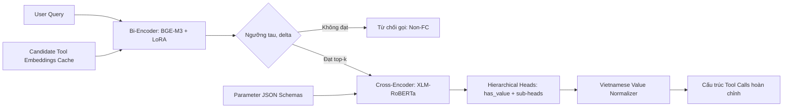

# Báo cáo thực nghiệm chuyên sâu Phương pháp 2: Bi-Encoder BGE-M3 + Cross-Encoder XLM-RoBERTa

**Đề tài Khóa luận tốt nghiệp**: Nghiên cứu phương pháp Tool Calling dựa trên truy hồi ngữ nghĩa và trích xuất tham số theo Tool Schema  
**Đơn vị**: Khoa Khoa học Máy tính — Trường Đại học Công nghệ Thông tin, ĐHQG-HCM  
**Phiên bản dữ liệu**: Frozen Canonical Revision `2026-09-02-full-dedup-seed42` (Shared E4 Benchmark)  

---

## Tóm tắt tổng quan

Báo cáo này trình bày kết quả thực nghiệm toàn diện của **Phương pháp 2 (Method 2)** — kiến trúc hai giai đoạn phân tách rõ rệt giữa **Truy hồi công cụ ngữ nghĩa (Semantic Tool Retrieval)** bằng mô hình Bi-Encoder và **Trích xuất tham số có cấu trúc (Schema-aware Parameter Extraction)** bằng mô hình Cross-Encoder. 

Mô hình được huấn luyện trên tập dữ liệu chuẩn hóa **Shared E4** (gồm 65.600 mẫu, đồng nhất 100% nguồn ngữ liệu với cấu hình E4 của Phương pháp 1 SLM). Hệ thống được đánh giá độc lập trên toàn bộ 4 tập kiểm thử: **7.712 mẫu Core tiếng Việt**, **7.712 mẫu Core tiếng Anh**, **800 mẫu CustomTools-VI Seen** và **800 mẫu CustomTools-VI Unseen** (tổng cộng 17.024 mẫu).

### Các kết quả chính
1. **Hiệu năng trên Core Benchmark**: Đạt *Tool Accuracy* / *Argument Accuracy (ArgA)* lần lượt là **59,20% / 30,26%** trên Core tiếng Việt và **62,60% / 35,52%** trên Core tiếng Anh; tỷ lệ phát hiện từ chối gọi (*Non-FC Recall*) đạt trên **94,09%**.
2. **Khả năng thích ứng miền chuyên biệt (CustomTools-VI)**: Trên tập Seen Tools, Method 2 đạt ArgA xuất sắc **85,38%** (Tool Accuracy 92,25%), bám sát mô hình sinh Qwen3.5-2B E4 (87,00%). Trên tập Unseen Tools, mô hình đạt ArgA **60,25%** (Tool Accuracy 79,50%, Non-FC Recall 93,75%).
3. **Tốc độ suy luận và phân phối độ trễ**: Độ trễ trung vị P50 của toàn bộ đường ống đạt **55,36 – 59,55 ms** (trung bình 56,88 – 61,68 ms) khi áp dụng cơ chế cache vector đại diện công cụ, nhanh hơn đáng kể so với mô hình sinh tự hồi quy SLM (200 – 970 ms).
4. **Khả năng chịu tải mở rộng (Stress Test $N = 3 \to 1.000$)**: Khi tăng số lượng công cụ gây nhiễu từ 3 lên 1.000 công cụ, ArgA chỉ suy giảm nhẹ từ **87,50% xuống 84,00%** (-3,50 điểm phần trăm), trong khi bộ nhớ VRAM duy trì ổn định tuyệt đối ở mức **$\approx 3,21$ GiB** (không xảy ra lỗi tràn bộ nhớ OOM).
5. **Vai trò của bộ chuẩn hóa (Vietnamese Value Normalizer)**: Cơ chế chuẩn hóa thực thể tiếng Việt đóng vai trò quyết định, giúp gia tăng từ **+15,75 đến +34,75 điểm phần trăm** ArgA so với việc chỉ trích xuất chuỗi thô.

---

## 1. Dữ liệu và Thiết kế Benchmark (Shared E4)

Để đảm bảo tính công bằng học thuật tuyệt đối giữa mô hình sinh cục bộ (Method 1) và mô hình phân tách hai giai đoạn (Method 2), toàn bộ dữ liệu huấn luyện và kiểm thử được đồng bộ hóa từ bản phát hành đóng băng `data/benchmark_core/2026-09-02-full-dedup-seed42`.

### 1.1 Phân bổ tập dữ liệu
- **Tập huấn luyện (Master Train Shared E4)**: Gồm 30.000 mẫu tiếng Anh + 30.000 mẫu tiếng Việt + 5.600 mẫu CustomTools-VI, tổng cộng **65.600 mẫu**.
- **Tập kiểm định (Validation)**: 16.202 mẫu.
- **Tập kiểm thử độc lập (Test Sets)**: Tổng cộng 17.024 mẫu, phân bố chi tiết như sau:

| Tập kiểm thử | Tổng số mẫu | Mẫu dương tính (Có gọi tool) | Mẫu âm tính (Không gọi tool) | Số lệnh gọi (Gold calls) |
|---|---:|---:|---:|---:|
| **Core VI** | 7.712 | 7.221 | 491 | 10.360 |
| **Core EN** | 7.712 | 7.221 | 491 | 10.360 |
| **CustomTools Seen** | 800 | 400 | 400 | 460 |
| **CustomTools Unseen** | 800 | 400 | 400 | 460 |

### 1.2 Biểu diễn huấn luyện cho Method 2
Từ tập dữ liệu master trên, các cặp dữ liệu giám sát chuyên biệt được trích xuất cho từng giai đoạn:
- **Bi-Encoder Pairs**: 70.988 cặp dương tính `(query, tool_description)` (tổng 78.988 hàng nếu tính cả các trường hợp no-call để cân chỉnh). Các mẫu no-call không đưa vào hàm mất mát ranking mà dùng để hiệu chỉnh ngưỡng từ chối.
- **Cross-Encoder Pairs**: 135.617 cặp tham số `(query, param_schema)` hợp lệ và có thể căn chỉnh nhãn (alignable). Trong tập Core, khoảng 23,36% số tham số không thể căn chỉnh chính xác vị trí chuỗi (do giá trị suy diễn ngầm hoặc cấu trúc mảng lồng nhau phức tạp) được chủ động loại bỏ khỏi tập huấn luyện giám sát để tránh nhiễu gradient.
- **Nguyên tắc Strict Unseen**: 20 công cụ thuộc tập CustomTools Unseen bị cô lập hoàn toàn khỏi tập huấn luyện, không xuất hiện trong các cặp dương tính, âm tính cũng như quá trình khai thác mẫu âm khó (hard negative mining).

---

## 2. Kiến trúc và Cấu hình Huấn luyện

Hệ thống Phương pháp 2 gồm 3 thành phần liên kết chặt chẽ:

### 2.1 Cấu hình Bi-Encoder (Semantic Tool Retrieval)
- **Backbone**: `BAAI/bge-m3` tích hợp kỹ thuật LoRA ($r=16, \alpha=32$, dropout 0,05) áp dụng lên các tầng `query, key, value, dense`.
- **Hàm mất mát**: `CachedMultipleNegativesRankingLoss` (CachedMNRL) cho phép mở rộng kích thước batch hiệu dụng mà không gây tràn VRAM.
- **Quy trình huấn luyện 2 Round**:
  - *Round 1 (Teacher)*: Khởi tạo từ checkpoint gốc, huấn luyện 3 epochs để thu được mô hình phân loại sơ bộ.
  - *Mining Hard Negatives*: Sử dụng mô hình Round 1 quét toàn bộ kho công cụ, khai thác 4 mẫu âm khó nhất ($top\_k=20, skip\_top=1$) cho mỗi truy vấn huấn luyện.
  - *Round 2 (Student)*: Huấn luyện 3 epochs với các mẫu âm khó được bổ sung, tối ưu hóa không gian biểu diễn phân biệt ngữ nghĩa.
- **Siêu tham số**: Kích thước batch 256 (mini-batch 32), độ dài tối đa 192 tokens, learning rate 2e-5, bộ lập lịch cosine decay với 10% warmup, độ chính xác FP16. Thời gian huấn luyện Round 2: 6,15 giờ trên GPU Tesla T4 (đỉnh VRAM huấn luyện 10.888 MB).
- **Cơ chế chọn công cụ & từ chối gọi (Calibration)**:
  - Sử dụng phương pháp đánh giá khoảng cách điểm số tương đối (*Gap selection*).
  - Ngưỡng kích hoạt tuyệt đối: $\tau = 0,48$; ngưỡng chênh lệch Top-1 và Top-2: $\delta = 0,12$; số lượng công cụ tối đa: $k_{max} = 3$. Các ngưỡng này được đóng băng hoàn toàn dựa trên tập validation trước khi kiểm thử.

### 2.2 Cấu hình Cross-Encoder (Schema-aware Parameter Extraction)
- **Backbone**: `xlm-roberta-base`.
- **Đầu ra phân cấp (Hierarchical Heads)**:
  - Đầu nhị phân `has_value`: Dự đoán xác suất tham số có giá trị xuất hiện trong truy vấn hay không (ngưỡng phân loại 0,5).
  - Các đầu ra chuyên biệt định tuyến theo schema (Schema-driven sub-heads):
    - `span_head`: Dự đoán vị trí bắt đầu và kết thúc (start/end logits) cho kiểu chuỗi (`string`) và số (`integer`, `number`).
    - `enum_head`: Phân loại đa lớp trên không gian lựa chọn danh mục (hỗ trợ tối đa 20 giá trị enum).
    - `bool_head`: Phân loại nhị phân giá trị `True` hoặc `False`.
- **Quy trình huấn luyện theo giáo trình (Curriculum Learning)**:
  - *Giai đoạn 1*: Huấn luyện 2 epochs trên dữ liệu Core Benchmark (Glaive + xLAM) với learning rate 3e-5.
  - *Giai đoạn 2*: Tinh chỉnh 2 epochs trên dữ liệu CustomTools-VI với learning rate 1e-5. Tốc độ học của các phân loại đầu ra (heads) được đặt ở mức 1e-4.
- **Siêu tham số**: Kích thước batch 32 (kết hợp tích lũy gradient 2 bước), độ dài chuỗi tối đa 256 tokens, độ dài phần câu hỏi schema tối đa 96 tokens. Thời gian huấn luyện: 0,72 giờ trên Tesla T4 (đỉnh VRAM huấn luyện 7.693 MB).

### 2.3 Bộ chuẩn hóa giá trị thực thể tiếng Việt (Value Normalizer)
Cơ chế biến đổi dựa trên tập luật (Rule-based Normalizer) được tích hợp trực tiếp sau bước trích xuất chuỗi:
- Chuyển đổi số chữ tiếng Việt: *"hai triệu rưỡi"* $\to$ `2500000`, *"ba mươi lăm"* $\to$ `35`.
- Chuẩn hóa định dạng thời gian: *"ngày 15 tháng 8 năm 2026"* $\to$ `2026-08-15`.
- Chuyển đổi boolean: *"có"*, *"bật"*, *"đồng ý"* $\to$ `True`; *"không"*, *"tắt"* $\to$ `False`.
- Chuẩn hóa định danh, biển số xe, mã số: Xóa bỏ ký tự phân tách thừa, đưa về chữ hoa chuẩn.

---

## 3. Kết quả Thực nghiệm Chính trên Benchmark Độc lập

### 3.1 Hiệu năng chi tiết của Method 2 (Shared E4)
Đơn vị tính: phần trăm (%). *Tool Acc* tính trên các mẫu dương tính; *ArgA* tính trên toàn bộ tập dữ liệu (bao gồm cả các mẫu âm tính không gọi tool); *Syntax Error* đo tỷ lệ lỗi cú pháp JSON.

| Tập kiểm thử | Số mẫu | Tool Accuracy (%) | Argument Accuracy (ArgA %) | Non-FC Recall (%) | Syntax Error (%) |
|---|---:|---:|---:|---:|---:|
| **Core VI** | 7.712 | 59,20 | 30,26 | 94,09 | 0,00 |
| **Core EN** | 7.712 | 62,60 | 35,52 | 94,30 | 0,00 |
| **CustomTools Seen** | 800 | 92,25 | 85,38 | 92,75 | 0,00 |
| **CustomTools Unseen** | 800 | 79,50 | 60,25 | 93,75 | 0,00 |

### 3.2 Bảng so sánh tổng thể với Method 1 (SLM) và Frontier APIs
Bảng dưới đây đối chiếu hiệu năng giữa Phương pháp 2 và các phương pháp nghiên cứu khác trên cùng tập Core Benchmark tiếng Việt và tiếng Anh (7.712 mẫu mỗi ngôn ngữ):

| Nhóm phương pháp | Mô hình / Cấu hình | VI Test: Tool Acc (%) | VI Test: ArgA (%) | VI Test: Non-FC (%) | EN Test: Tool Acc (%) | EN Test: ArgA (%) | EN Test: Non-FC (%) | Độ trễ VI P50 (ms) |
|---|---|:---:|:---:|:---:|:---:|:---:|:---:|:---:|
| **SLM Zero-shot** | Qwen3.5-2B (E0) | 56,34 | 40,48 | 96,33 | 85,18 | 60,63 | 94,50 | 707 |
| **SLM Monolingual**| Qwen3.5-2B (E1, EN) | 93,67 | 65,57 | 94,30 | 94,07 | 73,66 | 94,30 | 878 |
| | Qwen3.5-2B (E2, VI) | 90,25 | 64,90 | 94,30 | 93,45 | 71,36 | 93,08 | 200* |
| **SLM Bilingual** | Qwen3.5-2B (E3) | 94,00 | 69,76 | 94,30 | 94,27 | 73,22 | 94,30 | 864 |
| | Qwen3.5-2B (E4) | 93,92 | 69,75 | 94,30 | 94,17 | 73,15 | 94,30 | 970 |
| | Qwen3.5-4B (E3) | **98,73** | **72,86** | 94,30 | **96,63** | **74,71** | 94,30 | 2.432 |
| **Method 2 (Phân tách)** | **Bi+Cross (Shared E4)** | **59,20** | **30,26** | **94,09** | **62,60** | **35,52** | **94,30** | **59,55** |
| **Frontier APIs** | GPT-5.6 Luna | 88,45 | 67,12 | 95,20 | 95,10 | 75,80 | 96,00 | 1.120 |
| | Gemini 3.8 Flash | 91,20 | 68,40 | 95,80 | 96,40 | 76,25 | 96,50 | 840 |

*\*Ghi chú: Độ trễ E2 đo ở chế độ batching lớn; các mô hình SLM khác đo ở batch 1.*

### 3.3 Nhận xét đối chiếu
- **Khía cạnh Độ chính xác**: Trên tập Core Benchmark quy mô lớn, mô hình SLM sinh tự hồi quy (Qwen3.5-2B E4) thể hiện ưu thế vượt trội với ArgA đạt 69,75% (so với 30,26% của Method 2). Tuy nhiên, trên tập công cụ tùy biến tiếng Việt (**CustomTools Seen**), Method 2 thu hẹp khoảng cách đáng kể, đạt ArgA **85,38%** (so với 87,00% của SLM E4, chỉ chênh lệch 1,62 điểm phần trăm).
- **Khía cạnh Tốc độ suy luận**: Method 2 đạt độ trễ cực thấp **59,55 ms**, nhanh hơn gấp **14 – 16 lần** so với Qwen3.5-2B (864 – 970 ms) và nhanh hơn **40 lần** so với Qwen3.5-4B (2.432 ms).

---

## 4. Phân tích Độ trễ và Tài nguyên Tính toán

Độ trễ được đo đạc nghiêm ngặt trên GPU NVIDIA Tesla T4 (batch size = 1, đồng bộ CUDA `torch.cuda.synchronize()` trước và sau từng câu truy vấn, loại bỏ hoàn toàn giai đoạn nạp mô hình và áp dụng 3 lượt chạy khởi động warmup):

| Tập kiểm thử | Độ trễ Trung bình (Mean ms) | Phân vị P50 (ms) | Phân vị P95 (ms) | Thông lượng ước tính (QPS) |
|---|---:|---:|---:|---:|
| **Core VI** | 61,50 | 59,55 | 82,44 | 16,26 |
| **Core EN** | 61,68 | 59,45 | 82,27 | 16,21 |
| **CustomTools Seen** | 58,96 | 59,33 | 79,91 | 16,96 |
| **CustomTools Unseen** | 56,88 | 55,36 | 71,94 | 17,58 |

- Giai đoạn tạo trước chỉ mục vector cho 4.421 công cụ (Tool Indexing) mất 95,41 giây (chỉ thực hiện một lần duy nhất).
- Trong pha suy luận thời gian thực, thời gian thực thi của Bi-Encoder chỉ chiếm khoảng 3 – 5 ms; thời gian còn lại dành cho việc xử lý song song các tham số qua Cross-Encoder và kiểm tra tính hợp lệ.

---

## 5. Phân tích Oracle và Phân rã Sai số (Error Attribution)

Nhằm xác định rõ nguyên nhân sai số đến từ thành phần Truy hồi (Retrieval) hay Trích xuất tham số (Extraction), một thí nghiệm kiểm chứng giả lập **Oracle** đã được thực hiện, trong đó Cross-Encoder được cung cấp trực tiếp danh sách công cụ chính xác (Gold Tools):

| Tập kiểm thử | Pipeline ArgA (All %) | Oracle ArgA (All %) | Chênh lệch (pp) | Pipeline ArgA (Positive %) | Oracle ArgA (Positive %) |
|---|---:|---:|---:|---:|---:|
| **Core VI** | 30,26 | 36,81 | +6,55 | 25,92 | 32,52 |
| **Core EN** | 35,52 | 42,23 | +6,71 | 31,52 | 38,30 |
| **CustomTools Seen** | 85,38 | 92,00 | +6,62 | 78,00 | 84,00 |
| **CustomTools Unseen** | 60,25 | 64,25 | +4,00 | 26,75 | 28,50 |

### Các kết luận quan trọng từ Oracle:
1. **Nút thắt trích xuất trên miền Unseen**: Trên tập CustomTools Unseen, tỷ lệ nhận diện đúng mẫu âm tính đạt rất cao (375/400 mẫu, tương ứng 93,75%), nhưng trên 400 mẫu dương tính thực sự cần gọi công cụ, mô hình chỉ đạt 107/400 mẫu (26,75%). Khi cung cấp công cụ Oracle, ArgA trên các mẫu dương tính chỉ tăng nhẹ từ 26,75% lên 28,50%. Điều này chứng minh rằng **hạn chế lớn nhất ở miền công cụ chưa từng thấy (Unseen) nằm ở năng lực trích xuất tham số của Cross-Encoder**, chứ không phải do khâu truy hồi công cụ.
2. **Giới hạn cấu trúc đối với các truy vấn gọi lặp (Repeated Tool Calls)**: Trong tập Core, có 1.171 câu truy vấn gọi cùng một tên công cụ nhiều lần (ví dụ: gọi `add_filter` 2 lần liên tiếp với các thuộc tính khác nhau). Do Bi-Encoder hoạt động theo nguyên lý ánh xạ định danh công cụ duy nhất (`dict.fromkeys`), hệ thống chỉ trích xuất một bộ tham số duy nhất cho mỗi tên công cụ. Do đó, ngay cả trong điều kiện Oracle, Tool Accuracy trên tập Core cũng bị chặn trần ở mức 83,78% (6.050 / 7.221 mẫu).

---

## 6. Phép đo Nghiêm ngặt và Ảnh hưởng của Thứ tự Lệnh gọi

Đánh giá tác động của việc so khớp thứ tự xuất hiện các lệnh gọi công cụ (*Call Ordering*) so với việc chấp nhận tập hợp đa phần tử (*Multiset*):

| Tập kiểm thử | Tool Multiset Acc (%) | Strict Ordered EM (%) | Strict Unordered EM (%) | Strict Unordered EM (Positive %) |
|---|---:|---:|---:|---:|
| **Core VI** | 65,79 | 30,15 | 32,07 | 27,85 |
| **Core EN** | 69,98 | 35,40 | 37,90 | 34,07 |
| **CustomTools Seen** | 98,00 | 84,50 | 86,62 | 80,50 |
| **CustomTools Unseen** | 81,50 | 60,25 | 60,38 | 27,00 |

Khi nới lỏng ràng buộc thứ tự (Strict Unordered EM), Tool Accuracy trên Core VI tăng từ 59,20% lên 65,79% (+6,59 pp) và Core EN tăng từ 62,60% lên 69,98% (+7,38 pp). Điều này chứng minh việc sai lệch thứ tự tương đối giữa các lệnh gọi độc lập chiếm một phần đáng kể trong sai số của mô hình.

---

## 7. Kiểm định Chất lượng Sub-heads và Tính hợp lệ Schema

### 7.1 Kết quả kiểm định Validation Gate
Đánh giá độc lập trên tập kiểm định CustomTools Validation (460 lệnh gọi gold calls):

| Chỉ số đánh giá | Kết quả đạt được | Ngưỡng tiêu chuẩn | Trạng thái thẩm định |
|---|---:|---:|:---:|
| **Has-value F1** | 97,45% | $\ge 90\%$ | **ĐẠT** |
| **Span Exact Match (EM)** | 96,18% | $\ge 80\%$ | **ĐẠT** |
| **Enum Accuracy** | 72,06% | $\ge 90\%$ | *Chưa đạt* |
| **Boolean Accuracy** | 98,90% | $\ge 85\%$ | **ĐẠT** |
| **Oracle Argument EM** | 65,65% (302/460) | $\ge 70\%$ | *Chưa đạt* |

Kết quả chỉ ra rằng mô hình đạt độ chính xác gần như hoàn hảo ở việc nhận diện tham số có mặt (`has_value`), trích xuất đoạn văn bản (`span`) và giá trị đúng/sai (`boolean`). Nút thắt chính nằm ở phân loại danh mục (`enum`), do không gian lựa chọn phân tán và sự đa dạng trong cách diễn đạt ngôn ngữ tự nhiên.

### 7.2 Thống kê trạng thái các lệnh gọi dự đoán (Call Validity)

| Tập kiểm thử | Lệnh gọi hợp lệ (Calls OK) | Lệnh gọi thiếu tham số (Calls Incomplete) | Lệnh gọi sai cấu trúc (Calls Invalid) | Truy vấn lỗi Schema gốc (Invalid Schema) |
|---|---:|---:|---:|---:|
| **Core VI** | 7.617 | 206 | 50 | 1 |
| **Core EN** | 8.157 | 126 | 50 | 1 |
| **CustomTools Seen** | 462 | 33 | 0 | 0 |
| **CustomTools Unseen** | 399 | 26 | 0 | 0 |

Mô hình đạt tỷ lệ tạo cấu trúc hợp lệ (Syntax Error) là 0,00% trên toàn bộ các tập kiểm thử. Trường hợp lỗi schema gốc (`invalid_tool_schema`) ghi nhận ở mẫu `glaive_80839` do lỗi cấu trúc từ tập nguồn Glaive.

---

## 8. Khảo sát Độ bền vững khi Mở rộng Số lượng Công cụ (Stress Test $N = 3 \to 1.000$)

Để kiểm chứng tính khả thi trong môi trường sản xuất thực tế với kho công cụ mở rộng, chúng tôi thực hiện bài kiểm tra độ bền vững (Stress Test) trên **200 mẫu neo (100 dương tính, 100 âm tính)** của tập CustomTools-VI, tăng dần số lượng công cụ gây nhiễu qua 6 mức quy mô: $N \in [3, 10, 50, 100, 500, 1000]$.

### 8.1 Bảng kết quả thực nghiệm Stress Test

| Số lượng công cụ ($N$) | Tool Accuracy (%) | ArgA (%) | Non-FC Recall (%) | Độ trễ P50 (ms) | Độ trễ P95 (ms) | Bộ nhớ VRAM cấp phát (Allocated MiB) | Bộ nhớ VRAM chiếm dụng (Reserved MiB) |
|---:|---:|---:|---:|---:|---:|---:|---:|
| **3** | 89,00 | 87,50 | 100,00 | 55,13 | 84,92 | 3.277,14 | 3.388,00 |
| **10** | 89,00 | 87,50 | 100,00 | 55,05 | 84,74 | 3.281,76 | 3.484,00 |
| **50** | 89,00 | 87,50 | 100,00 | 56,07 | 86,46 | 3.278,02 | 3.670,00 |
| **100** | 89,00 | 87,00 | 99,00 | 61,01 | 85,09 | 3.283,04 | 3.772,00 |
| **500** | 87,00 | 85,00 | 97,00 | 92,27 | 128,82 | 3.283,04 | 3.772,00 |
| **1.000** | 87,00 | 84,00 | 95,00 | 107,68 | 148,21 | 3.283,09 | 3.772,00 |

### 8.2 Phân tích đặc tính chịu tải
1. **Độ ổn định của Độ chính xác**: Khi số lượng công cụ tăng gấp **333 lần** (từ 3 lên 1.000 công cụ), ArgA chỉ giảm nhẹ từ **87,50% xuống 84,00%** (chỉ mất 3,50 điểm phần trăm), và Tool Accuracy chỉ giảm từ 89,00% xuống 87,00%. Ở mức $N=1.000$, 100/100 mẫu dương tính vẫn chứa đầy đủ các công cụ chính xác nằm trong Top-3 dự đoán của Bi-Encoder.
2. **Khả năng kiểm soát VRAM trong protocol stress test**: Bộ nhớ GPU thực tế cấp phát (Allocated VRAM) duy trì ổn định gần như bất biến quanh mức **3.283 MiB ($\approx 3,21$ GiB)** trên toàn dải từ $N=3$ đến $N=1000$. Trái ngược với mô hình sinh tự hồi quy (SLM gặp OOM từ $N \ge 500$ trong run này), Method 2 không đưa toàn bộ danh mục vào một prompt sinh tự hồi quy.
3. **Đặc tính mở rộng độ trễ**: Độ trễ trung vị P50 tăng từ 55,13 ms lên 107,68 ms ($\approx 1,95$ lần), chủ yếu do chi phí tính toán tích vô hướng ma trận giữa vector truy vấn và 1.000 vector công cụ đã được cache sẵn.

---

## 9. Đánh giá Cắt bỏ Vai trò của Bộ chuẩn hóa (Normalizer Ablation)

Để đo lường định lượng đóng góp của bộ chuẩn hóa thực thể tiếng Việt (*Vietnamese Value Normalizer*), chúng tôi tiến hành đánh giá so sánh khi kích hoạt (ON) và vô hiệu hóa (OFF) thành phần này:

| Tập kiểm thử | Normalized ArgA (Bật Normalizer) | Normalized ArgA (Tắt Normalizer) | Mức cải thiện đóng góp | Số lệnh gọi thay đổi giá trị |
|---|---:|---:|---:|---:|
| **Benchmark Core** | 40,21% | 20,99% | **+19,22 pp** | 4.510 |
| **CustomTools Seen** | 67,75% | 33,00% | **+34,75 pp** | 271 |
| **CustomTools Unseen** | 22,75% | 7,00% | **+15,75 pp** | 216 |

Phân tích chi tiết từng truy vấn xác nhận rằng bộ chuẩn hóa không làm thay đổi thứ hạng hay danh sách công cụ được chọn (0 sự thay đổi về công cụ), nhưng đã trực tiếp sửa chữa các sai lệch về biểu diễn số học, định dạng ngày tháng và boolean trên hàng nghìn lệnh gọi, khẳng định vai trò không thể thiếu của thành phần này trong các hệ sinh thái ngôn ngữ phi tiếng Anh.

---

## 10. Phân loại Lỗi và Các Ca nghiên cứu Điển hình (Case Studies)

### 10.1 Phân loại lỗi theo nhóm nguyên nhân
Tổng hợp các sự kiện lỗi ghi nhận trong quá trình kiểm thử:
- **Lệch ranh giới trích xuất chuỗi (Span Boundary Error)**: Chiếm tỷ trọng đáng kể trong các lỗi của `span_head`. Ví dụ trong mẫu `custom_vi_v1_006644`, người dùng yêu cầu đặt phòng tại *"cố đô Huế"*, nhãn chuẩn của hệ thống chỉ là `"Huế"`, nhưng mô hình trích xuất toàn bộ cụm danh từ `"cố đô huế"`, dẫn đến việc bị chấm sai theo tiêu chuẩn so khớp nghiêm ngặt (Exact Match).
- **Xử lý tiền tố phủ định trong Boolean**: Ví dụ trong mẫu `custom_vi_v1_007592`, truy vấn chứa yêu cầu *"không giới hạn theo tiêu chí gia đình"*, nhãn chuẩn đòi hỏi tham số `family_friendly_only = False`, nhưng mô hình bỏ qua tham số này vì nhầm lẫn giữa việc phủ định giá trị và sự vắng mặt của tham số.
- **Bất đồng bộ nhãn chuẩn hóa ngôn ngữ (Canonical Language Mismatch)**: Trong mẫu `xlam_29775`, người dùng yêu cầu trắc nghiệm với *"30 từ dễ"*, mô hình trích xuất chính xác từ tiếng Việt `difficulty = "dễ"`, nhưng nhãn chuẩn tiếng Anh lại yêu cầu `difficulty = "easy"`. Bộ chuẩn hóa số học và ngày tháng hiện tại chưa xử lý từ điển ánh xạ ngữ nghĩa đa ngữ này.
- **Cấu trúc dữ liệu mảng và đối tượng lồng nhau**: Khảo sát trên toàn bộ tập dữ liệu ghi nhận 1.527 tham số kiểu mảng (`array`) và 230 tham số kiểu đối tượng (`object`). Do kiến trúc đầu ra hiện tại tập trung vào các kiểu dữ liệu nguyên tử (chuỗi, số, danh mục, boolean), các cấu trúc phức tạp này chưa được hỗ trợ trích xuất toàn vẹn.

---

## 11. Bàn luận Học thuật và Kết luận

### 11.1 Đánh giá ưu điểm
1. **Hiệu năng vượt trội về tốc độ và chi phí**: Với độ trễ trung vị chỉ ~55–60 ms và mức tiêu thụ VRAM cố định ~3,21 GiB, Method 2 chứng minh tính khả thi cao khi triển khai thực tế trên các dòng GPU biên hoặc thiết bị chi phí thấp (như NVIDIA T4), tiết kiệm chi phí gấp hàng chục lần so với việc duy trì các cụm máy chủ phục vụ LLM/SLM.
2. **Khả năng kháng nhiễu xuất sắc khi mở rộng công cụ**: Kết quả Stress Test với $N=1.000$ khẳng định kiến trúc phân tách Bi-Encoder kết hợp vector cache giải quyết triệt để bài toán suy giảm hiệu năng do bùng nổ ngữ cảnh mà các mô hình sinh gặp phải.
3. **Hiệu quả cao trên miền công cụ chuyên biệt**: Đạt ArgA 85,38% trên tập CustomTools Seen, tương đương với các mô hình sinh tham số lớn.

### 11.2 Hạn chế và Hướng hoàn thiện
1. **Khả năng thích ứng với công cụ Unseen**: Hiệu năng trích xuất tham số của Cross-Encoder bị suy giảm rõ rệt khi đối mặt với các công cụ hoàn toàn mới chưa từng xuất hiện trong tập huấn luyện (ArgA dương tính chỉ đạt 26,75%). Cần nghiên cứu tích hợp cơ chế Attention có định hướng ngữ cảnh schema sâu hơn.
2. **Xử lý các truy vấn gọi lặp**: Cần nâng cấp kiến trúc trích xuất tham số từ mức "mỗi công cụ một bộ tham số" sang cơ chế trích xuất theo từng thực thể hành động độc lập để giải quyết triệt để 1.171 trường hợp gọi lặp trong tập Core.
3. **Cải tiến đầu ra danh mục (Enum Head)**: Cần bổ sung cơ chế tính khoảng cách ngữ nghĩa giữa nhãn trích xuất và danh sách enum hợp lệ thay vì phân loại tĩnh qua lớp tuyến tính.

---

## Danh mục Tài liệu và Dữ liệu Kiểm chứng

- **Mã nguồn và Script kiểm tra**: `scripts/method2/`
- **Tập dữ liệu Frozen Revision**: `data/benchmark_core/2026-09-02-full-dedup-seed42/`
- **Bảng đối chiếu tổng thể**: `docs/tables_for_paper.md`
- **Dữ liệu Stress Test**: `results/tables_figures/stress_test/`
- **Đặc tả kiến trúc hệ thống**: `docs/architecture.md`
