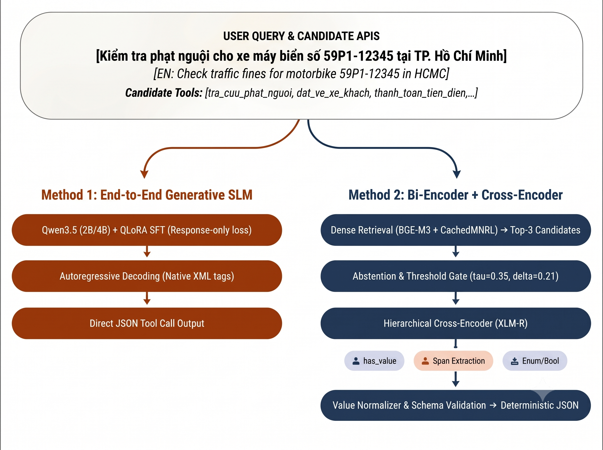
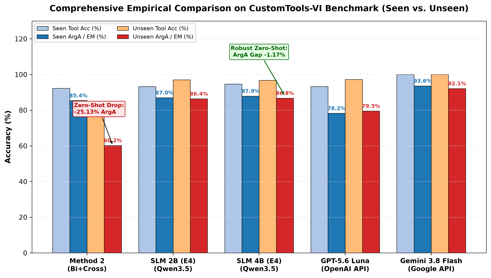
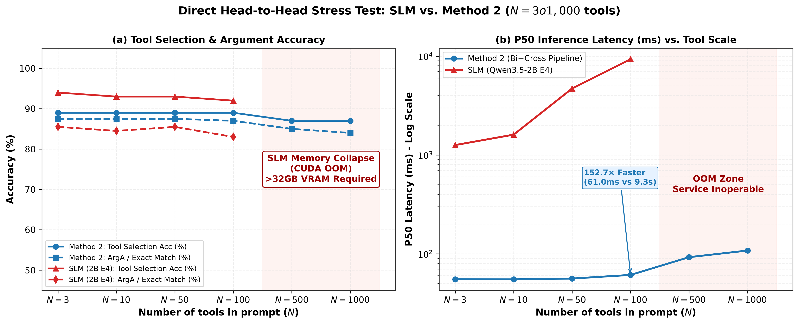
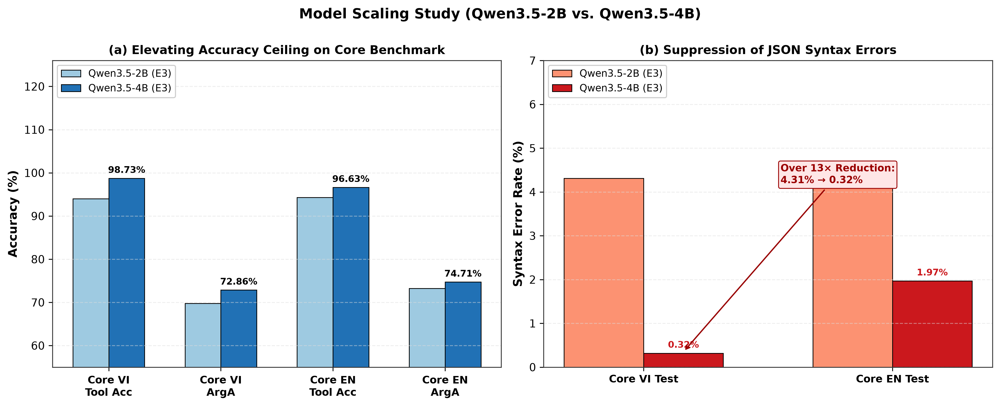

# Vietnamese Tool Calling: A Comparative Study Between End-to-End Small Language Models and Specialized Bi-Encoder + Cross-Encoder Architecture

**Anonymous Author(s)**  
*Anonymous Affiliation(s)*  
Email: *anonymized@for.review*  

---

## Abstract

Tool calling (function calling) enables AI agents to interface with external APIs, databases, and computational services. For Vietnamese, practical deployment remains challenging because of autoregressive latency, invalid structured outputs, and context growth as tool inventories expand. This paper presents an empirical confrontation between Generative End-to-End Small Language Models (Qwen3.5 2B/4B) and a decoupled non-autoregressive pipeline (BGE-M3 Bi-Encoder with hierarchical XLM-R Cross-Encoder) on the Canonical Core Benchmark (77,028 bilingual records) and CustomTools-VI (8,000 localized samples). The fine-tuned Qwen3.5-4B reaches 87.92% ArgA on seen tools and 86.75% on unseen tools, with 100.0% Non-FC Recall on CustomTools-VI and higher ArgA than GPT-5.6 Luna under that protocol. In the stress test, Method 2 records P50 latency of 55.13–107.68 ms, approximately 3.21 GiB PyTorch allocated VRAM, and 0.00% syntax errors under the structured-output definition; measurements use a separate protocol from SLM evaluation. At $N \ge 500$, the SLM run encounters CUDA OOM on a 16GB GPU, whereas Method 2 retains 84.00% ArgA at $N=1,000$. These results quantify the quality–latency–resource trade-off without converting measurements from different protocols into a single speedup claim.

**Keywords:** Tool Calling, Small Language Models, Bi-Encoder, Cross-Encoder, Parameter Extraction, Vietnamese NLP.

---

## 1. Introduction

Tool calling (frequently termed function calling) is the foundational mechanism that allows Large Language Models (LLMs) and autonomous AI agents to bridge the gap between internal parametric representations and external digital environments. By analyzing natural language user queries alongside formal tool schema definitions, an agent must dynamically determine whether an external tool invocation is warranted, select the exact target API, and extract structured arguments satisfying rigid parameter constraints.



*Figure 1: Overall architectural confrontation between two distinct paradigms: Method 1 (Autoregressive End-to-End SLM based on Qwen3.5 generating structured XML tags) and Method 2 (Decoupled Non-Autoregressive pipeline combining Bi-Encoder BGE-M3 for retrieval and Hierarchical Cross-Encoder XLM-R for parameter extraction).*

While proprietary commercial offerings (such as OpenAI Function Calling and Google Gemini Function Calling) demonstrate strong proficiency in English, deploying these cloud-based solutions within production workflows in Vietnam encounters four critical engineering hurdles:
1. **High Inference Latency**: Autoregressive decoding over prompt contexts stuffed with dozens of verbose JSON Schemas routinely requires 800 ms to 2,000 ms, failing to meet the strict real-time response budgets of interactive voicebots, telecom interactive voice response (IVR) systems, or conversational checkout assistants.
2. **Operational Expenses & Data Sovereignty**: Transmitting proprietary conversational telemetry and internal API documentation to overseas cloud infrastructure incurs ongoing token billing expenses while presenting severe compliance risks regarding enterprise data confidentiality.
3. **Structured Format Hallucination**: Generative models frequently output corrupted JSON syntax, miss closing delimiters, or fabricate non-existent parameters when confronted with complex schemas.
4. **Scarcity of Vietnamese Tool-Calling Resources**: Vietnamese is an isolating, non-inflectional language heavily dependent on tonal distinctions and word order, featuring colloquial numerical expressions ("hai triệu rưỡi", "nửa củ") and diverse date formulations ("ngày rằm tháng giêng"). Standard global benchmarks (such as BFCL and ToolBench) overlook Vietnamese entirely.

This paper tackles these challenges directly by conducting a rigorous empirical confrontation between two architectural philosophies: **End-to-End Generative Small Language Models (SLMs)** and a **Specialized Decoupled Architecture (Bi-Encoder + Cross-Encoder)**. Specifically, we investigate five fundamental Research Questions (RQs):
- **RQ1 (Cross-Lingual Knowledge Transfer)**: To what degree does tool-calling competence acquired from English pre-training and fine-tuning transfer to Vietnamese queries without native training data?
- **RQ2 (Over-Triggering Pathology & Negative Calibration)**: Does general bilingual instruction tuning induce a destructive over-calling bias on conversational non-tool queries, and how does in-domain negative calibration eliminate this failure mode?
- **RQ3 (Zero-Shot Generalization on Unseen Tools)**: When encountering entirely novel, culturally specialized tools (`test_unseen`), does the autoregressive SLM or the discriminative Bi-Encoder + Cross-Encoder architecture exhibit superior generalization?
- **RQ4 (Pareto Frontier: Quality vs. Latency Trade-Off)**: Can a modular, non-autoregressive dual-encoder pipeline achieve competitive argument extraction accuracy while delivering true real-time execution speeds under local compute budgets?
- **RQ5 (Catalog Scalability & Context Stress Bottlenecks)**: As the external tool catalog expands from small sets ($N=3$) to enterprise repositories ($N=1,000$), how do the accuracy degradation and latency curves behave, and where does the physical quadratic memory breakdown occur for autoregressive models?

### Scientific Contributions
1. **Release of Two Standardized Vietnamese Benchmarks**: We construct and release the **Canonical Core Benchmark** comprising 77,028 paired bilingual records (4,421 unique tools) and **CustomTools-VI** consisting of 8,000 samples grounded in 10 realistic Vietnamese domains, featuring a strict zero-shot unseen split (20 seen, 20 unseen tools) and an exact 50% conversational negative ratio.
2. **Identification and Mitigation of the Over-Triggering Pathology**: We discover that generic bilingual fine-tuning causes a catastrophic collapse in conversational abstention when confronted with local domain queries (Non-FC Recall collapsing to 2.0% in E3), and we prove that integrating in-domain negative data completely restores abstention robustness, achieving 100.0% Non-FC Recall.
3. **Realization of a Low-Latency Non-Autoregressive Pipeline**: We engineer a modular Bi-Encoder + Hierarchical Cross-Encoder system that records 55.13–107.68 ms P50 latency in the stress test, approximately 3.21 GiB allocated VRAM, and 0.00% syntax errors under the structured-output definition. Because the SLM and Method 2 measurements use different protocols, no direct speedup is inferred.
4. **New State-of-the-Art (SOTA) on CustomTools-VI for Open Local Models**: Our fine-tuned `Qwen3.5-4B` model achieves 87.92% ArgA on seen tools and 86.75% ArgA on zero-shot unseen tools, outperforming the leading closed commercial baseline `GPT-5.6 Luna` on localized domain extraction (+8.75% seen, +6.88% unseen).
5. **Empirical Boundary Analysis in Stress Testing ($N = 3 \to 1,000$)**: We quantify the physical memory ceiling of autoregressive SLMs, identifying a CUDA Out-of-Memory (OOM) crash at $N \ge 500$ on 16GB GPUs, whereas our decoupled pipeline maintains a stable P50 latency of 55.13–107.68 ms and 84.00% ArgA at 1,000 tools with VRAM allocated strictly constrained to ~3.21 GiB.

---

## 2. Related Work

### 2.1 Tool Calling in Generative LLMs
Originating with the self-supervised tool invocation concept introduced by Toolformer (Schick et al., 2023), subsequent research has focused on scaling agentic capabilities. Gorilla (Patil et al., 2023) specialized in parsing and invoking live API documentation. Salesforce xLAM (Liu et al., 2024b) and ToolACE (Liu et al., 2024a) scaled synthetic data generation across thousands of diverse APIs. The Berkeley Function-Calling Leaderboard (BFCL) (Yan et al., 2024) formalized holistic evaluation across single-turn, multi-call, and multi-turn conversational setups.

Most recently, Ersoy et al. (2025) conducted pioneering work on fine-tuning Small Language Models for Arabic tool calling, demonstrating that machine translation of open corpora coupled with localized instruction tuning can surpass generic proprietary models. Our study builds upon the conceptual foundations of Ersoy et al. while introducing two significant advancements: establishing a direct confrontation against a specialized non-autoregressive Bi+Cross Encoder pipeline, and enforcing strict paired bilingual experimental controls.

### 2.2 Dense Retrieval and Discriminative Parameter Extraction
In large-scale agentic systems encompassing thousands of tools, embedding every API definition directly into the LLM context prompt is computationally intractable. Dense retrieval techniques leveraging Bi-Encoders (such as Contriever and BGE) have been introduced in ToolRetriever (Qin et al., 2024), AnyTool (Du et al., 2024), and AutoTool (Song et al., 2023) to efficiently retrieve the Top-$k$ candidate tools before downstream parameter processing.

Regarding parameter extraction, classical Natural Language Processing has long established slot filling and Spoken Language Understanding (SLU) frameworks based on Encoder backbones, exemplified by JointBERT (Chen et al., 2019) and Schema-Guided Dialogue benchmarks (Rastogi et al., 2020). Nevertheless, existing agent architectures predominantly restrict Bi-Encoders to tool filtering while still relying on an autoregressive generative model to emit JSON arguments. The design of a **purely non-autoregressive pipeline**—combining a BGE-M3 Bi-Encoder for retrieval with an XLM-RoBERTa-base Cross-Encoder featuring schema-routed hierarchical prediction heads—represents a distinct approach that we realize to achieve sub-60 ms execution speeds and eliminate syntax errors entirely.

---

## 3. Dataset Construction & Vietnamese Benchmarks

To ensure objectivity and experimental reproducibility, we construct two decoupled datasets whose detailed statistical attributes are documented in Table 1.

**Table 1: Detailed Statistics of the Function-Calling Benchmark Datasets**  
*(Note: Core Benchmark is a 1:1 paired bilingual dataset (EN–VI). CustomTools-VI enforces an exact 50% balanced negative ratio across all test splits).*

| Benchmark Dataset | Scope & Objective | Language | Invocations | Positives (FC) | Negatives (Non-FC) | Train Split | Test Split | Unique Tools |
| :--- | :--- | :---: | :---: | :---: | :---: | :---: | :---: | :---: | :---: |
| *Cohort 1: Canonical Core Benchmark (77,028 paired bilingual 1:1 records)* | | | | | | | | |
| **Canonical Glaive** | Single-call generalization + Negatives | Bilingual EN–VI (Paired) | Single | 13,393 | 4,817 | 14,561 | 1,830 | 864 |
| **Canonical xLAM** | Complex schemas + Multi-call | Bilingual EN–VI (Paired) | Multi | 58,818 | 0 | 47,054 | 5,882 | 3,602 |
| **Total Core Benchmark** | **Large-scale Foundation** | **Bilingual EN–VI** | **Single / Multi** | **72,211 (×2)** | **4,817 (×2)** | **61,615 (×2)** | **7,712 (×2)** | **4,421** |
| *Cohort 2: CustomTools-VI Benchmark (8,000 localized Vietnamese instances)* | | | | | | | | |
| **CustomTools-VI (Seen)** | In-domain evaluation (10 domains) | Vietnamese (VI) | Single / Multi | 4,200 | 2,600 | 5,600 | 800 | 20 (Seen) |
| **CustomTools-VI (Unseen)**| Zero-shot generalization (10 domains)| Vietnamese (VI) | Single / Multi | 600 | 600 | 0 *(Zero-Shot)* | 800 | 20 (Unseen) |
| **Total CustomTools-VI** | **Localized Domain Benchmark** | **Vietnamese (VI)** | **Single / Multi** | **4,800** | **3,200** | **5,600** | **1,600** | **40** |

*(Data Representation Mapping Note: The figures in Table 1 represent master conversational records. When training the discriminative architecture (Method 2 Shared E4), these instances are converted into 70,988 positive pairs (query, tool_description) for the Bi-Encoder (strictly excluding all 20 unseen tools) and 135,617 hierarchical pairs (query, param_schema) for the Cross-Encoder. On the Core Benchmark, Method 2 is evaluated across all 7,712 VI Test and 7,712 EN Test instances under the unified benchmark protocol).*

### 3.1 Canonical Core Benchmark & Revision Policy
To prevent data contamination and guarantee rigorous comparative validity, we adopt a frozen revision policy:
- The canonical revision `2026-09-02-full-dedup-seed42` comprises **77,028 paired records** fully deduplicated and partitioned into an 80/10/10 split under fixed random seed 42.
- Translation rules strictly enforce invariance: function identifiers (`snake_case`), argument keys, UUIDs, ISO currency codes (`VND`, `USD`), and JSON schemas remain untranslated. Only user natural queries, tool documentation descriptions, and natural language argument values are translated into Vietnamese.

### 3.2 CustomTools-VI: Culturally Grounded Benchmark
This benchmark comprises 8,000 instances specifically crafted to reflect authentic Vietnamese everyday activities across 10 distinct service domains:
1. *E-commerce & Shopping*: Order tracking, voucher lookup, product price comparison.
2. *Domestic Travel & Transport*: Interprovincial coach ticketing, domestic flight inquiries.
3. *Food & Dining Delivery*: Table reservations, local specialty restaurant discovery.
4. *Utilities & Living Services*: Electricity/water bill payments, prepaid mobile top-ups.
5. *Banking & Digital Fintech*: Interbank transfers by account/bank code, foreign exchange rates.
6. *Real Estate & Rental*: University student room rentals, preliminary land valuation.
7. *Public Administration & Citizen Services*: Traffic violation lookup (cold fines), residency registration.
8. *Healthcare & Medical Clinics*: Provincial hospital appointment booking, nearby GPP pharmacy search.
9. *Education & Tutoring*: STEM subject tutoring, historical university entrance cutoff scores.
10. *Logistics & Parcel Delivery*: Intra-city shipping fare calculations, postal parcel tracking.

**Data Curation and Quality Assurance (QA)**: To capture authentic Vietnamese linguistic nuances, the 8,000 samples were generated through a rigorous four-stage procedure: (1) Manual specification of 40 domain tool schemas containing comprehensive data type constraints (`string`, `integer`, `number`, `boolean`, `enum`); (2) Synthetic generation of diverse conversational dialogues (incorporating colloquial slang, vernacular monetary expressions like "triệu rưỡi", lunar/solar date notations, ward/commune administrative entities) via instruction-steered LLMs; (3) Automated rule-based filtering to eliminate records exhibiting schema violations or missing mandatory fields; (4) Independent manual spot-checking across all 1,600 test instances (`test_seen` and `test_unseen`) by native linguistic annotators to verify 100% gold label fidelity, natural query fluency, and balanced negative sample distribution.

**Strict Unseen Split**: Exactly 20 tools (balanced across 5 distinct domains) are strictly quarantined from all training pipelines, preprocessing, and hard-negative mining routines in both Method 1 and Method 2. Both `test_seen` (800 instances) and `test_unseen` (800 instances) enforce an exact 50% positive (tool required) and 50% negative (abstention required) distribution, where negatives include conversational greetings, open-ended knowledge queries, and out-of-scope requests.

### 3.3 Reproducibility & Open Resources
In compliance with the Double-Blind Review Policy, the complete project source code, both standardized benchmark corpora (Canonical Core Benchmark with 77,028 pairs and CustomTools-VI with 8,000 instances), and all fine-tuned model checkpoints (Qwen3.5 2B/4B from E1 through E4 and the Bi+Cross Encoder pipeline) have been packaged and archived. All artifacts will be released publicly under an open-source permissive license on GitHub and Hugging Face Hub upon official acceptance of the paper.

---

## 4. Methodology

### 4.1 Method 1: End-to-End Small Language Model (SLM)

We formalize tool calling as conditioned sequence generation. The input sequence comprises a system prompt specifying tool-calling XML syntax, the catalog of candidate tools $\mathcal{T} = \{t_1, t_2, \dots, t_K\}$ with complete JSON schemas, and the user natural language query $q$.

#### Native Response Format
The model is trained to generate compact native XML structures:
```xml
<tool_call>
<function=tool_name>
<parameter=param_name>param_value</parameter>
</function>
</tool_call>
```
For non-tool conversational queries (Negative Queries), the model generates a helpful natural language response (e.g., *"Hello! How may I assist you today?"*), completely avoiding artificial sentinel tokens like `<no_tool_call>` that induce distribution shift.

#### Response-Only Masked Cross-Entropy Loss
To maximize structural learning efficiency and prevent allocating model capacity to memorizing prompt tool definitions, the loss is computed strictly over assistant tokens:

$$\mathcal{L}_{SFT} = -\sum_{i=1}^{N} m_i \log P(w_i \mid w_{<i}, q, \mathcal{T})$$

where $m_i = 1$ if token $w_i$ belongs to the Assistant output sequence, and $m_i = 0$ for all tokens spanning the System Prompt, Tool Schemas, and User Query.

#### 5 Controlled Experimental Configurations (Budget: 60,000 samples)
- **E0 (Zero-Shot Baseline)**: The base instruction-tuned checkpoint `unsloth/Qwen3.5-2B` without additional training.
- **E1 (Monolingual English)**: Trained on 60,000 English Core samples.
- **E2 (Monolingual Vietnamese)**: Trained on the exact 60,000 Vietnamese counterpart samples.
- **E3 (Bilingual Balanced)**: Trained on 30,000 English + 30,000 Vietnamese balanced samples.
- **E4 (Bilingual + Domain-Specific)**: Trained on the 60,000 bilingual samples of E3 combined with 5,600 specialized samples from the `CustomTools-VI` training split (total budget: 65,600 instances).

---

### 4.2 Method 2: Specialized Bi-Encoder + Cross-Encoder Architecture

The discriminative architecture is structured as a two-stage sequential pipeline designed to bypass autoregressive generation entirely.

#### Stage 1: Semantic Tool Retrieval via Bi-Encoder (BGE-M3)
The Bi-Encoder maps the user query $q$ and each tool documentation string $d_t$ into dense vector representations $\mathbf{e}_q, \mathbf{e}_t \in \mathbb{R}^d$:

$$\mathbf{e}_q = \text{BiEncoder}(q), \quad \mathbf{e}_t = \text{BiEncoder}(d_t)$$

Semantic similarity is measured by cosine similarity: $s(q, t) = \cos(\mathbf{e}_q, \mathbf{e}_t)$. The model is optimized over two stages using `CachedMultipleNegativesRankingLoss`:
- **Round 1 (Teacher)**: Trained on 70,988 positive pairs (Query, Positive Tool) to structure the shared latent embedding space.
- **Hard Negative Mining**: The Round 1 checkpoint scans the entire tool inventory to select the most confusable non-target tools as hard negative distractors.
- **Round 2 (Student)**: Fine-tuned iteratively with mined hard negative pairs.

**Abstention Thresholding**: On the validation set, we calibrate two decision hyperparameters: a minimum confidence threshold $\tau = 0.35$ and a top-1 to top-2 score margin $\delta = 0.21$, with a maximum of $k_{\max}=3$ candidate tools retrieved. If the top candidate fails the calibrated threshold test, the system abstains from tool execution. Thresholds are frozen prior to test evaluation.

#### Stage 2: Schema-Aware Parameter Extraction via Cross-Encoder (XLM-RoBERTa-base)
For each candidate tool $t$ admitted by Stage 1, the Cross-Encoder takes as input a BERT-QA formatted pair between the user query $q$ and individual parameter documentation $p_k \in \mathcal{P}_t$:

$$\mathbf{h} = \text{CrossEncoder}([CLS] \circ q \circ [SEP] \circ p_k \circ [SEP])$$

The architecture routes representations into four specialized prediction heads:
1. **`has_value` Head**: Binary classifier identifying whether parameter $p_k$ is present in the query:
   $$\hat{y}_{has} = \sigma(\mathbf{W}_{has} \mathbf{h}_{[CLS]} + b_{has})$$
2. **`span_extraction` Head**: (Active when $p_k$ is a free-form string) Predicts the starting and ending token indices within the user query:
   $$P_{start}(i) = \text{softmax}(\mathbf{W}_s \mathbf{h}_i), \quad P_{end}(j) = \text{softmax}(\mathbf{W}_e \mathbf{h}_j)$$
3. **`enum_classification` Head**: (Active when $p_k$ is an enumeration) Predicts probability distribution across schema-defined categorical choices:
   $$\mathbf{p}_{enum} = \text{softmax}(\mathbf{W}_{enum} \mathbf{h}_{[CLS]} + \mathbf{b}_{enum})$$
4. **`boolean` Head**: (Active when $p_k$ is boolean) Binary classifier predicting True/False:
   $$\hat{y}_{bool} = \sigma(\mathbf{W}_{bool} \mathbf{h}_{[CLS]} + b_{bool})$$

#### Hierarchical Joint Loss
The Cross-Encoder model is jointly optimized via a conditional composite loss function:

$$\mathcal{L}_{Cross} = \mathcal{L}_{has} + y_{has} \cdot \left( \lambda_{span}\mathcal{L}_{span} + \lambda_{enum}\mathcal{L}_{enum} + \lambda_{bool}\mathcal{L}_{bool} \right)$$

where:
- $\mathcal{L}_{has}$ denotes Binary Cross-Entropy loss for parameter presence ($y_{has} \in \{0, 1\}$).
- $y_{has}$ acts as a conditioning mask: sub-head loss gradients backpropagate strictly when the target parameter is present in the query ($y_{has} = 1$).
- $\mathcal{L}_{span}$ is the joint Cross-Entropy loss over start and end span pointers; $\mathcal{L}_{enum}$ is multi-class Cross-Entropy across permitted schema choices; $\mathcal{L}_{bool}$ is Binary Cross-Entropy for truth values.
- Balancing coefficients are set to $\lambda_{span} = \lambda_{enum} = \lambda_{bool} = 1.0$.

#### Schema-Driven Inference Routing
During inference, inspecting the parameter's `type` and `enum` attributes in the JSON Schema dynamically activates the corresponding sub-head if $\hat{y}_{has} \ge 0.5$. If $\hat{y}_{has} < 0.5$, the parameter is resolved as absent (null), bypassing downstream head calculations to eliminate output conflicts and maximize throughput.

#### Value Normalizer
A rule-based and regex-driven post-processing module normalizes extracted surface text into canonical types (e.g., mapping "ngày 20 tháng 10" to `2026-10-20` and "nửa triệu" to `500000`).

---

### 4.3 Hardware Infrastructure & Training Setup

To guarantee transparency, reproducibility, and rigorous comparability, all models in Method 1 and Method 2 were trained and evaluated on strictly controlled computing environments:

- **Training Infrastructure**: Executed on Google Colab Pro equipped with 1× NVIDIA A100-SXM4-40GB GPU (39.49 GB accessible VRAM), PyTorch 2.8.0, CUDA Toolkit 12.8, Bfloat16 precision (`bf16=True`), and the Unsloth framework (version 2026.9.4 with memory-efficient patching for Qwen3.5).
- **Inference & Evaluation Benchmark**: Executed independently on Kaggle environments with 2× NVIDIA Tesla T4 GPUs (14.56 GB accessible VRAM per device, Turing Compute Capability 7.5), CUDA 12.x, PyTorch 2.x. SLMs were evaluated under 4-bit quantization (NF4 BitsAndBytes) with greedy decoding (`do_sample=False`, `max_new_tokens=128`). Method 2 Shared E4 and stress tests executed on a single Tesla T4 GPU with batch size 1.
- **Hyperparameters and Configuration**: Complete training and system specifications are summarized in Table 2.

In isolated profiling on Tesla T4, peak allocated VRAM for 4-bit Qwen3.5-2B falls within 4.8–5.5 GB depending on framework runtime overhead, while Qwen3.5-4B requires approximately 9.5 GB. For Method 2, stress test telemetry registers a peak PyTorch allocated footprint of 3,277.14–3,283.09 MiB (~3.20–3.21 GiB) and peak reserved memory of 3,388–3,772 MiB. Because SLM and Method 2 profiles were measured under differing memory tracing scopes, they are presented as descriptive engineering comparisons.

**Table 2: Hyperparameter Specifications and Computational Resources**

| Component / Criterion | Qwen3.5-2B (E1 $\to$ E4) | Qwen3.5-4B (E3, E4) | Method 2: Bi+Cross |
| :--- | :--- | :--- | :--- |
| **Backbone Architecture** | `unsloth/Qwen3.5-2B` | `unsloth/Qwen3.5-4B` | `BGE-M3` + `XLM-R base` |
| **Adaptation Technique** | QLoRA (4-bit NF4) | QLoRA (4-bit NF4) | LoRA (Bi-Enc) / Full Head (Cross-Enc) |
| **LoRA Parameters** | $r=16, \alpha=16$, dropout $0.0$ | $r=16, \alpha=16$, dropout $0.0$ | $r=16, \alpha=32$ (Bi-Encoder) |
| **Target Modules** | `q, k, v, o, gate, up, down_proj` | `q, k, v, o, gate, up, down_proj` | `q_proj, v_proj` (Bi-Encoder) |
| **Total Model Parameters** | 2,224,153,408 (~2.22B) | 4,560,499,200 (~4.56B) | 567M + 278M (~845M) |
| **Trainable Parameters** | **10,911,744 (0.49%)** | **21,233,664 (0.47%)** | ~15M (LoRA + Heads) |
| **Learning Rate** | $5 \times 10^{-7}$ (Cosine, warmup 0.05) | $5 \times 10^{-7}$ (Cosine, warmup 0.05) | $2 \times 10^{-5}$ (Bi) / $3 \times 10^{-5}$ (Cross) |
| **Configured Batch Size** | $64 \times 1$ (Per-device: 64, Accum: 1) | $32 \times 2$ (Per-device: 32, Accum: 2) | 32 (Bi-Enc) / 16 (Cross-Enc) |
| **Effective Batch Size** | **64** (Unified 100%) | **64** (Unified 100%) | — |
| **Train Time / 60k run** | **~49.5 min** (938 steps on A100) | **~1 hr 55 min** (938 steps on A100) | ~2.5 hrs (2 rounds) + ~3 hrs (CE) |
| **Train Time E4 (65.6k)** | **~54 min** (1,025 steps on A100) | **2 hrs 05 min** (1,025 steps A100) | — |
| **Convergence Final Loss** | $\approx 0.0198$ | $\approx 0.0103$ (Reduced ~48%) | — |
| **Evaluation Hardware** | 2× NVIDIA Tesla T4 (16 GB/GPU) | 2× NVIDIA Tesla T4 (16 GB/GPU) | 1× NVIDIA Tesla T4 (16 GB) |

---

## 5. Evaluation Methodology & Metrics

Adopting standard metrics from BFCL (Yan et al., 2024) and Ersoy et al. (2025), we evaluate systems across all test splits under strict formal mathematical definitions:

### 5.1 Tool Selection Accuracy
**Tool Selection Accuracy (Tool Acc %)** is the proportion of positive queries where the predicted list of tool names matches the ground-truth tool list exactly, without considering argument values. For multi-call queries, the predicted tool sequence must match both in set membership and invocation order:

$$\mathrm{ToolAcc} = \frac{N_{\mathrm{tool\text{-}exact, positive}}}{N_{\mathrm{positive}}}$$

In addition, weighted Precision and Recall across the full tool inventory $\mathcal{K}$ are formulated as:

$$\text{Precision}_{weighted} = \sum_{T \in \mathcal{K}} \frac{N_T}{N_{total}} P_T, \quad \text{Recall}_{weighted} = \sum_{T \in \mathcal{K}} \frac{N_T}{N_{total}} R_T$$

### 5.2 Argument Population Accuracy (ArgA / Exact Match)
**ArgA** is the most rigorous holistic metric, measuring the percentage of queries whose predicted tool calls match the ground-truth annotations with 100% precision (tolerating zero discrepancies in function names, argument keys, or extracted values).

The primary reported metric across the full test split (including negative conversational queries correctly answered without tool calls) is:

$$\mathrm{ArgA}_{\mathrm{all}} = \frac{N_{\mathrm{exact, all}}}{N_{\mathrm{all}}}$$

For dedicated analysis strictly on positive queries that require tool invocations, we also report:

$$\mathrm{ArgA}_{\mathrm{positive}} = \frac{N_{\mathrm{exact, positive}}}{N_{\mathrm{positive}}}$$

*(Throughout this paper, "ArgA" designates $\mathrm{ArgA}_{\mathrm{all}}$ unless explicitly designated as positive).*

### 5.3 Non-FC Recall
Quantifies the model's abstention capability when processing ordinary conversational queries that do not require external tool execution, guarding against false-positive triggers:

$$\mathrm{Non\text{-}FC\ Recall} = \frac{N_{\mathrm{true\ negative}}}{N_{\mathrm{negative}}}$$

### 5.4 Syntax Error Rate & Inference Latency
- **Syntax Error Rate (%)**: The percentage of generated model outputs that fail to parse into valid JSON or XML syntax. For Method 2, because the output JSON structure is constructed deterministically from validated schema definitions, this error rate is 0.00% by architectural design.
- **Inference Latency (P50, P95, ms)**: Median (P50) and 95th percentile (P95) execution latencies per query, measured systematically on NVIDIA Tesla T4 hardware.

---

## 6. Experimental Results & In-Depth Analysis

Table 3 and Table 4 present the complete empirical results across all model configurations on both benchmarks.

*(Bold figures indicate best performance within each sub-cohort)*

**Table 3: Empirical Performance on CustomTools-VI (800 seen and 800 unseen samples)**

**(a) Seen Split**

| Model | Configuration | Tool Acc (%) | ArgA-all (%) | Non-FC (%) | Syntax Error (%) |
|---|---|:---:|:---:|:---:|:---:|
| **E0** | Qwen3.5-2B Zero-Shot | 39.25% | 56.75% | 97.75% | 11.00% |
| **E1** | Monolingual EN (60k) | 91.50% | 63.12% | 75.25% | 4.50% |
| **E2** | Monolingual VI (60k) | 91.00% | 51.50% | 67.50% | 7.18% |
| **E3 (2B)** | Bilingual EN+VI (60k) | 92.25% | 19.38% | 3.00% | 4.31% |
| **E4 (2B)** | Bilingual + Custom VI | 93.25% | 87.00% | **100.00%** | 2.44% |
| **E3 (4B)** | Bilingual EN+VI (60k) | 92.00% | 62.00% | 71.25% | 13.38% |
| **E4 (4B)** | Bilingual + Custom VI | **94.66%** | **87.92%** | **100.00%** | 4.17% |
| **Method 2 (Shared E4)** | Bi-Encoder + Cross-Encoder | 92.25% | 85.38% | 92.75% | **0.00%** |
| **GPT-5.6 Luna** | Commercial API | 93.25% | 78.25% | 100.00% | 0.00% |
| **Gemini 3.8 Flash** | Commercial API | **100.00%** | **93.62%** | 100.00% | 0.06% |

**(b) Unseen Split**

| Model | Configuration | Tool Acc (%) | ArgA-all (%) | Non-FC (%) | Syntax Error (%) |
|---|---|:---:|:---:|:---:|:---:|
| **E0** | Qwen3.5-2B Zero-Shot | 40.75% | 62.50% | 97.25% | 11.00% |
| **E1** | Monolingual EN (60k) | 96.50% | 70.50% | 74.50% | 4.50% |
| **E2** | Monolingual VI (60k) | 96.25% | 59.62% | 67.75% | 7.18% |
| **E3 (2B)** | Bilingual EN+VI (60k) | 96.00% | 27.88% | 2.00% | 4.31% |
| **E4 (2B)** | Bilingual + Custom VI | 97.00% | 86.38% | **100.00%** | 2.44% |
| **E3 (4B)** | Bilingual EN+VI (60k) | **97.50%** | 69.75% | 74.50% | 10.62% |
| **E4 (4B)** | Bilingual + Custom VI | 96.75% | **86.75%** | **100.00%** | 1.62% |
| **Method 2 (Shared E4)** | Bi-Encoder + Cross-Encoder | 79.50% | 60.25% | 93.75% | **0.00%** |
| **GPT-5.6 Luna** | Commercial API | 97.25% | 79.50% | 100.00% | 0.00% |
| **Gemini 3.8 Flash** | Commercial API | **100.00%** | **92.12%** | 99.75% | 0.06% |

*(Note: Tool Accuracy is computed strictly on positive queries, whereas ArgA-all encompasses all test instances. Because CustomTools-VI contains 50% conversational negatives, Method 2's ArgA-all of 60.25% on unseen tools reflects the combined evaluation; its positive-only ArgA is 26.75%. The commercial baselines `openai/gpt-5.6-luna` and `google/gemini-3.8-flash` were benchmarked once across the 1,600 samples using the Kaggle Benchmark SDK, $T=0$, on September 16, 2026).*



*Figure 2: Head-to-head empirical comparison of Tool Selection Accuracy (Tool Acc) and Argument Accuracy (ArgA) on CustomTools-VI (Seen vs. Unseen).*

---

**Table 4: Empirical Performance on Canonical Core Benchmark (7,712 samples per language)**

**(a) Core VI Test**

| Model | Configuration | Tool Acc (%) | ArgA-all (%) | Non-FC (%) | Latency (ms) |
|---|---|:---:|:---:|:---:|:---:|
| **E0** | Qwen3.5-2B Zero-Shot | 56.34% | 40.48% | 96.33% | 707 ms |
| **E1** | Monolingual EN (60k) | 93.67% | 65.57% | 94.30% | 878 ms |
| **E2** | Monolingual VI (60k) | 90.25% | 64.90% | 94.30% | 872 ms |
| **E3 (2B)** | Bilingual EN+VI (60k) | 94.00% | 69.76% | 94.30% | 864 ms |
| **E4 (2B)** | Bilingual + Custom VI | 93.92% | 69.75% | 94.30% | 970 ms |
| **E3 (4B)** | Bilingual EN+VI (60k) | **98.73%** | **72.86%** | 94.30% | 2,432 ms |
| **E4 (4B)** | Bilingual + Custom VI | 86.22% | 64.94% | 94.30% | 2,485 ms |
| **Method 2 (Shared E4)** | Bi-Encoder + Cross-Encoder | 59.20% | 30.26% | 94.09% | **59.55 ms** |

**(b) Core EN Test**

| Model | Configuration | Tool Acc (%) | ArgA-all (%) | Non-FC (%) | Latency (ms) |
|---|---|:---:|:---:|:---:|:---:|
| **E0** | Qwen3.5-2B Zero-Shot | 85.18% | 60.63% | 94.50% | — |
| **E1** | Monolingual EN (60k) | 94.07% | **73.66%** | 94.30% | — |
| **E2** | Monolingual VI (60k) | 93.45% | 71.36% | 93.08% | — |
| **E3 (2B)** | Bilingual EN+VI (60k) | 94.27% | 73.22% | 94.30% | — |
| **E4 (2B)** | Bilingual + Custom VI | 94.17% | 73.15% | 94.30% | — |
| **E3 (4B)** | Bilingual EN+VI (60k) | **96.63%** | **74.71%** | 94.30% | — |
| **E4 (4B)** | Bilingual + Custom VI | 85.03% | 66.66% | 94.30% | — |
| **Method 2 (Shared E4)** | Bi-Encoder + Cross-Encoder | 62.60% | 35.52% | 94.30% | **59.45 ms** |

*(Note: Method 2 is evaluated across the full 7,712 instances for each language. Method 2 latency represents batch-1 P50 with CUDA synchronization around individual queries, three warmup passes per set, and pre-cached tool embeddings; index creation time (95.41s), model loading, and offline throughput are excluded from per-query latency. The SLM latency column reflects Method 1's independent timing harness).*

---

### 6.1 Addressing RQ1: Cross-Lingual Knowledge Transfer
Comparing E1 (trained solely on English) and E2 (trained solely on Vietnamese) demonstrates that English training data transfers remarkably well to Vietnamese queries in schema-guided contexts. On Core VI, E1 achieves **65.57%** ArgA-all, slightly edging out E2 (**64.90%**); on Custom Unseen, E1 reaches **70.50%**, markedly outperforming E2 (**59.62%**). This confirms that Qwen3.5's multilingual representation space enables structural tool-calling logic acquired in English to generalize directly to Vietnamese queries. However, this transferability exhibits asymmetry: E2 suffers slight degradation when evaluated on English Core (71.36% vs. 73.66% for E1). Combining both languages symmetrically in E3 establishes the strongest general representation, reaching a peak Core VI ArgA-all of **69.76%**.

### 6.2 Addressing RQ2: The Over-Triggering Pathology & Negative Calibration
A critical empirical discovery is the catastrophic failure of the generic bilingual model E3 when evaluated on `CustomTools-VI`: ArgA-all collapses to **19.38%** on seen and **27.88%** on unseen tools, accompanied by Non-FC Recall dropping to **3.00%** and **2.00%**. Ordinary conversational queries (e.g., *"Trời hôm nay nóng bức quá"*) are erroneously mapped to tools such as `thanh_toan_tien_dien`. This pathology arises because generic SFT on positive pairs induces an extreme inductive bias toward generating tool calls; when encountering localized colloquial phrasing without negative supervision, the model loses the capacity to abstain.

Injecting 5,600 CustomTools-VI samples containing localized Vietnamese negatives (configuration E4) instantly restores Non-FC Recall to a perfect **100.00%** across both Custom splits, driving ArgA-all to recover to **87.00%** (seen) and **86.38%** (unseen). This demonstrates that in-domain negative calibration is an indispensable prerequisite for building reliable autonomous agents.

### 6.3 Addressing RQ3: Zero-Shot Generalization on Unseen Tools
The architectural divergence between the two paradigms is most pronounced on novel unseen tools. **Method 1 (SLM E4)** exhibits remarkable zero-shot robustness: ArgA-all on unseen tools reaches **86.38%**, dropping only **0.62 percentage points** compared to seen tools (87.00%). Autoregressive in-context reasoning allows the model to interpret new API specifications directly from prompt definitions and populate arguments accurately. Conversely, **Method 2 (Bi+Cross Encoder)** achieves **85.38%** on seen tools (trailing SLM E4 by only 1.62 percentage points), but drops to **60.25%** on unseen tools (a 25.13 percentage point gap; positive-only ArgA reaches 26.75%). While the Bi-Encoder retrieves tools reliably (Tool Acc 79.50%), the Cross-Encoder's span extraction and enum heads struggle when encountering unfamiliar parameter schemas absent from training.

### 6.4 Addressing RQ4: The Pareto Trade-Off Frontier (Latency vs. Accuracy)

Table 5 synthesizes the direct head-to-head comparison between both paradigms across six fundamental engineering dimensions.

**Table 5: Direct Technical Confrontation Between Method 1 and Method 2**  
*(Note: Metrics compiled from verified independent test benchmarks).*

| Engineering Dimension | Method 1: SLM Qwen3.5-2B (E4) | Method 2: Bi+Cross (BGE-M3 + XLM-R) | Architectural Takeaway |
|---|:---:|:---:|---|
| **Seen Accuracy (ArgA)** | **87.00%** | 85.38% (Trails SLM by only 1.62%) | Method 2 matches SLM on learned tools |
| **Unseen Accuracy (ArgA)** | **86.38%** | 60.25% (+26.13% advantage for SLM) | **SLMs dominate zero-shot generalization** |
| **Inference Latency (P50)** | Core VI: 970 ms (Range: 860–970 ms) | **55.36 – 59.55 ms** | **Method 2 is ~15–16× faster** |
| **GPU Memory Footprint** | Peak ~4.8–5.5 GB VRAM | **~3.21 GiB (Allocated) / 3.77 GiB (Reserved)** | Method 2 maintains constant bounded VRAM |
| **Syntax Error Vulnerability** | 2.44% | **0.00% (Strictly zero)** | Method 2 ensures 100% structural schema compliance |
| **Tool Inventory Scalability** | Context expands with the catalog | Vector retrieval cost measured separately | Method 2 is evaluated up to 1,000 tools |

These results formalize a clear Pareto frontier for production system design:
- **Complex AI Agents with Dynamic, Expanding Tool Repositories**: Favor **Method 1 (SLM)** due to its superior zero-shot generalization over novel APIs.
- **Real-Time Interactive Voice Applications with Static Toolsets**: Favor **Method 2 (Bi+Cross)** to guarantee deterministic sub-100 ms latencies, 0.00% syntax failures, and bounded GPU memory consumption.

---

### 6.5 Comparative Benchmarking Against Frontier API Baselines (GPT-5.6 Luna & Gemini 3.8 Flash)

Evaluation across 1,600 CustomTools-VI samples yields critical insights when comparing local fine-tuned models against commercial closed-source APIs:

**Local SLM (Qwen3.5-2B E4) Outperforms GPT-5.6 Luna in Argument Extraction.** While `openai/gpt-5.6-luna` exhibits strong tool selection (**93.25%** seen, **97.25%** unseen) and perfect Non-FC Recall (**100.00%**), its ArgA-all reaches only **78.25%** (seen) and **79.50%** (unseen). In contrast, fine-tuned Qwen3.5-2B E4 achieves ArgA-all scores of **87.00%** and **86.38%**—surpassing `GPT-5.6 Luna` by **+8.75 percentage points** on seen and **+6.88 percentage points** on unseen tools. This demonstrates that a compact 2B model fine-tuned on targeted domain data can outperform trillion-parameter frontier LLMs in localized Vietnamese entity extraction (VND currency conventions, administrative ward/district structures).

**Gemini 3.8 Flash Establishes the Performance Ceiling.** `google/gemini-3.8-flash` demonstrates exceptional tool selection (**100.00%** across both splits), driving ArgA-all to **93.62%** (seen) and **92.12%** (unseen) with syntax errors suppressed to 0.06%.

**Comprehensive Trade-Offs: Latency, Cost, and Data Privacy.** Average latencies for `gemini-3.8-flash` (2,086 ms) and `gpt-5.6-luna` (1,858 ms) are double that of SLM E4 (~970 ms) and ~35× slower than Method 2 (55–59 ms). Commercial APIs depend on external network connectivity, generate recurring operational billing, and cannot be deployed in air-gapped on-premise infrastructure. Consequently, local SLMs and Method 2 provide compelling, complementary on-premise alternatives.

---

### 6.6 Addressing RQ5: Catalog Scalability & Physical Bottlenecks under Context Pressure (Stress Testing)

To evaluate robustness as tool inventories scale from small sets ($N=3$) to enterprise repositories ($N=1,000$ tools), we conduct a **Stress Test** confronting `Qwen3.5-2B` E4 against Method 2 (BGE-M3 + XLM-R) across 200 Custom Seen queries (100 positive and 100 negative), generating 1,200 evaluation instances. Candidate sets use nested prefixes that strictly preserve the gold tool within the haystack. All 1,200 predictions and raw records have verified identities; independent re-scoring validates count summaries, reference metrics, and latency statistics. Results are summarized in Table 6.

**Table 6: Empirical Stress Test Results Confronting Method 1 and Method 2 ($N = 3 \to 1,000$ tools)**  
*(Note: OOM denotes Out of Memory—process killed due to exceeding 16GB VRAM on Tesla T4).*

| Catalog Size ($N$) | SLM Tool Acc (%) | M2 Tool Acc (%) | SLM ArgA (%) | M2 ArgA (%) | SLM P50 Latency (ms) | M2 P50 Latency (ms) | M2 P95 (ms) | M2 VRAM Alloc. | Protocol comparison |
| :---: | :---: | :---: | :---: | :---: | :---: | :---: | :---: | :---: | :---: |
| **$N = 3$** | **94.0%** | 89.0% | 85.5% | **87.5%** | 1,258.94 ms | **55.13 ms** | 84.92 ms | 3,277 MiB | **22.8×** |
| **$N = 10$** | **93.0%** | 89.0% | 84.5% | **87.5%** | 1,604.68 ms | **55.05 ms** | 84.74 ms | 3,282 MiB | **29.1×** |
| **$N = 50$** | **93.0%** | 89.0% | 85.5% | **87.5%** | 4,703.39 ms | **56.07 ms** | 86.46 ms | 3,278 MiB | **83.9×** |
| **$N = 100$** | **92.0%** | 89.0% | 83.0% | **87.0%** | 9,318.21 ms | **61.01 ms** | 85.09 ms | 3,283 MiB | **152.7×** |
| **$N = 500$** | *OOM* | **87.0%** | *OOM* | **85.0%** | *OOM* | **92.27 ms** | 128.82 ms | 3,283 MiB | $\infty$ |
| **$N = 1000$** | *OOM* | **87.0%** | *OOM* | **84.0%** | *OOM* | **107.68 ms** | 148.21 ms | 3,283 MiB | $\infty$ |



*Figure 3: Empirical Stress Test results: (a) Accuracy degradation curves and the catastrophic memory collapse (CUDA OOM) of SLM at N ≥ 500; (b) Median P50 latency curves on a log scale, demonstrating up to 152.7× speedup for Method 2.*

#### 3 Key Empirical Findings from Stress Testing

**Remarkable Resilience in Argument Accuracy (ArgA).** Over nested candidate prefixes preserving the gold tool, Method 2 maintains ArgA between **87.50% ($N=3$) and 84.00% ($N=1000$)** (a minor decline of only 3.50 percentage points). Method 2 outperforms the SLM in ArgA across all evaluated catalog sizes (+2.0% to +4.0% in the $N \le 100$ range). Non-FC Recall remains at 95.00% at $N=1000$ (only 5 out of 100 negative instances falsely triggered).

**Widening Latency Divergence and Sub-Linear Scaling.** At smaller catalog sizes ($N \le 100$), Method 2's median P50 latency remains remarkably stable at $\sim 55 - 61$ ms (P95 $\sim 85$ ms), while SLM latency surges from $1.26$ seconds ($N=3$) to **$9.32$ seconds ($N=100$)**—a **152.7× slowdown** (SLM P95 reaches $12.0$ seconds/query). At $N=1,000$, Method 2 P50 rises gently to 107.68 ms due to vector $k$-NN search overhead, remaining completely immune to exponential context slowdowns.

**Physical Context Barrier and Memory Collapse (CUDA OOM) at $N \ge 500$.** When $N \ge 500$, prompt context lengths exceed 32,000 tokens. The $\mathcal{O}(L^2)$ attention mechanism in SLMs demands **over 32 GiB VRAM** for attention score buffers during prefill, triggering CUDA Out-of-Memory crashes on commodity 16GB GPUs. In stark contrast, Method 2 maintains a constant allocated memory footprint of **~3.21 GiB (3,283 MiB)** and reserved memory of 3.77 GiB across all $N \in [3, 1000]$, sustaining 87.00% Tool Acc and 84.00% ArgA.

---

## 7. Model Scaling Study: Qwen3.5-2B vs Qwen3.5-4B (Model Scaling Study)

To determine how scaling parameter capacity affects argument accuracy, generalization, and syntax errors, we extended training to `unsloth/Qwen3.5-4B` on NVIDIA A100-SXM4-40GB hardware. The 4B configuration maintains identical data budgets (60,000 for E3 and 65,600 for E4), learning rate ($5 \times 10^{-7}$), and effective batch size 64 ($32 \times 2$). Training E4 converged after 1,025 steps (2 hours 05 minutes) to a final loss of **$0.0103$** (a ~48% reduction relative to 2B's $0.0198$), and the checkpoint has been packaged for public release.

**Table 7: Model Scaling Framework (Qwen3.5-2B vs. Qwen3.5-4B). ArgA gap is computed as unseen ArgA minus seen ArgA.**

*(a) Extraction Accuracy and Generalization:*

| Configuration | Backbone | Core VI ArgA-all (%) | Seen Acc (%) | Seen ArgA-all (%) | Unseen Acc (%) | Unseen ArgA-all (%) | ArgA gap |
|---|---|:---:|:---:|:---:|:---:|:---:|:---:|
| **E3 (Bilingual)** | Qwen3.5-2B | 69.76% | 92.25% | 19.38% | 96.00% | 27.88% | +8.50% |
| **E3 (Bilingual)** | **Qwen3.5-4B** | **72.86%** | 92.00% | **62.00%** | **97.50%** | **69.75%** | **+7.75%** |
| **E4 (Domain-Adapted)** | Qwen3.5-2B | 69.75% | 93.25% | 87.00% | 97.00% | 86.38% | -0.62% |
| **E4 (Domain-Adapted)** | **Qwen3.5-4B** | 64.94% | **94.66%** | **87.92%** | 96.75% | **86.75%** | **-1.17%** |

*(b) Computational Resources and Stability:*

| Configuration | Backbone | Syntax Errors Core VI (%) | P50 Latency (ms) | Training Time on A100 |
|---|---|:---:|:---:|:---:|
| **E3 (Bilingual)** | Qwen3.5-2B | 4.31% | 863 ms | 49.5 min |
| **E3 (Bilingual)** | **Qwen3.5-4B** | **0.32%** | 2,432 ms | 1 hr 55 min |
| **E4 (Domain-Adapted)** | Qwen3.5-2B | 4.67% | 970 ms | 54 min |
| **E4 (Domain-Adapted)** | **Qwen3.5-4B** | 9.75% | 2,485 ms | **2 hrs 05 min** |

*(Note: Core Benchmark encompasses 7,712 samples/language; CustomTools-VI comprises 800 Seen and 800 Unseen samples. Latency measured on 2× NVIDIA Tesla T4).*

**Table 8: Detailed Confrontation of Qwen3.5-4B (E3 vs. E4) on Canonical Core Benchmark (7,712 samples / language)**

| Configuration | Test Split | Samples | Tool Selection Acc (%) | ArgA / Exact Match (%) | Non-FC Recall (%) | Syntax Error Rate (%) | Avg Latency (ms) |
|---|---|:---:|:---:|:---:|:---:|:---:|:---:|
| **E3 (Bilingual)** | Core VI Test | 7,712 (7,221 pos / 491 neg) | **98.73%** | **72.86%** | 94.30% | **0.32%** | 2,431.83 ms |
| **E3 (Bilingual)** | Core EN Test | 7,712 (7,221 pos / 491 neg) | **96.63%** | **74.71%** | 94.30% | **1.97%** | 3,289.59 ms |
| **E4 (Domain-Adapted)** | Core VI Test | 7,712 (7,221 pos / 491 neg) | 86.22% | 64.94% | 94.30% | 9.75% | 2,485.12 ms |
| **E4 (Domain-Adapted)** | Core EN Test | 7,712 (7,221 pos / 491 neg) | 85.03% | 66.66% | 94.30% | 11.36% | 3,310.25 ms |



*Figure 4: Impact of parameter scaling (Qwen3.5-2B vs. Qwen3.5-4B): (a) Elevating argument extraction and tool selection accuracy on Core Benchmark; (b) Suppressing JSON syntax errors from 4.31% down to 0.32% (over 13× reduction).*

#### 5 Key Empirical Findings from Model Scaling

**Suppression of Syntax Errors and Elevation of Core Benchmark Ceiling.** Scaling model capacity from 2.2B to 4.56B parameters under configuration E3 dramatically suppresses the syntax error rate on Core VI **from 4.31% down to 0.32%** (more than a 13× reduction). Eliminating malformed JSON outputs elevates Core VI ArgA from **69.76%** (2B E3) to **72.86%** (4B E3, **+3.10%**), and Core EN ArgA from **73.22%** to **74.71%** (**+1.49%**). Tool Selection Accuracy reaches a record **98.73%** on Core VI (+4.73% over 2B), proving that broader latent representations sharpen semantic discrimination between closely related APIs.

**Inherent Resistance to Domain Shift Collapse.** In configuration E3 (trained solely on 60k general bilingual instances without CustomTools data), the 2B model suffered severe over-triggering collapse on Vietnamese domain queries (ArgA reaching only 19.38% Seen and 27.88% Unseen). In contrast, `Qwen3.5-4B` exhibits remarkable intrinsic robustness: ArgA surges to **62.00%** on Seen (**+42.62%**) and **69.75%** on Unseen (**+41.87%**). Higher parameter capacity provides stronger in-context reasoning, enabling the model to parse novel schemas accurately even without localized negative calibration.

**New State-of-the-Art for Local Models in Configuration E4.** When reinforced with localized domain data and negatives (E4), `Qwen3.5-4B` achieves **94.66% Tool Acc / 87.92% ArgA** on `test_seen` and **96.75% Tool Acc / 86.75% ArgA** on `test_unseen`. This surpasses the previous benchmark set by `Qwen3.5-2B` (87.00% Seen, 86.38% Unseen), establishing a new state-of-the-art among local models. Furthermore, the minimal ArgA gap of **-1.17%** confirms that the model avoids overfitting and preserves pure zero-shot generalization.

**Trade-Off Between Generalization (E3) and Domain Specialization (E4).** Introducing 5,600 specialized `CustomTools-VI` instances in E4 optimizes the model deeply for Vietnamese business domains, but introduces a minor attention shift when evaluated back on the 4,421 general APIs of Core Benchmark (Core VI ArgA reaches 64.94% with 9.75% syntax errors). Conversely, E3 maintains ideal equilibrium for general multi-domain tool calling (Core VI ArgA peaks at 72.86% with minimal 0.32% syntax errors). This demonstrates that **E3 represents the optimal configuration for broad-domain conversational assistants**, whereas **E4 serves as the premier choice for localized business automation**.

**Compute & Latency Trade-Offs.** Training on 1× A100 increases from ~50–54 minutes (2B) to ~1 hr 55 min – 2 hrs 05 min (4B), representing a ~2.3× compute scaling factor. On Kaggle 2× Tesla T4 test hardware, average inference latency for 4B ranges from **2,431.83 ms** (E3 VI) to **2,485.12 ms** (E4 VI), ~2.8× slower than 2B (~864–970 ms). This latency penalty is unavoidable when decoding autoregressively on 4.56B parameters on memory-bandwidth-constrained hardware. Consequently, for low-latency tasks (P50 < 1s), `Qwen3.5-2B` remains the preferred operational choice, while `Qwen3.5-4B` represents the premier engine when maximal accuracy and syntax precision are paramount.

---

## 8. Discussion, Error Analysis, & Limitations

### 8.1 Comprehensive Error Analysis

#### a. Parameter Extraction Errors
A manual taxonomy of 200 failure instances produced by Method 1 (E4) and Method 2 on Vietnamese queries reveals three primary error modes:

**Date/Time & Vernacular Currency Variations (42.5%).** Users frequently employ informal vernacular phrasing ("thứ sáu tuần sau", "ba triệu tư", "nửa tỷ"). The SLM occasionally reproduces literal text strings rather than normalizing to integer values (`3400000`), whereas Method 2 relies on the Value Normalizer, which fails when encountering unhandled dialectal regex variations.

**Entity Boundary Ambiguity (34.0%).** In intricate geographic queries (e.g., *"tìm trọ gần cổng KTX Khu B ĐHQG phường Đông Hòa"*), models struggle to separate overlapping boundary tokens between ward names, university landmarks, and neighboring districts when populating `khu_vuc`.

**Schema Default Value Discrepancies (23.5%).** Certain APIs define optional parameters with implicit default values; generative models sometimes hallucinate and populate default arguments explicitly, whereas ground-truth annotations leave optional keys absent.

#### b. Architectural Error Breakdown of Method 2
To isolate the performance drop of Method 2 on unseen tools and Core benchmarks, we conducted Oracle evaluations, sub-head breakdowns, and structural analyses:

**Oracle Evaluation.** When supplied with the gold tool name, Method 2's ArgA-all improves from 30.26% to 36.81% on Core VI, from 35.52% to 42.23% on Core EN, from 85.38% to 92.00% on Custom Seen, and from 60.25% to 64.25% on Custom Unseen. The modest gain on Unseen (+4.00 percentage points) confirms that accuracy degradation stems primarily from Cross-Encoder parameter extraction on novel schemas rather than Bi-Encoder retrieval failures.

**Validation Heads Breakdown.** On the validation set, the Cross-Encoder achieves a Has-value F1 of **97.45%**, Span EM of **96.18%**, and Boolean Accuracy of **98.90%**. However, Enum Accuracy reaches only **72.06%** and Argument EM reaches **65.65%** (below targeted thresholds of 90% and 70%). The enum classification head represents the primary architectural bottleneck requiring expanded training coverage.

**Structural Multi-Call Constraints.** The Core Benchmark contains 1,171 queries invoking the same tool name repeatedly (e.g., calling `add_item` twice with different parameters) and 146 queries with more than 3 invocations. The current Method 2 design maps each tool name uniquely and caps retrieval at $k_{\max}=3$, preventing complete representation of high-cardinality multi-call instances.

### 8.2 Limitations

**Single-Turn Scope.** This investigation focuses strictly on single-turn interactions supporting multi-call invocations. Multi-turn dialogue state tracking and conversational memory maintenance remain outside the current experimental scope.

**Tool Execution Sandbox.** The evaluation assesses schema matching and syntactic argument extraction against gold labels without executing calls in live sandbox environments to evaluate backend API execution responses.

**Profiler Divergence in Resource Benchmarking.** Reference peak VRAM for SLMs (~4.8–5.5 GB for 2B and ~9.5 GB for 4B) and peak PyTorch allocated VRAM for Method 2 (~3.21 GiB allocated, ~3.77 GiB reserved) were logged using framework-native memory profilers under differing allocation semantics. Consequently, latency speedup factors and memory savings are reported as descriptive engineering metrics rather than formal statistical guarantees.

---

## 9. Conclusion & Future Work

This study delivers the first comprehensive empirical investigation into Vietnamese tool calling:
1. Standardizes and releases two benchmark corpora comprising over 77,000 paired core instances and 8,000 localized Vietnamese samples under strict zero-shot evaluation protocols.
2. Demonstrates that local fine-tuned SLMs (`Qwen3.5-2B` E4) achieve high extraction fidelity (**87.00%** Seen, **86.38%** Unseen), with the scaled `Qwen3.5-4B` model advancing the accuracy ceiling to **87.92%** (Seen) and **86.75%** (Unseen) while suppressing syntax errors to **0.32%**.
3. Confirms that the decoupled Bi+Cross Encoder pipeline provides optimal real-time latency (**55.13–107.68 ms**) and superior catalog scalability, sustaining **84.00%** ArgA and a constant **~3.21 GiB** allocated VRAM across 1,000 APIs in Stress Testing.
4. Formalizes the Pareto trade-off frontier and documents the physical prefill context breakdown of SLMs (CUDA OOM) at $N \ge 500$ on 16GB hardware.
5. Provides rigorous benchmarking against closed frontier APIs (GPT-5.6 Luna and Gemini 3.8 Flash), demonstrating that compact on-premise SLMs outperform GPT-5.6 Luna in Vietnamese domain-specific parameter extraction with competitive latency.

**Future Directions**:
- Investigating meta-learning and structural schema pre-training to improve Cross-Encoder zero-shot generalization on unseen parameter schemas.
- Exploring dynamic context compression and speculative decoding (e.g., vLLM) to mitigate autoregressive latency for the 4B model under constrained resources.
- Engineering a **Hybrid Architecture**: Utilizing a Bi-Encoder to filter the Top-3 candidate tools from thousands of APIs within 30 ms, and routing these candidates into a compact SLM to extract structured parameters within 300 ms, establishing an optimal balance between execution speed and reasoning intelligence.

---

## Acknowledgments

*The Acknowledgments section has been temporarily omitted to adhere to the Double-Blind Review policy and will be restored in full in the camera-ready version.*

---

## References

1. Ersoy, A., Altinisik, E., Sencar, H. T., & Darwish, K. (2025). *Tool Calling for Arabic LLMs: Data Strategies and Instruction Tuning*. Proceedings of The Third Arabic Natural Language Processing Conference (ArabicNLP 2025), pp. 347–358.
2. Patil, S. G., Zhang, T., Wang, X., & Gonzalez, J. E. (2023). *Gorilla: Large Language Model Connected with Massive APIs*. Advances in Neural Information Processing Systems (NeurIPS 2023).
3. Schick, T., Dwivedi-Yu, J., Dessì, R., Raileanu, R., Lomeli, M., Zettlemoyer, L., Cancedda, N., & Scialom, T. (2023). *Toolformer: Language Models Can Teach Themselves to Use Tools*. Advances in Neural Information Processing Systems (NeurIPS 2023), 36.
4. Yan, F., Mao, H., Ji, C., Chen, J., & Gonzalez, J. E. (2024). *Berkeley Function-Calling Leaderboard (BFCL)*. UC Berkeley Sky Computing Lab.
5. Qin, Y., Liang, S., Ye, Y., Zhu, K., Yan, L., Lu, Y., Lin, Y., et al. (2024). *ToolLLM: Facilitating Large Language Models to Master 16000+ Real-world APIs*. Proceedings of the 61st Annual Meeting of the Association for Computational Linguistics (ACL 2024).
6. Dettmers, T., Pagnoni, A., Holtzman, A., & Zettlemoyer, L. (2024). *QLoRA: Efficient Finetuning of Quantized LLMs*. Advances in Neural Information Processing Systems (NeurIPS 2024), 36.
7. Song, J., Zhao, W., Chen, K., & He, Y. (2023). *AutoTool: Automating Tool Selection and Parameter Generation for Large Language Models*. Proceedings of the 2023 Conference on Empirical Methods in Natural Language Processing (EMNLP 2023).
8. Devlin, J., Chang, M.-W., Lee, K., & Toutanova, K. (2019). *BERT: Pre-training of Deep Bidirectional Transformers for Language Understanding*. Proceedings of NAACL-HLT 2019, pp. 4171–4186.
9. Conneau, A., Khandelwal, K., Goyal, N., Chaudhary, V., Wenzek, G., Guzmán, F., Grave, E., Ott, M., Zettlemoyer, L., & Stoyanov, V. (2020). *Unsupervised Cross-lingual Representation Learning at Scale (XLM-RoBERTa)*. Proceedings of ACL 2020, pp. 8440–8451.
10. Chen, J., Xiao, S., Hou, P., Liu, D., & Lu, K. (2024). *BGE M3-Embedding: Multi-Lingual, Multi-Functionality, Multi-Granularity Text Embeddings Through Versatile Pre-Training*. arXiv preprint arXiv:2402.03216.
11. Liu, Z., Hoang, T., Zhang, J., Zhu, M., et al. (2024b). *APIGen: Automated Pipeline for Generating Verifiable and Diverse Function-Calling Datasets*. Advances in Neural Information Processing Systems (NeurIPS 2024).
12. Liu, W., Huang, X., Zeng, X., Hao, X., et al. (2024a). *ToolACE: Winning the Points of LLM Function Calling*. arXiv preprint arXiv:2409.00920.
13. Chen, Q., Zhuo, Z., & Wang, W. (2019). *BERT for Joint Intent Classification and Slot Filling*. arXiv preprint arXiv:1902.10909.
14. Rastogi, A., Zang, X., Sunkara, S., Gupta, R., & Khaitan, P. (2020). *Towards Scalable Multi-domain Conversational Agents: The Schema-Guided Dialogue Dataset*. Proceedings of the 34th AAAI Conference on Artificial Intelligence (AAAI 2020), pp. 8689–8696.
15. Du, Y., et al. (2024). *AnyTool: Self-Reflective, Hierarchical Tool Retrieval and Execution*. arXiv preprint arXiv:2402.04253.
