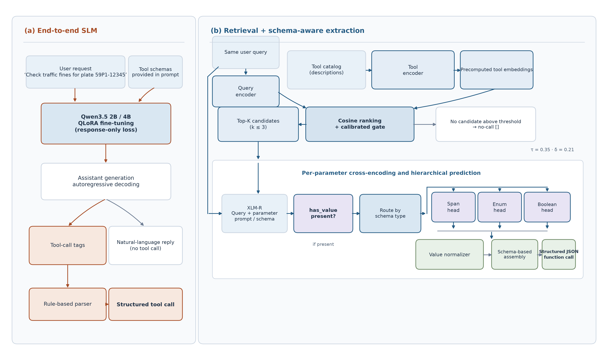
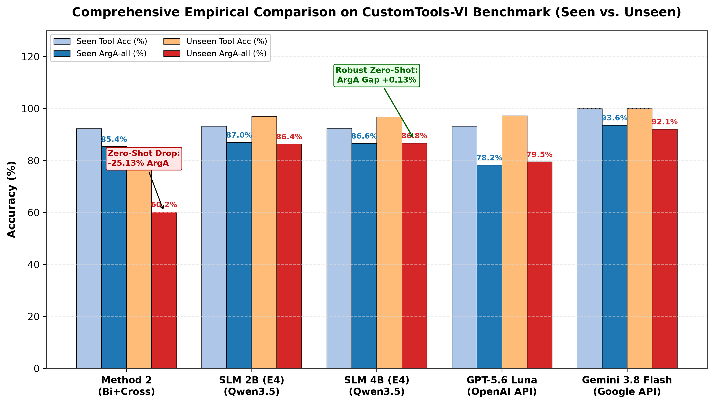
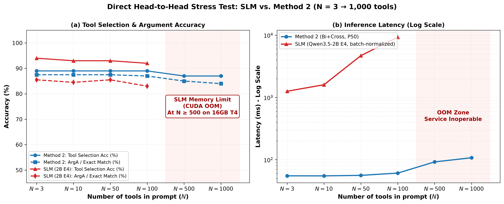
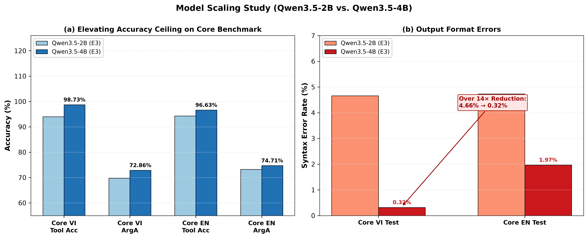

# Vietnamese Tool Calling: Comparing End-to-End Small Language Models with a Bi-Encoder–Cross-Encoder Architecture

**Phuoc Thinh Dao¹, Quang Dat Ha¹, Van Thin Dang¹\***

¹ Faculty of Computer Science, University of Information Technology, Vietnam National University Ho Chi Minh City, Vietnam

Email: 25210038@ms.uit.edu.vn; 25210008@ms.uit.edu.vn; thindv@uit.edu.vn

\* Corresponding author

---

## Abstract

Tool calling enables AI agents to interact with external APIs, but its application to Vietnamese requires accurate argument extraction and abstention under latency and memory constraints. This paper empirically compares end-to-end Qwen3.5 2B/4B small language models with a decoupled BGE-M3 Bi-Encoder and hierarchical XLM-RoBERTa Cross-Encoder on the Canonical Core Benchmark (77,028 bilingual pairs) and CustomTools-VI (8,000 samples). Qwen3.5-2B E4 achieves 87.00% ArgA on seen tools and 86.38% on unseen tools, exceeding GPT-5.6 Luna in the evaluated CustomTools-VI run. In the stress test, Method 2 records P50 latency of 55.05–107.68 ms, approximately 3.21 GiB of PyTorch allocated VRAM, and a 0.00% syntax error rate under the structured-output definition. At $N \ge 500$, the SLM encounters CUDA OOM on a 16 GB GPU, whereas Method 2 retains 84.00% ArgA at $N=1{,}000$. Because the methods use different latency protocols, their measurements are compared descriptively rather than converted into a speedup factor. The results provide quantitative evidence for architecture selection under quality and resource constraints.

**Keywords:** Tool Calling, Small Language Models, Bi-Encoder, Cross-Encoder, Parameter Extraction, Vietnamese NLP.

---

## 1. Introduction

Tool calling (frequently termed function calling) is the foundational mechanism that allows Large Language Models (LLMs) and autonomous AI agents to bridge the gap between internal parametric representations and external digital environments. By analyzing natural language user queries alongside formal tool schema definitions, an agent must dynamically determine whether an external tool invocation is warranted, select the exact target API, and extract structured arguments satisfying rigid parameter constraints.



*Figure 1: Overall architectural confrontation between two distinct paradigms: Method 1 (Autoregressive End-to-End SLM based on Qwen3.5 generating custom tags parsed by the study-specific parser) and Method 2 (Decoupled Non-Autoregressive pipeline combining Bi-Encoder BGE-M3 for retrieval and Hierarchical Cross-Encoder XLM-R for parameter extraction).*

Although commercial systems have demonstrated strong tool-calling performance, Vietnamese deployment still presents four engineering challenges:
1. **Inference latency**: Autoregressive decoding over contexts containing multiple JSON Schemas increases computation; the magnitude depends on the model, hardware, and serving protocol.
2. **Operational cost and data governance**: Cloud APIs incur usage costs and require explicit assessment of access control, storage, compliance, and data-protection policies.
3. **Structured Format Hallucination**: Generative models frequently output corrupted JSON syntax, miss closing delimiters, or fabricate non-existent parameters when confronted with complex schemas.
4. **Scarcity of Vietnamese resources**: Vietnamese monetary, date, and place expressions exhibit substantial surface variation. Within the scope of this review, widely used benchmarks such as BFCL and ToolBench do not provide a controlled, Vietnamese-specific evaluation set.

We compare two architecture families: an **end-to-end generative SLM** and a **decoupled Bi-Encoder–Cross-Encoder system**. The study addresses five research questions:
- **RQ1 (Cross-Lingual Knowledge Transfer)**: To what degree does tool-calling competence acquired from English pre-training and fine-tuning transfer to Vietnamese queries without native training data?
- **RQ2 (Over-triggering and negative calibration)**: Does bilingual instruction tuning over-trigger tools on ordinary conversational queries, and what changes after adding in-domain negative examples?
- **RQ3 (Generalization to unseen tools)**: How do the two methods perform on tools absent from training?
- **RQ4 (Quality–latency trade-off)**: What quality and resource trade-offs arise between the two architectures under the measured protocols?
- **RQ5 (Catalog scalability)**: How do accuracy, latency, and executability change as the tool catalog grows from $N=3$ to $N=1{,}000$?

### Contributions
1. We construct two benchmarks: the Canonical Core Benchmark with 77,028 bilingual pairs and CustomTools-VI with 8,000 samples, including unseen-tool partitions and 50% negative queries in both CustomTools-VI test splits.
2. We compare an end-to-end SLM with a schema-aware Bi-Encoder–Cross-Encoder system and evaluate two commercial APIs on the same CustomTools-VI splits.
3. We evaluate catalog sizes from $N=3$ to $N=1{,}000$, reporting accuracy, latency, memory, and non-executable conditions while avoiding direct ratios between incompatible timing protocols.

---

## 2. Related Work

### 2.1 Tool Calling with Generative Language Models
Toolformer studies how language models can learn to invoke tools [1], while Gorilla focuses on API selection from documentation [2]. APIGen/xLAM [3] and ToolACE [4] scale automatically generated and verified function-calling data. The Berkeley Function-Calling Leaderboard (BFCL) provides evaluation protocols for multiple invocation and dialogue settings [5].

Ersoy et al. study SLM fine-tuning for Arabic and report benefits from combining translated and in-language data in their setting [6]. We investigate the corresponding problem for Vietnamese and add a Bi-Encoder–Cross-Encoder comparison under paired bilingual controls.

### 2.2 Dense Retrieval and Discriminative Argument Extraction
In systems with many APIs, placing every tool definition in the language-model context increases input length and inference cost. ToolLLM [7] and AnyTool [8] investigate retrieval or selection mechanisms that reduce the candidate set before downstream processing. BGE-M3 provides multilingual dense representations at multiple granularities [9].

For argument extraction, prior work builds on bidirectional BERT representations [10] for intent and slot prediction, including JointBERT [11] and the Schema-Guided Dialogue dataset [12]. XLM-RoBERTa provides a cross-lingual encoder backbone for this component [13]. Unlike pipelines that retain a generative model after retrieval, our system constructs outputs from schema-routed classification and extraction heads without autoregressive output decoding.

---

## 3. Data and Evaluation Protocol

We use two complementary datasets, summarized in Table 1. The Canonical Core Benchmark is normalized from Glaive Function Calling v2 [14] and xLAM Function Calling 60k [15], then paired in English and Vietnamese using the procedure in Section 3.1. CustomTools-VI is constructed specifically for this study.

**Table 1: Training and evaluation split statistics**

| Dataset | Positive | Negative | Train | Val | Test | Tools |
| :--- | ---: | ---: | ---: | ---: | ---: | ---: |
| Core Glaive | 13,393 | 4,817 | 14,561 | 1,819 | 1,830 | 864 |
| Core xLAM | 58,818 | 0 | 47,054 | 5,882 | 5,882 | 3,602 |
| **Core (EN–VI pairs)** | **72,211** | **4,817** | **61,615** | **7,701** | **7,712** | **4,421** |
| Custom Seen | 4,200 | 2,600 | 5,600 | 400 | 800 | 20 |
| Custom Unseen | 600 | 600 | 0 | 400 | 800 | 20 |
| **CustomTools-VI** | **4,800** | **3,200** | **5,600** | **800** | **1,600** | **40** |

*Core rows count matched 1:1 EN–VI pairs (77,028 pairs; the same counts in each language), not pooled language instances. CustomTools-VI contains Vietnamese only; each test split is 50% negative. Glaive contains single calls and negatives; xLAM contains multi-call cases. Unique tool counts in total rows need not equal sums because tools can overlap.*

*(Data Representation Mapping Note: The figures in Table 1 represent master conversational records. When training the discriminative architecture (Method 2 Shared E4), these instances are converted into 70,988 positive pairs (query, tool_description) for the Bi-Encoder (strictly excluding all 20 unseen tools) and 135,617 hierarchical pairs (query, param_schema) for the Cross-Encoder. On the Core Benchmark, Method 2 is evaluated across all 7,712 VI Test and 7,712 EN Test instances under the unified benchmark protocol).*

### 3.1 Translation Rules and Frozen Revision
To control leakage and preserve the same split across models, we freeze revision `2026-09-02-full-dedup-seed42`, containing **77,028 paired records** after deduplication and partitioned approximately 80/10/10 with a fixed seed. Function names, argument keys, UUIDs, currency codes, and JSON Schemas remain unchanged during translation; only user queries, tool descriptions, and natural-language string values are translated.

### 3.2 CustomTools-VI: Culturally Grounded Benchmark
This benchmark comprises 8,000 instances specifically crafted to reflect authentic Vietnamese everyday activities across 10 distinct service domains:
1. *E-commerce & Shopping*: Order tracking, voucher lookup, product price comparison.
2. *Domestic Travel & Transport*: Interprovincial coach ticketing, domestic flight inquiries.
3. *Food & Dining Delivery*: Table reservations, local specialty restaurant discovery.
4. *Utilities & Living Services*: Electricity/water bill payments, prepaid mobile top-ups.
5. *Banking & Digital Fintech*: Interbank transfers by account/bank code, foreign exchange rates.
6. *Real Estate & Rental*: University student room rentals, preliminary land valuation.
7. *Public Administration & Citizen Services*: Traffic violation lookup (cold fines), residency registration.
8. *Healthcare & Medical Clinics*: Provincial hospital appointment booking, nearby GPP pharmacy search.
9. *Education & Tutoring*: STEM subject tutoring, historical university entrance cutoff scores.
10. *Logistics & Parcel Delivery*: Intra-city shipping fare calculations, postal parcel tracking.

**Data curation and quality control**: The 8,000 samples are produced in four stages: (1) manual design of 40 tool schemas with type constraints; (2) LLM-assisted generation under controlled prompts, including colloquial monetary, date, and place expressions; (3) automatic validation of schema conformance and required fields; and (4) manual review of all 1,600 test samples for gold labels, naturalness, and negative-sample balance. This process reduces detectable errors but does not guarantee an error-free benchmark.

**Unseen-tool split**: Twenty unseen tools distributed across 10 domain groups are absent from training examples and hard-negative mining for both methods; their schemas are provided only at inference time. Both `test_seen` and `test_unseen` contain 800 samples, evenly divided between tool-calling and non-tool queries.

### 3.3 Reproducibility
Each experiment is associated with a configuration, frozen data revision, and seed. Source code, manifests, data checksums, training configurations, and checkpoints are intended for release under appropriate licenses. Resource links will be added according to the selected venue's review policy.

---

## 4. Methodology

### 4.1 Method 1: End-to-End Small Language Model (SLM)

We formalize tool calling as conditioned sequence generation. The input sequence comprises a system prompt specifying a custom tag format parsed by study-specific rules, the catalog of candidate tools $\mathcal{T} = \{t_1, t_2, \dots, t_K\}$ with complete JSON schemas, and the user natural language query $q$.

#### Custom-Tag Response Format
The model is trained to generate a custom tag structure recognized by the study-specific parser rather than standard XML:
```text
<tool_call>
<function=tool_name>
<parameter=param_name>param_value</parameter>
</function>
</tool_call>
```
For non-tool conversational queries, the model generates a natural-language response (e.g., *"Hello! How may I assist you today?"*) rather than an artificial sentinel such as `<no_tool_call>`.

#### Response-Only Masked Cross-Entropy Loss
To maximize structural learning efficiency and prevent allocating model capacity to memorizing prompt tool definitions, the loss is computed strictly over assistant tokens:

$$\mathcal{L}_{SFT} = -\sum_{i=1}^{N} m_i \log P(w_i \mid w_{<i}, q, \mathcal{T})$$

where $m_i = 1$ if token $w_i$ belongs to the Assistant output sequence, and $m_i = 0$ for all tokens spanning the System Prompt, Tool Schemas, and User Query.

#### Training-Data Configurations
- **E0 (Zero-Shot Baseline)**: The base instruction-tuned checkpoint `unsloth/Qwen3.5-2B` without additional training.
- **E1 (Monolingual English)**: Trained on 60,000 English Core samples.
- **E2 (Monolingual Vietnamese)**: Trained on the exact 60,000 Vietnamese counterpart samples.
- **E3 (Bilingual Balanced)**: Trained on 30,000 English + 30,000 Vietnamese balanced samples.
- **E4 (Bilingual + Domain-Specific)**: Trained on the 60,000 bilingual samples of E3 combined with 5,600 specialized samples from the `CustomTools-VI` training split (total budget: 65,600 instances).

---

### 4.2 Method 2: Specialized Bi-Encoder + Cross-Encoder Architecture

The discriminative architecture comprises two sequential stages and does not use autoregressive decoding to construct the structured output.

#### Stage 1: Semantic Tool Retrieval via Bi-Encoder (BGE-M3)
The Bi-Encoder maps the user query $q$ and each tool documentation string $d_t$ into dense vector representations $\mathbf{e}_q, \mathbf{e}_t \in \mathbb{R}^d$:

$$\mathbf{e}_q = \text{BiEncoder}(q), \quad \mathbf{e}_t = \text{BiEncoder}(d_t)$$

Semantic similarity is measured by cosine similarity: $s(q, t) = \cos(\mathbf{e}_q, \mathbf{e}_t)$. The model is optimized over two stages using `CachedMultipleNegativesRankingLoss`:
- **Round 1 (Teacher)**: Trained on 70,988 positive pairs (Query, Positive Tool) to structure the shared latent embedding space.
- **Hard Negative Mining**: The Round 1 checkpoint scans the entire tool inventory to select the most confusable non-target tools as hard negative distractors.
- **Round 2 (Student)**: Fine-tuned iteratively with mined hard negative pairs.

**Abstention Thresholding**: On the validation set, we calibrate two decision hyperparameters: a minimum confidence threshold $\tau = 0.35$ and a top-1 to top-2 score margin $\delta = 0.21$, with a maximum of $k_{\max}=3$ candidate tools retrieved. If the top candidate fails the calibrated threshold test, the system abstains from tool execution. Thresholds are frozen prior to test evaluation.

#### Stage 2: Schema-Aware Parameter Extraction via Cross-Encoder (XLM-RoBERTa-base)
For each candidate tool $t$ admitted by Stage 1, the Cross-Encoder takes as input a BERT-QA formatted pair between the user query $q$ and individual parameter documentation $p_k \in \mathcal{P}_t$:

$$\mathbf{h} = \text{CrossEncoder}([CLS] \circ q \circ [SEP] \circ p_k \circ [SEP])$$

The architecture routes representations into four specialized prediction heads:
1. **`has_value` Head**: Binary classifier identifying whether parameter $p_k$ is present in the query:
   $$\hat{y}_{has} = \sigma(\mathbf{W}_{has} \mathbf{h}_{[CLS]} + b_{has})$$
2. **`span_extraction` Head**: (Active when $p_k$ is a free-form string) Predicts the starting and ending token indices within the user query:
   $$P_{start}(i) = \text{softmax}(\mathbf{W}_s \mathbf{h}_i), \quad P_{end}(j) = \text{softmax}(\mathbf{W}_e \mathbf{h}_j)$$
3. **`enum_classification` Head**: (Active when $p_k$ is an enumeration) Predicts probability distribution across schema-defined categorical choices:
   $$\mathbf{p}_{enum} = \text{softmax}(\mathbf{W}_{enum} \mathbf{h}_{[CLS]} + \mathbf{b}_{enum})$$
4. **`boolean` Head**: (Active when $p_k$ is boolean) Binary classifier predicting True/False:
   $$\hat{y}_{bool} = \sigma(\mathbf{W}_{bool} \mathbf{h}_{[CLS]} + b_{bool})$$

#### Hierarchical Joint Loss
The Cross-Encoder model is jointly optimized via a conditional composite loss function:

$$\mathcal{L}_{Cross} = \mathcal{L}_{has} + y_{has} \sum_{b \in \{span,enum,bool\}} \mathbf{1}[b=b(p_k)]\lambda_b\mathcal{L}_b$$

where:
- $\mathcal{L}_{has}$ denotes Binary Cross-Entropy loss for parameter presence ($y_{has} \in \{0, 1\}$).
- $y_{has}$ acts as a conditioning mask: sub-head loss gradients backpropagate strictly when the target parameter is present in the query ($y_{has} = 1$). The branch notation $b(p_k)$ identifies the head associated with the type of parameter $p_k$, and $\mathbf{1}[b=b(p_k)]$ ensures that only this branch contributes to the loss.
- $\mathcal{L}_{span}$ is the joint Cross-Entropy loss over start and end span pointers; $\mathcal{L}_{enum}$ is multi-class Cross-Entropy across permitted schema choices; $\mathcal{L}_{bool}$ is Binary Cross-Entropy for truth values.
- Balancing coefficients are set to $\lambda_{span} = \lambda_{enum} = \lambda_{bool} = 1.0$.

#### Schema-Driven Inference Routing
During inference, the system selects the head associated with the parameter's `type` or `enum` field when $\hat{y}_{has} \ge 0.5$. If $\hat{y}_{has} < 0.5$, the parameter is treated as absent and no sub-head value is used in the final output. This routing avoids merging predictions from incompatible types.

#### Value Normalizer
A rule-based and regex-driven post-processing module normalizes extracted surface text into canonical types (e.g., mapping "20/10/2026" to `2026-10-20` when the year is explicitly stated and "nửa triệu" to `500000`).

---

### 4.3 Hardware and Training Hyperparameters

The execution environment is reported separately for each method because the hardware and training procedures are not identical:

- **Training infrastructure**: SLMs are trained on Google Colab Pro with 1× NVIDIA A100-SXM4-40GB, 83.5 GB RAM, Ubuntu 22.04 LTS, CUDA 12.4, and PyTorch 2.5 using Unsloth and 4-bit NF4 QLoRA [16]. The Bi-Encoder and Cross-Encoder are trained independently on a 16 GB Tesla T4.
- **Inference & Evaluation Benchmark**: Executed independently on Kaggle environments with 2× NVIDIA Tesla T4 GPUs (14.56 GB accessible VRAM per device, Turing Compute Capability 7.5), CUDA 12.x, PyTorch 2.x. SLMs were evaluated under 4-bit quantization (NF4 BitsAndBytes) with greedy decoding (`do_sample=False`, `max_new_tokens=128`). Method 2 Shared E4 and stress tests executed on a single Tesla T4 GPU with batch size 1.
- **Hyperparameters and Configuration**: SLMs use 4-bit NF4 QLoRA with $r=16$, $\alpha=16$, zero dropout, a $5\times10^{-7}$ learning rate (cosine schedule, 0.05 warmup), and effective batch size 64, targeting linear q, k, v, o, gate, up, and down modules. The BGE-M3 Bi-Encoder uses LoRA ($r=16$, $\alpha=32$, dropout 0.05), a $2\times10^{-5}$ learning rate, effective batch size 256, and two CachedMNRL rounds with mined hard negatives. The XLM-R Cross-Encoder uses hierarchical heads, effective batch size 64, and learning rates $3\times10^{-5}$ on Core, $1\times10^{-5}$ on Custom, and $1\times10^{-4}$ for the heads.

In isolated profiling on Tesla T4, peak allocated VRAM for 4-bit Qwen3.5-2B falls within 4.8–5.5 GB depending on framework runtime overhead, while Qwen3.5-4B requires approximately 9.5 GB. For Method 2, stress test telemetry registers a peak PyTorch allocated footprint of 3,277.14–3,283.09 MiB (~3.20–3.21 GiB) and peak reserved memory of 3,388–3,772 MiB. Because SLM and Method 2 profiles were measured under differing memory tracing scopes, they are presented as descriptive engineering comparisons.

---

## 5. Metrics and Evaluation Setup

Following structured-call evaluation in BFCL [5] and Ersoy et al. [6], we use the following metrics on all test splits.

### 5.1 Tool Selection Accuracy
**Tool Selection Accuracy (Tool Acc %)** is the proportion of positive queries where the predicted list of tool names matches the ground-truth tool list exactly, without considering argument values. For local-model evaluation, multi-call queries require the predicted tool list to match both membership and order. The stored API evaluator sorts predicted and reference tool names before comparison, so it checks names and multiplicities without enforcing order; API Tool Acc is therefore a protocol-specific comparison rather than an order-equivalent score:

$$\mathrm{ToolAcc} = \frac{N_{\mathrm{tool\text{-}exact, positive}}}{N_{\mathrm{positive}}}$$

### 5.2 Argument Population Accuracy (ArgA / Exact Match)
**ArgA** is the most rigorous holistic metric, measuring the percentage of queries whose predicted tool calls match the ground-truth annotations with 100% precision (tolerating zero discrepancies in function names, argument keys, or extracted values). The local-model scorer requires order-preserving call matching and applies the study's normalization rules. The API scorer greedily pairs each predicted call with an unmatched reference call without enforcing order; numeric values use tolerance $10^{-4}$, while other values are compared after trimming surrounding whitespace and ignoring case. API and local ArgA values are therefore descriptive comparisons, especially for multi-call queries.

The primary reported metric across the full test split (including negative conversational queries correctly answered without tool calls) is:

$$\mathrm{ArgA}_{\mathrm{all}} = \frac{N_{\mathrm{exact, all}}}{N_{\mathrm{all}}}$$

For dedicated analysis strictly on positive queries that require tool invocations, we also report:

$$\mathrm{ArgA}_{\mathrm{positive}} = \frac{N_{\mathrm{exact, positive}}}{N_{\mathrm{positive}}}$$

*(Throughout this paper, "ArgA" designates $\mathrm{ArgA}_{\mathrm{all}}$ unless explicitly designated as positive).*

### 5.3 Non-FC Recall
Quantifies the model's abstention capability when processing ordinary conversational queries that do not require external tool execution, guarding against false-positive triggers:

$$\mathrm{Non\text{-}FC\ Recall} = \frac{N_{\mathrm{true\ negative}}}{N_{\mathrm{negative}}}$$

### 5.4 Syntax Error Rate & Inference Latency
- **Syntax Error Rate (%)**: The percentage of tool-call outputs that are not recognized by the parser associated with each method. The SLM uses custom tags and a dedicated parser, whereas APIs may return JSON. The stored API task also marks request failures through an exception branch, so this rate is not fully identical to the SLM format check. It does not mean standard XML validation or argument correctness. Method 2 constructs structured outputs directly and records 0.00% under the current protocol; semantic correctness is assessed with ArgA.
- **Inference Latency (ms)**: Tables identify mean or P50/P95 values as appropriate. On Core, SLM tables report batch generation time divided by sample count, whereas Method 2 measures individual batch-1 requests. In the stress test, Method 2 reports P50/P95 and the SLM still reports batch-normalized generation time. Measurements from different protocols are compared descriptively and are not converted into speedup factors.

---

## 6. Experimental Results

Tables 2 and 3 report the central results on both benchmarks.

*(Bold figures indicate best performance within each sub-cohort)*

**Table 2: Empirical Performance on CustomTools-VI (800 seen and 800 unseen samples)**

**(a) Seen Split**

| Model | Tool Acc | ArgA-all | Non-FC | Syntax error |
| :--- | ---: | ---: | ---: | ---: |
| E0 (2B) | 39.25 | 56.75 | 97.75 | 11.12 |
| E1 (2B) | 91.50 | 63.12 | 75.25 | 5.75 |
| E2 (2B) | 91.00 | 51.50 | 67.50 | 8.12 |
| E3 (2B) | 92.25 | 19.38 | 3.00 | 5.38 |
| E4 (2B) | 93.25 | 87.00 | **100.00** | 3.38 |
| E3 (4B) | 92.00 | 62.00 | 71.25 | 13.38 |
| E4 (4B) | 92.50 | 86.62 | **100.00** | 5.38 |
| Method 2 | 92.25 | 85.38 | 92.75 | **0.00** |
| GPT-5.6 Luna | 93.25 | 78.25 | 100.00 | 0.00 |
| Gemini 3.8 Flash | **100.00** | **93.62** | 100.00 | 0.00 |

**(b) Unseen Split**

| Model | Tool Acc | ArgA-all | Non-FC | Syntax error |
| :--- | ---: | ---: | ---: | ---: |
| E0 (2B) | 40.75 | 62.50 | 97.25 | 10.88 |
| E1 (2B) | 96.50 | 70.50 | 74.50 | 3.25 |
| E2 (2B) | 96.25 | 59.62 | 67.75 | 6.25 |
| E3 (2B) | 96.00 | 27.88 | 2.00 | 3.25 |
| E4 (2B) | 97.00 | 86.38 | **100.00** | 1.50 |
| E3 (4B) | **97.50** | 69.75 | 74.50 | 10.62 |
| E4 (4B) | 96.75 | **86.75** | **100.00** | 1.62 |
| Method 2 | 79.50 | 60.25 | 93.75 | **0.00** |
| GPT-5.6 Luna | 97.25 | 79.50 | 100.00 | 0.00 |
| Gemini 3.8 Flash | **100.00** | **92.12** | 99.75 | 0.12 |

*(All table entries are percentages. E0–E4 are defined in Section 4.1; Method 2 is Shared E4. Tool Accuracy is computed on positive queries, whereas ArgA-all covers all test instances. Method 2's 60.25% unseen ArgA-all therefore differs from its 26.75% positive-only ArgA. The two commercial APIs were evaluated once on 1,600 samples using the Kaggle Benchmark SDK on September 16, 2026. The task code did not pass `temperature`, so $T=0$ cannot be confirmed. The Gemini run log reports 0/800 syntax errors on seen and 1/800 on unseen (0.12% after task-code rounding); the combined 1/1,600 rate is approximately 0.06%.)*



*Figure 2: Head-to-head empirical comparison of Tool Selection Accuracy (Tool Acc) and Argument Accuracy (ArgA) on CustomTools-VI (Seen vs. Unseen).*

---

**Table 3: Core VI and Core EN results (7,712 samples per split)**

**(a) Core VI**

| Model | Tool Acc (%) | ArgA (%) | Syntax error (%) | Latency (ms) |
| :--- | ---: | ---: | ---: | ---: |
| E0 (2B) | 56.34 | 40.48 | 15.13 | 707 |
| E1 (2B) | 93.67 | 65.57 | 4.94 | 878 |
| E2 (2B) | 90.25 | 64.90 | 9.48 | 872 |
| E3 (2B) | 94.00 | **69.76** | 4.66 | 864 |
| E4 (2B) | 93.92 | 69.75 | 4.67 | 970 |
| E3 (4B) | **98.73** | **72.86** | 0.32 | 2,432 |
| E4 (4B) | 86.22 | 64.94 | 9.75 | 2,485 |
| Method 2 | 59.20 | 30.26 | 0.00 | 59.55 |

**(b) Core EN**

| Model | Tool Acc (%) | ArgA (%) | Syntax error (%) | Latency (ms) |
| :--- | ---: | ---: | ---: | ---: |
| E0 (2B) | 85.18 | 60.63 | 6.66 | 690 |
| E1 (2B) | 94.07 | **73.66** | 4.88 | 875 |
| E2 (2B) | 93.45 | 71.36 | 5.64 | 193 |
| E3 (2B) | 94.27 | 73.22 | 4.73 | 849 |
| E4 (2B) | 94.17 | 73.15 | 4.73 | 931 |
| E3 (4B) | **96.63** | **74.71** | 1.97 | 3,290 |
| E4 (4B) | 85.03 | 66.66 | 11.36 | 3,310 |
| Method 2 | 62.60 | 35.52 | 0.00 | 59.45 |

*Tool Acc covers positive queries, whereas ArgA covers the entire split. SLM syntax errors are measured using the custom-tag parser; Method 2 constructs structured outputs and records 0.00% format errors, which does not imply correct arguments. Method 2 Non-FC Recall is 94.09% on Core VI and 94.30% on Core EN; SLM configurations generally reach 94.30%, except E0 (96.33% VI, 94.50% EN) and E2 (93.08% EN). SLM latency is batch time divided by sample count as reported in the experiment summary; Method 2 reports synchronized batch-1 P50 with cached tool embeddings (excluding model loading and the 95.41 s index-build time). These protocols do not support a direct speedup ratio.*

---

### 6.1 Cross-Lingual Transfer (RQ1)
E1, trained only on English, remains effective on Vietnamese queries in a schema-guided setting. On Core VI, E1 reaches 65.57% ArgA-all versus 64.90% for E2; on Custom Unseen, the corresponding values are 70.50% and 59.62%. These observations are consistent with partial cross-lingual transfer of schema interpretation, but the design does not isolate the effects of multilingual pretraining from those of fine-tuning data.

### 6.2 Over-Triggering and Negative Examples (RQ2)
The bilingual E3 model degrades substantially on CustomTools-VI: ArgA-all is 19.38% on seen and 27.88% on unseen, while Non-FC Recall is 3.00% and 2.00%. Most negative queries are incorrectly classified as tool requests, indicating over-triggering under this evaluation condition.

After adding 5,600 CustomTools-VI samples containing negative examples, E4 reaches 100.00% Non-FC Recall on both splits and 87.00%/86.38% ArgA-all on seen/unseen. The difference is consistent with in-domain data improving abstention, but E3 and E4 differ in multiple data components; the experiment does not isolate the causal contribution of negative examples alone.

### 6.3 Generalization to Unseen Tools (RQ3)
SLM E4 reaches 86.38% ArgA-all on unseen tools, 0.62 percentage points below seen performance. This result is consistent with using tool descriptions and schemas supplied in the prompt, although the evaluation does not isolate individual mechanisms. Method 2 declines from 85.38% on seen to 60.25% on unseen; unseen positive-only ArgA is 26.75% and Tool Acc is 79.50%. Oracle evaluation indicates that errors are not limited to retrieval, but it does not justify assigning the entire decline to the Cross-Encoder.

### 6.4 Quality–Latency–Memory Trade-Off (RQ4)

On CustomTools-VI, 2B E4 reaches 87.00%/86.38% ArgA on seen/unseen tools, versus 85.38%/60.25% for Method 2 (Table 2). Core VI SLM 2B E4 batch-normalized latency is 970 ms; Method 2 batch-1 P50 ranges from 55.05 to 107.68 ms in the stress test. Reference SLM peak VRAM is ~4.8–5.5 GB, whereas Method 2 records ~3.21 GiB allocated and up to 3.77 GiB reserved in stress testing. Because timing and memory protocols differ, these measurements are only descriptive comparisons. The SLM's syntax-error rate across CustomTools-VI is 2.44% versus 0.00% for Method 2 under its structured-output protocol; ArgA remains necessary for assessing content. In the measured setting, SLM E4 is relevant when unseen schemas are common, whereas Method 2 is relevant when a stable catalog and low batch-1 latency are priorities.

---

### 6.5 Comparison with Commercial APIs

Evaluation across 1,600 CustomTools-VI samples yields critical insights when comparing local fine-tuned models against commercial closed-source APIs:

**Qwen3.5-2B E4 records higher ArgA than GPT-5.6 Luna on this benchmark.** GPT-5.6 Luna reaches 78.25% seen and 79.50% unseen ArgA-all, whereas Qwen3.5-2B E4 reaches 87.00% and 86.38%, differences of 8.75 and 6.88 percentage points. A single benchmark and API run do not support generalization beyond the reported protocol.

**Gemini 3.8 Flash records the highest API result in this run.** It reaches 100.00% Tool Accuracy on both splits and 93.62%/92.12% ArgA-all on seen/unseen. The Kaggle run log reports 0/800 (0.00%) syntax errors on seen and 1/800 (0.12%) on unseen, or 1/1,600 (approximately 0.06%) overall.

**Latency, cost, and data governance.** Commercial APIs, SLMs, and Method 2 were measured under different protocols; the paper therefore does not convert these values into normalized speed or cost ratios. Commercial APIs depend on network access and provider pricing, whereas local models require separate infrastructure assessment.

---

### 6.6 Tool-Catalog Scalability (RQ5)

The stress test compares Qwen3.5-2B E4 with Method 2 as the catalog grows from $N=3$ to $N=1{,}000$. It uses 200 Custom Seen queries (100 positive and 100 negative), producing 1,200 evaluation instances. Candidate sets are nested prefixes and always contain the gold tool for positive queries. Independent re-scoring matches the stored counts, strict/reference metrics, and latency statistics.

**Table 4: Stress-Test Results ($N = 3 \to 1{,}000$ tools)**
*(Note: OOM denotes Out of Memory—process killed due to exceeding 16GB VRAM on Tesla T4).*

| $N$ | SLM Tool Acc | M2 Tool Acc | SLM ArgA | M2 ArgA | M2 P50 (ms) |
| ---: | ---: | ---: | ---: | ---: | ---: |
| 3 | 94.0 | 89.0 | 85.5 | 87.5 | 55.13 |
| 10 | 93.0 | 89.0 | 84.5 | 87.5 | 55.05 |
| 50 | 93.0 | 89.0 | 85.5 | 87.5 | 56.07 |
| 100 | 92.0 | 89.0 | 83.0 | 87.0 | 61.01 |
| 500 | *OOM* | 87.0 | *OOM* | 85.0 | 92.27 |
| 1,000 | *OOM* | 87.0 | *OOM* | 84.0 | 107.68 |

*Accuracy columns are percentages. OOM denotes CUDA Out of Memory on a 16 GB T4. Method 2 P95 grows from 84.92 to 148.21 ms and PyTorch allocated peak VRAM ranges from 3,277 to 3,283 MiB across the six levels. SLM batch-normalized latencies for $N=3,10,50,100$ are 1,258.94, 1,604.68, 4,703.39, and 9,318.21 ms, respectively. Method 2 P50 measures synchronized batch-1 requests with cached tool embeddings; no cross-protocol speedup factor is calculated.*



*Figure 3: Stress-test results: (a) accuracy and the SLM CUDA OOM boundary at $N \ge 500$; (b) Method 2 batch-1 P50 and SLM batch-normalized latency on a log scale.*

#### Stress-Test Analysis

**Argument accuracy.** Over nested candidate prefixes preserving the gold tool, Method 2 declines from 87.50% ArgA at $N=3$ to 84.00% at $N=1{,}000$, a 3.50-point difference. At $N \le 100$, its ArgA is 2.0–4.0 points above the SLM; Non-FC Recall is 95.00% at $N=1{,}000$.

**Latency.** At $N \le 100$, Method 2 P50 ranges from 55.05 to 61.01 ms and P95 from 84.74 to 86.46 ms. At $N=1{,}000$, P50 is 107.68 ms, 1.95 times its value at $N=3$. The experiment does not isolate component-level costs, and no cross-protocol speedup is reported.

**Memory limit.** In the T4 16 GB configuration, the SLM encounters CUDA OOM at $N \ge 500$. Longer prompts may increase memory demand, but the experiment does not isolate attention, KV cache, precision, batch size, or kernel implementation. Method 2 remains executable at $N=1{,}000$ with approximately 3.21 GiB allocated VRAM, 87.00% Tool Acc, and 84.00% ArgA.

---

### 6.7 Effect of Model Scale

We extend training to `unsloth/Qwen3.5-4B` using the same data budgets, a learning rate of $5 \times 10^{-7}$, and effective batch size 64. E4 completes 1,025 steps in 2 h 05 min with a final loss near 0.0103. The loss difference from the 2B checkpoint is descriptive because the checkpoints may differ in factors beyond parameter count.

The 2B/4B ArgA gaps (unseen minus seen) are +8.50/+7.75 percentage points under E3 and −0.62/+0.13 under E4, respectively, as derived from Table 2. Core VI syntax-error rates for E3/E4 are 4.66%/4.67% for 2B and 0.32%/9.75% for 4B; A100 training takes 49.5/54 minutes for 2B and 1 h 55 min/2 h 05 min for 4B. Each Core test split has 7,712 samples; SLM evaluation is distributed across two Tesla T4 GPUs, but each query runs on only one device.



*Figure 4: Comparison of Qwen3.5-2B and Qwen3.5-4B under E3: (a) Core Benchmark accuracy; (b) Core VI output-format error rate decreases from 4.66% to 0.32% according to the study parser.*

#### Model-Scaling Analysis

Under E3, the 4B checkpoint records lower Core VI syntax error (0.32% versus 4.66%) and higher Core VI ArgA (72.86% versus 69.76%) than the 2B checkpoint. It also records substantially higher CustomTools-VI ArgA. These are observed checkpoint differences; the experiment does not isolate parameter count from all other training and optimization factors, so they should not be interpreted as a causal estimate of scaling alone.

Under E4, the 4B checkpoint records **92.50% Tool Acc / 86.62% ArgA** on Seen and **96.75% / 86.75%** on Unseen, yielding a tight ArgA gap of +0.13 percentage points. The close alignment between seen and unseen performance indicates balanced generalization across familiar and zero-shot schemas on this benchmark.

Training and latency measurements show higher resource use for the 4B checkpoints. These measurements are descriptive and do not establish a universally optimal checkpoint: deployment choice depends on the target distribution, latency budget, memory budget, and measured protocol.

---

## 7. Discussion and Limitations

### 7.1 Error Analysis

#### Parameter-Extraction Errors
Inspection of failed predictions from Method 1 E4 and Method 2 on Vietnamese queries suggests three types of parameter-extraction errors. As no auditable sampling and coding record is available, the observations below are qualitative rather than estimates of each error type's prevalence. Call-order errors are discussed separately.

**Entity-boundary ambiguity.** Long place names and nested landmarks can produce overlapping spans, particularly when a schema requires a smaller administrative unit than the surface expression.

**Non-standard normalization.** Colloquial date, time, and monetary expressions may not map cleanly to canonical values. The SLM can reproduce the surface form, while Method 2 depends on normalization rules that do not cover every variant.

**Implicit argument assignment.** Models sometimes insert an optional default value that is absent from the reference, or fail to infer a value that the annotation treats as implicit.

#### Method 2 Diagnostics
Oracle evaluation, head-level validation, and structural analysis help separate retrieval and extraction errors.

**Oracle evaluation.** When supplied with the reference tool, Method 2 ArgA-all increases from 30.26% to 36.81% on Core VI, from 35.52% to 42.23% on Core EN, from 85.38% to 92.00% on Custom Seen, and from 60.25% to 64.25% on Custom Unseen. On positive Custom Unseen cases, ArgA increases from 26.75% to 28.50%. Oracle values are not strict end-to-end results, and repeated calls to the same tool make the Core interpretation approximate.

**Validation-head breakdown.** On the validation set, the Cross-Encoder achieves Has-value F1 of 97.45%, Span EM of 96.18%, Boolean Accuracy of 98.90%, Enum Accuracy of 72.06%, and Argument EM of 65.65%. Within this diagnostic, enum prediction is the weakest reported sub-head.

**Structural multi-call constraints.** The Core Benchmark contains 1,171 queries that invoke the same tool name repeatedly and 146 queries with more than three invocations. Method 2 maps each tool name uniquely and caps retrieval at $k_{\max}=3$, limiting exact representation of these cases.

### 7.2 Limitations

**Single-Turn Scope.** This investigation focuses strictly on single-turn interactions supporting multi-call invocations. Multi-turn dialogue state tracking and conversational memory maintenance remain outside the current experimental scope.

**Tool Execution Sandbox.** The evaluation assesses schema matching and syntactic argument extraction against gold labels without executing calls in live sandbox environments to evaluate backend API execution responses.

**Profiler Divergence in Resource Benchmarking.** Reference peak VRAM for SLMs (~4.8–5.5 GB for 2B and ~9.5 GB for 4B) and peak PyTorch allocated VRAM for Method 2 (~3.21 GiB allocated, ~3.77 GiB reserved) were logged using framework-native memory profilers under differing allocation semantics. Consequently, latency speedup factors and memory savings are reported as descriptive engineering metrics rather than formal statistical guarantees.

**Statistical uncertainty.** The tables report point estimates from one run without confidence intervals or a multi-seed analysis. Small differences between configurations are therefore interpreted only within the evaluated test sets.

---

## 8. Conclusion

This study constructs two benchmarks and compares an end-to-end SLM with a Bi-Encoder–Cross-Encoder architecture for Vietnamese tool calling. On CustomTools-VI, Qwen3.5-2B E4 reaches 87.00% ArgA on seen tools and 86.38% on unseen tools; Qwen3.5-4B E4 reaches 86.62% on seen tools and 86.75% on unseen tools. In the stress test, Method 2 reaches 84.00% ArgA, 107.68 ms P50 latency, and approximately 3.21 GiB of PyTorch allocated VRAM at $N=1{,}000$, while the SLM encounters CUDA OOM from $N \ge 500$ on a 16 GB T4. The results characterize quality, latency, and scalability trade-offs under the stated conditions; they do not establish universal superiority of either architecture.

Future work should evaluate multiple seeds and confidence intervals, align profilers across methods, and extend the benchmark to multi-turn dialogue with actual tool execution. A hybrid architecture that uses a Bi-Encoder to narrow the schema set before SLM extraction should also be evaluated under the same accuracy, latency, and memory protocol.

---

## References

[1] T. Schick *et al.*, “Toolformer: Language models can teach themselves to use tools,” in *Advances in Neural Information Processing Systems*, vol. 36, 2023.

[2] S. G. Patil, T. Zhang, X. Wang, and J. E. Gonzalez, “Gorilla: Large language model connected with massive APIs,” arXiv:2305.15334, 2023.

[3] Z. Liu *et al.*, “APIGen: Automated pipeline for generating verifiable and diverse function-calling datasets,” in *Advances in Neural Information Processing Systems*, vol. 37, pp. 54463–54482, 2024.

[4] W. Liu *et al.*, “ToolACE: Winning the points of LLM function calling,” arXiv:2409.00920, 2024.

[5] F. Yan, H. Mao, C. Ji, T. Zhang, S. G. Patil, I. Stoica, and J. E. Gonzalez, “Berkeley Function Calling Leaderboard,” arXiv:2402.06656, 2024.

[6] A. Ersoy, E. Altinisik, K. M. Darwish, and H. T. Sencar, “Tool calling for Arabic LLMs: Data strategies and instruction tuning,” in *Proc. Third Arabic Natural Language Processing Conf.*, 2025, pp. 347–358, doi: 10.18653/v1/2025.arabicnlp-main.28.

[7] Y. Qin *et al.*, “ToolLLM: Facilitating large language models to master 16000+ real-world APIs,” arXiv:2307.16789, 2023.

[8] Y. Du, F. Wei, and H. Zhang, “AnyTool: Self-reflective, hierarchical agents for large-scale API calls,” arXiv:2402.04253, 2024.

[9] J. Chen, S. Xiao, P. Zhang, K. Luo, D. Lian, and Z. Liu, “BGE M3-embedding: Multi-lingual, multi-functionality, multi-granularity text embeddings through self-knowledge distillation,” arXiv:2402.03216, 2024.

[10] J. Devlin, M.-W. Chang, K. Lee, and K. Toutanova, “BERT: Pre-training of deep bidirectional transformers for language understanding,” in *Proc. NAACL-HLT*, 2019, pp. 4171–4186.

[11] Q. Chen, Z. Zhuo, and W. Wang, “BERT for joint intent classification and slot filling,” arXiv:1902.10909, 2019.

[12] A. Rastogi, X. Zang, S. Sunkara, R. Gupta, and P. Khaitan, “Towards scalable multi-domain conversational agents: The Schema-Guided Dialogue dataset,” in *Proc. AAAI Conf. Artificial Intelligence*, vol. 34, no. 5, 2020, pp. 8689–8696.

[13] A. Conneau *et al.*, “Unsupervised cross-lingual representation learning at scale,” in *Proc. 58th Annual Meeting of the Association for Computational Linguistics*, 2020, pp. 8440–8451.

[14] Glaive AI, “Glaive Function Calling v2,” Hugging Face Datasets, 2023. [Online]. Available: https://huggingface.co/datasets/glaiveai/glaive-function-calling-v2. Accessed: Sep. 23, 2026.

[15] Salesforce AI Research, “xLAM Function Calling 60k,” Hugging Face Datasets, 2024. [Online]. Available: https://huggingface.co/datasets/Salesforce/xlam-function-calling-60k. Accessed: Sep. 23, 2026.

[16] T. Dettmers, A. Pagnoni, A. Holtzman, and L. Zettlemoyer, “QLoRA: Efficient finetuning of quantized LLMs,” in *Advances in Neural Information Processing Systems*, vol. 36, 2023.
