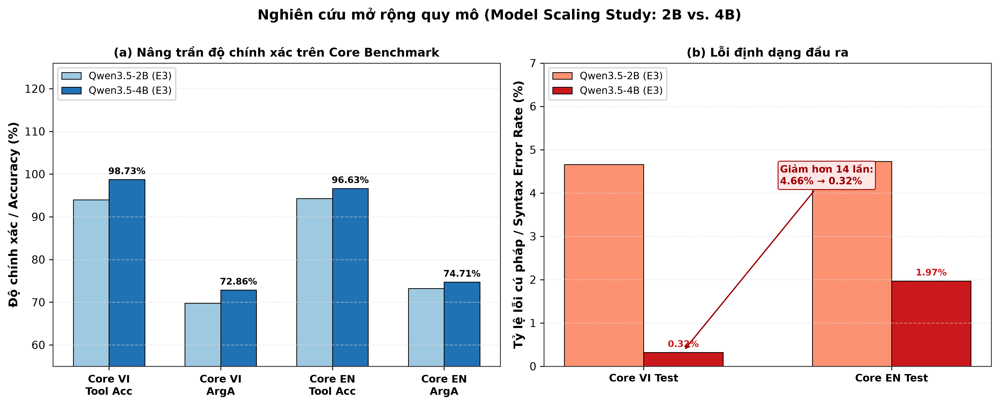

# Gọi công cụ tiếng Việt: So sánh mô hình ngôn ngữ nhỏ đầu-cuối và kiến trúc Bi-Encoder–Cross-Encoder

**Đào Phước Thịnh¹, Hà Quang Đạt¹, Đặng Văn Thìn¹\***

¹ Khoa Khoa học Máy tính, Trường Đại học Công nghệ Thông tin – ĐHQG-HCM, Việt Nam

Email: 25210038@ms.uit.edu.vn; 25210008@ms.uit.edu.vn; thindv@uit.edu.vn

\* Tác giả liên hệ

---

## Tóm tắt

Gọi công cụ (tool calling) là cơ chế giúp tác tử AI tương tác với các API bên ngoài, song việc ứng dụng trên tiếng Việt đặt ra các yêu cầu về độ chính xác trích xuất, khả năng từ chối, độ trễ và bộ nhớ. Bài báo so sánh thực nghiệm Mô hình Ngôn ngữ Nhỏ End-to-End (SLM Qwen3.5 2B/4B) với hệ thống phân tách Bi-Encoder BGE-M3 và Hierarchical Cross-Encoder XLM-RoBERTa trên Canonical Core Benchmark (77,028 cặp song ngữ) và CustomTools-VI (8,000 mẫu). Qwen3.5-2B E4 đạt ArgA 87.00% trên seen và 86.38% trên unseen, cao hơn GPT-5.6 Luna trong lần đánh giá CustomTools-VI. Trong stress test, Method 2 ghi nhận P50 55.05–107.68 ms, PyTorch allocated VRAM khoảng 3.21 GiB và lỗi cú pháp 0% theo định nghĩa structured-output. Khi mở rộng tới $1{,}000$ công cụ, Method 2 duy trì ArgA 84.00%, trong khi SLM gặp CUDA OOM tại $N \ge 500$ trên GPU 16 GB. Các số đo latency của hai phương pháp dùng protocol khác nhau và chỉ được đối chiếu mô tả. Nghiên cứu cung cấp cơ sở định lượng cho việc lựa chọn kiến trúc theo yêu cầu chất lượng và tài nguyên.

**Từ khóa:** Gọi công cụ, mô hình ngôn ngữ nhỏ, Bi-Encoder, Cross-Encoder, trích xuất tham số, tiếng Việt.

---

## 1. Giới thiệu

Khả năng gọi công cụ (tool calling), thường được gọi là gọi hàm (function calling), là cơ chế nền tảng giúp các mô hình ngôn ngữ lớn (LLM) và các tác tử thông minh (AI Agents) kết nối với thế giới bên ngoài. Thông qua việc phân tích ngôn ngữ tự nhiên của người dùng và định nghĩa schema của các công cụ khả dụng, mô hình tự động nhận diện thời điểm cần kích hoạt công cụ, lựa chọn chính xác API mục tiêu và trích xuất các tham số cấu trúc tương ứng.


*Hình 1: Sơ đồ kiến trúc tổng quan đối chiếu giữa hai trường phái kỹ thuật: Phương pháp 1 (SLM End-to-End dựa trên Qwen3.5 sinh mã tự hồi quy) và Phương pháp 2 (Kiến trúc phân tách không tự hồi quy kết hợp Bi-Encoder BGE-M3 và Cross-Encoder XLM-R).*

Mặc dù các hệ thống thương mại đã cho thấy hiệu năng cao trên nhiều tác vụ gọi công cụ, việc triển khai cho tiếng Việt vẫn đặt ra bốn thách thức kỹ thuật:

1. **Độ trễ suy luận**: Quá trình giải mã tự hồi quy trên ngữ cảnh chứa nhiều định nghĩa JSON Schema làm tăng chi phí tính toán; mức ảnh hưởng phụ thuộc mô hình, phần cứng và giao thức phục vụ.
2. **Chi phí vận hành và quản trị dữ liệu**: Việc gửi dữ liệu và prompt hội thoại lên API đám mây làm phát sinh chi phí sử dụng và yêu cầu đánh giá tuân thủ, phân quyền, lưu trữ cũng như chính sách bảo vệ dữ liệu.
3. **Ảo giác cấu trúc (Format Hallucination)**: Mô hình tạo sinh có nguy cơ xuất ra chuỗi JSON dị tật, thiếu dấu đóng ngoặc hoặc tự ý bịa đặt các tham số không có trong tài liệu kỹ thuật.
4. **Sự thiếu hụt tài nguyên nghiên cứu tiếng Việt**: Tiếng Việt có nhiều cách biểu đạt số tiền, ngày tháng và địa danh (chẳng hạn “hai triệu rưỡi” hoặc “ngày rằm tháng giêng”). Trong phạm vi khảo sát của nghiên cứu, các benchmark phổ biến như BFCL và ToolBench chưa cung cấp một tập đánh giá chuyên biệt, có kiểm soát cho tiếng Việt.

Công trình khảo sát các thách thức trên thông qua việc so sánh thực nghiệm hai phương pháp: **Mô hình Ngôn ngữ Nhỏ End-to-End (SLM)** và **Kiến trúc Chuyên biệt Phân tách (Bi-Encoder + Cross-Encoder)**. Cụ thể, bài báo tập trung giải đáp năm câu hỏi nghiên cứu:

- **RQ1 (Năng lực chuyển giao ngôn ngữ chéo)**: Khả năng chuyển giao tri thức gọi công cụ (cross-lingual transfer) từ tiếng Anh sang tiếng Việt của mô hình nền tảng đạt mức độ nào khi không có dữ liệu huấn luyện bản địa?
- **RQ2 (Hiện tượng kích hoạt công cụ quá mức & Hiệu chuẩn âm tính)**: Quá trình tinh chỉnh song ngữ phổ quát có gây ra hiện tượng kích hoạt công cụ thiếu kiểm soát (over-triggering pathology) trên các câu hội thoại thông thường, và vai trò của dữ liệu âm tính (negative calibration) là gì?
- **RQ3 (Khả năng tổng quát hóa Zero-Shot trên công cụ mới)**: Hiệu năng của SLM và kiến trúc Bi-Encoder + Cross-Encoder thay đổi như thế nào khi đánh giá trên các công cụ chưa xuất hiện trong huấn luyện (`test_unseen`)?
- **RQ4 (Đánh đổi giữa chất lượng, độ trễ và bộ nhớ)**: Chất lượng, độ trễ và nhu cầu bộ nhớ của hai kiến trúc thay đổi như thế nào trong các giao thức đánh giá đã khảo sát?
- **RQ5 (Tính bền bỉ và giới hạn bộ nhớ dưới áp lực mở rộng danh mục)**: Khi số lượng công cụ tăng từ $N=3$ đến $N=1{,}000$, độ chính xác, độ trễ và khả năng thực thi thay đổi như thế nào trong cấu hình phần cứng khảo sát?

### Đóng góp của nghiên cứu

1. Xây dựng hai tập đối chuẩn gồm Canonical Core Benchmark với 77,028 cặp bản ghi song ngữ và CustomTools-VI với 8,000 mẫu, trong đó có phân vùng công cụ chưa thấy và 50% mẫu âm ở hai tập kiểm thử CustomTools-VI.
2. Đánh giá chất lượng hai họ kiến trúc trên cùng các tập kiểm thử: SLM sinh đầu ra đầu-cuối và hệ thống Bi-Encoder–Cross-Encoder trích xuất theo schema, đồng thời đối chiếu với hai API thương mại trên CustomTools-VI; các số đo tài nguyên khác giao thức được trình bày riêng.
3. Đánh giá khả năng mở rộng khi danh mục tăng từ $N=3$ đến $N=1{,}000$, báo cáo đồng thời độ chính xác, độ trễ, bộ nhớ và điều kiện không thể thực thi; các số đo khác giao thức chỉ được đối chiếu mô tả.

---

## 2. Nghiên cứu liên quan

### 2.1 Gọi công cụ bằng mô hình ngôn ngữ sinh
Toolformer nghiên cứu cơ chế để mô hình tự học cách sử dụng công cụ [1], trong khi Gorilla tập trung vào khả năng lựa chọn API dựa trên tài liệu [2]. APIGen [3] và ToolACE [4] nghiên cứu việc sinh và kiểm chứng dữ liệu gọi hàm; xLAM Function Calling 60k là một nguồn dữ liệu dùng trong nghiên cứu này [15]. Berkeley Function-Calling Leaderboard (BFCL) cung cấp giao thức đánh giá cho nhiều dạng lệnh gọi và hội thoại [5].

Ersoy và cộng sự nghiên cứu tinh chỉnh SLM cho tiếng Ả Rập và báo cáo lợi ích của dữ liệu dịch kết hợp dữ liệu bản địa trong thiết lập của họ [6]. Nghiên cứu này khảo sát bài toán tương ứng cho tiếng Việt, đồng thời bổ sung kiến trúc đối trọng Bi-Encoder–Cross-Encoder và quy trình kiểm soát dữ liệu song ngữ.

### 2.2 Truy hồi dày và trích xuất tham số phân biệt
Trong hệ sinh thái có nhiều API, việc đưa toàn bộ định nghĩa công cụ vào ngữ cảnh làm tăng độ dài đầu vào và chi phí suy luận. ToolLLM [7] và AnyTool [8] nghiên cứu các cơ chế truy hồi hoặc lựa chọn công cụ nhằm thu hẹp tập ứng viên trước bước xử lý tiếp theo. BGE-M3 cung cấp biểu diễn đa ngôn ngữ và hỗ trợ truy hồi dày ở nhiều mức độ chi tiết [9].

Về trích xuất tham số, các nghiên cứu kế thừa biểu diễn hai chiều của BERT [10] cho dự đoán ý định và tham số, tiêu biểu như JointBERT [11] và Schema-Guided Dialogue [12]. XLM-RoBERTa cung cấp backbone biểu diễn chéo ngôn ngữ phù hợp cho thành phần này [13]. Khác với đường ống vẫn dùng mô hình sinh sau bước truy hồi, hệ thống được khảo sát ở đây xây dựng đầu ra từ các đầu phân loại và trích xuất theo schema, không sử dụng giải mã tự hồi quy ở giai đoạn tạo lệnh gọi.

---

## 3. Dữ liệu và giao thức đánh giá

Nghiên cứu sử dụng hai bộ dữ liệu với mục đích bổ sung cho nhau; thống kê chi tiết được trình bày trong Bảng 1. Canonical Core Benchmark được chuẩn hóa từ Glaive Function Calling v2 [14] và xLAM Function Calling 60k [15], sau đó tạo cặp tiếng Anh–tiếng Việt theo quy trình ở Mục 3.1. CustomTools-VI được xây dựng riêng cho nghiên cứu này.

**Bảng 1: Phân bố dữ liệu huấn luyện và đánh giá**

| Tập dữ liệu | Dương | Âm | Train | Val | Test | Công cụ |
| :--- | ---: | ---: | ---: | ---: | ---: | ---: |
| Core Glaive | 13,393 | 4,817 | 14,561 | 1,819 | 1,830 | 864 |
| Core xLAM | 58,818 | 0 | 47,054 | 5,882 | 5,882 | 3,602 |
| **Core (cặp EN–VI)** | **72,211** | **4,817** | **61,615** | **7,701** | **7,712** | **4,421** |
| Custom Seen | 4,200 | 2,600 | 5,600 | 400 | 800 | 20 |
| Custom Unseen | 600 | 600 | 0 | 400 | 800 | 20 |
| **CustomTools-VI** | **4,800** | **3,200** | **5,600** | **800** | **1,600** | **40** |

*Các hàng Core tính theo cặp EN–VI đối sánh 1:1 (77,028 cặp; mỗi ngôn ngữ có cùng số mẫu), không cộng gộp hai ngôn ngữ. CustomTools-VI chỉ có tiếng Việt; mỗi tập kiểm thử gồm 50% mẫu âm. Glaive có đơn lệnh và mẫu âm; xLAM có đa lệnh gọi. Số công cụ duy nhất ở hàng tổng không bằng tổng số công cụ các hàng thành phần do có trùng lặp.*

*(Ghi chú về biểu diễn dữ liệu: Bảng 1 thống kê các bản ghi hội thoại gốc. Để huấn luyện Method 2 Shared E4, dữ liệu được chuyển thành 70,988 cặp dương `(query, tool_description)` cho Bi-Encoder, không gồm 20 công cụ unseen, và 135,617 cặp `(query, param_schema)` cho Cross-Encoder. Method 2 được đánh giá trên 7,712 mẫu Core VI và 7,712 mẫu Core EN.)*

### 3.1 Quy chuẩn dịch thuật và phiên bản dữ liệu
Để kiểm soát rò rỉ dữ liệu và duy trì cùng một phân hoạch giữa các mô hình, chúng tôi đóng băng phiên bản dữ liệu như sau:
- Bản sửa đổi `2026-09-02-full-dedup-seed42` bao gồm **77,028 cặp bản ghi** sau bước khử trùng lặp, được phân chia cố định theo tỷ lệ xấp xỉ 80/10/10.
- Trong quá trình dịch, tên hàm (`snake_case`), tên tham số, mã UUID, mã tiền tệ (`VND`, `USD`) và cấu trúc schema được giữ nguyên. Chỉ câu hỏi người dùng, mô tả công cụ và các giá trị tham số dạng ngôn ngữ tự nhiên được dịch.

### 3.2 Bộ dữ liệu đặc thù Việt Nam (CustomTools-VI)
Bộ dữ liệu gồm 8,000 mẫu được xây dựng bám sát ngữ cảnh thực tế tại Việt Nam, phân bổ trên 10 nhóm chức năng nghiệp vụ:
1. *Thương mại điện tử & Mua sắm*: Tra cứu tình trạng đơn hàng, tìm kiếm voucher, so sánh giá hàng hóa.
2. *Vận tải & Du lịch nội địa*: Đặt vé xe khách liên tỉnh, tra cứu thông tin chuyến bay nội địa.
3. *Ẩm thực & Đặt bàn*: Đặt chỗ nhà hàng, tìm kiếm quán ăn đặc sản theo quận/huyện.
4. *Tiện ích & Dịch vụ sinh hoạt*: Thanh toán tiền điện nước sinh hoạt, nạp tiền điện thoại trả trước.
5. *Ngân hàng & Tài chính số*: Chuyển khoản nội bộ theo số tài khoản/ngân hàng, tra cứu tỷ giá ngoại tệ.
6. *Bất động sản & Nhà trọ*: Tìm kiếm phòng trọ sinh viên gần trường đại học, định giá đất sơ bộ.
7. *Dịch vụ hành chính công*: Tra cứu phương tiện vi phạm giao thông (phạt nguội), đăng ký cư trú.
8. *Y tế & Sức khỏe*: Đặt lịch hẹn khám bệnh tại bệnh viện tuyến tỉnh, tìm nhà thuốc đạt chuẩn GPP gần nhất.
9. *Giáo dục & Tuyển sinh*: Tìm gia sư các môn khoa học tự nhiên, tra cứu điểm chuẩn đại học các năm.
10. *Giao vận & Bưu chính*: Tính toán cước vận chuyển nội thành, định vị bưu kiện bưu điện.

**Quy trình kiến tạo và kiểm soát chất lượng dữ liệu**: Tập dữ liệu 8,000 mẫu được xây dựng qua bốn giai đoạn: (1) thiết kế thủ công 40 schema công cụ với các ràng buộc kiểu dữ liệu; (2) sinh kịch bản hội thoại bằng mô hình ngôn ngữ dưới điều kiện prompt, bao gồm một số cách diễn đạt khẩu ngữ về tiền tệ, ngày tháng và địa danh; (3) kiểm tra tự động tính hợp lệ của schema và các trường bắt buộc; và (4) rà soát thủ công 1,600 mẫu kiểm thử về nhãn gold, tính tự nhiên và phân bố mẫu âm. Quy trình này giảm lỗi có thể phát hiện bằng quy tắc và rà soát, nhưng không được xem là bảo đảm dữ liệu không còn sai sót.

**Quy tắc công cụ chưa thấy**: 20 công cụ unseen, phân bổ trên 10 nhóm miền, không xuất hiện trong mẫu huấn luyện hoặc quá trình khai thác hard negative của cả hai phương pháp; schema của chúng chỉ được cung cấp ở thời điểm suy luận. Hai tập `test_seen` và `test_unseen`, mỗi tập 800 mẫu, đều gồm 50% truy vấn yêu cầu gọi công cụ và 50% truy vấn không gọi công cụ.

### 3.3 Khả năng tái lập
Mỗi thí nghiệm được gắn với cấu hình, phiên bản dữ liệu đóng băng và seed tương ứng. Mã nguồn, manifest, checksum dữ liệu, cấu hình huấn luyện và checkpoint dự kiến được công bố kèm giấy phép phù hợp. Khi chọn venue, liên kết tài nguyên sẽ được bổ sung theo chính sách bình duyệt tương ứng.


---

## 4. Phương pháp

### 4.1 Phương pháp 1: SLM đầu-cuối

Chúng tôi định dạng bài toán gọi công cụ dưới dạng sinh ngôn ngữ có điều kiện. Đầu vào bao gồm câu lệnh hệ thống (hướng dẫn định dạng thẻ tùy biến), danh mục các công cụ khả dụng $\mathcal{T} = \{t_1, t_2, \dots, t_K\}$ kèm JSON Schema chi tiết, và câu truy vấn tự nhiên của người dùng $q$.

#### Định dạng phản hồi
Mô hình được huấn luyện để sinh ra cấu trúc thẻ tùy biến, được bộ phân tích của nghiên cứu nhận dạng theo quy tắc riêng, không phải XML chuẩn:
```text
<tool_call>
<function=ten_cong_cu>
<parameter=ten_tham_so>gia_tri_tham_so</parameter>
</function>
</tool_call>
```
Đối với trường hợp không cần gọi công cụ, mô hình sinh phản hồi hội thoại tự nhiên (ví dụ: *“Chào bạn, tôi có thể hỗ trợ gì cho bạn hôm nay?”*) thay vì token quy ước như `<no_tool_call>`.

#### Hàm mất mát chỉ trên phản hồi
Để tối đa hóa hiệu suất học cấu trúc và tránh lãng phí dung lượng mô hình vào việc tái tạo lại định nghĩa công cụ trong prompt, hàm mất mát chỉ được tính toán trên các token thuộc lượt sinh của Assistant:

$$\mathcal{L}_{SFT} = -\sum_{i=1}^{N} m_i \log P(w_i \mid w_{<i}, q, \mathcal{T})$$

Trong đó $m_i = 1$ nếu token $w_i$ thuộc về chuỗi phản hồi của Assistant, và $m_i = 0$ đối với toàn bộ các token thuộc về System Prompt, Tool Schema và User Query.

#### Các cấu hình dữ liệu huấn luyện
- **E0 (Zero-Shot Baseline)**: Mô hình nguyên bản `unsloth/Qwen3.5-2B` chưa qua SFT trên tập dữ liệu dự án.
- **E1 (Monolingual English)**: Huấn luyện trên 60,000 mẫu Core tiếng Anh.
- **E2 (Monolingual Vietnamese)**: Huấn luyện trên đúng 60,000 mẫu Core tiếng Việt tương ứng.
- **E3 (Bilingual Balanced)**: Huấn luyện trên 30,000 mẫu tiếng Anh + 30,000 mẫu tiếng Việt.
- **E4 (Bilingual + Domain-Specific)**: Huấn luyện trên 60,000 mẫu song ngữ của E3 kết hợp cùng 5,600 mẫu tập huấn luyện đặc thù miền `CustomTools-VI` (tổng ngân sách 65,600 mẫu).

---

### 4.2 Phương pháp 2: Bi-Encoder–Cross-Encoder

Hệ thống gồm hai giai đoạn nối tiếp và không sử dụng giải mã tự hồi quy để xây dựng đầu ra có cấu trúc.

#### Giai đoạn 1: Truy hồi công cụ bằng Bi-Encoder
Bi-Encoder mã hóa câu truy vấn của người dùng $q$ và văn bản mô tả của từng công cụ $d_t$ thành các vector biểu diễn dense $\mathbf{e}_q, \mathbf{e}_t \in \mathbb{R}^d$:

$$\mathbf{e}_q = \text{BiEncoder}(q), \quad \mathbf{e}_t = \text{BiEncoder}(d_t)$$

Điểm tương đồng ngữ nghĩa được tính bằng độ đo Cosine: $s(q, t) = \cos(\mathbf{e}_q, \mathbf{e}_t)$. Mô hình được huấn luyện qua 2 vòng bằng hàm mất mát `CachedMultipleNegativesRankingLoss`:
- **Vòng 1 (Teacher)**: Huấn luyện trên 70,988 cặp dương (Query, Positive Tool) để thiết lập không gian vector nền tảng.
- **Khai thác Hard Negative**: Dùng checkpoint Vòng 1 để quét toàn bộ kho công cụ và chọn ra các công cụ sai có điểm tương đồng cao nhất làm mẫu âm tính khó.
- **Vòng 2 (Student)**: Huấn luyện tiếp tục với các mẫu hard negative đã khai thác.

**Cơ chế từ chối gọi công cụ (Abstention Thresholding)**: Trên tập validation, chúng tôi hiệu chuẩn hai siêu tham số: ngưỡng tin cậy tối thiểu $\tau = 0.35$ và khoảng cách biên giữa Top-1 và Top-2 $\delta = 0.21$, với tối đa $k_{\max}=3$ công cụ được chọn. Nếu điểm số cao nhất không vượt qua điều kiện hiệu chuẩn, hệ thống kết luận đây là truy vấn thông thường và trả về kết quả không gọi công cụ. Các ngưỡng được đóng băng trước khi đánh giá trên tập test.

#### Giai đoạn 2: Trích xuất tham số theo schema bằng Cross-Encoder
Đối với mỗi công cụ $t$ vượt qua bộ lọc ở Giai đoạn 1, Cross-Encoder tiếp nhận đầu vào ghép cặp dạng BERT-QA giữa câu truy vấn $q$ và định nghĩa của từng tham số $p_k \in \mathcal{P}_t$:

$$\mathbf{h} = \text{CrossEncoder}([CLS] \circ q \circ [SEP] \circ p_k \circ [SEP])$$

Mô hình kích hoạt 4 đầu dự đoán chuyên biệt:
1. **Đầu `has_value`**: Phân loại nhị phân xác định tham số $p_k$ có xuất hiện trong câu hỏi hay không:
   $$\hat{y}_{has} = \sigma(\mathbf{W}_{has} \mathbf{h}_{[CLS]} + b_{has})$$
2. **Đầu `span_extraction`**: (Kích hoạt khi $p_k$ là chuỗi văn bản tự do) Dự đoán vị trí bắt đầu và kết thúc của giá trị trong câu truy vấn:
   $$P_{start}(i) = \text{softmax}(\mathbf{W}_s \mathbf{h}_i), \quad P_{end}(j) = \text{softmax}(\mathbf{W}_e \mathbf{h}_j)$$
3. **Đầu `enum_classification`**: (Kích hoạt khi $p_k$ thuộc dạng liệt kê) Dự đoán xác suất rơi vào các giá trị cho phép trong schema:
   $$\mathbf{p}_{enum} = \text{softmax}(\mathbf{W}_{enum} \mathbf{h}_{[CLS]} + \mathbf{b}_{enum})$$
4. **Đầu `boolean`**: (Kích hoạt khi $p_k$ là kiểu logic) Phân loại True/False:
   $$\hat{y}_{bool} = \sigma(\mathbf{W}_{bool} \mathbf{h}_{[CLS]} + b_{bool})$$

#### Hàm mất mát đa nhiệm phân cấp
Toàn bộ mô hình Cross-Encoder được tối ưu hóa đồng thời thông qua hàm mất mát kết hợp có điều kiện:

$$\mathcal{L}_{Cross} = \mathcal{L}_{has} + y_{has} \sum_{b \in \{span,enum,bool\}} \mathbf{1}[b=b(p_k)]\lambda_b\mathcal{L}_b$$

Trong đó:
- $\mathcal{L}_{has}$ là hàm mất mát Binary Cross-Entropy xác định sự hiện diện của tham số ($y_{has} \in \{0, 1\}$).
- $y_{has}$ đóng vai trò cổng mặt nạ: mất mát nhánh con chỉ được tính khi tham số mục tiêu xuất hiện trong câu hỏi ($y_{has} = 1$). Ký hiệu $b(p_k)$ là nhánh tương ứng với kiểu của tham số $p_k$; $\mathbf{1}[b=b(p_k)]$ bảo đảm chỉ nhánh này đóng góp vào mất mát.
- $\mathcal{L}_{span}$ là tổng mất mát Cross-Entropy cho vị trí bắt đầu ($P_{start}$) và kết thúc ($P_{end}$) của chuỗi giá trị; $\mathcal{L}_{enum}$ là Cross-Entropy đa lớp trên danh mục giá trị cho phép của schema; $\mathcal{L}_{bool}$ là Binary Cross-Entropy cho giá trị logic.
- Các hệ số cân bằng được thiết lập $\lambda_{span} = \lambda_{enum} = \lambda_{bool} = 1.0$.

#### Điều phối suy luận theo schema
Tại pha suy luận, hệ thống chọn đầu dự đoán tương ứng với trường `type` hoặc `enum` trong JSON Schema nếu $\hat{y}_{has} \ge 0.5$. Nếu $\hat{y}_{has} < 0.5$, tham số được xem là vắng mặt và các đầu con không được dùng để tạo giá trị. Cơ chế này tránh việc hợp nhất các dự đoán không cùng kiểu trong đầu ra cuối.

#### Bộ chuẩn hóa giá trị
Một module xử lý hậu kỳ dựa trên từ điển và biểu thức chính quy chuẩn hóa một số chuỗi tiếng Việt thành định dạng số học hoặc ngày tháng chuẩn (ví dụ: "nửa triệu" thành `500000`, hoặc "20/10/2026" thành `2026-10-20` khi năm được nêu tường minh).

---

### 4.3 Phần cứng và siêu tham số huấn luyện

Nhằm đảm bảo tính minh bạch và khả năng tái lập, nghiên cứu ghi nhận riêng môi trường thực thi của từng phương pháp do phần cứng và quy trình huấn luyện không đồng nhất:

- **Hạ tầng huấn luyện (Training Infrastructure)**: Các mô hình SLM được huấn luyện trên Google Colab Pro với 1× GPU NVIDIA A100-SXM4-40GB (VRAM khả dụng 39.49 GB), RAM 83.5 GB, Ubuntu 22.04 LTS, CUDA 12.4 và PyTorch 2.5 thông qua Unsloth và QLoRA 4-bit NF4 [16]. Bi-Encoder và Cross-Encoder của Method 2 được huấn luyện độc lập trên GPU NVIDIA Tesla T4 16 GB thuộc Kaggle.
- **Hạ tầng kiểm thử suy luận (Inference & Evaluation Benchmark)**: Thực hiện độc lập trên môi trường Kaggle với 2× GPU NVIDIA Tesla T4 (14.56 GB VRAM mỗi card, kiến trúc Turing Compute Capability 7.5), CUDA 12.x, PyTorch 2.x. Các mô hình SLM được định lượng 4-bit (NF4 BitsAndBytes) và giải mã tham lam (`do_sample=False`, `max_new_tokens=128`). Run Shared E4 và stress test của Method 2 được thực thi trên một GPU Tesla T4, batch size 1.
- **Siêu tham số và cấu hình huấn luyện**: SLM dùng QLoRA 4-bit NF4 với $r=16$, $\alpha=16$, dropout 0, learning rate $5\times10^{-7}$ (cosine, warmup 0.05) và batch hiệu dụng 64; các mô-đun Linear q, k, v, o, gate, up, down được tinh chỉnh. Bi-Encoder BGE-M3 dùng LoRA ($r=16$, $\alpha=32$, dropout 0.05), learning rate $2\times10^{-5}$, batch hiệu dụng 256 và hai vòng CachedMNRL với hard negatives. Cross-Encoder XLM-R dùng các đầu phân cấp, batch hiệu dụng 64; learning rate lần lượt là $3\times10^{-5}$ trên Core, $1\times10^{-5}$ trên Custom và $1\times10^{-4}$ cho các đầu dự đoán.

Trong các phép đo riêng trên Tesla T4, peak VRAM của Qwen3.5-2B 4-bit nằm trong khoảng 4.8--5.5 GB tùy cách tính overhead cấp phát và Qwen3.5-4B sử dụng khoảng 9.5 GB. Với Method 2, stress test mới ghi nhận peak PyTorch allocated tuyệt đối 3,277.14--3,283.09 MiB (xấp xỉ 3.20--3.21 GiB) và peak reserved 3,388--3,772 MiB. Các số liệu SLM và Method 2 chưa dùng cùng profiler và phạm vi cấp phát, nên chỉ được đối chiếu mô tả.

---

## 5. Độ đo và thiết lập đánh giá

Dựa trên cách đánh giá lệnh gọi có cấu trúc trong BFCL [5] và nghiên cứu của Ersoy và cộng sự [6], chúng tôi sử dụng các độ đo sau trên toàn bộ tập kiểm thử.

### 5.1 Độ chính xác lựa chọn công cụ
**Tool Selection Accuracy (Tool Acc %)** là tỷ lệ các truy vấn dương mà tên công cụ dự đoán khớp nhãn tham chiếu, chưa xét đến giá trị tham số. Trong giao thức chấm các mô hình cục bộ, truy vấn đa lệnh gọi yêu cầu danh sách tên khớp cả thành phần và thứ tự. Mã đánh giá API hiện lưu sắp xếp danh sách tên trước khi so khớp, nên chỉ đòi hỏi đúng tên và số lần xuất hiện, không xét thứ tự. Vì vậy, các tỷ lệ Tool Acc của API là đối chiếu theo giao thức riêng, không phải phép chấm thứ tự tuyệt đối tương đương với mô hình cục bộ:

$$\mathrm{ToolAcc} = \frac{N_{\mathrm{tool\text{-}exact, positive}}}{N_{\mathrm{positive}}}$$

### 5.2 Độ chính xác khớp toàn bộ đầu ra
**ArgA** đo tỷ lệ các truy vấn có toàn bộ lệnh gọi được chấm khớp nhãn tham chiếu theo bộ chấm của từng phương pháp. Bộ chấm mô hình cục bộ yêu cầu danh sách lệnh gọi khớp theo thứ tự và giá trị tham số theo quy tắc chuẩn hóa của nghiên cứu. Mã đánh giá API hiện lưu ghép từng lệnh gọi dự đoán với một lệnh gọi gold chưa được ghép, không xét thứ tự; các giá trị số được so với dung sai $10^{-4}$ và giá trị khác được so sau khi bỏ khoảng trắng đầu/cuối, không phân biệt chữ hoa/thường. Do đó, ArgA của API và mô hình cục bộ chỉ được đối chiếu mô tả, nhất là đối với truy vấn đa lệnh gọi.

Chỉ số báo cáo mặc định trên toàn bộ tập kiểm thử (bao gồm cả mẫu âm tính từ chối gọi hàm chính xác) là:

$$\mathrm{ArgA}_{\mathrm{all}} = \frac{N_{\mathrm{exact, all}}}{N_{\mathrm{all}}}$$

Khi cần phân tích chuyên biệt trên các câu hỏi thực sự yêu cầu gọi công cụ, chúng tôi báo cáo thêm:

$$\mathrm{ArgA}_{\mathrm{positive}} = \frac{N_{\mathrm{exact, positive}}}{N_{\mathrm{positive}}}$$

*(Trong toàn bộ bài báo, ký hiệu "ArgA" được hiểu là $\mathrm{ArgA}_{\mathrm{all}}$ trừ khi có ghi chú riêng).*

### 5.3 Độ phủ mẫu âm tính
Đo lường năng lực kiềm chế của mô hình khi gặp các câu hỏi giao tiếp thông thường không liên quan đến công cụ nhằm kiểm soát rủi ro kích hoạt giả (False Positive):

$$\mathrm{Non\text{-}FC\ Recall} = \frac{N_{\mathrm{true\ negative}}}{N_{\mathrm{negative}}}$$

### 5.4 Tỷ lệ lỗi cú pháp và độ trễ suy luận

- **Syntax Error Rate (%)**: Tỷ lệ đầu ra gọi công cụ không được bộ phân tích của từng phương pháp nhận dạng theo định dạng quy ước; SLM dùng thẻ tùy biến với bộ phân tích chuyên biệt, còn API có thể dùng JSON. Mã task API hiện lưu cũng đánh dấu lỗi ở nhánh ngoại lệ khi yêu cầu thất bại, nên chỉ số lỗi này không hoàn toàn đồng nhất với phép kiểm tra định dạng của SLM. Chỉ số không đồng nghĩa với kiểm tra XML chuẩn hoặc tính đúng của giá trị tham số. Method 2 kiến tạo đầu ra có cấu trúc trực tiếp và ghi nhận 0.00% lỗi định dạng trong giao thức hiện tại; độ đúng nội dung được đánh giá bằng ArgA.
- **Inference Latency (ms)**: Các bảng ghi rõ mean hoặc phân vị P50/P95 tùy giao thức. Trên Core, SLM báo cáo thời gian batch chia theo số mẫu theo bảng tổng hợp kết quả, còn Method 2 đo từng truy vấn ở batch 1. Trong stress test, Method 2 báo cáo P50/P95, trong khi số đo SLM vẫn là thời gian batch chia theo mẫu. Các chuỗi số liệu khác giao thức chỉ được đối chiếu mô tả và không dùng để tính hệ số tăng tốc trực tiếp.

---

## 6. Kết quả thực nghiệm

Bảng 2 và Bảng 3 trình bày kết quả trọng tâm trên hai tập benchmark.

*(Số liệu in đậm thể hiện kết quả tốt nhất trong từng phân nhóm)*

**Bảng 2: Kết quả trên CustomTools-VI (800 mẫu seen và 800 mẫu unseen)**

**(a) Tập seen**

| Mô hình | Tool Acc | ArgA-all | Non-FC | Lỗi cú pháp |
| :--- | ---: | ---: | ---: | ---: |
| E0 (2B) | 39.25 | 56.75 | 97.75 | 11.12 |
| E1 (2B) | 91.50 | 63.12 | 75.25 | 5.75 |
| E2 (2B) | 91.00 | 51.50 | 67.50 | 8.12 |
| E3 (2B) | 92.25 | 19.38 | 3.00 | 5.38 |
| E4 (2B) | 93.25 | 87.00 | **100.00** | 3.38 |
| E3 (4B) | 92.00 | 62.00 | 71.25 | 13.38 |
| E4 (4B) | 92.50 | 86.62 | **100.00** | 5.38 |
| Method 2 | 92.25 | 85.38 | 92.75 | **0.00** |
| GPT-5.6 Luna | 93.25 | 78.25 | 100.00 | 0.00 |
| Gemini 3.8 Flash | **100.00** | **93.62** | 100.00 | 0.00 |

**(b) Tập unseen**

| Mô hình | Tool Acc | ArgA-all | Non-FC | Lỗi cú pháp |
| :--- | ---: | ---: | ---: | ---: |
| E0 (2B) | 40.75 | 62.50 | 97.25 | 10.88 |
| E1 (2B) | 96.50 | 70.50 | 74.50 | 3.25 |
| E2 (2B) | 96.25 | 59.62 | 67.75 | 6.25 |
| E3 (2B) | 96.00 | 27.88 | 2.00 | 3.25 |
| E4 (2B) | 97.00 | 86.38 | **100.00** | 1.50 |
| E3 (4B) | **97.50** | 69.75 | 74.50 | 10.62 |
| E4 (4B) | 96.75 | **86.75** | **100.00** | 1.62 |
| Method 2 | 79.50 | 60.25 | 93.75 | **0.00** |
| GPT-5.6 Luna | 97.25 | 79.50 | 100.00 | 0.00 |
| Gemini 3.8 Flash | **100.00** | **92.12** | 99.75 | 0.12 |

*(Các giá trị trong bảng là %. Cấu hình E0–E4 được định nghĩa ở Mục 4.1; Method 2 là Shared E4. Tool Accuracy chỉ tính trên truy vấn dương, còn ArgA-all tính trên toàn bộ tập. Do mỗi tập Custom có 50% truy vấn âm, ArgA-all 60.25% của Method 2 trên unseen không phải độ chính xác của riêng truy vấn dương; ArgA-positive tương ứng là 26.75%. Hai API `openai/gpt-5.6-luna` và `google/gemini-3.8-flash` được chạy một lần trên 1,600 mẫu bằng Kaggle Benchmark SDK ngày 16/09/2026; mã task không truyền tham số `temperature`, vì vậy không thể xác nhận cấu hình $T=0$. Log Gemini ghi nhận lỗi cú pháp 0/800 ở seen và 1/800 ở unseen: lần lượt 0.00% và 0.12% theo cách làm tròn của mã đánh giá; tỷ lệ gộp là 1/1,600, xấp xỉ 0.06%.)*


*Hình 2: Hiệu năng lựa chọn công cụ (Tool Acc) và trích xuất tham số (ArgA) trên CustomTools-VI, phân theo seen và unseen.*

---

**Bảng 3: Kết quả trên Core VI và Core EN (mỗi tập 7,712 mẫu)**

**(a) Core VI**

| Mô hình | Tool Acc (%) | ArgA (%) | Lỗi cú pháp (%) | Latency (ms) |
| :--- | ---: | ---: | ---: | ---: |
| E0 (2B) | 56.34 | 40.48 | 15.13 | 707 |
| E1 (2B) | 93.67 | 65.57 | 4.94 | 878 |
| E2 (2B) | 90.25 | 64.90 | 9.48 | 872 |
| E3 (2B) | 94.00 | **69.76** | 4.66 | 864 |
| E4 (2B) | 93.92 | 69.75 | 4.67 | 970 |
| E3 (4B) | **98.73** | **72.86** | 0.32 | 2,432 |
| E4 (4B) | 86.22 | 64.94 | 9.75 | 2,485 |
| Method 2 | 59.20 | 30.26 | 0.00 | 59.55 |

**(b) Core EN**

| Mô hình | Tool Acc (%) | ArgA (%) | Lỗi cú pháp (%) | Latency (ms) |
| :--- | ---: | ---: | ---: | ---: |
| E0 (2B) | 85.18 | 60.63 | 6.66 | 690 |
| E1 (2B) | 94.07 | **73.66** | 4.88 | 875 |
| E2 (2B) | 93.45 | 71.36 | 5.64 | 193 |
| E3 (2B) | 94.27 | 73.22 | 4.73 | 849 |
| E4 (2B) | 94.17 | 73.15 | 4.73 | 931 |
| E3 (4B) | **96.63** | **74.71** | 1.97 | 3,290 |
| E4 (4B) | 85.03 | 66.66 | 11.36 | 3,310 |
| Method 2 | 62.60 | 35.52 | 0.00 | 59.45 |

*Tool Acc tính trên truy vấn dương, ArgA trên toàn bộ tập. Lỗi cú pháp của SLM tính theo bộ phân tích thẻ tùy biến; Method 2 kiến tạo structured-output và ghi nhận 0.00% lỗi định dạng, không phản ánh độ đúng tham số. Non-FC Recall của Method 2 là 94.09% trên Core VI và 94.30% trên Core EN; các cấu hình SLM chủ yếu đạt 94.30%, ngoại trừ E0 (96.33% trên VI, 94.50% trên EN) và E2 (93.08% trên EN). Latency của SLM là thời gian batch chia số mẫu theo bảng tổng hợp thực nghiệm; Method 2 là P50 đơn truy vấn (batch 1, đồng bộ CUDA, cache embedding công cụ; không tính thời gian tải mô hình và xây index 95.41 giây). Hai giao thức đo khác nhau, không tính tỷ số độ trễ.*

---

### 6.1 Chuyển giao ngôn ngữ chéo (RQ1)
Đối chiếu giữa E1 (chỉ học tiếng Anh) và E2 (chỉ học tiếng Việt) cho thấy E1 vẫn xử lý được truy vấn tiếng Việt trong thiết lập có schema. Trên Core tiếng Việt, E1 đạt ArgA-all **65.57%**, nhỉnh hơn E2 (**64.90%**); trên Custom Unseen, hai cấu hình lần lượt đạt **70.50%** và **59.62%**. Kết quả phù hợp với giả thuyết Qwen3.5 chuyển giao được một phần năng lực phân tích schema từ tiếng Anh sang tiếng Việt. Tuy nhiên, thiết kế hiện tại chưa tách riêng tác động của tiền huấn luyện đa ngôn ngữ và dữ liệu tinh chỉnh. Ở chiều đánh giá ngược trên Core EN, E2 đạt 71.36% so với 73.66% của E1; E3 đạt ArgA-all 69.76% trên Core VI. Các số liệu cho thấy khác biệt giữa các cấu hình trong những lần chạy này, chưa chứng minh sự chuyển giao không suy hao.

### 6.2 Kích hoạt công cụ quá mức và dữ liệu âm (RQ2)
Mô hình song ngữ E3 suy giảm rõ rệt trên `CustomTools-VI`: ArgA-all đạt **19.38%** trên seen và **27.88%** trên unseen, trong khi Non-FC Recall tương ứng chỉ còn **3.00%** và **2.00%**. Phần lớn truy vấn âm bị nhận nhầm thành yêu cầu gọi công cụ, thể hiện thiên kiến kích hoạt quá mức trong điều kiện đánh giá này.

Sau khi bổ sung 5,600 mẫu CustomTools-VI có chứa dữ liệu âm tính ở cấu hình E4, Non-FC Recall đạt **100.00%** trên cả hai tập Custom; ArgA-all tăng lên **87.00%** (seen) và **86.38%** (unseen). Chênh lệch phù hợp với giả thuyết dữ liệu bản địa hỗ trợ nhận diện truy vấn không gọi hàm. Tuy nhiên, E3 và E4 khác nhau ở nhiều thành phần dữ liệu nên thí nghiệm hiện tại chưa cô lập riêng tác động của mẫu âm tính.

### 6.3 Khái quát hóa trên công cụ chưa thấy (RQ3)
Trên tập công cụ unseen, **Method 1 (SLM E4)** đạt ArgA-all **86.38%**, thấp hơn 0.62 điểm phần trăm so với seen (87.00%). Kết quả phù hợp với khả năng sử dụng mô tả công cụ và schema trong prompt để xử lý công cụ mới, nhưng phép đánh giá hiện tại chưa tách riêng tác động của từng thành phần. **Method 2** đạt **85.38%** trên seen và **60.25%** trên unseen, giảm 25.13 điểm phần trăm; ArgA-positive unseen là 26.75% và Tool Acc là 79.50%. Đối chứng Oracle cho thấy lỗi không chỉ nằm ở truy hồi, nhưng chưa cho phép quy toàn bộ mức suy giảm cho riêng Cross-Encoder hoặc một đầu dự đoán cụ thể.

### 6.4 Đánh đổi giữa chất lượng và độ trễ (RQ4)

Trên CustomTools-VI, SLM 2B E4 đạt ArgA 87.00% ở seen và 86.38% ở unseen; Method 2 lần lượt đạt 85.38% và 60.25% (Bảng 2). Độ trễ Core VI của SLM 2B E4 là 970 ms theo thời gian batch chia số mẫu, còn P50 của Method 2 nằm trong khoảng 55.05–107.68 ms ở stress test đơn truy vấn. Peak VRAM tham chiếu của SLM là khoảng 4.8–5.5 GB, so với Method 2 khoảng 3.21 GiB allocated và tối đa 3.77 GiB reserved trong stress test. Các số đo độ trễ và bộ nhớ khác giao thức chỉ được đối chiếu mô tả. Tỷ lệ lỗi cú pháp của SLM trên toàn bộ CustomTools-VI là 2.44%, còn Method 2 ghi nhận 0.00% theo định nghĩa structured-output; chỉ số này không thay thế ArgA về độ đúng nội dung. Các kết quả gợi ý hai lựa chọn kiến trúc theo yêu cầu triển khai:

- **Ứng dụng thường xuyên tiếp nhận schema mới**: SLM E4 là lựa chọn đáng cân nhắc vì đạt ArgA cao hơn Method 2 trên tập unseen trong thí nghiệm này.
- **Ứng dụng cần độ trễ thấp với danh mục API xác định**: Method 2 là lựa chọn phù hợp trong phạm vi protocol stress test, nơi P50 nằm dưới 100 ms ở các mức $N \le 500$ và lỗi cú pháp bằng 0% theo định nghĩa structured-output.

---

### 6.5 Đối chiếu với API thương mại

Thực nghiệm trên 1,600 mẫu CustomTools-VI cung cấp phép đối chiếu giữa các mô hình cục bộ và hai API thương mại trong cùng tập dữ liệu:

**SLM cục bộ ghi nhận ArgA cao hơn GPT-5.6 Luna trên benchmark này.** `openai/gpt-5.6-luna` đạt Tool Acc **93.25%** ở seen, **97.25%** ở unseen và Non-FC Recall **100.00%**, trong khi ArgA-all lần lượt là **78.25%** và **79.50%**. Qwen3.5-2B E4 đạt ArgA-all **87.00%** và **86.38%**, cao hơn **8.75** và **6.88** điểm phần trăm theo các bộ chấm đang dùng. Mã đánh giá API hiện lưu không xét thứ tự đa lệnh gọi và có dung sai khi so giá trị, vì vậy đây là đối chiếu mô tả, chưa phải đánh giá lại tất cả dự đoán theo một bộ chấm chung. Một benchmark và một lần chạy API cũng không đủ để quy chênh lệch cho riêng fine-tuning hoặc khái quát sang các miền khác.

**Gemini 3.8 Flash đạt kết quả cao nhất trong lần chạy API.** Mô hình `google/gemini-3.8-flash` đạt Tool Accuracy **100.00%** trên cả hai tập và ArgA-all **93.62%** ở seen, **92.12%** ở unseen theo bộ chấm API. Lỗi cú pháp là **0/800 (0.00%)** ở seen và **1/800 (0.12%)** ở unseen theo log Kaggle, tương ứng **1/1,600 (0.06%)** trên toàn bộ benchmark.

**Bài toán đánh đổi toàn diện: Độ trễ, chi phí và quyền riêng tư.** Các phép đo API thương mại, SLM và Method 2 được thực hiện qua các protocol khác nhau nên chỉ được báo cáo như đối chiếu mô tả, không quy đổi thành hệ số tăng tốc hoặc chi phí chuẩn hóa. API thương mại phụ thuộc kết nối Internet và chính sách tính phí; mô hình cục bộ có thể giảm phụ thuộc này nhưng vẫn cần đánh giá hạ tầng riêng trước khi triển khai.

---

### 6.6 Khả năng mở rộng danh mục công cụ (RQ5)

Để đánh giá độ bền khi danh mục tăng từ $N=3$ đến $N=1{,}000$, stress test so sánh `Qwen3.5-2B` E4 với Method 2 trên 200 truy vấn Custom Seen, gồm 100 mẫu dương và 100 mẫu âm, ở sáu mức danh mục (1,200 tổ hợp truy vấn–danh mục cho mỗi phương pháp). Các tập ứng viên là những prefix lồng nhau và luôn chứa công cụ gold đối với truy vấn dương. Kết quả ở các mức thực thi được có định danh bản ghi và được tái chấm đối chiếu với tệp tổng hợp; SLM không hoàn thành tại $N \ge 500$ do CUDA OOM. Bảng 4 trình bày kết quả.

**Bảng 4: Kết quả stress test ($N = 3 \to 1{,}000$ công cụ)**
*(Ghi chú: OOM viết tắt của Out of Memory — tiến trình bị hủy do vượt quá dung lượng 16GB VRAM của GPU T4).*

| $N$ | SLM Tool Acc | M2 Tool Acc | SLM ArgA | M2 ArgA | M2 P50 (ms) |
| ---: | ---: | ---: | ---: | ---: | ---: |
| 3 | 94.0 | 89.0 | 85.5 | 87.5 | 55.13 |
| 10 | 93.0 | 89.0 | 84.5 | 87.5 | 55.05 |
| 50 | 93.0 | 89.0 | 85.5 | 87.5 | 56.07 |
| 100 | 92.0 | 89.0 | 83.0 | 87.0 | 61.01 |
| 500 | *OOM* | 87.0 | *OOM* | 85.0 | 92.27 |
| 1,000 | *OOM* | 87.0 | *OOM* | 84.0 | 107.68 |


*Các cột chính xác tính bằng %. OOM là CUDA Out of Memory trên GPU T4 16 GB. M2 P95 tăng từ 84.92 lên 148.21 ms, peak PyTorch allocated VRAM dao động 3,277–3,283 MiB theo sáu mức $N$. Độ trễ SLM ở các mức $N=3,10,50,100$ lần lượt là 1,258.94; 1,604.68; 4,703.39; 9,318.21 ms theo thời gian batch chia số mẫu; M2 P50 đo đơn truy vấn với đồng bộ CUDA và cache embedding. Hai giao thức không được quy đổi thành hệ số tăng tốc.*

*Hình 3: Kết quả stress test: (a) độ chính xác và ranh giới CUDA OOM của SLM tại $N \ge 500$; (b) độ trễ trên thang log, gồm P50 đơn truy vấn của Method 2 và thời gian batch chia theo số mẫu của SLM.*

#### Phân tích kết quả stress test

**Độ ổn định của ArgA trong protocol stress test.** Trên candidate prefix lồng nhau và luôn bảo toàn gold tool trong haystack, Method 2 duy trì ArgA từ **87.50% ($N=3$) xuống 84.00% ($N=1000$)**, giảm 3.50 điểm phần trăm. Ở dải $N \le 100$, ArgA của Method 2 cao hơn SLM từ 2.0 đến 4.0 điểm phần trăm. Non-FC Recall đạt 95.00% ở $N=1000$.

**Đặc tính độ trễ của Method 2.** Ở dải $N \le 100$, P50 của Method 2 nằm trong khoảng 55.05–61.01 ms và P95 khoảng 84.74–86.46 ms. Khi mở rộng lên $N=1,000$, P50 đạt 107.68 ms, tương đương 1.95 lần giá trị tại $N=3$. Việc phải đối chiếu với nhiều vector công cụ hơn có thể góp phần làm tăng thời gian xử lý, nhưng thí nghiệm chưa cô lập riêng chi phí của từng thành phần. Do protocol SLM và Method 2 khác nhau, bài báo không quy đổi các số đo này thành hệ số tăng tốc.

**Giới hạn bộ nhớ của SLM tại $N \ge 500$.** Trong cấu hình stress test trên GPU T4 16 GB, SLM gặp CUDA Out of Memory khi $N \ge 500$. Prompt dài có thể làm tăng nhu cầu bộ nhớ, nhưng thí nghiệm chưa tách riêng tác động của attention, KV cache, precision, batch và cách hiện thực kernel; vì vậy, kết quả chỉ xác lập giới hạn thực thi của cấu hình đã đo. Method 2 tiếp tục chạy ở $N=1000$, với PyTorch allocated khoảng **3.21 GiB (3,283 MiB)**, Tool Acc 87.00% và ArgA 84.00% trong giao thức này.

---

### 6.7 Ảnh hưởng của quy mô mô hình

Để khảo sát mối liên hệ giữa quy mô mô hình với độ chính xác trích xuất, khả năng xử lý schema mới và tỷ lệ lỗi cú pháp, chúng tôi mở rộng huấn luyện lên `unsloth/Qwen3.5-4B` trên GPU NVIDIA A100-SXM4-40GB. Mô hình 4B giữ nguyên ngân sách dữ liệu (60,000 mẫu cho E3 và 65,600 mẫu cho E4), tỷ lệ học $5 \times 10^{-7}$ và effective batch size 64 ($32 \times 2$). Quá trình huấn luyện E4 hoàn thành sau 1,025 bước trong 2 giờ 05 phút, với loss cuối khoảng 0.0103. Chênh lệch loss so với mô hình 2B chỉ mang tính mô tả vì hai checkpoint có thể khác nhau ở nhiều yếu tố ngoài số tham số.

ArgA gap (unseen trừ seen) của 2B/4B lần lượt là +8.50/+7.75 điểm phần trăm ở E3 và −0.62/+0.13 điểm phần trăm ở E4, tính từ Bảng 2. Lỗi cú pháp Core VI của E3/E4 2B là 4.66%/4.67%, còn E3/E4 4B là 0.32%/9.75%; thời gian huấn luyện trên A100 tương ứng 49.5/54 phút và 1 giờ 55 phút/2 giờ 05 phút. Mỗi tập Core có 7,712 mẫu; SLM được chia dữ liệu để suy luận độc lập trên 2× Tesla T4, mỗi truy vấn vẫn chạy trên một GPU.



*Hình 4: So sánh hai checkpoint Qwen3.5-2B và Qwen3.5-4B ở cấu hình E3: (a) độ chính xác trên Core Benchmark; (b) tỷ lệ lỗi định dạng theo bộ phân tích của nghiên cứu trên Core VI giảm từ 4.66% xuống 0.32%.*

#### Phân tích kết quả mở rộng quy mô

Từ Bảng 2, Bảng 3 và các số liệu trên, chúng tôi ghi nhận năm kết quả chính sau đây.

**Lợi thế quan sát được của checkpoint 4B E3 trên Core Benchmark.** Tỷ lệ lỗi định dạng trên Core VI giảm từ **4.66%** ở mô hình 2B xuống **0.32%** ở mô hình 4B trong các artifact hiện lưu. ArgA tăng từ **69.76%** lên **72.86%** trên Core VI và từ **73.22%** lên **74.71%** trên Core EN; Tool Acc Core VI tăng 4.73 điểm phần trăm lên 98.73%. Các chênh lệch ghi nhận lợi thế của checkpoint 4B trong cấu hình E3, nhưng chưa tách riêng ảnh hưởng của quy mô tham số khỏi các khác biệt huấn luyện khác.

**Khác biệt giữa hai checkpoint E3 trên CustomTools-VI.** ArgA của mô hình 2B là 19.38% trên Seen và 27.88% trên Unseen, trong khi mô hình 4B đạt lần lượt 62.00% và 69.75%. Khoảng cách cho thấy hai checkpoint phản ứng khác nhau với miền dữ liệu mới, nhưng thiết kế hiện tại chưa đủ để quy toàn bộ chênh lệch cho dung lượng tham số hoặc năng lực suy luận trong ngữ cảnh.

**Kết quả E4 trên CustomTools-VI.** Qwen3.5-4B E4 đạt **92.50% Tool Acc / 86.62% ArgA** trên tập Seen và **96.75% / 86.75%** trên Unseen. ArgA gap là +0.13 điểm phần trăm trên hai tập kiểm thử này; chênh lệch nhỏ chưa đủ để kết luận tính tương đương thống kê hoặc khả năng khái quát hóa trên các miền khác.

**Đánh đổi giữa E3 và E4 trong các tập đã khảo sát.** Việc bổ sung 5,600 mẫu `CustomTools-VI` ở E4 đi kèm kết quả cao hơn trên CustomTools-VI nhưng thấp hơn trên Core VI: E4 đạt ArgA 64.94% và lỗi cú pháp 9.75%, so với 72.86% và 0.32% của E3. Kết quả gợi ý lựa chọn checkpoint theo miền dữ liệu mục tiêu; thí nghiệm hiện tại chưa xác định cơ chế nhân quả của mức suy giảm hoặc chứng minh một cấu hình tốt hơn trong mọi điều kiện.

**Đánh đổi tài nguyên và độ trễ.** Thời gian huấn luyện trên 1× A100 tăng từ khoảng 50–54 phút ở mô hình 2B lên 1 giờ 55 phút–2 giờ 05 phút ở mô hình 4B. Theo bảng tổng hợp kết quả trên Core VI, mean latency của mô hình 4B khoảng 2,432–2,485 ms, so với 864–970 ms của mô hình 2B ở các cấu hình E3 và E4. Đánh đổi giữa độ trễ và độ chính xác phụ thuộc checkpoint và điều kiện đo; các số liệu khác giao thức không dùng để suy ra hệ số tăng tốc.

---

## 7. Thảo luận và hạn chế

### 7.1 Phân tích lỗi

#### Lỗi trích xuất tham số tiếng Việt
Việc xem xét các dự đoán sai của Method 1 (E4) và Method 2 trên dữ liệu tiếng Việt gợi ý ba dạng sai lệch tham số dưới đây. Bài báo chưa có thống kê gán nhãn lỗi theo một quy trình lấy mẫu và mã hóa có thể đối chiếu, nên không ước lượng tỷ trọng của từng dạng. Sai lệch thứ tự đa lệnh gọi được phân tích riêng như một lỗi cấu trúc đầu ra.

**Nhập nhằng ranh giới thực thể.** Địa chỉ nhiều cấp hoặc tên riêng phức tạp dễ bị cắt thiếu tiền tố hay hậu tố. Đầu span của Cross-Encoder có thể lấy thiếu một phần thực thể, trong khi SLM có thể tự thêm từ nối hoặc thay đổi cách viết so với truy vấn gốc.

**Chuẩn hóa cách diễn đạt phi quy chuẩn.** Các biểu thức tiền tệ, ngày tháng, biển số hoặc mã định danh có thể cần chuyển sang định dạng canonical mà schema yêu cầu. Value Normalizer bao phủ một số dạng phổ biến nhưng vẫn có thể không nhận diện được giá trị hoặc chuyển đổi sai kiểu dữ liệu.

**Tự gán tham số ngầm định.** Khi truy vấn không cung cấp giá trị cho tham số tùy chọn, mô hình tạo sinh đôi khi điền một giá trị phỏng đoán trong khi nhãn chuẩn để trống. Đầu `has_value` của Method 2 có thể hạn chế dạng lỗi này, nhưng phân tích hiện tại chưa định lượng riêng mức giảm.

#### Lỗi theo thành phần của phương pháp 2
Để tìm hiểu các nguồn sai lệch có thể góp phần vào mức suy giảm của Method 2 trên tập unseen và Core Benchmark, chúng tôi đối chiếu đánh giá Oracle, hiệu năng từng đầu dự đoán và giới hạn cấu trúc:

**Đánh giá Oracle.** Khi được cấp sẵn gold tool name, ArgA-all của Method 2 tăng từ 30.26% lên 36.81% trên Core VI, từ 35.52% lên 42.23% trên Core EN, từ 85.38% lên 92.00% trên Custom Seen và từ 60.25% lên 64.25% trên Custom Unseen. Trên riêng truy vấn dương unseen, ArgA tăng từ 26.75% lên 28.50%. Kết quả nhất quán với giả thuyết trích xuất tham số trên schema mới là một nút thắt quan trọng, nhưng Oracle hiện hành chưa phải upper bound hoàn hảo cho repeated calls nên không thể quy toàn bộ chênh lệch cho một thành phần.

**Hiệu năng các đầu dự đoán (Validation Heads Breakdown).** Trên tập validation, Cross-Encoder đạt Has-value F1 **97.45%**, Span EM **96.18%** và Boolean Accuracy **98.90%**. Enum Accuracy đạt **72.06%** và Argument EM đạt **65.65%** (dưới các ngưỡng mục tiêu tương ứng 90% và 70%). Kết quả gợi ý cần khảo sát thêm các lỗi liên quan đến giá trị liệt kê; chỉ số riêng từng đầu chưa cho phép quy mức suy giảm ArgA cho một đầu dự đoán duy nhất.

**Giới hạn cấu trúc lệnh gọi.** Core Benchmark có 1,171 câu truy vấn lặp lại cùng một tên công cụ trong nhãn gold (ví dụ: gọi `add_item` hai lần với hai tham số khác nhau) và 146 câu có hơn 3 lệnh gọi. Thiết kế hiện tại của Method 2 chỉ ánh xạ duy nhất một lần cho mỗi tên công cụ và giới hạn $k_{\max}=3$, dẫn đến việc không thể biểu diễn hoàn hảo các trường hợp đa lệnh gọi này.

### 7.2 Hạn chế của nghiên cứu

**Phạm vi đơn lượt (Single-Turn).** Đề tài tập trung giải quyết bài toán đơn lượt hỗ trợ đa lệnh gọi (multi-call). Các tình huống hội thoại đa lượt có duy trì ngữ cảnh trạng thái bộ nhớ nằm ngoài phạm vi khảo sát hiện tại.

**Môi trường thực thi công cụ (Tool Execution Environment).** Nghiên cứu dừng lại ở việc đánh giá tính hợp lệ của lệnh gọi (schema matching) mà chưa kết nối với môi trường sandbox để chạy thử API thật và đánh giá phản hồi trả về.

**So sánh tài nguyên chưa hoàn toàn đồng nhất profiler.** Peak VRAM tham chiếu của SLM (~4.8--5.5 GB cho 2B và ~9.5 GB cho 4B) và peak PyTorch của Method 2 trong Stress Test (~3.21 GiB allocated, ~3.77 GiB reserved) được đo lường qua các môi trường thực thi và thư viện theo dõi bộ nhớ chuyên biệt của từng framework. Do đó, các so sánh về hệ số tăng tốc độ trễ và tỷ lệ tiết kiệm bộ nhớ được trình bày như đối chiếu mô tả có giá trị tham khảo kỹ thuật cao thay vì kiểm định thống kê tuyệt đối.

**Độ bất định thống kê.** Các bảng báo cáo ước lượng điểm từ một lần chạy và chưa kèm khoảng tin cậy hoặc phân tích nhiều seed. Vì vậy, các khác biệt nhỏ giữa các cấu hình chỉ được diễn giải trong phạm vi các tập kiểm thử đã khảo sát.

---

## 8. Kết luận

Nghiên cứu xây dựng hai tập đối chuẩn và so sánh SLM đầu-cuối với kiến trúc Bi-Encoder–Cross-Encoder cho gọi công cụ tiếng Việt. Trên CustomTools-VI, Qwen3.5-2B E4 đạt ArgA 87.00% ở seen và 86.38% ở unseen; Qwen3.5-4B E4 đạt ArgA 86.62% ở seen và 86.75% ở unseen. Trong stress test, phương pháp 2 đạt ArgA 84.00%, P50 107.68 ms và PyTorch allocated VRAM khoảng 3.21 GiB tại $N=1{,}000$, trong khi SLM gặp CUDA OOM từ $N \ge 500$ trên GPU T4 16 GB. Các kết quả mô tả đánh đổi giữa chất lượng, độ trễ và khả năng mở rộng trong điều kiện thực nghiệm đã nêu; chúng không thiết lập ưu thế phổ quát của một kiến trúc.

Hướng tiếp theo là đánh giá nhiều seed và khoảng tin cậy, thống nhất profiler giữa các phương pháp và mở rộng sang hội thoại đa lượt có thực thi công cụ. Một kiến trúc lai sử dụng Bi-Encoder để thu hẹp tập schema trước khi đưa vào SLM cũng cần được đánh giá bằng cùng giao thức về độ chính xác, độ trễ và bộ nhớ.

---

## Tài liệu tham khảo

[1] T. Schick *et al.*, “Toolformer: Language models can teach themselves to use tools,” in *Advances in Neural Information Processing Systems*, vol. 36, 2023.

[2] S. G. Patil, T. Zhang, X. Wang, and J. E. Gonzalez, “Gorilla: Large language model connected with massive APIs,” arXiv:2305.15334, 2023.

[3] Z. Liu *et al.*, “APIGen: Automated pipeline for generating verifiable and diverse function-calling datasets,” in *Advances in Neural Information Processing Systems*, vol. 37, pp. 54463–54482, 2024.

[4] W. Liu *et al.*, “ToolACE: Winning the points of LLM function calling,” arXiv:2409.00920, 2024.

[5] F. Yan, H. Mao, C. Ji, T. Zhang, S. G. Patil, I. Stoica, and J. E. Gonzalez, “Berkeley Function Calling Leaderboard,” arXiv:2402.06656, 2024.

[6] A. Ersoy, E. Altinisik, K. M. Darwish, and H. T. Sencar, “Tool calling for Arabic LLMs: Data strategies and instruction tuning,” in *Proc. Third Arabic Natural Language Processing Conf.*, 2025, pp. 347–358, doi: 10.18653/v1/2025.arabicnlp-main.28.

[7] Y. Qin *et al.*, “ToolLLM: Facilitating large language models to master 16000+ real-world APIs,” arXiv:2307.16789, 2023.

[8] Y. Du, F. Wei, and H. Zhang, “AnyTool: Self-reflective, hierarchical agents for large-scale API calls,” arXiv:2402.04253, 2024.

[9] J. Chen, S. Xiao, P. Zhang, K. Luo, D. Lian, and Z. Liu, “BGE M3-embedding: Multi-lingual, multi-functionality, multi-granularity text embeddings through self-knowledge distillation,” arXiv:2402.03216, 2024.

[10] J. Devlin, M.-W. Chang, K. Lee, and K. Toutanova, “BERT: Pre-training of deep bidirectional transformers for language understanding,” in *Proc. NAACL-HLT*, 2019, pp. 4171–4186.

[11] Q. Chen, Z. Zhuo, and W. Wang, “BERT for joint intent classification and slot filling,” arXiv:1902.10909, 2019.

[12] A. Rastogi, X. Zang, S. Sunkara, R. Gupta, and P. Khaitan, “Towards scalable multi-domain conversational agents: The Schema-Guided Dialogue dataset,” in *Proc. AAAI Conf. Artificial Intelligence*, vol. 34, no. 5, 2020, pp. 8689–8696.

[13] A. Conneau *et al.*, “Unsupervised cross-lingual representation learning at scale,” in *Proc. 58th Annual Meeting of the Association for Computational Linguistics*, 2020, pp. 8440–8451.

[14] Glaive AI, “Glaive Function Calling v2,” Hugging Face Datasets, 2023. [Online]. Available: https://huggingface.co/datasets/glaiveai/glaive-function-calling-v2. Accessed: Sep. 23, 2026.

[15] Salesforce AI Research, “xLAM Function Calling 60k,” Hugging Face Datasets, 2024. [Online]. Available: https://huggingface.co/datasets/Salesforce/xlam-function-calling-60k. Accessed: Sep. 23, 2026.

[16] T. Dettmers, A. Pagnoni, A. Holtzman, and L. Zettlemoyer, “QLoRA: Efficient finetuning of quantized LLMs,” in *Advances in Neural Information Processing Systems*, vol. 36, 2023.
