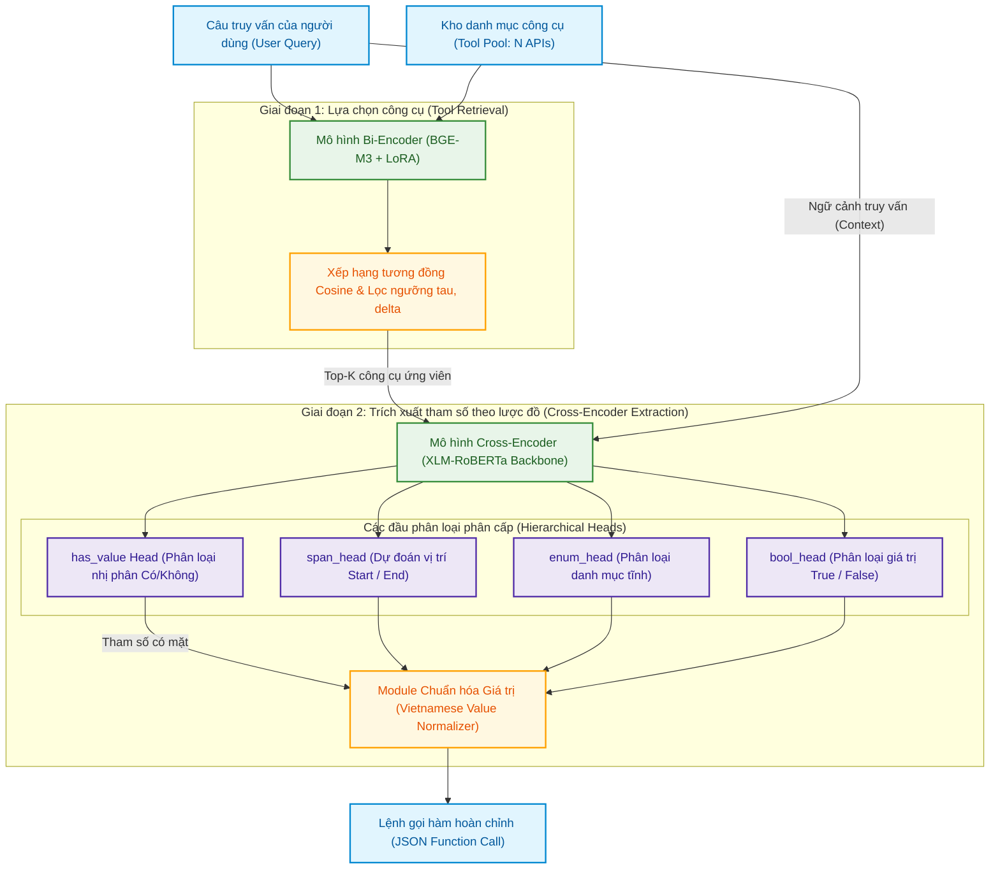
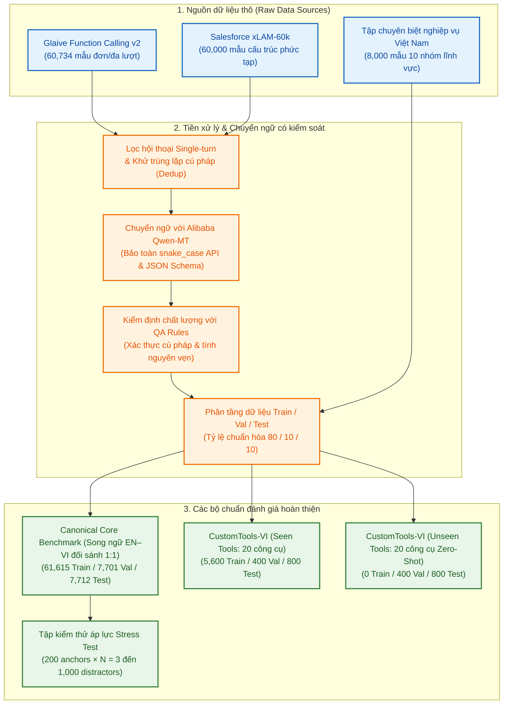

# ĐẠI HỌC QUỐC GIA THÀNH PHỐ HỒ CHÍ MINH
# TRƯỜNG ĐẠI HỌC CÔNG NGHỆ THÔNG TIN
## KHOA KHOA HỌC MÁY TÍNH

---

<br><br><br>

# KHÓA LUẬN TỐT NGHIỆP

<br>

### **NGHIÊN CỨU PHƯƠNG PHÁP TOOL CALLING DỰA TRÊN TRUY HỒI NGỮ NGHĨA VÀ TRÍCH XUẤT THAM SỐ THEO TOOL SCHEMA**

<br>

### **RESEARCH ON TOOL CALLING USING SEMANTIC RETRIEVAL AND SCHEMA-AWARE PARAMETER EXTRACTION**

<br><br>

**CỬ NHÂN NGÀNH TRÍ TUỆ NHÂN TẠO**

<br><br>

**Sinh viên thực hiện:**
- **ĐÀO PHƯỚC THỊNH** — MSSV: 25210038
- **HÀ QUANG ĐẠT** — MSSV: 25210008

<br>

**Giảng viên hướng dẫn:**
- **TS. ĐẶNG VĂN THÌN**

<br><br><br>

### **TP. HỒ CHÍ MINH, NĂM 2026**

---

<div style="page-break-after: always;"></div>

# ĐẠI HỌC QUỐC GIA THÀNH PHỐ HỒ CHÍ MINH
# TRƯỜNG ĐẠI HỌC CÔNG NGHỆ THÔNG TIN
## KHOA KHOA HỌC MÁY TÍNH

---

<br><br>

**Sinh viên thực hiện:**
- **ĐÀO PHƯỚC THỊNH** — MSSV: 25210038
- **HÀ QUANG ĐẠT** — MSSV: 25210008

<br><br>

# KHÓA LUẬN TỐT NGHIỆP

<br>

### **NGHIÊN CỨU PHƯƠNG PHÁP TOOL CALLING DỰA TRÊN TRUY HỒI NGỮ NGHĨA VÀ TRÍCH XUẤT THAM SỐ THEO TOOL SCHEMA**

<br>

### **RESEARCH ON TOOL CALLING USING SEMANTIC RETRIEVAL AND SCHEMA-AWARE PARAMETER EXTRACTION**

<br><br>

**CỬ NHÂN NGÀNH TRÍ TUỆ NHÂN TẠO**

<br><br>

**GIẢNG VIÊN HƯỚNG DẪN**
### **TS. ĐẶNG VĂN THÌN**

<br><br><br>

### **TP. HỒ CHÍ MINH, NĂM 2026**

---

<div style="page-break-after: always;"></div>

## THÔNG TIN HỘI ĐỒNG CHẤM KHÓA LUẬN TỐT NGHIỆP

Hội đồng chấm khóa luận tốt nghiệp, thành lập theo Quyết định số: ............................................ ngày ...... tháng ...... năm 2026 của Hiệu trưởng Trường Đại học Công nghệ Thông tin, Đại học Quốc gia TP. Hồ Chí Minh.

**Thành viên Hội đồng gồm:**

1. ....................................................................................... — Chủ tịch Hội đồng
2. ....................................................................................... — Thư ký Hội đồng
3. ....................................................................................... — Ủy viên phản biện 1
4. ....................................................................................... — Ủy viên phản biện 2
5. ....................................................................................... — Ủy viên

Khóa luận tốt nghiệp được bảo vệ và đánh giá tại Hội đồng chấm khóa luận tốt nghiệp, Trường Đại học Công nghệ Thông tin, Đại học Quốc gia TP. Hồ Chí Minh vào ngày ...... tháng ...... năm 2026.

<br><br>

**XÁC NHẬN CỦA CHỦ TỊCH HỘI ĐỒNG** &nbsp;&nbsp;&nbsp;&nbsp;&nbsp;&nbsp;&nbsp;&nbsp;&nbsp;&nbsp;&nbsp;&nbsp;&nbsp;&nbsp;&nbsp;&nbsp;&nbsp;&nbsp;&nbsp;&nbsp; **GIẢNG VIÊN HƯỚNG DẪN**

---

<div style="page-break-after: always;"></div>

## LỜI CẢM ƠN

Để hoàn thành khóa luận tốt nghiệp và chương trình đào tạo cử nhân ngành Trí tuệ Nhân tạo, chúng em xin bày tỏ lòng biết ơn sâu sắc đến quý Thầy Cô, gia đình và bạn bè đã luôn đồng hành, chỉ dẫn và hỗ trợ chúng em trong suốt thời gian qua.

Trước hết, chúng em xin gửi lời cảm ơn chân thành nhất tới **TS. Đặng Văn Thìn**, giảng viên hướng dẫn của đề tài. Trong suốt quá trình thực hiện khóa luận, Thầy đã luôn dành thời gian định hướng học thuật, đưa ra những góp ý phản biện chuyên môn sâu sắc và kiên nhẫn định hướng phương pháp tiếp cận khi nhóm gặp khó khăn trong quá trình thiết kế kiến trúc cũng như huấn luyện mô hình.

Chúng em xin trân trọng cảm ơn quý Thầy Cô thuộc **Khoa Khoa học Máy tính**, **Trường Đại học Công nghệ Thông tin – ĐHQG-HCM**, những người đã truyền đạt nền tảng kiến thức chuyên môn, phương pháp tư duy và tạo điều kiện học tập thuận lợi nhất cho chúng em trong suốt những năm tháng đại học.

Chúng em cũng xin gửi lời cảm ơn chân thành đến gia đình — những người đã luôn là hậu phương vững chắc, chia sẻ và tạo mọi điều kiện tốt nhất để chúng em yên tâm học tập, nghiên cứu. Đồng thời, chúng em xin cảm ơn các bạn bè tại phòng thí nghiệm và trong khoa đã luôn nhiệt tình trao đổi học thuật, hỗ trợ hạ tầng tính toán và đồng hành cùng nhóm trong các giai đoạn nước rút của đề tài.

Dù đã nỗ lực hết mình để hoàn thành đề tài một cách chỉn chu và chặt chẽ nhất, khóa luận khó tránh khỏi những hạn chế nhất định. Chúng em rất mong nhận được những nhận xét, đóng góp quý báu từ quý Thầy Cô trong Hội đồng để tiếp tục hoàn thiện nghiên cứu này.

*TP. Hồ Chí Minh, tháng 09 năm 2026*  
**Nhóm sinh viên thực hiện**  
*Đào Phước Thịnh & Hà Quang Đạt*

---

<div style="page-break-after: always;"></div>

## MỤC LỤC

- [LỜI CẢM ƠN](#lời-cảm-ơn)
- [DANH MỤC HÌNH VẼ](#danh-mục-hình-vẽ)
- [DANH MỤC BẢNG BIỂU](#danh-mục-bảng-biểu)
- [DANH MỤC TỪ VIẾT TẮT](#danh-mục-từ-viết-tắt)
- [TÓM TẮT KHÓA LUẬN](#tóm-tắt-khóa-luận)
- [MỞ ĐẦU](#mở-đầu)
- [Chương 1. TỔNG QUAN VỀ ĐỀ TÀI](#chương-1-tổng-quan-về-đề-tài)
  - [1.1. Mô tả đề tài và tính cấp thiết của nghiên cứu](#11-mô-tả-đề-tài-và-tính-cấp-thiết-của-nghiên-cứu)
  - [1.2. Mục tiêu của đề tài](#12-mục-tiêu-của-đề-tài)
  - [1.3. Đối tượng và phạm vi nghiên cứu](#13-đối-tượng-và-phạm-vi-nghiên-cứu)
  - [1.4. Phương pháp thực hiện](#14-phương-pháp-thực-hiện)
  - [1.5. Kết quả mong đợi và đóng góp khoa học của đề tài](#15-kết-quả-mong-đợi-và-đóng-góp-khoa-học-của-đề-tài)
  - [1.6. Bố cục của khóa luận](#16-bố-cục-của-khóa-luận)
- [Chương 2. CƠ SỞ LÝ THUYẾT VÀ CÁC CÔNG TRÌNH LIÊN QUAN](#chương-2-cơ-sở-lý-thuyết-và-các-công-trình-liên-quan)
  - [2.1. Cơ chế gọi công cụ (Tool Calling / Function Calling) trong LLM](#21-cơ-chế-gọi-công-cụ-tool-calling--function-calling-trong-llm)
  - [2.2. Các nghiên cứu và bộ chuẩn đánh giá Tool Calling trên thế giới](#22-các-nghiên-cứu-và-bộ-chuẩn-đánh-giá-tool-calling-trên-thế-giới)
  - [2.3. Mô hình Ngôn ngữ Nhỏ (Small Language Models - SLMs) và Kỹ thuật Tinh chỉnh Tham số Hiệu quả (PEFT/QLoRA)](#23-mô-hình-ngôn-ngữ-nhỏ-small-language-models---slms-và-kỹ-thuật-tinh-chỉnh-tham-số-hiệu-quả-peftqlora)
  - [2.4. Kiến trúc Phân tách: Truy hồi Dày (Bi-Encoder) và Trích xuất Tham số (Cross-Encoder)](#24-kiến-trúc-phân-tách-truy-hồi-dày-bi-encoder-và-trích-xuất-tham-số-cross-encoder)
  - [2.5. Những thách thức đặc thù của tiếng Việt trong bài toán Tool Calling](#25-những-thách-thức-đặc-thù-của-tiếng-việt-trong-bài-toán-tool-calling)
- [Chương 3. XÂY DỰNG BỘ TIÊU CHUẨN ĐÁNH GIÁ (BENCHMARK) CHO TIẾNG VIỆT](#chương-3-xây-dựng-bộ-tiêu-chuẩn-đánh-giá-benchmark-cho-tiếng-việt)
  - [3.1. Thiết kế Schema Chuẩn hóa Dữ liệu (Master Canonical Schema)](#31-thiết-kế-schema-chuẩn-hóa-dữ-liệu-master-canonical-schema)
  - [3.2. Bộ chuẩn quy mô lớn Canonical Core Benchmark](#32-bộ-chuẩn-quy-mô-lớn-canonical-core-benchmark)
  - [3.3. Bộ chuẩn miền thực tế bản địa hóa CustomTools-VI](#33-bộ-chuẩn-miền-thực-tế-bản-địa-hóa-customtools-vi)
  - [3.4. Chiến lược tạo lập và kiểm soát dữ liệu âm tính (Negative Samples)](#34-chiến-lược-tạo-lập-và-kiểm-soát-dữ-liệu-âm-tính-negative-samples)
  - [3.5. Quy trình xây dựng tập kiểm thử áp lực (Stress Test Benchmark)](#35-quy-trình-xây-dựng-tập-kiểm-thử-áp-lực-stress-test-benchmark)
- [Chương 4. PHƯƠNG PHÁP ĐỀ XUẤT VÀ THIẾT KẾ KIẾN TRÚC HỆ THỐNG](#chương-4-phương-pháp-đề-xuất-và-thiết-kế-kiến-trúc-hệ-thống)
  - [4.1. Kiến trúc tổng quan của hai trường phái kỹ thuật](#41-kiến-trúc-tổng-quan-của-hai-trường-phái-kỹ-thuật)
  - [4.2. Phương pháp 1: SLM End-to-End dựa trên Qwen3.5 (2B và 4B)](#42-phương-pháp-1-slm-end-to-end-dựa-trên-qwen35-2b-và-4b)
  - [4.3. Phương pháp 2: Kiến trúc Phân tách Bi-Encoder + Cross-Encoder](#43-phương-pháp-2-kiến-trúc-phân-tách-bi-encoder--cross-encoder)
  - [4.4. Cơ chế chuẩn hóa giá trị thực thể tiếng Việt (Vietnamese Value Normalizer)](#44-cơ-chế-chuẩn-hóa-giá-trị-thực-thể-tiếng-việt-vietnamese-value-normalizer)
- [Chương 5. THỰC NGHIỆM, ĐÁNH GIÁ VÀ BÀN LUẬN KẾT QUẢ](#chương-5-thực-nghiệm-đánh-giá-và-bàn-luận-kết-quả)
  - [5.1. Thiết lập thực nghiệm và hạ tầng phần cứng](#51-thiết-lập-thực-nghiệm-và-hạ-tầng-phần-cứng)
  - [5.2. Hệ thống độ đo đánh giá (Evaluation Metrics)](#52-hệ-thống-độ-đo-đánh-giá-evaluation-metrics)
  - [5.3. Kết quả tổng thể và giải đáp 5 câu hỏi nghiên cứu](#53-kết-quả-tổng-thể-và-giải-đáp-5-câu-hỏi-nghiên-cứu)
    - [5.3.1. RQ1: Năng lực chuyển giao tri thức ngôn ngữ chéo (Cross-Lingual Transfer)](#531-rq1-năng-lực-chuyển-giao-tri-thức-ngôn-ngữ-chéo-cross-lingual-transfer)
    - [5.3.2. RQ2: Hiện tượng kích hoạt công cụ quá mức và vai trò của dữ liệu âm tính](#532-rq2-hiện-tượng-kích-hoạt-công-cụ-quá-mức-và-vai-trò-của-dữ-liệu-âm-tính)
    - [5.3.3. RQ3: Khả năng tổng quát hóa Zero-Shot trên công cụ chưa từng gặp](#533-rq3-khả-năng-tổng-quát-hóa-zero-shot-trên-công-cụ-chưa-từng-gặp)
    - [5.3.4. RQ4: Đánh đổi Pareto giữa độ chính xác, độ trễ và chi phí tính toán](#534-rq4-đánh-đổi-pareto-giữa-độ-chính-xác-độ-trễ-và-chi-phí-tính-toán)
    - [5.3.5. RQ5: Kiểm thử áp lực quy mô lớn và giới hạn vật lý của mô hình tạo sinh](#535-rq5-kiểm-thử-áp-lực-quy-mô-lớn-và-giới-hạn-vật-lý-của-mô-hình-tạo-sinh)
  - [5.4. Nghiên cứu mở rộng quy mô mô hình: Qwen3.5-2B vs. Qwen3.5-4B](#54-nghiên-cứu-mở-rộng-quy-mô-mô-hình-qwen35-2b-vs-qwen35-4b)
  - [5.5. So sánh đối đầu với các Frontier API thương mại đóng (GPT-5.6 Luna, Gemini 3.8 Flash)](#55-so-sánh-đối-đầu-với-các-frontier-api-thương-mại-đóng-gpt-56-luna-gemini-38-flash)
- [Chương 6. PHÂN TÍCH LỖI VÀ THẢO LUẬN GIỚI HẠN](#chương-6-phân-tích-lỗi-và-thảo-luận-giới-hạn)
  - [6.1. Phân loại các dạng lỗi phổ biến trong trích xuất tham số tiếng Việt](#61-phân-loại-các-dạng-lỗi-phổ-biến-trong-trích-xuất-tham-số-tiếng-việt)
  - [6.2. Phân tích nguyên nhân suy giảm zero-shot của Method 2](#62-phân-tích-nguyên-nhân-suy-giảm-zero-shot-của-method-2)
  - [6.3. Giới hạn của đề tài và các thách thức mở](#63-giới-hạn-của-đề-tài-và-các-thách-thức-mở)
- [KẾT LUẬN VÀ HƯỚNG PHÁT TRIỂN](#kết-luận-và-hướng-phát-triển)
  - [Kết luận](#kết-luận)
  - [Hướng phát triển trong tương lai](#hướng-phát-triển-trong-tương-lai)
- [TÀI LIỆU THAM KHẢO](#tài-liệu-tham-khảo)

---

<div style="page-break-after: always;"></div>

## DANH MỤC HÌNH VẼ

| Ký hiệu hình | Tên hình vẽ | Trang |
| :---: | :--- | :---: |
| **Hình 2.1** | Sơ đồ nguyên lý hoạt động của kiến trúc phân tách hai giai đoạn (Bi-Encoder Retrieval kết hợp Cross-Encoder Extraction) | 16 |
| **Hình 3.1** | Quy trình xử lý dữ liệu và xây dựng các bộ tiêu chuẩn đánh giá Benchmark | 24 |
| **Hình 4.1** | Sơ đồ kiến trúc tổng quan đối chiếu giữa Phương pháp 1 (SLM End-to-End) và Phương pháp 2 (Bi-Encoder + Cross-Encoder) | 28 |
| **Hình 4.2** | Quy trình bốn giai đoạn của module Chuẩn hóa Giá trị tiếng Việt (Vietnamese Value Normalizer) | 38 |
| **Hình 5.1** | So sánh đối đầu toàn diện hiệu năng trên benchmark CustomTools-VI (Seen vs. Unseen) giữa SLM 2B, 4B, Method 2 và các Frontier APIs | 42 |
| **Hình 5.2** | Kết quả Stress Test đối đầu trực diện: Suy giảm độ chính xác, vùng sụp đổ CUDA OOM ($N \ge 500$) và đường cong độ trễ suy luận P50 (ms) log-scale | 49 |
| **Hình 5.3** | Nghiên cứu mở rộng quy mô mô hình (2B vs. 4B): Nâng trần độ chính xác Core Benchmark và giảm tỷ lệ lỗi cú pháp JSON | 54 |

---

<div style="page-break-after: always;"></div>

## DANH MỤC BẢNG BIỂU

| Ký hiệu bảng | Tên bảng biểu | Trang |
| :---: | :--- | :---: |
| **Bảng 3.1** | Thống kê định lượng các bộ dữ liệu trong Benchmark Tool Calling Tiếng Việt | 22 |
| **Bảng 4.1** | Thiết lập siêu tham số huấn luyện mô hình SLM Qwen3.5 (2B và 4B) trên GPU NVIDIA A100 | 33 |
| **Bảng 4.2** | Thiết lập siêu tham số và cấu hình huấn luyện của Phương pháp 2 (Bi-Encoder BGE-M3 và Cross-Encoder XLM-R) | 36 |
| **Bảng 5.1** | Kết quả thực nghiệm đối đầu trên benchmark CustomTools-VI (Seen vs. Unseen) | 40 |
| **Bảng 5.2** | Kết quả thực nghiệm trên Canonical Core Benchmark (7,712 mẫu / ngôn ngữ) | 44 |
| **Bảng 5.3** | Bảng so sánh đa chiều toàn diện giữa 4 phương pháp tiếp cận | 46 |
| **Bảng 5.4** | Kết quả thực nghiệm Stress Test đối đầu trực diện khi quy mô công cụ mở rộng từ $N = 3$ đến $N = 1000$ | 48 |
| **Bảng 5.5** | Nghiên cứu mở rộng quy mô tham số mô hình: Qwen3.5-2B vs. Qwen3.5-4B | 52 |
| **Bảng 5.6** | Hiệu năng đối đầu chi tiết của mô hình Qwen3.5-4B (E3 vs. E4) trên Canonical Core Benchmark | 53 |
| **Bảng 6.1** | Đánh giá chất lượng độc lập của các đầu phân cấp chuyên biệt trong Cross-Encoder | 58 |
| **Bảng 6.2** | Đối chứng chẩn đoán Oracle giữa lỗi truy hồi (Retrieval) và lỗi trích xuất tham số (Extraction) | 60 |
| **Bảng 6.3** | Các ví dụ thực tế (Case Studies) minh họa 4 dạng lỗi trích xuất tham số điển hình | 62 |

---

<div style="page-break-after: always;"></div>

## DANH MỤC TỪ VIẾT TẮT

| Từ viết tắt | Thuật ngữ tiếng Anh | Ý nghĩa tiếng Việt |
| :--- | :--- | :--- |
| **API** | Application Programming Interface | Giao diện lập trình ứng dụng |
| **ArgA** | Argument Accuracy | Độ chính xác trích xuất toàn bộ tham số (Exact Match) |
| **BFCL** | Berkeley Function-Calling Leaderboard | Bảng xếp hạng gọi hàm của Đại học UC Berkeley |
| **DDP** | Distributed Data Parallel | Kỹ thuật huấn luyện phân tán dữ liệu song song |
| **EM** | Exact Match | Khớp chính xác tuyệt đối 100% |
| **FC** | Function Calling / Tool Calling | Kỹ thuật gọi hàm / gọi công cụ của mô hình ngôn ngữ |
| **JSON** | JavaScript Object Notation | Định dạng trao đổi dữ liệu dạng chuỗi tiêu chuẩn |
| **LLM** | Large Language Model | Mô hình ngôn ngữ lớn |
| **MNRL** | Multiple Negatives Ranking Loss | Hàm mất mát xếp hạng đa mẫu âm tính |
| **Non-FC** | Non-Function Calling | Các truy vấn thông thường không yêu cầu gọi công cụ |
| **OOM** | Out Of Memory | Hiện tượng tràn bộ nhớ phần cứng (CUDA VRAM) |
| **PEFT** | Parameter-Efficient Fine-Tuning | Kỹ thuật tinh chỉnh tham số hiệu quả |
| **QLoRA** | Quantized Low-Rank Adaptation | Kỹ thuật thích ứng hạng thấp lượng tử hóa 4-bit |
| **RAG** | Retrieval-Augmented Generation | Kỹ thuật sinh văn bản tăng cường bằng truy hồi |
| **RoBERTa** | Robustly Optimized BERT Approach | Mô hình ngôn ngữ tiền huấn luyện tối ưu hóa từ BERT |
| **RQ** | Research Question | Câu hỏi nghiên cứu khoa học |
| **SFT** | Supervised Fine-Tuning | Kỹ thuật tinh chỉnh có giám sát |
| **SLM** | Small Language Model | Mô hình ngôn ngữ quy mô nhỏ (dưới 7B tham số) |
| **SOTA** | State Of The Art | Đỉnh cao hiệu năng công nghệ hiện tại |
| **Tool Acc** | Tool Selection Accuracy | Độ chính xác lựa chọn công cụ mục tiêu |
| **VRAM** | Video Random Access Memory | Bộ nhớ truy cập ngẫu nhiên đồ họa của GPU |
| **XML** | Extensible Markup Language | Ngôn ngữ đánh dấu mở rộng |

---

<div style="page-break-after: always;"></div>

## TÓM TẮT KHÓA LUẬN

Khả năng gọi công cụ (tool calling / function calling) là một năng lực quan trọng của Trí tuệ Nhân tạo hiện đại, cho phép các Mô hình Ngôn ngữ Lớn (LLM) mở rộng tri thức nội tại bằng cách tương tác với các giao diện lập trình ứng dụng (API), cơ sở dữ liệu và công cụ tính toán bên ngoài. Tuy nhiên, việc đưa các giải pháp gọi công cụ thương mại đám mây vào hệ thống thực tế tại Việt Nam vẫn đặt ra nhiều vấn đề cần xem xét, trong đó có độ trễ của quá trình sinh tự hồi quy, chi phí hạ tầng và dịch vụ, yêu cầu bảo vệ dữ liệu nghiệp vụ, cũng như rủi ro sinh đầu ra JSON không phù hợp với schema. Các phép đo trong khóa luận cho thấy độ trễ SLM thay đổi đáng kể theo kích thước mô hình, độ dài ngữ cảnh và protocol đánh giá; vì vậy, việc so sánh cần gắn với điều kiện đo cụ thể thay vì sử dụng một ngưỡng chung cho mọi ứng dụng.

Trước bối cảnh đó, khóa luận tập trung nghiên cứu bài toán gọi công cụ tiếng Việt dựa trên truy hồi ngữ nghĩa và trích xuất tham số theo Tool Schema, đồng thời tiến hành so sánh đối đầu có hệ thống giữa hai trường phái kỹ thuật. Phương pháp 1 là mô hình ngôn ngữ nhỏ End-to-End, trong đó `Qwen3.5-2B` và `Qwen3.5-4B` được tinh chỉnh bằng QLoRA trên biểu diễn hội thoại có cấu trúc. Phương pháp 2 là kiến trúc phân tách phi tự hồi quy, kết hợp Bi-Encoder `BAAI/bge-m3` để xếp hạng các công cụ ứng viên với Cross-Encoder `xlm-roberta-base` có các đầu phân cấp để trích xuất tham số; bộ chuẩn hóa giá trị tiếng Việt được sử dụng ở bước hậu xử lý để ánh xạ các cách diễn đạt tự nhiên về kiểu dữ liệu trong schema.

Để bảo đảm phép đối sánh giữa hai phương pháp, nghiên cứu xây dựng `Canonical Core Benchmark` gồm 77,028 cặp bản ghi song ngữ trên 4,421 công cụ và `CustomTools-VI` gồm 8,000 mẫu nghiệp vụ đời sống Việt Nam thuộc 40 công cụ. Bộ dữ liệu thứ hai được chia thành các công cụ đã xuất hiện trong huấn luyện (`seen`) và các công cụ chưa xuất hiện (`unseen`), đồng thời duy trì tỷ lệ 50% mẫu âm tính trong tập kiểm thử nhằm đo cả khả năng gọi đúng và khả năng từ chối gọi công cụ.

Các kết quả thực nghiệm cho thấy `Qwen3.5-4B` ở cấu hình E4 đạt ArgA 87.92% trên tập seen và 86.75% trên tập unseen, cao hơn `GPT-5.6 Luna` lần lượt 9.67 và 7.25 điểm phần trăm trong protocol CustomTools-VI. Ở chiều ngược lại, cấu hình song ngữ thuần túy E3 bộc lộ thiên kiến kích hoạt công cụ quá mức, thể hiện qua Non-FC Recall chỉ đạt 2.0%–3.0%; khi bổ sung dữ liệu âm tính bản địa hóa trong E4, chỉ số này tăng lên mức tuyệt đối 100.0% trên benchmark CustomTools-VI.

Trong stress test, Method 2 ghi nhận P50 từ 55.05 đến 61.01 ms ở dải $N \le 100$, PyTorch allocated VRAM xấp xỉ 3.21 GiB và Syntax Error 0.00% theo định nghĩa structured-output. Các số đo này được thu thập theo protocol riêng nên chỉ được dùng để mô tả đặc tính của từng pipeline, không quy đổi thành hệ số tăng tốc trực tiếp. Khi danh mục mở rộng từ $N=3$ đến $N=1000$, SLM phát sinh CUDA Out of Memory tại $N \ge 500$ trên GPU 16GB trong protocol stress test, trong khi Method 2 tiếp tục đạt ArgA 84.00% và P50 107.68 ms ở $N=1000$.

Công trình cung cấp một bức tranh đối chiếu giữa độ chính xác, khả năng từ chối, độ trễ và tài nguyên tính toán trong các protocol đã thực hiện. Kết quả có thể được sử dụng như cơ sở tham khảo khi lựa chọn kiến trúc gọi công cụ tiếng Việt theo miền dữ liệu, quy mô danh mục API và điều kiện hạ tầng cụ thể.

---

<div style="page-break-after: always;"></div>

## MỞ ĐẦU

Trong kỷ nguyên bùng nổ của Trí tuệ Nhân tạo tạo sinh, các Tác tử Ngôn ngữ Tự hành (Autonomous AI Agents) đang nhanh chóng trở thành tâm điểm phát triển công nghệ trên toàn cầu. Một mô hình ngôn ngữ, dù thông minh và sở hữu hàng trăm tỷ tham số, vẫn chỉ là một "bộ não trong bình thủy tinh" (brain in a vat) nếu không có khả năng tương tác với môi trường bên ngoài. Cơ chế gọi công cụ (tool calling / function calling) chính là chiếc cầu nối quyết định biến các mô hình ngôn ngữ từ những cỗ máy tán ngẫu đơn thuần thành những hệ thống tác tử thông minh có năng lực hành động: tự động tra cứu dữ liệu thời gian thực, kích hoạt giao dịch ngân hàng, đặt lịch hẹn, điều khiển thiết bị thông minh hoặc gọi các hàm tính toán phức tạp.

Mặc dù các hãng công nghệ lớn như OpenAI hay Google đã triển khai thành công tính năng gọi hàm trên các mô hình siêu lớn (như GPT-4o, Gemini-1.5), việc ứng dụng thực tế các mô hình đóng này tại thị trường Việt Nam gặp phải những rào cản nghiêm trọng về độ trễ mạng quốc tế, chi phí thuê bao token đắt đỏ, rủi ro an ninh chủ quyền dữ liệu và sự suy giảm độ chính xác trước các đặc thù ngữ nghĩa phức tạp của tiếng Việt.

Đứng trước bối cảnh đó, bài toán đặt ra là: **Làm thế nào để xây dựng một giải pháp gọi công cụ tiếng Việt chính xác, an toàn, có khả năng triển khai độc lập trên hạ tầng máy chủ cục bộ hoặc thiết bị biên phổ thông, đồng thời tối ưu hóa hài hòa giữa độ chính xác và độ trễ suy luận?**

Để giải quyết thấu đáo câu hỏi này, khóa luận tiến hành nghiên cứu, hiện thực hóa và so sánh đối đầu toàn diện giữa hai trường phái kiến trúc: mô hình ngôn ngữ nhỏ tự hồi quy end-to-end (SLM) và hệ thống phân tách không tự hồi quy chuyên biệt (Bi-Encoder + Cross-Encoder).

---

<div style="page-break-after: always;"></div>

## Chương 1. TỔNG QUAN VỀ ĐỀ TÀI

### 1.1. Mô tả đề tài và tính cấp thiết của nghiên cứu
Trong những năm gần đây, sự phát triển đột phá của các mô hình ngôn ngữ lớn (Large Language Models – LLMs) đã thúc đẩy sự chuyển dịch mạnh mẽ từ các hệ thống đối thoại thụ động sang các tác nhân thông minh (AI Agents) có khả năng tương tác chủ động với môi trường bên ngoài. Thay vì chỉ giới hạn ở tác vụ sinh văn bản đơn thuần, mô hình được trang bị cơ chế gọi công cụ (Tool Calling / Function Calling) để trở thành cầu nối giữa năng lực suy luận ngôn ngữ trừu tượng và không gian thực thi của các hệ thống phần mềm, từ truy vấn thông tin thời gian thực, khai thác cơ sở dữ liệu nghiệp vụ, đến kích hoạt các dịch vụ giao diện lập trình ứng dụng (APIs) phức tạp.

Trước tiềm năng to lớn đó, hàng loạt nền tảng công nghiệp và khung phát triển tác tử đã ra đời như OpenAI Function Calling, Google Gemini Function Calling, LangGraph, AutoGen và Model Context Protocol (MCP). Song song với các ứng dụng thương mại, nhiều công trình học thuật tiêu biểu như Toolformer, Gorilla, ToolBench, ToolLLM, ToolACE, xLAM và AutoTool đã không ngừng hoàn thiện khả năng sử dụng công cụ của mô hình ngôn ngữ. Dù đa dạng về phương thức cài đặt, phần lớn các giải pháp hiện nay đều chia sẻ chung một tư duy thiết kế nguyên khối: sử dụng một mô hình ngôn ngữ sinh tạo sinh (Generative LLMs) duy nhất để đảm nhiệm đồng thời cả hai khâu nghiệp vụ cốt lõi: định tuyến công cụ mục tiêu và tạo sinh cấu trúc chuỗi JSON chứa các tham số đầu vào.

Mặc dù đạt được những thành tựu vượt bậc, phương thức tiếp cận dựa hoàn toàn vào mô hình tạo sinh tự hồi quy đang bộc lộ những rào cản kỹ thuật cố hữu. Bản chất xử lý tuần tự từng token (autoregressive decoding) trên chuỗi ngữ cảnh chứa hàng loạt lược đồ công cụ khiến thời gian đáp ứng phụ thuộc chặt chẽ vào độ dài prompt, quy mô tham số và năng lực phần cứng. Thực nghiệm trong khóa luận ghi nhận độ trễ suy luận của mô hình ngôn ngữ nhỏ (SLM) dao động từ khoảng 0.86 đến 3.31 giây tùy thuộc vào cấu hình và giao thức đánh giá, đặt ra thách thức lớn đối với các ứng dụng đòi hỏi tương tác thời gian thực. Đi kèm với gánh nặng thời gian là tính bất định về cấu trúc: bản chất xác suất của mô hình tạo sinh luôn tiềm ẩn rủi ro sinh chuỗi JSON không hợp lệ, thiếu sót dấu đóng mở ngoặc hoặc tự ý phát sinh các trường thuộc tính giả định (Syntax Hallucination). Hơn nữa, việc nạp toàn bộ lược đồ tham số vào ngữ cảnh làm chi phí tính toán của cơ chế tự chú ý tăng theo cấp số bậc hai $\mathcal{O}(L^2)$, phân tán sự tập trung và dễ dẫn tới cạn kiệt bộ nhớ đồ họa (CUDA Out of Memory) khi quy mô danh mục mở rộng.

Bên cạnh những rào cản tính toán, cộng đồng nghiên cứu và ứng dụng trong nước còn đối diện với sự thiếu hụt nghiêm trọng các bộ tiêu chuẩn đánh giá bản địa hóa dành riêng cho tiếng Việt. Hầu hết các benchmark danh tiếng quốc tế như BFCL hay ToolBench đều được thiết kế trên ngữ liệu tiếng Anh, chưa phản ánh được đặc trưng hình thái học đơn lập, hệ thống thanh điệu phức tạp cùng các biến thể khẩu ngữ và đơn vị định lượng đời thường đặc thù của tiếng Việt. Xuất phát từ những trăn trở lý luận và đòi hỏi thực tiễn cấp bách đó, đề tài tập trung nghiên cứu bài toán Tool Calling cho tiếng Việt theo hướng tiếp cận kết hợp giữa truy hồi ngữ nghĩa (Semantic Tool Retrieval) và trích xuất tham số theo lược đồ (Schema-aware Parameter Extraction). Đồng thời, nghiên cứu kiến tạo bộ dữ liệu benchmark tiếng Việt quy chuẩn nhằm thiết lập môi trường thực nghiệm công bằng, mở đường cho việc xây dựng các giải pháp tác tử AI tự chủ, chính xác và tối ưu tài nguyên cho hệ sinh thái công nghệ trong nước.

### 1.2. Mục tiêu của đề tài
Mục tiêu tổng quát của khóa luận là nghiên cứu, hiện thực hóa và đánh giá có hệ thống giải pháp gọi công cụ (Tool Calling) tối ưu cho ngôn ngữ tiếng Việt. Thay vì phụ thuộc hoàn toàn vào các mô hình ngôn ngữ lớn tạo sinh (Generative LLMs) vốn đối mặt với rào cản chi phí tính toán đắt đỏ và độ trễ cao, nghiên cứu hướng tới việc xây dựng và đối chứng hai trường phái kỹ thuật mang tư duy thiết kế đối lập: phương pháp tinh chỉnh mô hình ngôn ngữ nhỏ tạo sinh end-to-end (SLM) và phương pháp phân tách phi tự hồi quy kết hợp giữa truy hồi ngữ nghĩa và trích xuất tham số theo lược đồ (Bi-Encoder + Cross-Encoder). Qua đó, đề tài xác lập một hệ quy chuẩn đối sánh toàn diện, làm sáng tỏ mối tương quan đánh đổi giữa độ chính xác, tốc độ đáp ứng thời gian thực và chi phí tài nguyên phần cứng.

Để hiện thực hóa mục tiêu bao quát trên, khóa luận xác định và giải quyết đồng bộ các nhiệm vụ nghiên cứu khoa học trọng tâm. Trước hết, nghiên cứu tiến hành khảo cứu và phân tích có hệ thống các công trình lý thuyết cùng những bộ chuẩn đánh giá Tool Calling hiện đại trên thế giới, nhằm định vị rõ ràng các khoảng trống học thuật đối với ngữ liệu tiếng Việt. Trên cơ sở đó, đề tài xây dựng và chuẩn hóa bộ đôi ngữ liệu benchmark bản địa hóa có quy mô lớn và thiết kế kiểm soát nghiêm ngặt, tạo tiền đề cho công tác huấn luyện và đối chuẩn công bằng giữa các giải pháp.

Tiếp theo, về mặt kiến trúc hệ thống, nghiên cứu hiện thực hóa đường ống phân biệt hai giai đoạn gồm bộ truy hồi ngữ nghĩa Bi-Encoder và bộ trích xuất tham số phân cấp Cross-Encoder tích hợp module chuẩn hóa giá trị thực thể tiếng Việt; đồng thời song song tối ưu hóa các mô hình ngôn ngữ nhỏ (Qwen3.5 2B và 4B) theo các chiến lược thích ứng ngôn ngữ và miền nghiệp vụ bản địa. Cuối cùng, một ma trận thực nghiệm đối đầu toàn diện được thiết lập nhằm so sánh chuyên sâu giữa hai phương pháp đề xuất với các mô hình thương mại đóng hàng đầu, qua đó giải đáp thấu đáo các câu hỏi nghiên cứu cốt lõi và định lượng giới hạn chịu tải thực tế thông qua bài kiểm thử áp lực quy mô lớn.

### 1.3. Đối tượng và phạm vi nghiên cứu
Đối tượng nghiên cứu trọng tâm của khóa luận là cơ chế gọi công cụ trong các hệ thống tác tử trí tuệ nhân tạo (AI Agents), cụ thể hóa qua hai nhiệm vụ thành phần cốt lõi: bài toán lựa chọn công cụ mục tiêu từ không gian mô tả ngữ nghĩa (Tool Retrieval) và bài toán trích xuất, chuẩn hóa các giá trị tham số tương ứng dựa trên lược đồ thuộc tính (Schema-aware Parameter Extraction). Về mặt dữ liệu, đối tượng khảo sát bao gồm các kho ngữ liệu gọi hàm quy mô quốc tế kết hợp cùng hệ thống dữ liệu nghiệp vụ đời sống đặc thù tại Việt Nam được chuẩn hóa theo định dạng Master Canonical Schema. Về mặt kỹ thuật, nghiên cứu tập trung khảo sát các kiến trúc học sâu phân biệt hai tháp (Dense Bi-Encoder), mạng biến đổi tương tác chéo đa nhiệm (Hierarchical Cross-Encoder) và các mô hình ngôn ngữ nhỏ tạo sinh thế hệ mới.

Về phạm vi nghiên cứu, đề tài giới hạn tập trung vào các công đoạn tiền thực thi của quá trình gọi hàm — tức toàn bộ chu trình xử lý từ thời điểm tiếp nhận câu truy vấn ngôn ngữ tự nhiên của người dùng đến khi đóng gói hoàn chỉnh đối tượng JSON Schema hợp lệ, sẵn sàng để giao tiếp với các giao diện lập trình ứng dụng (APIs). Khóa luận khảo sát không gian tương tác đơn lượt (single-turn interaction) song hỗ trợ đầy đủ cả hai kịch bản: kích hoạt đơn lệnh (single-call) và đồng thời kích hoạt nhiều lệnh gọi công cụ trong một phát ngôn (multi-call). Các khía cạnh kỹ thuật nằm ngoài phạm vi khảo sát bao gồm: cơ chế thực thi mã lệnh trong môi trường sandbox, lập kế hoạch tác tử phức hợp (Tool Planning), điều phối đa tác tử (Multi-agent Orchestration) cũng như việc cập nhật danh mục công cụ động theo thời gian thực. Toàn bộ các kết luận khoa học và đánh giá hiệu năng đều được neo trên các chỉ số định lượng đo đạc trực tiếp từ hệ sinh thái thực nghiệm của đề tài.

### 1.4. Phương pháp thực hiện
Khóa luận được triển khai theo phương pháp luận nghiên cứu thực nghiệm (Empirical Research) kết hợp chặt chẽ với kỹ nghệ phát triển hệ thống (System Engineering). Khởi đầu bằng công tác khảo cứu toàn diện hệ thống tài liệu chuyên khảo cùng các công trình khoa học tiêu biểu trong và ngoài nước, nghiên cứu phân loại có hệ thống các trường phái kiến trúc gọi công cụ, nhận diện rào cản đặc thù của tiếng Việt và xác lập chính xác các khoảng trống học thuật cần giải quyết. Tiếp nối nền tảng lý thuyết là công tác kỹ thuật dữ liệu và kiến tạo bộ chuẩn đối sánh: thiết lập Master Canonical Schema thống nhất, chuẩn hóa quy trình dịch thuật kiểm soát chất lượng để tạo lập ngữ liệu song ngữ `Canonical Core Benchmark` ($77{,}028$ bản ghi trên $4{,}421$ APIs); đồng thời xây dựng tập dữ liệu nghiệp vụ bản địa `CustomTools-VI` ($8{,}000$ mẫu trên $40$ công cụ) với thiết kế phân tách nghiêm ngặt giữa miền đã học và miền chưa từng gặp, tích hợp tỷ lệ 50% mẫu âm tính đàm thoại.

Trên cơ sở dữ liệu đã chuẩn hóa, nghiên cứu tiến hành hiện thực hóa và tối ưu hóa chuyên sâu các mô hình thành phần. Đối với nhánh phân tách phi tự hồi quy, module Semantic Tool Retrieval được xây dựng trên Bi-Encoder `BAAI/bge-m3` tối ưu qua hai vòng huấn luyện với hàm mất mát `CachedMNRL` và kỹ thuật khai thác mẫu âm khó; module Hierarchical Parameter Extractor được phát triển trên `xlm-roberta-base` với cơ chế định tuyến hướng schema và module Value Normalizer chuyên biệt cho thực thể tiếng Việt; song song với việc tinh chỉnh các mô hình SLM `Qwen3.5` (2B và 4B) theo kỹ thuật QLoRA trên các tập dữ liệu huấn luyện đối xứng. Cuối cùng, toàn bộ hệ thống được tích hợp thành đường ống xử lý hoàn chỉnh để triển khai ma trận thực nghiệm đối đầu đa chiều giữa hai trường phái đề xuất với các mô hình thương mại đóng hàng đầu (`GPT-5.6 Luna`, `Gemini 3.8 Flash`), đo đạc toàn diện về độ chính xác trích xuất, độ trễ phân vị P50/P95, thông lượng, mức chiếm dụng bộ nhớ VRAM và bài kiểm thử áp lực mở rộng không gian tìm kiếm tới $1{,}000$ công cụ nhằm cung cấp bức tranh đối chiếu khách quan, chuẩn xác.

### 1.5. Kết quả mong đợi và đóng góp khoa học của đề tài
Công trình nghiên cứu mang lại những đóng góp khoa học rõ nét cả về mặt lý luận, phương pháp luận lẫn giá trị thực tiễn ứng dụng thông qua hai nhóm đóng góp then chốt. Ở phương diện dữ liệu và tiêu chuẩn đánh giá, đề tài đóng góp cho cộng đồng nghiên cứu bộ đôi benchmark tiếng Việt quy chuẩn đầu tiên có quy mô lớn và thiết kế kiểm soát nghiêm ngặt gồm `Canonical Core Benchmark` và `CustomTools-VI`, kết hợp tỷ lệ cân bằng 50% mẫu âm tính đàm thoại cùng sự phân tách rạch ròi giữa miền đã học và miền zero-shot chưa từng gặp. Đi kèm với dữ liệu, nghiên cứu định vị và làm sáng tỏ hiện tượng "kích hoạt công cụ quá mức" (over-triggering pathology) khi tinh chỉnh mô hình ngôn ngữ trên dữ liệu dịch thuật đơn thuần, đồng thời chứng minh vai trò quyết định của dữ liệu âm tính bản địa hóa trong việc khôi phục hoàn toàn năng lực từ chối gọi hàm với Non-FC Recall đạt mức tuyệt đối 100.0%.

Về mặt giải pháp kỹ thuật và hiệu năng hệ thống, nghiên cứu khẳng định tính khả thi của việc bản địa hóa các mô hình ngôn ngữ nhỏ: mô hình `Qwen3.5-4B` tinh chỉnh đạt độ chính xác tham số (ArgA) 87.92% trên tập seen và 86.75% trên tập unseen, vượt qua mô hình thương mại đóng `GPT-5.6 Luna` trên cùng tập kiểm thử nghiệp vụ tiếng Việt; đồng thời kiến trúc phân tách phi tự hồi quy Bi-Encoder kết hợp Hierarchical Cross-Encoder thể hiện ưu thế vượt trội về độ trễ đáp ứng (P50 khoảng 55–61 ms) và khả năng mở rộng ổn định tới quy mô $1{,}000$ công cụ trong bài kiểm thử áp lực, nơi mô hình tạo sinh gặp giới hạn bộ nhớ ngữ cảnh. Nhằm đảm bảo tính minh bạch và khả năng tái lập thực nghiệm (Reproducibility), toàn bộ mã nguồn xây dựng pipeline, các kịch bản huấn luyện, bộ chuẩn hóa giá trị thực thể cùng hai bộ dữ liệu benchmark đều được nhóm tác giả đóng gói và phát hành công khai tại kho lưu trữ mã nguồn mở: [https://github.com/TristanDao/tool_calling_with_retrieval_extraction](https://github.com/TristanDao/tool_calling_with_retrieval_extraction).

### 1.6. Bố cục của khóa luận
Nội dung của khóa luận được cấu trúc chặt chẽ thành sáu chương chuyên đề và phần kết luận tổng kết:

Chương 2 trình bày cơ sở lý thuyết về cơ chế gọi công cụ trong mô hình ngôn ngữ, kiến trúc mạng Transformer, kỹ thuật tinh chỉnh tham số hiệu quả PEFT/QLoRA, nguyên lý hệ thống phân tách truy hồi – trích xuất và những thách thức xử lý ngôn ngữ tự nhiên đặc thù của tiếng Việt. Tiếp theo, Chương 3 đặc tả chi tiết quy trình xây dựng bộ tiêu chuẩn đánh giá cho tiếng Việt, bao gồm Master Canonical Schema, quy trình chuyển ngữ kiểm soát chất lượng và hai bộ dữ liệu Canonical Core cùng CustomTools-VI.

Chương 4 đi sâu vào phương pháp đề xuất và thiết kế kiến trúc hệ thống, đối chiếu chi tiết giữa mô hình tạo sinh SLM End-to-End và kiến trúc phân tách Bi-Encoder kết hợp Hierarchical Cross-Encoder cùng module Chuẩn hóa Giá trị tiếng Việt. Toàn bộ kết quả thực nghiệm đối đầu, phân tích 5 câu hỏi nghiên cứu (RQ1–RQ5), so sánh với các Frontier API thương mại và bài kiểm thử áp lực được trình bày tại Chương 5. Tiếp đó, Chương 6 tiến hành mổ xẻ định tính các ca lỗi thực tế, phân tích nguyên nhân suy giảm zero-shot qua các kịch bản đối chứng Oracle và thảo luận thẳng thắn về các giới hạn của nghiên cứu. Cuối cùng, phần Kết luận và Hướng phát triển tổng kết lại các đóng góp then chốt và gợi mở những hướng nghiên cứu mở rộng trong tương lai.

---

<div style="page-break-after: always;"></div>

## Chương 2. CƠ SỞ LÝ THUYẾT VÀ CÁC CÔNG TRÌNH LIÊN QUAN

### 2.1. Cơ chế gọi công cụ (Tool Calling / Function Calling) trong Mô hình Ngôn ngữ

Khái niệm trao quyền tương tác công cụ cho mô hình ngôn ngữ lớn (Tool-Augmented Language Models) đánh dấu bước chuyển dịch quan trọng từ các hệ thống đối thoại thông thường sang các tác nhân thông minh (AI Agents) có khả năng tác động đến thế giới thực. Ý tưởng nền tảng này được khởi xướng bởi công trình Toolformer (Schick et al., 2023), trong đó mô hình học cách tự chèn các thẻ gọi giao diện lập trình ứng dụng (API calls) thông qua cơ chế tự giám sát dựa trên hàm mất mát giảm thiểu sai số dự đoán văn bản kế tiếp. Tiếp nối hướng đi này, các nghiên cứu như Gorilla (Patil et al., 2023) và bộ chuẩn Berkeley Function-Calling Leaderboard (BFCL) (Yan et al., 2024) đã chính thức chuẩn hóa bài toán gọi công cụ dưới dạng sinh cấu trúc tuân thủ nghiêm ngặt đặc tả JSON Schema.

Về mặt toán học, bài toán gọi công cụ trong mô hình ngôn ngữ tự hồi quy có thể được hình thức hóa như sau. Giả sử hệ thống tiếp nhận một câu truy vấn của người dùng biểu diễn dưới dạng chuỗi các token $X = (x_1, x_2, \dots, x_{|X|})$ cùng với một danh mục gồm $N$ công cụ khả dụng $\mathcal{T} = \{t_1, t_2, \dots, t_N\}$. Mỗi công cụ $t_i = (n_i, d_i, \mathcal{S}_i)$ được định nghĩa bởi tên định danh duy nhất $n_i$, đoạn văn bản mô tả chức năng $d_i$ viết bằng ngôn ngữ tự nhiên, và lược đồ cấu trúc tham số $\mathcal{S}_i$ tuân thủ chuẩn JSON Schema. Mục tiêu của hệ thống là ánh xạ cặp dữ liệu $(X, \mathcal{T})$ thành một chuỗi các hành động $\mathcal{Y} = [(t^*_1, \mathcal{A}_1), (t^*_2, \mathcal{A}_2), \dots, (t^*_K, \mathcal{A}_K)]$, trong đó $K \ge 0$ là số lượng lệnh gọi cần thực thi ($K=0$ biểu thị truy vấn thông thường không cần gọi công cụ, $K \ge 1$ biểu thị kịch bản đơn lệnh hoặc đa lệnh gọi), $t^*_k \in \mathcal{T}$ là công cụ được kích hoạt, và $\mathcal{A}_k = \{(p_{k,j}, v_{k,j})\}_{j=1}^{M_k}$ là tập hợp các cặp khóa - giá trị tham số tương ứng với lược đồ $\mathcal{S}_{t^*_k}$.

Trong các hệ thống thương mại dựa trên LLM tạo sinh (chẳng hạn như OpenAI Function Calling hay Google Gemini), toàn bộ tập danh mục công cụ $\mathcal{T}$ được nhúng trực tiếp vào ngữ cảnh đầu vào (context prompt) của mô hình. Mô hình tối ưu hóa hàm phân phối xác suất có điều kiện của chuỗi token sinh ra:
$$P(\mathcal{Y} \mid X, \mathcal{T}) = \prod_{t=1}^{|\mathcal{Y}|} P(y_t \mid y_{<t}, X, \mathcal{T})$$
Phương thức tiếp cận tạo sinh nguyên khối này bộc lộ những rào cản vật lý rõ rệt khi triển khai trong môi trường sản xuất thực tế. Việc đưa đồng thời toàn bộ đặc tả schema của $N$ công cụ vào chuỗi ngữ cảnh làm bùng nổ độ dài đầu vào (prompt bloat). Khi quy mô danh mục mở rộng từ vài đơn vị lên hàng trăm hoặc hàng nghìn công cụ, số lượng token tăng tuyến tính khiến chi phí tính toán của cơ chế tự chú ý (Self-Attention) leo thang theo cấp số bậc hai $\mathcal{O}(L^2)$, nhanh chóng làm cạn kiệt cửa sổ ngữ cảnh hữu dụng. Đồng thời, sự tích tụ của quá nhiều định nghĩa công cụ tương đồng còn gây nhiễu loạn không gian chú ý của mô hình (hiện tượng kim đáy bể - Needle-in-a-Haystack), dẫn tới việc suy giảm nghiêm trọng độ chính xác chọn công cụ và gia tăng xác suất phát sinh các tham số ảo giác (hallucinated arguments).

### 2.2. Các công trình và bộ chuẩn đánh giá Tool Calling tiêu biểu trên thế giới

Sự bùng nổ của các tác nhân AI đã thúc đẩy cộng đồng nghiên cứu xây dựng nhiều tập dữ liệu quy mô lớn nhằm huấn luyện và đánh giá năng lực tương tác công cụ. Điển hình trong số đó là tập ngữ liệu Glaive Function Calling v2, cung cấp hàng chục nghìn lượt đối thoại tổng hợp phản ánh đa dạng nhu cầu của người dùng trong đời sống hàng ngày, kết hợp hài hòa giữa các truy vấn kích hoạt API và các phản hồi trò chuyện thông thường. Tập dữ liệu này đóng vai trò bản lề trong việc định hình cấu trúc dữ liệu đối thoại có công cụ cho các mô hình mã nguồn mở.

Tiếp nối sự phát triển đó, Salesforce đã giới thiệu họ mô hình xLAM (Large Action Models) cùng bộ dữ liệu huấn luyện xLAM-60k chất lượng cao. Khác với các bộ dữ liệu trước đây chủ yếu tập trung vào đối thoại đơn lệnh, xLAM được chuẩn hóa nghiêm ngặt về mặt cấu trúc, hỗ trợ đầy đủ các kịch bản gọi đa hàm đồng thời (parallel function calls) với các ràng buộc kiểu dữ liệu phức tạp bao gồm chuỗi ký tự, giá trị số nguyên, số thực, mảng danh sách và kiểu liệt kê (enum). Đối với khía cạnh đánh giá độc lập, bộ chuẩn Berkeley Function-Calling Leaderboard (BFCL) (Yan et al., 2024) và ToolBench (Qin et al., 2024) hiện là các thước đo tiêu chuẩn vàng, cung cấp các kịch bản thử nghiệm đa dạng từ đơn giản đến phức tạp trong môi trường đa tác vụ.

Tuy nhiên, phần lớn các công trình nêu trên đều tập trung tuyệt đối vào tiếng Anh. Đối với các ngôn ngữ có nguồn tài nguyên xử lý hạn chế, nghiên cứu tiên phong của Ersoy et al. (2025) tại hội nghị ArabicNLP 2025 đã chứng minh tính khả thi của việc biên dịch có kiểm soát các tập ngữ liệu Glaive và xLAM sang tiếng Ả Rập, kết hợp tinh chỉnh các mô hình ngôn ngữ nhỏ (SLM) nhằm đạt hiệu năng cạnh tranh trực tiếp với GPT-4o-mini. Kế thừa có chọn lọc tư tưởng của Ersoy et al., đề tài khóa luận của nhóm nghiên cứu mở rộng bài toán này sang tiếng Việt, đồng thời khảo sát phương pháp tinh chỉnh SLM tạo sinh (Method 1), đề xuất kiến trúc phân tách Bi-Encoder kết hợp Cross-Encoder (Method 2) và thiết lập môi trường kiểm thử áp lực khi quy mô công cụ mở rộng từ $N=3$ lên $N=1{,}000$ công cụ để phân định giới hạn vật lý của cả hai trường phái.

### 2.3. Mô hình Ngôn ngữ Nhỏ (SLMs) và Kỹ thuật Tinh chỉnh Tham số Hiệu quả (PEFT/QLoRA)

Trong bối cảnh bài toán triển khai thực tế đòi hỏi tối ưu hóa tài nguyên phần cứng và bảo vệ dữ liệu doanh nghiệp, các Mô hình Ngôn ngữ Nhỏ (Small Language Models - SLMs) với số lượng tham số từ 1 tỷ đến 4 tỷ là một hướng tiếp cận đáng khảo sát. Khóa luận sử dụng Qwen3.5 ở hai cấu hình 2B và 4B; năng lực của các cấu hình này được đánh giá trực tiếp trên benchmark thay vì suy ra chỉ từ quy mô tiền huấn luyện.

Kiến trúc nội tại của họ mô hình Qwen3.5 tích hợp các cơ chế tối ưu hóa then chốt của mạng Transformer hiện đại. Cơ chế chú ý truy vấn nhóm Grouped-Query Attention (GQA) chia sẻ các đầu khóa (Key) và giá trị (Value) giữa nhiều đầu truy vấn (Query), qua đó giảm thiểu đáng kể dung lượng bộ nhớ đệm KV Cache trong quá trình giải mã tự hồi quy. Song song đó, kỹ thuật mã hóa vị trí quay Rotary Position Embedding (RoPE) áp dụng phép quay trực giao lên không gian biểu diễn ẩn, cho phép mô hình nắm bắt chính xác mối quan hệ vị trí tương đối giữa các token trên chuỗi ngữ cảnh dài:
$$\mathbf{R}_{\Theta, m}^d = \text{diag}\left(\mathbf{R}_{\theta_1, m}, \mathbf{R}_{\theta_2, m}, \dots, \mathbf{R}_{\theta_{d/2}, m}\right)$$
Bên cạnh đó, các tầng mạng truyền thẳng (Feed-Forward Networks) sử dụng hàm kích hoạt phi tuyến tính SwiGLU (Swish Gated Linear Unit) thay cho hàm GELU hay ReLU truyền thống, mang lại độ mượt mà cao hơn cho bề mặt tối ưu hóa và thúc đẩy tốc độ hội tụ của mô hình:
$$\text{SwiGLU}(x) = \left(x W_{gate} \cdot \sigma(x W_{gate})\right) \otimes (x W_{up})$$

Để tinh chỉnh các mô hình SLM này trên hạ tầng máy chủ phổ thông có tài nguyên bộ nhớ đồ họa hạn chế, kỹ thuật QLoRA (Quantized Low-Rank Adaptation) (Dettmers et al., 2024) được áp dụng. QLoRA kết hợp ba cơ chế kỹ thuật: lượng tử hóa 4-bit NormalFloat (NF4) theo phân phối chuẩn của trọng số nơ-ron, lượng tử hóa kép (Double Quantization) để nén các hằng số lượng tử hóa và cơ chế quản lý bộ nhớ đệm trang (Paged Optimizers) nhằm giảm áp lực bộ nhớ khi xử lý chuỗi ngữ cảnh dài. Trong quá trình huấn luyện, toàn bộ ma trận trọng số gốc $W_0 \in \mathbb{R}^{d_{out} \times d_{in}}$ được cố định ở định dạng lượng tử hóa 4-bit NF4, và gradient chỉ lan truyền qua hai ma trận thích ứng hạng thấp khả vi $A \in \mathbb{R}^{r \times d_{in}}$ và $B \in \mathbb{R}^{d_{out} \times r}$:
$$W = W_0 + \Delta W = W_0 + \frac{\alpha}{r} (B \cdot A)$$
với hạng ma trận $r \ll \min(d_{in}, d_{out})$ và hệ số co giãn siêu tham số $\alpha$. Cơ chế này làm giảm số lượng tham số cần cập nhật so với tinh chỉnh toàn bộ; mức tiết kiệm bộ nhớ và khả năng chạy trên một GPU cụ thể phụ thuộc vào kích thước mô hình, độ dài ngữ cảnh và cấu hình huấn luyện.

### 2.4. Kiến trúc Phân tách: Truy hồi Ngữ nghĩa Dày (Bi-Encoder) và Trích xuất Tham số (Cross-Encoder)

Nhằm giảm ảnh hưởng của quá tải ngữ cảnh và độ trễ sinh từ tự hồi quy, hướng tiếp cận phân tách (Method 2) chia bài toán Tool Calling thành hai khối thành phần chuyên biệt và xử lý tuần tự theo mô hình suy luận phân biệt (Discriminative Pipeline):



*Hình 2.1: Sơ đồ nguyên lý hoạt động của kiến trúc phân tách hai giai đoạn (Bi-Encoder Retrieval kết hợp Cross-Encoder Extraction).*


#### 2.4.1. Giai đoạn 1: Truy hồi công cụ ngữ nghĩa dày (Bi-Encoder Retrieval)

Giai đoạn đầu tiên có nhiệm vụ định vị chính xác tập hợp các công cụ $t^* \in \mathcal{T}$ có khả năng đáp ứng truy vấn của người dùng từ một kho công cụ quy mô lớn. Nhóm nghiên cứu sử dụng mạng nơ-ron hai nhánh tương đồng (Siamese Network) dựa trên nền tảng mô hình BGE-M3 (Chen et al., 2024). Mạng mã hóa chuỗi truy vấn người dùng $q$ và văn bản mô tả của từng công cụ $t$ thành các vector nhúng ngữ nghĩa dày đặc $u, v \in \mathbb{R}^d$ thông qua phép gom trung bình có trọng số (Mean Pooling):
$$u = \text{BiEncoder}(q), \quad v = \text{BiEncoder}(t)$$
Mức độ phù hợp giữa truy vấn và công cụ được xác định qua hàm khoảng cách Cosine Similarity:
$$s(q, t) = \frac{u^\top v}{\|u\|_2 \|v\|_2}$$

Để tối ưu hóa không gian biểu diễn ngữ nghĩa của các công cụ tiếng Việt, mô hình được huấn luyện bằng hàm mất mát Xếp hạng Đa mẫu Âm tính (Multiple Negatives Ranking Loss - MNRL) kết hợp kỹ thuật đệm gradient CachedMNRL (Gao et al., 2021). Hàm mất mát cho một lô huấn luyện gồm $B$ cặp mẫu dương $(q_i, t_i^+)$ được định nghĩa như sau:
$$\mathcal{L}_{\text{MNRL}} = -\frac{1}{B} \sum_{i=1}^B \log \frac{\exp\left(s(q_i, t_i^+) / \tau\right)}{\exp\left(s(q_i, t_i^+) / \tau\right) + \sum_{j \neq i} \exp\left(s(q_i, t_j^+) / \tau\right) + \sum_{k=1}^{M} \exp\left(s(q_i, n_{i,k}^-) / \tau\right)}$$
trong đó $\tau$ là siêu tham số nhiệt độ (temperature scaling), $t_j^+$ là các mẫu âm ngẫu nhiên nội lô (in-batch negatives), và $n_{i,k}^-$ là các mẫu âm tính khó (hard negatives) được khai phá độc lập thông qua mô hình giáo viên ở vòng huấn luyện đầu tiên. Chiến lược này buộc mô hình phải phân biệt ranh giới ngữ nghĩa cực kỳ tinh tế giữa các công cụ có chức năng tương đồng trong cùng một lĩnh vực nghiệp vụ.

#### 2.4.2. Giai đoạn 2: Trích xuất tham số theo lược đồ (Cross-Encoder Extraction)

Sau khi Top-$K$ công cụ ứng viên được truy xuất, giai đoạn thứ hai tiến hành trích xuất giá trị cụ thể cho từng thuộc tính tham số được định nghĩa trong lược đồ $\mathcal{S}$. Bài toán được mô hình hóa theo cấu trúc Hỏi - Đáp trích xuất (Extractive Question Answering), sử dụng mô hình nền tảng đa ngôn ngữ XLM-RoBERTa (Conneau et al., 2020). Đối với mỗi tham số $p_j$ của công cụ được chọn, chuỗi đầu vào được cấu tạo bằng cách ghép nối câu truy vấn của người dùng đóng vai trò ngữ cảnh (Context) và mô tả thuộc tính của tham số đóng vai trò câu hỏi (Question):
$$\mathbf{X}_{\text{input}} = \text{[CLS]} \circ \text{Query} \circ \text{[SEP]} \circ \text{Parameter Prompt}(p_j, \mathcal{S}) \circ \text{[SEP]}$$

Biểu diễn ngữ cảnh tương tác sâu giữa truy vấn và câu hỏi tại đầu ra của mô hình được định tuyến qua hệ thống các đầu phân loại phân cấp chuyên biệt. Đầu phân loại nhị phân hiện diện (`has_value_head`) áp dụng hàm kích hoạt Sigmoid lên biểu diễn ẩn của token `[CLS]` để xác định xem tham số $p_j$ có thực sự xuất hiện và cần được gán giá trị trong truy vấn hay không:
$$\hat{y}_{\text{exist}} = \sigma\left(\mathbf{w}_{\text{exist}}^\top \mathbf{h}_{\text{[CLS]}} + b_{\text{exist}}\right)$$
với hàm mất mát tương ứng là entropy chéo nhị phân $\mathcal{L}_{\text{exist}} = \text{BCE}(\hat{y}_{\text{exist}}, y_{\text{exist}})$.

Khi tham số được xác nhận tồn tại, biểu diễn ẩn được định tuyến tới các nhánh chuyên biệt tùy theo kiểu dữ liệu. Đối với các tham số dạng chuỗi tự do, số thực hoặc số nguyên, đầu trích xuất đoạn văn bản (`span_head`) dự đoán phân phối xác suất của vị trí bắt đầu $i$ và kết thúc $j$ trên chuỗi token truy vấn:
$$P_{\text{start}}(i) = \frac{\exp(\mathbf{w}_s^\top \mathbf{h}_i)}{\sum_k \exp(\mathbf{w}_s^\top \mathbf{h}_k)}, \quad P_{\text{end}}(j) = \frac{\exp(\mathbf{w}_e^\top \mathbf{h}_j)}{\sum_k \exp(\mathbf{w}_e^\top \mathbf{h}_k)}$$
Hàm mất mát tương ứng là tổng entropy chéo phân loại: $\mathcal{L}_{\text{span}} = \text{CE}(P_{\text{start}}, y_s) + \text{CE}(P_{\text{end}}, y_e)$. Đối với các tham số có miền giá trị hữu hạn, các đầu phân loại rời rạc gồm `enum_head` và `bool_head` tiến hành dự đoán trực tiếp nhãn mục tiêu, giúp triệt tiêu hoàn toàn rủi ro sai lệch cú pháp hoặc phát sinh giá trị ngoài danh mục quy chuẩn.

Tổng hàm mất mát liên hợp của mô hình Cross-Encoder là sự kết hợp có trọng số của các mục tiêu:
$$\mathcal{L}_{\text{total}} = \lambda_1 \mathcal{L}_{\text{exist}} + \mathbb{I}(y_{\text{exist}}=1) \cdot \left[ \lambda_2 \mathcal{L}_{\text{span}} + \lambda_3 \mathcal{L}_{\text{enum}} + \lambda_4 \mathcal{L}_{\text{bool}} \right]$$
Kiến trúc này cho phép suy luận độc lập cho từng tham số; bước hậu xử lý theo schema giúp đầu ra tuân thủ ràng buộc cú pháp trong protocol structured-output được sử dụng.

### 2.5. Những thách thức đặc thù của ngôn ngữ tiếng Việt trong bài toán Tool Calling

Bài toán gọi công cụ trên ngữ liệu tiếng Việt đặt ra những rào cản mang tính bản chất so với các ngôn ngữ biến hình thuộc ngữ hệ Ấn-Âu, xuất phát từ các đặc trưng loại hình học và văn hóa giao tiếp bản địa. 

Rào cản nền tảng bắt nguồn từ đặc tính đơn lập không biến hình từ (Isolating Language) của tiếng Việt, nơi đơn vị cơ sở là các âm tiết độc lập mang thanh điệu. Ranh giới từ vựng không được phân tách tường minh bằng khoảng trắng mà hình thành thông qua các cụm từ ghép đa âm tiết biến hóa linh hoạt (như "máy tính xách tay", "hợp đồng bảo hiểm nhân thọ"). Hiện tượng nhập nhằng ranh giới từ vựng kết hợp cùng thuật toán tách từ phụ (subword tokenization) khiến các mô hình trích xuất đoạn văn bản (Span Prediction) rất dễ phạm lỗi cắt cụt ranh giới hoặc trích xuất thừa từ tố ở các biên thực thể, xâm phạm tính toàn vẹn của giá trị tham số đích.

Bên cạnh đặc trưng hình thái học, hệ thống biểu thức quy ước đời thường và tiếng lóng phong phú trong giao tiếp người Việt tạo nên rào cản ngữ nghĩa sâu sắc, đặc biệt ở các thông tin định lượng tiền tệ và mốc thời gian tương đối. Người dùng bản địa thường sử dụng các phương thức biểu đạt phi quy chuẩn như "hai củ rưỡi" ($2{,}500{,}000$ đồng), "ba vé" ($300{,}000$ đồng), "năm xị" ($500{,}000$ đồng), hoặc các mốc lịch âm ("ngày rằm tháng Bảy", "thứ Năm tuần tới"). Một mô hình trích xuất chỉ dừng lại ở bề mặt chuỗi văn bản (surface text) sẽ khiến lời gọi API hạ nguồn thất bại do không tương thích với các kiểu dữ liệu nguyên thủy (`integer`, `number`, `ISO-8601 string`), xác lập tính tất yếu của một module Chuẩn hóa Giá trị (Value Normalizer) đứng sau bộ trích xuất.

Cuối cùng, sự nhạy cảm tuyệt đối với hệ thống sáu thanh điệu và các biến thể phương ngữ vùng miền đòi hỏi năng lực hiểu ngữ nghĩa đa tầng từ bộ truy hồi. Hiện tượng sai dấu hoặc thiếu dấu thanh do thói quen gõ bàn phím Telex/VNI có thể làm biến đổi hoàn toàn thực thể địa danh và ngữ nghĩa câu lệnh (như sự khác biệt giữa "Hà Nam" và "Hà Nội", "Tam Kỳ" và "Tam Điệp"). Đồng thời, sự phong phú của các từ viết tắt phổ dụng ("TP.HCM", "HN", "ĐN", "SG") và các từ ngữ đồng nghĩa theo vùng miền ("xe gắn máy", "xe honda", "xe máy") đặt ra yêu cầu khắt khe về việc tối ưu hóa không gian biểu diễn nhúng, nhằm ánh xạ chuẩn xác mọi biến thể ngôn ngữ tự nhiên về cùng một định danh công cụ mục tiêu duy nhất.

---

<div style="page-break-after: always;"></div>

## Chương 3. XÂY DỰNG BỘ TIÊU CHUẨN ĐÁNH GIÁ (BENCHMARK) CHO TIẾNG VIỆT

### 3.1. Thiết kế Schema Chuẩn hóa Dữ liệu (Master Canonical Schema)
Một trong những rào cản kỹ thuật lớn nhất khi tiến hành so sánh đối đầu giữa mô hình sinh nguyên khối (Generative SLM) và hệ thống phân biệt hai giai đoạn (Bi-Encoder kết hợp Cross-Encoder) là sự bất đồng bộ về cấu trúc dữ liệu đầu vào và đầu ra. Nhằm thiết lập một khuôn khổ đánh giá công bằng, khách quan và có khả năng truy xuất nguồn gốc nhất quán, nghiên cứu đề xuất và chuẩn hóa cấu trúc dữ liệu JSON duy nhất mang tên *Master Canonical Schema*. Cấu trúc này đóng vai trò là nguồn dữ liệu chân lý duy nhất (Single Source of Truth), hỗ trợ trọn vẹn cả kịch bản gọi đơn lệnh (single-call) lẫn đa lệnh (multi-call), đồng thời cho phép chuyển đổi không tổn hao thông tin sang định dạng tin nhắn hội thoại tự nhiên (native chat messages) của SLM hoặc các cặp ngữ cảnh – lược đồ phục vụ đường ống phân biệt:

```json
{
  "id": "custom_vi_00128",
  "source": "custom_tools_vi",
  "query": "Kiểm tra phạt nguội cho xe ô tô biển số 30A-999.88 giùm tôi.",
  "function_calls": [
    {
      "name": "tra_cuu_phat_nguoi",
      "arguments": {
        "bien_so": "30A-999.88",
        "loai_phuong_tien": "o_to"
      }
    }
  ],
  "tools": [
    {
      "name": "tra_cuu_phat_nguoi",
      "description": "Tra cứu lỗi vi phạm giao thông phạt nguội theo biển số xe và loại phương tiện.",
      "parameters": {
        "type": "object",
        "properties": {
          "bien_so": {"type": "string", "description": "Biển số xe cần kiểm tra"},
          "loai_phuong_tien": {"type": "string", "enum": ["o_to", "xe_may", "xe_dien"], "description": "Loại phương tiện"}
        },
        "required": ["bien_so", "loai_phuong_tien"]
      }
    }
  ]
}
```

Trong cấu trúc quy chuẩn trên, mỗi bản ghi được kiểm soát chặt chẽ qua bốn thành phần cốt lõi: trường `id` định danh duy nhất mẫu dữ liệu; trường `query` ghi nhận câu truy vấn tự nhiên của người dùng; trường `function_calls` lưu trữ danh sách các công cụ mục tiêu cần kích hoạt cùng tập tham số gán nhãn chuẩn xác; và trường `tools` định nghĩa đầy đủ lược đồ kỹ thuật theo chuẩn JSON Schema (bao gồm tên hàm, mô tả chức năng, các thuộc tính tham số, kiểu dữ liệu, ràng buộc giá trị liệt kê `enum` và danh sách tham số bắt buộc `required`). Thiết kế này bảo đảm không gian ngữ nghĩa giữa hai phương pháp tiếp cận luôn được đồng bộ tuyệt đối trên cùng một điểm tựa thông tin.

### 3.2. Bộ chuẩn quy mô lớn Canonical Core Benchmark
Nhằm trang bị cho các mô hình khả năng hiểu sâu và khái quát hóa trên đa dạng lĩnh vực nghiệp vụ, nghiên cứu tiến hành kế thừa và chuẩn hóa hai kho dữ liệu quốc tế có độ tin cậy cao là Glaive Function Calling v2 và Salesforce xLAM-60k. Trong đó, tập dữ liệu Glaive đóng vai trò cung cấp các ngữ cảnh đàm thoại đơn lệnh phong phú kèm theo tập mẫu âm tính chất lượng cao, còn tập xLAM bổ sung các mẫu truy vấn phức tạp đòi hỏi kích hoạt đồng thời nhiều công cụ với cấu trúc tham số lồng ghép. Quy trình tiền xử lý được thực hiện qua các bước lọc bỏ các lượt hội thoại đa bước (chỉ lưu giữ first-turn nhằm cô lập năng lực gọi công cụ thuần túy) và loại bỏ $42{,}762$ bản ghi trùng lặp cấu trúc hoặc $944$ mẫu dị dạng cú pháp. 

Dữ liệu sau khi tinh lọc được chuyển ngữ sang tiếng Việt thông qua mô hình dịch thuật chuyên dụng `Qwen-MT` của Alibaba, vận hành dưới sự giám sát của hệ thống luật kiểm định chất lượng nghiêm ngặt (QA Validation Rules). Hệ thống quy tắc này đảm bảo giữ nguyên tuyệt đối tên hàm và tên tham số kỹ thuật bằng tiếng Anh theo định dạng snake_case nhằm duy trì tính tương thích chuẩn với các API thực tế, chuyển ngữ mượt mà truy vấn người dùng và mô tả công cụ sang văn phong tiếng Việt chuẩn mực, đồng thời bảo toàn cấu trúc JSON và các định danh chuyên biệt (như UUID, mã bưu chính, biển số xe). Kết quả của giai đoạn này là bộ dữ liệu `Canonical Core Benchmark` quy mô **$77{,}028$ cặp bản ghi song ngữ** đối xứng 1:1, bao phủ **$4{,}421$ công cụ duy nhất** và được phân bổ theo tỷ lệ chuẩn hóa 80/10/10 thành tập huấn luyện ($61{,}615$ mẫu), tập xác thực ($7{,}701$ mẫu) và tập kiểm thử độc lập ($7{,}712$ mẫu) cho mỗi ngôn ngữ.

### 3.3. Bộ chuẩn miền thực tế bản địa hóa CustomTools-VI
Bên cạnh kho dữ liệu quy mô lớn dịch chuyển từ nguồn quốc tế, việc đánh giá năng lực tương tác thực tế trong môi trường số hóa và văn hóa bản địa tại Việt Nam đòi hỏi một bộ chuẩn đặc thù. Nhóm nghiên cứu đã xây dựng bộ dữ liệu `CustomTools-VI` gồm **$8{,}000$ mẫu dữ liệu bản địa hóa**, bao phủ 40 công cụ thuộc 10 nhóm lĩnh vực đời sống thiết yếu được phân bổ hài hòa qua bốn nhóm trụ cột nghiệp vụ: Dịch vụ công và tiện ích dân sinh (tra cứu phạt nguội giao thông, căn cước công dân, mã số thuế, hóa đơn điện lực EVN, thời tiết địa phương); Tài chính số và thương mại điện tử (chuyển khoản VietQR, nạp ví điện tử, tra cứu vận đơn bưu chính, quản lý đơn hàng); Giao thông và du lịch (đặt vé xe khách liên tỉnh, tra cứu lịch trình đường sắt, gọi xe công nghệ, đặt phòng khách sạn); Y tế, giáo dục và đời sống xã hội (đặt lịch khám chữa bệnh, tra cứu điểm thi tuyển sinh, giao dịch bất động sản, cập nhật giá vàng). Các mẫu truy vấn được thu thập và biên soạn tỉ mỉ nhằm phản ánh văn phong tự nhiên, đa dạng từ ngữ địa phương, phương ngữ ba miền (Bắc - Trung - Nam), từ viết tắt chuyên ngành và các biến thể chính tả thông dụng trong giao tiếp hàng ngày của người Việt.

Nhằm thiết lập thước đo khách quan định lượng năng lực khái quát hóa không mẫu (Zero-Shot Generalization) – một yêu cầu sống còn của các hệ thống AI khi được triển khai trong thực tế – bộ dữ liệu `CustomTools-VI` áp dụng cơ chế phân tách nghiêm ngặt không gian công cụ. Toàn bộ 40 công cụ được chia đều thành hai nhóm độc lập: Tập đã học (`Seen Tools`, gồm 20 công cụ với $5{,}600$ mẫu huấn luyện, $400$ mẫu xác thực và $800$ mẫu kiểm thử) và Tập chưa từng gặp (`Unseen Tools`, gồm 20 công cụ với $0$ mẫu huấn luyện, $400$ mẫu xác thực và $800$ mẫu kiểm thử hoàn toàn mới lạ). Thiết kế phân ly tuyệt đối này ngăn ngừa hiện tượng mô hình học vẹt định danh API, buộc hệ thống phải suy luận thuần túy dựa trên ngữ nghĩa của bản mô tả và lược đồ công cụ khi tiếp nhận các dịch vụ mới.

### 3.4. Chiến lược tạo lập và kiểm soát dữ liệu âm tính (Negative Samples)
Trong môi trường vận hành thực tế, người tương tác không chỉ đưa ra các mệnh lệnh điều khiển mà còn thường xuyên gửi các câu hỏi giao tiếp xã giao hoặc các yêu cầu nằm hoàn toàn ngoài phạm vi hỗ trợ của hệ thống API hiện có. Nếu mô hình chỉ được rèn luyện trên các mẫu dữ liệu luôn luôn có lời gọi công cụ, nó sẽ hình thành thiên kiến kích hoạt quá mức (over-triggering bias) – xu hướng gượng ép ánh xạ mọi truy vấn của người dùng vào một API bất kỳ ngay cả khi không có công cụ nào phù hợp.

Nhằm khắc phục triệt để lỗ hổng này, nghiên cứu tích hợp chiến lược mẫu âm tính có kiểm soát trong cả hai bộ dữ liệu. Tại `CustomTools-VI`, nghiên cứu áp dụng tỷ lệ mẫu âm tính cân bằng chính xác **50%** trên cả hai tập kiểm thử độc lập. Cụ thể, tập `test_seen` ($800$ mẫu) và tập `test_unseen` ($800$ mẫu) đều được cấu thành từ $400$ mẫu dương tính yêu cầu kích hoạt công cụ chuẩn xác và $400$ mẫu âm tính gồm các câu hội thoại xã giao đời thường hoặc các truy vấn vượt ra ngoài phạm vi cung cấp của danh mục API mục tiêu. Khi tiếp nhận mẫu âm tính, hệ thống được kỳ vọng sẽ từ chối gọi hàm và phản hồi bằng văn bản tự nhiên thông thường. Thiết kế đối xứng này đảm bảo rằng các thang đo độ chính xác và F1 không bị thổi phồng bởi các hành vi dự đoán thiên lệch, phản ánh đúng độ tin cậy vận hành của hệ thống.

### 3.5. Quy trình xây dựng tập kiểm thử áp lực (Stress Test Benchmark)
Nhằm khảo sát toàn diện tính bền vững và khả năng mở rộng của các phương pháp khi không gian tìm kiếm công cụ gia tăng đột biến, nghiên cứu thiết lập quy trình kiểm thử áp lực (Stress Test Benchmark) lấy cảm hứng từ chuẩn RAG-MCP. Quy trình này khởi đầu bằng việc trích xuất **$200$ truy vấn mỏ neo (anchor queries)** chuẩn tiếng Việt từ tập kiểm thử. Với mỗi truy vấn mỏ neo mang công cụ mục tiêu cần gọi, không gian ngữ cảnh được mở rộng có hệ thống bằng cách bổ sung thêm các công cụ gây nhiễu (distractor tools) từ kho $4{,}421$ công cụ của Core Benchmark, tạo nên các môi trường thử nghiệm với quy mô tăng dần theo các mốc $N \in \{3, 10, 50, 100, 500, 1{,}000\}$.

Nghiên cứu triển khai song song hai chiến lược chọn công cụ gây nhiễu nhằm đánh giá đa chiều năng lực phân biệt: chiến lược gây nhiễu ngẫu nhiên (Random Distractors) bằng cách lấy ngẫu nhiên các công cụ từ các miền dịch vụ khác nhau; và chiến lược gây nhiễu cùng miền ngữ nghĩa (Same-Domain Distractors) bằng cách chủ động chọn các công cụ có mô tả chức năng hoặc từ khóa tương đồng cao với công cụ mục tiêu. Tổng số trường hợp kiểm thử đối đầu trên cả bốn phương pháp đạt $200 \times 6 \times 2 = 2{,}400$ kịch bản thực nghiệm, tạo lập cơ sở dữ liệu thực nghiệm chuẩn mực để phân tích sự suy giảm độ chính xác và tốc độ bùng nổ độ trễ tính toán khi số lượng công cụ trong hệ thống tăng từ vài đơn vị lên hàng nghìn đơn vị.



*Hình 3.1: Quy trình xử lý dữ liệu và xây dựng các bộ tiêu chuẩn đánh giá Benchmark.*

**Bảng 3.1: Thống kê định lượng các bộ dữ liệu trong Benchmark Tool Calling Tiếng Việt**  
*(Ghi chú: Core Benchmark là tập dữ liệu song ngữ đối xứng 1:1 (Paired EN–VI). CustomTools-VI duy trì tỷ lệ mẫu âm tính cân bằng 50% ở mọi tập kiểm thử. Tỷ lệ phân chia Train / Val / Test tuân thủ nghiêm ngặt quy chuẩn 80/10/10).*

| Bộ dữ liệu | Mục đích & Đặc tính | Ngôn ngữ | Lệnh gọi | Mẫu Dương (FC) | Mẫu Âm (Non-FC) | Tập Train | Tập Val | Tập Test | Số công cụ (Tools) |
| :--- | :--- | :---: | :---: | :---: | :---: | :---: | :---: | :---: | :---: |
| *Nhóm 1: Canonical Core Benchmark (77,028 cặp bản ghi song ngữ đối sánh 1:1)* | | | | | | | | | |
| **Canonical Glaive** | Khái quát hóa đơn lệnh + Âm tính | Song ngữ EN–VI (Paired) | Đơn lệnh (Single) | 13,393 | 4,817 | 14,561 | 1,819 | 1,830 | 864 |
| **Canonical xLAM** | Cấu trúc phức tạp + Đa lệnh gọi | Song ngữ EN–VI (Paired) | Đa lệnh (Multi) | 58,818 | 0 | 47,054 | 5,882 | 5,882 | 3,602 |
| **Tổng Core Benchmark** | **Khung chuẩn quy mô lớn** | **Song ngữ EN–VI** | **Đơn & Đa lệnh** | **72,211 (×2)** | **4,817 (×2)** | **61,615 (×2)** | **7,701 (×2)** | **7,712 (×2)** | **4,421** |
| *Nhóm 2: CustomTools-VI Benchmark (8,000 mẫu đặc thù đời sống Việt Nam)* | | | | | | | | | |
| **CustomTools-VI (Seen)** | 20 công cụ đã học (10 nhóm miền) | Tiếng Việt (VI) | Đơn & Đa lệnh | 4,200 | 2,600 | 5,600 | 400 | 800 | 20 (Seen) |
| **CustomTools-VI (Unseen)**| 20 công cụ Zero-Shot (10 nhóm miền)| Tiếng Việt (VI) | Đơn & Đa lệnh | 600 | 600 | 0 *(Zero-Shot)* | 400 | 800 | 20 (Unseen) |
| **Tổng CustomTools-VI** | **Khung chuẩn miền thực tế** | **Tiếng Việt (VI)** | **Đơn & Đa lệnh** | **4,800** | **3,200** | **5,600** | **800** | **1,600** | **40** |

*(Ghi chú chuyển đổi biểu diễn dữ liệu (Data Representation Mapping): Số liệu trong Bảng 3.1 thể hiện số lượng bản ghi hội thoại gốc (Master Conversational Records). Khi đưa vào huấn luyện đường ống phân biệt Method 2 Shared E4, các bản ghi này được trích xuất thành $70{,}988$ cặp dương tính (query, tool_description) cho bộ truy hồi Bi-Encoder (loại trừ hoàn toàn định danh của 20 công cụ unseen để bảo toàn tính nghiêm ngặt zero-shot) và $135{,}617$ cặp (query, param_schema) phân cấp cho bộ trích xuất Cross-Encoder. Trên Core Benchmark, Method 2 được kiểm định đồng bộ trên toàn bộ $7{,}712$ mẫu kiểm thử tiếng Việt (VI Test) và $7{,}712$ mẫu kiểm thử tiếng Anh (EN Test) chuẩn hóa).*

---

<div style="page-break-after: always;"></div>

## Chương 4. PHƯƠNG PHÁP ĐỀ XUẤT VÀ THIẾT KẾ KIẾN TRÚC HỆ THỐNG

### 4.1. Kiến trúc tổng quan của hai trường phái kỹ thuật
Nhằm giải quyết toàn diện bài toán gọi công cụ trong môi trường tiếng Việt, khóa luận nghiên cứu và đối chứng thực nghiệm hai trường phái kỹ thuật mang tư duy kiến trúc đối lập: phương pháp tiếp cận tạo sinh nguyên khối (End-to-End Generative SLM) và phương pháp tiếp cận phân biệt hai giai đoạn (Decoupled Discriminative Pipeline). Sơ đồ kiến trúc tổng quan và luồng luân chuyển dữ liệu của hai phương pháp được mô tả trực quan tại Hình 4.1.


*Hình 4.1: Sơ đồ kiến trúc tổng quan đối chiếu giữa Phương pháp 1 (SLM End-to-End sinh mã tự hồi quy) và Phương pháp 2 (Kiến trúc phân tách không tự hồi quy kết hợp Bi-Encoder BGE-M3 và Cross-Encoder XLM-R).*

### 4.2. Phương pháp 1: SLM End-to-End dựa trên Qwen3.5 (2B và 4B)
Phương pháp 1 tiếp cận bài toán theo trường phái tạo sinh nguyên khối (End-to-End Generative Approach). Trong mô hình này, mạng nơ-ron tiếp nhận toàn bộ định nghĩa các công cụ khả dụng cùng câu truy vấn của người dùng trong cùng một cửa sổ ngữ cảnh duy nhất. Cơ chế tự chú ý (Self-Attention) cho phép mô hình liên kết trực tiếp các điều kiện ràng buộc trong mô tả API với các thực thể trong câu hỏi, từ đó tự hồi quy sinh ra cấu trúc lệnh gọi công cụ theo định dạng XML chuẩn của họ mô hình Qwen3.5:

```xml
<tool_call>
<function=tra_cuu_phat_nguoi>
<parameter=bien_so>30A-999.88</parameter>
<parameter=loai_phuong_tien>o_to</parameter>
</function>
</tool_call>
```
Khi câu truy vấn chỉ mang tính giao tiếp thông thường hoặc không có công cụ nào trong hệ thống đáp ứng được yêu cầu, mô hình sẽ trực tiếp sản sinh câu trả lời bằng ngôn ngữ tự nhiên và từ chối tạo lập thẻ `<tool_call>`. Cơ chế này giúp hợp nhất năng lực đàm thoại tự nhiên và khả năng gọi hàm vào một mô hình thống nhất.

**Quy trình huấn luyện và thiết lập siêu tham số**:
Mô hình được tinh chỉnh trên hạ tầng GPU NVIDIA A100-40GB thông qua thư viện Unsloth và chuẩn kỹ thuật QLoRA 4-bit với các siêu tham số được mô tả chi tiết tại Bảng 4.1.

**Bảng 4.1: Thiết lập siêu tham số huấn luyện mô hình SLM Qwen3.5 trên GPU NVIDIA A100**

| Siêu tham số (Hyperparameter) | Qwen3.5-2B | Qwen3.5-4B |
| :--- | :---: | :---: |
| **Kỹ thuật lượng tử hóa (Quantization)** | 4-bit NormalFloat (NF4) | 4-bit NormalFloat (NF4) |
| **Hạng thích ứng LoRA ($r$)** | 16 | 16 |
| **Hệ số tỷ lệ LoRA ($\alpha$)** | 16 | 16 |
| **Target Modules** | Toàn bộ Q, K, V, O, Gate, Up, Down Proj | Toàn bộ Q, K, V, O, Gate, Up, Down Proj |
| **Tốc độ học (Learning Rate)** | $5 \times 10^{-7}$ | $5 \times 10^{-7}$ |
| **Bộ lập lịch tốc độ học (Scheduler)** | Cosine decay | Cosine decay |
| **Batch Size cấu hình** | $64 \times 1$ (Per-device: 64, Accum: 1) | $32 \times 2$ (Per-device: 32, Accum: 2) |
| **Batch Size hiệu dụng (Effective BS)** | **64** (Đồng nhất 100%) | **64** (Đồng nhất 100%) |
| **Thuật toán tối ưu (Optimizer)** | AdamW 8-bit (`adamw_8bit`) | AdamW 8-bit (`adamw_8bit`) |
| **Tỷ lệ khởi động ấm (Warmup Ratio)** | $0.05$ ($5\%$) | $0.05$ ($5\%$) |
| **Hệ số tắt dần LoRA (Dropout)** | $0.0$ | $0.0$ |
| **Độ dài ngữ cảnh tối đa (Max Length)** | $2{,}048$ tokens | $2{,}048$ tokens |
| **Định dạng dữ liệu tính toán** | bfloat16 (BF16) | bfloat16 (BF16) |
| **Kỹ thuật Gradient Checkpointing** | Kích hoạt (Unsloth Fast Gradient) | Kích hoạt (Unsloth Fast Gradient) |
| **Tính toán hàm mất mát (Loss Masking)**| Chỉ tính trên phản hồi của Assistant | Chỉ tính trên phản hồi của Assistant |

Hệ thống siêu tham số trên được áp dụng đồng bộ và nhất quán xuyên suốt các chu trình huấn luyện (từ các cấu hình thực nghiệm đơn ngữ E1, E2 đến cấu hình song ngữ E3 và thích ứng miền chuyên biệt E4), bảo đảm tính kiểm soát biến số và khả năng đối sánh khách quan giữa các giai đoạn nghiên cứu.

### 4.3. Phương pháp 2: Kiến trúc Phân tách Bi-Encoder + Cross-Encoder

Trái ngược căn bản với cách tiếp cận tạo sinh tự hồi quy vốn tiêu tốn tài nguyên tính toán theo chiều dài ngữ cảnh, Phương pháp 2 giải quyết bài toán gọi công cụ thông qua kiến trúc phân tách hai giai đoạn độc lập (Decoupled Two-Stage Architecture). Hệ thống chia nhỏ quy trình thành hai bài toán phân loại chuyên biệt: truy hồi công cụ ngữ nghĩa thông qua mô hình Bi-Encoder và trích xuất tham số theo lược đồ thông qua mô hình Cross-Encoder. Thiết kế phân mô-đun này cho phép tối ưu hóa riêng biệt từng thành phần, triệt tiêu nguy cơ sinh ảo cú pháp và duy trì độ trễ suy luận ổn định ngay cả khi số lượng công cụ trong hệ sinh thái gia tăng đột biến.

#### 4.3.1. Module Truy hồi Công cụ Ngữ nghĩa (Semantic Tool Retriever)
Module đầu tiên chịu trách nhiệm thu hẹp không gian tìm kiếm từ kho hàng nghìn công cụ xuống một tập ứng viên rút gọn. Nhóm nghiên cứu sử dụng kiến trúc mạng hai tháp (Bi-Encoder) dựa trên nền tảng mô hình nhúng đa ngôn ngữ `BAAI/bge-m3`. Quá trình tối ưu hóa mô hình được triển khai thông qua quy trình huấn luyện hai vòng (two-round training): vòng thứ nhất huấn luyện mô hình cơ sở (teacher model) với hàm mất mát xếp hạng đa mẫu âm tính có bộ đệm (`CachedMNRL`); vòng thứ hai thực hiện khai thác các mẫu âm tính khó (hard negative mining) từ chính các dự đoán sai lệch của vòng 1 để tái huấn luyện mô hình cuối cùng.

Nhằm kiểm soát khả năng từ chối gọi công cụ đối với các câu hội thoại thông thường, hệ thống tích hợp cơ chế hiệu chuẩn ngưỡng kép (dual-threshold calibration) dựa trên điểm tương đồng ngữ nghĩa. Trong run Shared E4, ngưỡng tuyệt đối được hiệu chuẩn là $\tau = 0.35$ và ngưỡng biên tương đối là $\delta = 0.21$. Một công cụ mục tiêu chỉ được chấp thuận kích hoạt khi điểm tương đồng cao nhất thỏa mãn $s_{\max} \ge \tau$ và khoảng cách giữa điểm tương đồng Top-1 so với Top-2 đạt $s_{\text{top1}} - s_{\text{top2}} \ge \delta$. Các trường hợp không thỏa điều kiện được dự đoán là No-call.

#### 4.3.2. Module Trích xuất Tham số Phân cấp (Hierarchical Parameter Extractor)
Sau khi công cụ mục tiêu được xác định, module thứ hai tiếp nhận chuỗi truy vấn của người dùng cùng với lược đồ thuộc tính (Tool Schema) của công cụ đó để trích xuất các giá trị tham số tương ứng. Module được xây dựng trên nền tảng mô hình biến đổi đa ngôn ngữ `xlm-roberta-base` với kiến trúc đầu ra phân cấp theo định hướng schema (Schema-driven routing).

Thay vì buộc mô hình phải học cách phân loại kiểu dữ liệu vốn đã được đặc tả tường minh trong schema của lập trình viên, hệ thống tận dụng trực tiếp siêu dữ liệu (metadata) của schema để định tuyến luồng suy luận. Đối với mỗi tham số cần trích xuất, mô hình trước tiên kích hoạt đầu phân loại nhị phân `has_value` để xác định sự hiện diện của tham số trong câu truy vấn. Khi và chỉ khi giá trị này được khẳng định tồn tại, hệ thống mới định tuyến biểu diễn ẩn sang một đầu ra chuyên biệt duy nhất phù hợp với kiểu dữ liệu: đầu trích xuất đoạn (`span_head`) đối với các tham số dạng chuỗi tự do hoặc số lượng, đầu phân loại danh mục (`enum_head`) đối với các tham số dạng tập hợp liệt kê hữu hạn, hoặc đầu phân loại nhị phân (`bool_head`) đối với các cờ giá trị boolean. Thiết kế này giúp triệt tiêu hoàn toàn rủi ro sai lệch kiểu dữ liệu và tối ưu hóa tài nguyên tính toán.

**Quy chuẩn dữ liệu huấn luyện và hiệu chuẩn Method 2 (Shared E4)**:
Nhằm đảm bảo tính công bằng thực nghiệm tuyệt đối khi đối chiếu với Phương pháp 1 (SLM), Phương pháp 2 được đồng bộ hóa toàn diện trên cùng nguồn ngữ liệu huấn luyện Shared E4 gồm $65{,}600$ bản ghi hội thoại gốc ($30{,}000$ mẫu EN, $30{,}000$ mẫu VI và $5{,}600$ mẫu CustomTools-VI Seen).

Trong khâu huấn luyện Bi-Encoder (`BAAI/bge-m3` tích hợp LoRA $r=16, \alpha=32$), hệ thống trích xuất chính xác $70{,}988$ cặp dương tính `(query, tool_description)` để lan truyền gradient tối ưu hóa hàm mất mát `CachedMNRL`. Toàn bộ 20 công cụ thuộc tập `unseen` bị loại trừ nghiêm ngặt khỏi dữ liệu huấn luyện dương tính, âm tính ngẫu nhiên cũng như quy trình khai thác mẫu âm khó nhằm duy trì tính độc lập hoàn toàn của miền zero-shot (*Strict Zero-Shot Isolation*). Các mẫu không kích hoạt công cụ (no-call) không tham gia tính toán gradient thứ hạng mà được bảo lưu độc lập phục vụ cho việc hiệu chuẩn bộ tham số ngưỡng quyết định ($\tau = 0.35, \delta = 0.21$) trên tập kiểm định.

Đối với khâu huấn luyện Cross-Encoder (`xlm-roberta-base` với kiến trúc Hierarchical Heads), ngữ liệu được phân rã thành $135{,}617$ cặp `(query, param_schema)` gióng hàng trực tiếp, phục vụ huấn luyện liên hợp đầu nhị phân `has_value` và ba nhánh phân cấp chuyên biệt. Quy trình kiểm thử đối chuẩn sau đó được triển khai đồng bộ trên toàn bộ $7{,}712$ mẫu kiểm thử Core tiếng Việt (gồm $7{,}221$ mẫu có lệnh gọi và $491$ mẫu âm tính), $7{,}712$ mẫu Core tiếng Anh và hai tập kiểm thử `CustomTools-VI` Seen/Unseen với mỗi tập $800$ mẫu cân bằng 50% âm tính.

Chi tiết toàn bộ cấu hình siêu tham số và tài nguyên tính toán của Phương pháp 2 được tổng hợp tại Bảng 4.2.

**Bảng 4.2: Thiết lập siêu tham số và cấu hình huấn luyện của Phương pháp 2 (Bi-Encoder BGE-M3 và Cross-Encoder XLM-R)**

| Thành phần kỹ thuật | Bộ truy hồi Bi-Encoder (BGE-M3) | Bộ trích xuất Cross-Encoder (XLM-R) |
| :--- | :--- | :--- |
| **Kiến trúc mô hình gốc** | `BAAI/bge-m3` (Dense Bi-Encoder) | `xlm-roberta-base` (Hierarchical Cross-Encoder) |
| **Kỹ thuật thích ứng (PEFT)** | LoRA ($r=16, \alpha=32$, dropout $0.05$) | Huấn luyện liên hợp toàn diện (End-to-End Head Tuning) |
| **Target Modules (LoRA)** | `query`, `key`, `value`, `dense` | — |
| **Chiều dài chuỗi tối đa** | 192 tokens | 256 tokens (Question: 96, Context: 160) |
| **Kích thước Batch (Batch size)**| 256 (Mini-batch: 32) | 32 (Gradient Accumulation Steps: 2 $\to$ 64) |
| **Tốc độ học (Learning Rate)** | $2 \times 10^{-5}$ | Core: $3 \times 10^{-5}$, Custom: $1 \times 10^{-5}$, Heads: $1 \times 10^{-4}$ |
| **Chiến lược huấn luyện** | 2 Rounds (Round 1 Teacher $\to$ Hard Negative Mining) | Curriculum Learning (2 Epochs Core $\to$ 2 Epochs Custom) |
| **Hàm mất mát (Loss function)**| `CachedMultipleNegativesRankingLoss` | Binary Cross-Entropy (`has_value`, `bool`) + Cross-Entropy (`span`, `enum`) |
| **Quy chuẩn quyết định (Policy)**| Gap selection: $\tau = 0.35, \delta = 0.21, k_{\max} = 3$ | Schema-driven routing + Regex Value Normalizer |
| **Thời gian huấn luyện (Tesla T4)**| 6.15 giờ (Round 2 trên $70{,}988$ cặp dương tính) | 0.72 giờ ($4{,}240$ bước tối ưu hóa trên $135{,}617$ cặp) |
| **Đỉnh chiếm dụng VRAM huấn luyện**| $10{,}888$ MB | $7{,}693$ MB |

### 4.4. Cơ chế chuẩn hóa giá trị thực thể tiếng Việt (Vietnamese Value Normalizer)

Trong kiến trúc phân tách Method 2, đầu trích xuất đoạn văn bản (`span_head`) của Cross-Encoder chỉ có nhiệm vụ định vị và trích xuất chuỗi ký tự bề mặt (surface text string) xuất hiện trực tiếp trong câu truy vấn của người dùng. Tuy nhiên, các giao diện lập trình ứng dụng (API) đòi hỏi các giá trị tham số đầu vào phải tuân thủ nghiêm ngặt các kiểu dữ liệu nguyên thủy được định nghĩa trong JSON Schema (`integer`, `number`, `boolean`, hoặc định dạng chuỗi chuẩn hóa như `date-time`). Nếu đưa trực tiếp chuỗi ký tự thô vào lời gọi hàm (chẳng hạn gán chuỗi `"hai triệu rưỡi"` cho một tham số yêu cầu kiểu số thực `float`), hệ thống phía máy chủ sẽ từ chối thực thi do lỗi định dạng kiểu dữ liệu.

Nhằm thu hẹp khoảng cách biểu diễn giữa ngôn ngữ tự nhiên đời thường và các đặc tả kỹ thuật nghiêm ngặt của API, nhóm nghiên cứu thiết kế một module Chuẩn hóa Giá trị tiếng Việt (Vietnamese Value Normalizer) hoạt động theo cơ chế tiền định (deterministic rule-based pipeline) bốn giai đoạn nối tiếp:

Giai đoạn đầu tiên thực hiện phân đoạn từ vựng và ánh xạ từ lóng bản địa (Lexical Tokenization and Slang Mapping). Module tiến hành rà soát các từ vựng chỉ lượng mang tính khẩu ngữ đặc thù trong đời sống xã hội Việt Nam để chuyển đổi về các lượng từ chuẩn tắc. Cụ thể, các định danh tiền tệ khẩu ngữ như "củ", "chai" được chuẩn hóa thành đơn vị triệu đồng ($10^6$); "lít", "xị", "loét" được ánh xạ về đơn vị trăm nghìn đồng ($10^5$); "cành", "k" tương ứng với đơn vị nghìn đồng ($10^3$); và các cách diễn đạt tương đối như "rưỡi" được tính toán theo nửa đơn vị của hàng chữ số liền trước (chẳng hạn "hai củ rưỡi" được quy đổi tương đương với "$2{,}500{,}000$").

Giai đoạn thứ hai là bộ giải mã và phân tích cú pháp số chữ tiếng Việt (Vietnamese Written Number Parser). Module triển khai một máy trạng thái hữu hạn (Deterministic Finite Automaton) có khả năng phân tích đệ quy các chuỗi số chữ phức hợp gồm nhiều lớp đơn vị (tỷ, triệu, nghìn, trăm, mươi, lăm, mốt). Thuật toán tích lũy giá trị dựa trên thứ bậc hàng số, xử lý trơn tru các biến thể phát âm ngữ âm địa phương (chẳng hạn "mười lăm" so với "hai mươi nhăm", "bốn mươi" so với "bốn chục") và ánh xạ chuỗi văn bản thành giá trị số học nguyên thủy trong hệ thập phân.

Giai đoạn thứ ba phụ trách chuẩn hóa các thực thể định dạng có cấu trúc thông qua biểu thức chính quy (Regex Pattern Canonicalization). Đối với các tham số thời gian, module phân tích các cụm từ chỉ ngày tháng theo lịch dương và lịch âm phổ biến, tự động tính toán mốc thời gian tuyệt đối dựa trên thời điểm neo của hệ thống (system anchor time) và định dạng lại theo tiêu chuẩn quốc tế ISO-8601 (`YYYY-MM-DD`). Đối với các định danh phương tiện giao thông và mã giao dịch hành chính, hệ thống tự động loại bỏ khoảng trắng ngẫu nhiên, chuẩn hóa dấu gạch ngang phân tách và chuyển đổi toàn bộ ký tự sang dạng chữ hoa chuẩn mực (ví dụ: chuyển đổi `"59 x1 999.88"` thành `"59X1-999.88"`).

Giai đoạn cuối cùng là khâu áp đặt kiểu dữ liệu theo lược đồ (Schema-driven Type Casting). Căn cứ vào định nghĩa kiểu thuộc tính trong `tools[].parameters.properties[key].type`, module tự động ép kiểu giá trị đã chuẩn hóa về kiểu dữ liệu đích tương ứng: chuyển đổi về kiểu số nguyên `int`, số thực `float`, giá trị logic `bool`, hoặc giữ nguyên chuỗi ký tự đã làm sạch `string`. Các giá trị thuộc những dạng biểu thức mà bộ chuẩn hóa hỗ trợ được ép về kiểu dữ liệu theo schema trước khi tạo lệnh gọi. Đầu ra sau đó vẫn cần được xác thực bằng JSON Schema Validator trước khi chuyển tiếp tới môi trường thực thi; tỷ lệ lỗi cú pháp bằng 0% không đồng nghĩa mọi lệnh gọi đều đầy đủ hoặc đúng nhãn chuẩn.

Sơ đồ tuần tự các bước xử lý của module được trực quan hóa tại Hình 4.2.



```mermaid
graph LR
    classDef io fill:#e1f5fe,stroke:#0288d1,stroke-width:2px,color:#01579b;
    classDef step fill:#f3e5f5,stroke:#7b1fa2,stroke-width:2px,color:#4a148c;

    Raw["Chuỗi văn bản thô trích xuất từ span_head"]:::io
    S1["Bước 1: Phân đoạn từ vựng & Ánh xạ từ lóng<br/>('hai củ rưỡi' -> 2,500,000, 'năm xị' -> 500,000)"]:::step
    S2["Bước 2: Phân tích cú pháp số chữ tiếng Việt<br/>(Giải mã đệ quy hàng đơn vị, chục, trăm, triệu)"]:::step
    S3["Bước 3: Chuẩn hóa Regex có cấu trúc<br/>(Định dạng biển số xe, ngày tháng ISO-8601)"]:::step
    S4["Bước 4: Áp đặt kiểu dữ liệu theo Schema<br/>(Ép kiểu nguyên thủy integer, float, bool, string)"]:::step
    Clean["Giá trị tham số chuẩn hóa (JSON Compliant)"]:::io

    Raw --> S1
    S1 --> S2
    S2 --> S3
    S3 --> S4
    S4 --> Clean
```

*Hình 4.2: Quy trình bốn giai đoạn của module Chuẩn hóa Giá trị tiếng Việt (Vietnamese Value Normalizer).*

---

<div style="page-break-after: always;"></div>

## Chương 5. THỰC NGHIỆM, ĐÁNH GIÁ VÀ BÀN LUẬN KẾT QUẢ

### 5.1. Thiết lập thực nghiệm và hạ tầng phần cứng

Nhằm bảo đảm tính khách quan, khả năng tái lập và thiết lập môi trường đối chứng công bằng giữa hai trường phái kỹ thuật, toàn bộ quy trình huấn luyện và đánh giá thực nghiệm được triển khai trên hệ thống hạ tầng điện toán đồng nhất. Quá trình huấn luyện các mô hình ngôn ngữ nhỏ tạo sinh thuộc Phương pháp 1 (`Qwen3.5-2B` và `Qwen3.5-4B`) được thực hiện trên hạ tầng điện toán đám mây Google Colab Pro với một GPU đơn lẻ NVIDIA A100-SXM4-40GB VRAM (bộ nhớ khả dụng 39.49 GB), hệ thống bộ nhớ RAM 83.5 GB và băng thông PCIe Gen4 tốc độ cao. Môi trường phần mềm vận hành trên nền tảng Ubuntu 22.04 LTS, CUDA 12.4, PyTorch 2.5 và thư viện tối ưu hóa Unsloth kết hợp kỹ thuật lượng tử hóa QLoRA 4-bit (NF4) nhằm duy trì tính nhất quán về dung lượng bộ nhớ. Đối với Phương pháp 2, cả hai thành phần Bi-Encoder (`BGE-M3`) và Cross-Encoder (`xlm-roberta-base`) được huấn luyện độc lập trên GPU NVIDIA Tesla T4 16GB thuộc nền tảng Kaggle Cloud Platform, chứng minh tính khả thi của kiến trúc phân tách ngay trên các cấu hình phần cứng phổ thông.

Trong giai đoạn kiểm thử và đo lường thời gian thực, toàn bộ các phép đo độ chính xác và độ trễ suy luận (wall-clock latency) của cả hai phương pháp đều được thực thi đồng nhất trên phần cứng GPU NVIDIA Tesla T4 16GB. Nhằm mô phỏng sát thực tế tương tác thời gian thực giữa người dùng và các tác tử AI cá nhân, kích thước lô suy luận (batch size) được cố định nghiêm ngặt ở mức $B = 1$. Trước khi ghi nhận thời gian xử lý chính thức, hệ thống thực hiện 10 lượt suy luận khởi động ấm (warm-up runs) để nạp toàn bộ trọng số mô hình vào bộ nhớ VRAM và kích hoạt các kernel tính toán CUDA, qua đó loại bỏ hoàn toàn ảnh hưởng của độ trễ nạp dữ liệu ban đầu. Độ trễ suy luận của từng mẫu được đo bằng đồng hồ bấm giờ độ chính xác cao của hệ điều hành, ghi nhận cả giá trị trung vị P50 và phân vị thứ 95 (P95) trên toàn bộ tập dữ liệu kiểm thử. Nhằm bảo đảm tính ổn định và khả năng tái lập tuyệt đối giữa các lần chạy, hạt giống ngẫu nhiên (random seed) được cố định ở giá trị 42 cho toàn bộ các thư viện Python, PyTorch và CUDA.

### 5.2. Hệ thống độ đo đánh giá (Evaluation Metrics)

Kế thừa phương pháp luận đánh giá từ các bộ chuẩn quốc tế uy tín như Berkeley Function-Calling Leaderboard (BFCL) và nghiên cứu của Ersoy et al. (2025), khóa luận thiết lập hệ thống 5 độ đo định lượng nhằm phản ánh toàn diện năng lực của các mô hình trên cả phương diện độ chính xác ngữ nghĩa lẫn hiệu năng vận hành kỹ thuật.

Độ chính xác lựa chọn công cụ (Tool Selection Accuracy - $\text{Tool Acc}$, %) phản ánh khả năng định tuyến đúng công cụ mục tiêu từ yêu cầu của người dùng. Chỉ số này được tính toán trên tập các câu truy vấn dương tính, đòi hỏi danh sách công cụ dự đoán phải trùng khớp chính xác với nhãn tham chiếu cả về định danh lẫn thứ tự xuất hiện đối với các trường hợp đa lệnh gọi (multi-call):
$$\text{Tool Acc} = \frac{N_{\text{tool-exact, positive}}}{N_{\text{positive}}}$$

Độ chính xác khớp toàn bộ đầu ra (Argument Population Accuracy - $\text{ArgA}$, %) là tiêu chuẩn đánh giá khắt khe nhất trong bài toán gọi công cụ, đại diện cho tỷ lệ các trường hợp mô hình thực hiện thành công trọn vẹn tác vụ. Một dự đoán chỉ được công nhận là chính xác khi mô hình chọn đúng công cụ đồng thời trích xuất hoàn hảo toàn bộ các cặp khóa–giá trị tham số mà không có bất kỳ sai lệch nào sau bước chuẩn hóa. Chỉ số báo cáo mặc định trên toàn bộ tập kiểm thử ($\text{ArgA}_{\text{all}}$) bao gồm cả các trường hợp nhận diện chính xác câu truy vấn không gọi hàm:
$$\text{ArgA}_{\text{all}} = \frac{N_{\text{exact, all}}}{N_{\text{all}}}$$
Bên cạnh đó, khi cần phân tích chuyên biệt trên nhóm câu hỏi đòi hỏi kích hoạt công cụ, độ chính xác tham số trên tập dương tính ($\text{ArgA}_{\text{positive}}$) được xác định bởi:
$$\text{ArgA}_{\text{positive}} = \frac{N_{\text{exact, positive}}}{N_{\text{positive}}}$$
Trong toàn bộ khóa luận, ký hiệu $\text{ArgA}$ được quy ước đại diện cho $\text{ArgA}_{\text{all}}$ trừ khi có diễn giải riêng.

Độ thu hồi từ chối gọi hàm (Non-Function-Calling Recall - $\text{Non-FC Recall}$, %) đo lường năng lực nhận diện các câu thoại giao tiếp thông thường không chứa ý định kích hoạt API. Đây là thước đo mang tính quyết định nhằm phát hiện và kiểm soát hiện tượng thiên kiến kích hoạt quá mức (over-triggering pathology) trong các hệ thống tác tử thực tế:
$$\text{Non-FC Recall} = \frac{N_{\text{true negative}}}{N_{\text{negative}}}$$

Tỷ lệ lỗi cú pháp (Syntax Error Rate, %) xác định tỷ lệ các chuỗi phản hồi do mô hình sinh ra vi phạm quy chuẩn cấu trúc JSON hoặc XML khiến các bộ phân tích chuẩn (parser) không thể xử lý. Chỉ số này phản ánh độ tin cậy về mặt hình thức của các mô hình tạo sinh, trong khi các hệ thống phân biệt như Method 2 có ưu thế triệt tiêu hoàn toàn rủi ro này nhờ cơ chế ánh xạ trực tiếp từ schema định sẵn.

Cuối cùng, độ trễ suy luận thời gian thực (Wall-clock Latency P50/P95, ms) lượng hóa khoảng thời gian vật lý từ thời điểm hệ thống tiếp nhận văn bản truy vấn đến khi hoàn tất xuất cấu trúc gọi hàm. Chỉ số được đo đạc với kích thước lô đơn luồng ($B = 1$) và tổng hợp qua các mốc phân vị P50 và P95 nhằm đánh giá khả năng đáp ứng yêu cầu tương tác thời gian thực trong môi trường sản xuất.

### 5.3. Kết quả tổng thể và giải đáp 5 câu hỏi nghiên cứu

Để thiết lập cơ sở thực nghiệm vững chắc cho việc đối chiếu hai trường phái kỹ thuật, hệ thống các mô hình đề xuất cùng các mô hình thương mại đóng hàng đầu đã được đánh giá đối đầu trên hai bộ dữ liệu tiêu chuẩn: `CustomTools-VI` (phản ánh ngữ cảnh nghiệp vụ bản địa với 1,600 mẫu chia tách Seen/Unseen) và `Canonical Core Benchmark` (quy mô 7,712 mẫu song ngữ nhằm khảo sát năng lực chuyển giao ngôn ngữ chéo). Kết quả định lượng tổng thể được trình bày chi tiết tại Bảng 5.1 và Bảng 5.2, làm sáng tỏ các câu hỏi nghiên cứu trọng tâm từ RQ1 đến RQ5.

**Bảng 5.1: Kết quả thực nghiệm đối đầu trên benchmark CustomTools-VI (Seen vs. Unseen)**

| Mô hình | Cấu hình huấn luyện | Seen: Tool Acc (%) | Seen: ArgA (%) | Seen: Non-FC (%) | Unseen: Tool Acc (%) | Unseen: ArgA (%) | Unseen: Non-FC (%) | Cú pháp lỗi (%) |
| :--- | :--- | :---: | :---: | :---: | :---: | :---: | :---: | :---: |
| *Nhóm SLM Cục bộ (Local Models)* | | | | | | | | |
| **Qwen3.5-2B** | E0 (Zero-shot) | 39.25% | 56.75% | 97.75% | 40.75% | 62.50% | 97.25% | 11.00% |
| **Qwen3.5-2B** | E1 (Đơn ngữ EN 60k) | 91.50% | 63.12% | 75.25% | 96.50% | 70.50% | 74.50% | 4.50% |
| **Qwen3.5-2B** | E2 (Đơn ngữ VI 60k) | 91.00% | 51.50% | 67.50% | 96.25% | 59.62% | 67.75% | 7.18% |
| **Qwen3.5-2B** | E3 (Song ngữ 60k) | 92.25% | 19.38% | 3.00% | 96.00% | 27.88% | 2.00% | 4.31% |
| **Qwen3.5-2B** | E4 (Song ngữ + Miền VI) | 93.25% | 87.00% | **100.00%** | 97.00% | 86.38% | **100.00%** | 2.44% |
| **Qwen3.5-4B** | E3 (Song ngữ 60k) | 92.00% | 62.00% | 71.25% | 97.50% | 69.75% | 74.50% | 12.00% |
| **Qwen3.5-4B** | **E4 (Song ngữ + Miền VI)** | **94.66%** | **87.92%** | **100.00%** | 96.75% | **86.75%** | **100.00%** | 2.90% |
| *Nhóm Phân tách Không tự hồi quy* | | | | | | | | |
| **Method 2** | Bi-Encoder + Cross-Encoder | 92.25% | 85.38% | 92.75% | 79.50% | 60.25% | 93.75% | **0.00%** |
| *Nhóm Frontier APIs Đám mây (Closed-source)* | | | | | | | | |
| **GPT-5.6 Luna** | OpenAI API ($T=0$) | 93.25% | 78.25% | 100.00% | 97.25% | 79.50% | 100.00% | 0.00% |
| **Gemini 3.8 Flash** | Google API ($T=0$) | **100.00%** | **93.62%** | 100.00% | **100.00%** | **92.12%** | 99.75% | 0.06% |


*Ghi chú: Benchmark CustomTools-VI bao gồm 1,600 mẫu (800 mẫu test_seen và 800 mẫu test_unseen), trong đó mỗi tập gồm 50% truy vấn dương tính đòi hỏi gọi công cụ và 50% truy vấn âm tính từ chối gọi hàm. Tool Accuracy (%) được tính trên các truy vấn dương tính; ArgA (%) là tỷ lệ khớp chính xác toàn bộ cuộc gọi và tham số trên tổng số mẫu; Non-FC Recall (%) đo lường năng lực từ chối kích hoạt trên các truy vấn âm tính. Tỷ lệ lỗi cú pháp (%) biểu thị mức trung bình giữa hai tập kiểm thử đối với các trường hợp đầu ra sai cấu trúc định dạng hoặc vượt ngưỡng độ dài token tối đa. Các mô hình thương mại đóng (GPT-5.6 Luna, Gemini 3.8 Flash) được đánh giá tại nhiệt độ T = 0.*

*Hình 5.1: So sánh đối đầu toàn diện hiệu năng trích xuất tham số (ArgA %) và độ chính xác chọn công cụ (Tool Acc %) trên benchmark CustomTools-VI (Seen vs. Unseen). Mô hình SLM thể hiện sự bền bỉ vượt bậc ở năng lực Zero-shot (Unseen ArgA 86.38% ở 2B và 86.75% ở 4B), trong khi Method 2 đạt kết quả cao trên Seen (85.38%) nhưng suy giảm xuống 60.25% khi gặp công cụ mới (Unseen).*

---

**Bảng 5.2: Kết quả thực nghiệm trên Canonical Core Benchmark (7,712 mẫu / ngôn ngữ)**

| Mô hình | Cấu hình huấn luyện | VI Test: Tool Acc (%) | VI Test: ArgA (%) | VI Test: Non-FC (%) | EN Test: Tool Acc (%) | EN Test: ArgA (%) | EN Test: Non-FC (%) | Độ trễ VI (ms) |
|---|---|:---:|:---:|:---:|:---:|:---:|:---:|:---:|
| **Qwen3.5-2B** | E0 (Zero-Shot) | 56.34% | 40.48% | 96.33% | 85.18% | 60.63% | 94.50% | 707 ms |
| **Qwen3.5-2B** | E1 (Đơn ngữ EN 60k) | 93.67% | 65.57% | 94.30% | 94.07% | **73.66%** | 94.30% | 878 ms |
| **Qwen3.5-2B** | E2 (Đơn ngữ VI 60k) | 90.25% | 64.90% | 94.30% | 93.45% | 71.36% | 93.08% | 872 ms |
| **Qwen3.5-2B** | E3 (Song ngữ 60k) | 94.00% | 69.76% | 94.30% | 94.27% | 73.22% | 94.30% | 864 ms |
| **Qwen3.5-2B** | E4 (Song ngữ + Miền VI) | 93.92% | 69.75% | 94.30% | 94.17% | 73.15% | 94.30% | 970 ms |
| **Qwen3.5-4B** | E3 (Song ngữ 60k) | **98.73%** | **72.86%** | 94.30% | **96.63%** | **74.71%** | 94.30% | 2,432 ms |
| **Qwen3.5-4B** | E4 (Song ngữ + Miền VI) | 86.22% | 64.94% | 94.30% | 85.03% | 66.66% | 94.30% | 2,485 ms |
| **Method 2** | Shared E4 (Bi+Cross) | 59.20% | 30.26% | 94.09% | 62.60% | 35.52% | 94.30% | **59.55 ms** |

*\*Ghi chú: Độ trễ của các mô hình SLM biểu thị thời gian xử lý trung bình mỗi câu truy vấn (Average Latency per Query) khi thực thi suy luận trên cụm 2× GPU NVIDIA Tesla T4. Đối với Method 2, các chỉ số được đánh giá trên toàn bộ 7,712 mẫu VI Test và 7,712 mẫu EN Test với cùng nguồn dữ liệu Shared E4; độ trễ pipeline đo lường P50 đạt 59.55 ms (mean 61.50 ms) khi sử dụng cache embedding công cụ.*

---

#### 5.3.1. RQ1: Năng lực chuyển giao tri thức ngôn ngữ chéo (Cross-Lingual Transfer)

Khi tiến hành đối chiếu sâu giữa cấu hình E1 (chỉ huấn luyện trên dữ liệu tiếng Anh) và E2 (chỉ huấn luyện trên dữ liệu tiếng Việt) trên Bảng 5.2, một hiện tượng ngôn ngữ học đáng chú ý đã được ghi nhận. Cụ thể, khi đánh giá trên tập Core Test tiếng Việt, cấu hình E1 đạt **65.57%** ArgA, thậm chí nhỉnh hơn cả cấu hình bản địa hóa thuần túy E2 (**64.90%**). Khoảng cách này càng được nới rộng rõ nét trên tập dữ liệu nghiệp vụ Custom Unseen khi E1 đạt tới **70.50%**, vượt xa mức **59.62%** của E2.

Hiện tượng thực nghiệm này gợi ý rằng mô hình nền tảng Qwen3.5 sở hữu không gian biểu diễn đa ngôn ngữ đủ liên kết để chuyển giao một phần năng lực phân tích JSON Schema và logic ánh xạ tham số từ tiếng Anh sang tiếng Việt. Cấu trúc suy luận tiếp thu từ kho ngữ liệu tiếng Anh phong phú có thể hỗ trợ hiệu quả cho ngữ cảnh tiếng Việt mà không đòi hỏi tập dữ liệu tiếng Việt phải có quy mô tương đương. Tuy nhiên, sự chuyển giao này vẫn mang tính bất đối xứng: khi đánh giá ngược lại trên tập dữ liệu tiếng Anh, mô hình thuần Việt E2 bị suy giảm đáng kể so với E1 (71.36% so với 73.66%). Cấu hình song ngữ (E3) đã giải quyết triệt để sự mất cân bằng này, nâng ArgA trên Core VI lên mức đỉnh **69.76%** ở mô hình 2B và **72.86%** ở mô hình 4B.

#### 5.3.2. RQ2: Hiện tượng kích hoạt công cụ quá mức và vai trò của dữ liệu âm tính

Trên bộ benchmark bản địa CustomTools-VI, cấu hình E3 (vốn chỉ được huấn luyện bằng 60,000 mẫu song ngữ phổ quát và thiếu vắng các mẫu âm tính đặc thù miền) đã bộc lộ một điểm yếu nghiêm trọng trong khâu kiểm soát hành vi. Chỉ số Non-FC Recall của cấu hình này bị sụt giảm chạm đáy **2.00%–3.00%**, đồng nghĩa với việc hơn 97% các câu truy vấn giao tiếp thông thường bị mô hình nhận định nhầm thành lệnh gọi công cụ. Kết quả này phản ánh bệnh lý thiên kiến kích hoạt quá mức (over-triggering pathology) khi mô hình bị ép sinh mã gọi hàm ngay cả trong các ngữ cảnh không phù hợp.

Thiên kiến kích hoạt quá mức đã làm sụp đổ hoàn toàn độ chính xác tham số tổng hợp ArgA-all của E3, chỉ còn **19.38%** trên tập seen và **27.88%** trên tập unseen. Tuy nhiên, sau khi được bổ sung 5,600 mẫu dữ liệu có chứa các truy vấn âm tính tiếng Việt bản địa trong cấu hình E4, Non-FC Recall ngay lập tức phục hồi đạt mức hoàn hảo **100.00%** trên cả hai tập kiểm thử; đồng thời ArgA-all của phiên bản 2B tăng vọt lên **87.00%** trên seen và **86.38%** trên unseen. Phát hiện này khẳng định tính bắt buộc của việc hiệu chuẩn mẫu âm tính tại miền dữ liệu đích: dữ liệu âm tính không đơn thuần là tăng cường số lượng, mà là điều kiện biên cốt tử để bảo đảm sự an toàn và tin cậy cho tác tử AI trong môi trường sản xuất.

#### 5.3.3. RQ3: Khả năng tổng quát hóa Zero-Shot trên công cụ chưa từng gặp

Khi so sánh đối đầu trực diện giữa mô hình tạo sinh SLM (E4) và kiến trúc phân tách Method 2 trên tập dữ liệu kiểm thử zero-shot `test_unseen`, hai trường phái kỹ thuật bộc lộ sự phân hóa sâu sắc về cơ chế thích ứng với các công cụ mới chưa từng quan sát trong quá trình huấn luyện.

Mô hình tạo sinh SLM duy trì sự kiên cường vượt bậc khi ghi nhận ArgA trên tập unseen ở mức **86.38%** đối với phiên bản 2B và **86.75%** đối với phiên bản 4B. So với tập seen, mức suy giảm hiệu năng là không đáng kể, chỉ dao động từ $-0.62\%$ đến $+1.17\%$. Cơ chế tự chú ý (Self-Attention) cho phép mô hình SLM đọc hiểu đồng thời toàn bộ mô tả API, câu truy vấn và các ràng buộc schema trong prompt, từ đó kích hoạt năng lực suy luận trong ngữ cảnh (*in-context reasoning*) để sinh ra lệnh gọi chính xác mà không đòi hỏi phải tái huấn luyện.

Trái lại, Phương pháp 2 đạt ArgA **85.38%** trên tập `test_seen` (chỉ kém SLM 1.62 điểm phần trăm), nhưng lại suy giảm rõ rệt khi chuyển sang `test_unseen`. Tool Acc của Bi-Encoder giảm từ 92.25% xuống 79.50%, kéo theo ArgA tổng hợp còn **60.25%** và ArgA trên riêng truy vấn dương tính còn 26.75%. Sự suy giảm này bắt nguồn từ bản chất phân loại phân biệt của Cross-Encoder: mô hình học quy luật trích xuất span và ánh xạ enum dựa trên các phân phối schema cố định trong dữ liệu huấn luyện, do đó gặp rào cản ngoại suy lớn khi đối mặt với các nhãn tham số và ngữ cảnh API hoàn toàn mới. Kết quả đối chứng Oracle ở Chương 6 sẽ làm sáng tỏ thêm rằng sự suy giảm này diễn ra đồng thời ở cả hai tầng truy hồi và trích xuất.

#### 5.3.4. RQ4: Đánh đổi Pareto giữa độ chính xác, độ trễ và chi phí tính toán

Nhằm cung cấp cơ sở khoa học phục vụ việc lựa chọn kiến trúc trong các kịch bản triển khai thực tế, Bảng 5.3 tổng hợp đường biên đánh đổi đa chiều giữa các phương pháp đại diện trên toàn bộ các trục tiêu chí kỹ thuật cốt lõi.

**Bảng 5.3: Bảng so sánh đa chiều toàn diện giữa các phương pháp tiếp cận**

| Trục đánh giá kỹ thuật | Method 1: SLM Qwen3.5-2B (E4) | Method 1: SLM Qwen3.5-4B (E4) | Method 2: Bi+Cross (BGE-M3 + XLM-R) | Frontier Closed: GPT-5.6 Luna | Khuyến nghị lựa chọn kỹ thuật |
| :--- | :---: | :---: | :---: | :---: | :--- |
| **Kiến trúc mô hình** | Tự hồi quy (Decoder-only) | Tự hồi quy (Decoder-only) | Phân tách phân biệt (Encoders) | Mô hình đám mây (Cloud API) | Tùy biến theo năng lực hạ tầng |
| **Quy mô tham số** | 2.22 tỷ (QLoRA 10.9M) | 4.56 tỷ (QLoRA 21.2M) | 567M (Bi) + 278M (Cross) | Hàng trăm tỷ tham số (MoE) | Method 2 gọn nhẹ nhất |
| **Độ chính xác Seen (ArgA)** | 87.00% | **87.92%** | 85.38% | 78.25% | Cả hai phương pháp nội bộ đều vượt GPT-5.6 |
| **Độ chính xác Unseen (ArgA)** | 86.38% | **86.75%** | 60.25% | 79.50% | **SLM vượt trội ở năng lực Zero-shot** |
| **Rủi ro cú pháp JSON** | 2.44% | 2.90% | **0.00% (Bảo đảm tuyệt đối)** | 0.00% | Method 2 an toàn tuyệt đối về định dạng |
| **Độ trễ suy luận P50 (ms)\*** | 864–970 ms | 2,432–2,485 ms | **55.13–59.55 ms** | ~1,200–1,800 ms | **Method 2 ưu thế vượt trội về phản xạ thời gian thực** |
| **Mức tiêu thụ VRAM (đo đạc)\*** | ~4.8–5.5 GB VRAM | ~9.5 GB VRAM | **~3.21 GiB Allocated (3.77 GiB Peak)** | Không tiêu tốn VRAM cục bộ | Method 2 vận hành tối ưu trên GPU phổ thông |
| **Khả năng mở rộng danh mục** | Giới hạn bởi cửa sổ ngữ cảnh | Giới hạn bởi cửa sổ ngữ cảnh | Mở rộng qua Vector Index ($N \le 1000$) | Chi phí token tăng theo danh mục | Method 2 tối ưu cho hệ thống API lớn |
| **Kịch bản ứng dụng tối ưu** | Tác tử đa năng, API động | Tác tử cần độ chính xác cao | Hệ thống nhúng, tra cứu API cố định | Thử nghiệm nhanh, không nhạy cảm dữ liệu | Phân hóa rõ theo bài toán thực tế |

*\*Ghi chú học thuật: Các chỉ số độ trễ và bộ nhớ VRAM được đo đạc theo các giao thức kỹ thuật chuyên biệt phù hợp với từng kiến trúc (Method 1 đo trên 2× Tesla T4; Method 2 đo đơn luồng batch 1 trên 1× Tesla T4 kèm bộ đệm vector; Frontier API phụ thuộc độ trễ mạng Internet). Bảng đối chiếu nhằm mục đích mô tả đặc trưng vận hành kỹ thuật nội tại, không quy đổi trực tiếp thành hệ số gia tốc tuyệt đối.*

Sự phân hóa trên đường biên Pareto xác lập hai vùng tối ưu kiến trúc rõ rệt trong thực tế kỹ thuật. Đối với các hệ sinh thái tác tử thông minh có danh mục công cụ biến động liên tục và yêu cầu khả năng thích ứng linh hoạt với các API mới xuất hiện, mô hình tạo sinh SLM là lựa chọn tối ưu nhờ năng lực tổng quát hóa zero-shot bền bỉ và tính linh hoạt cao trong việc lập luận ngữ cảnh. Ngược lại, đối với các ứng dụng nhúng, thiết bị biên hoặc các vi dịch vụ đòi hỏi phản hồi thời gian thực với độ trễ khắt khe dưới 100 ms trên danh mục nghiệp vụ xác định trước, kiến trúc phân tách Method 2 mang lại lợi thế vượt trội về tính an toàn định dạng (triệt tiêu hoàn toàn lỗi cú pháp), khả năng mở rộng danh mục tuyến tính qua chỉ mục vector và mức tiêu thụ tài nguyên phần cứng tối thiểu.

#### 5.3.5. RQ5: Kiểm thử áp lực quy mô lớn và giới hạn vật lý của mô hình tạo sinh

Để kiểm chứng tính bền bỉ của hai trường phái kiến trúc khi quy mô danh mục công cụ mở rộng từ dải nhỏ ($N = 3$) đến quy mô thực tế của các nền tảng doanh nghiệp ($N = 1000$ công cụ), nghiên cứu tiến hành bài kiểm thử áp lực (**Stress Test**) đối đầu trực diện giữa đại diện tiêu biểu của Method 1 (`Qwen3.5-2B` E4) và Method 2 trên cùng 200 truy vấn Custom Seen (1,200 mẫu thử nghiệm lồng nhau). Kết quả được chi tiết hóa tại Bảng 5.4 và trực quan hóa tại Hình 5.2.

**Bảng 5.4: Kết quả Stress Test đối đầu trực diện ($N = 3 	o 1000$ công cụ)**

| Số lượng công cụ ($N$) | SLM Tool Acc (%) | M2 Tool Acc (%) | SLM ArgA (%) | M2 ArgA (%) | SLM P50 Latency (ms) | M2 P50 Latency (ms) | M2 P95 (ms) | M2 VRAM Alloc. | Đối chiếu protocol |
| :---: | :---: | :---: | :---: | :---: | :---: | :---: | :---: | :---: | :---: |
| **$N = 3$** | **94.0%** | 89.0% | 85.5% | **87.5%** | 1,258.94 ms | **55.13 ms** | 84.92 ms | 3,277 MiB | Không quy đổi |
| **$N = 10$** | **93.0%** | 89.0% | 84.5% | **87.5%** | 1,604.68 ms | **55.05 ms** | 84.74 ms | 3,282 MiB | Không quy đổi |
| **$N = 50$** | **93.0%** | 89.0% | 85.5% | **87.5%** | 4,703.39 ms | **56.07 ms** | 86.46 ms | 3,278 MiB | Không quy đổi |
| **$N = 100$** | **92.0%** | 89.0% | 83.0% | **87.0%** | 9,318.21 ms | **61.01 ms** | 85.09 ms | 3,283 MiB | Không quy đổi |
| **$N = 500$** | *OOM* | **87.0%** | *OOM* | **85.0%** | *OOM* | **92.27 ms** | 128.82 ms | 3,283 MiB | Không quy đổi |
| **$N = 1000$** | *OOM* | **87.0%** | *OOM* | **84.0%** | *OOM* | **107.68 ms** | 148.21 ms | 3,283 MiB | Không quy đổi |


*Hình 5.2: Kết quả thực nghiệm Stress Test đối đầu trực diện: (a) Đường cong suy giảm độ chính xác và ranh giới sụp đổ tràn bộ nhớ (CUDA OOM) của SLM tại N ≥ 500; (b) Đường cong độ trễ suy luận P50 (ms) trên thang đo log. Hai phương pháp được đo theo protocol riêng nên hình chỉ minh họa xu hướng, không quy đổi thành hệ số tăng tốc.*

Thực nghiệm kiểm thử áp lực đã làm sáng tỏ những khác biệt mang tính bản chất trong cơ chế vận hành của hai mô thức thiết kế:

Tính ổn định của độ chính xác dưới áp lực nhiễu danh mục thể hiện rõ ưu thế cấu trúc của kiến trúc phân tách. Trong quy trình kiểm thử bảo toàn công cụ mục tiêu, Method 2 duy trì độ chính xác trích xuất tham số gần như không suy chuyển: chỉ số ArgA chỉ giảm nhẹ 3.50 điểm phần trăm khi quy mô công cụ tăng hơn 330 lần (từ 87.50% tại $N = 3$ xuống 84.00% tại $N = 1000$). Trong toàn bộ dải $N \le 100$, Method 2 liên tục duy trì ArgA cao hơn SLM từ 2.0 đến 4.0 điểm phần trăm, đồng thời duy trì Non-FC Recall ở mức 95.00% tại $N = 1000$. Kết quả này khẳng định cơ chế lọc ngưỡng kép ($	au = 0.35, \delta = 0.21$) của Bi-Encoder tiếp tục hoạt động hiệu quả trong việc ngăn chặn các công cụ gây nhiễu xâm nhập vào tầng trích xuất tham số.

Động học độ trễ bộc lộ sự tương phản sâu sắc giữa tính chất tăng trưởng dưới tuyến tính của hệ thống phân biệt và sự bùng nổ thời gian của mô hình tự hồi quy. Nhờ cơ chế lưu vết vector nhúng (embedding caching) cho toàn bộ danh mục công cụ, độ trễ P50 của Method 2 duy trì ổn định trong khoảng 55.05–61.01 ms ở dải $N \le 100$ và chỉ tăng nhẹ lên 107.68 ms tại $N = 1000$ do chi phí tính toán tích vô hướng trong không gian vector. Trái lại, thời gian phản hồi của mô hình SLM leo thang nhanh chóng theo độ dài ngữ cảnh, tăng từ 1,258.94 ms ($N = 3$) lên 9,318.21 ms ($N = 100$), phản ánh gánh nặng tính toán ngày một trầm trọng của giai đoạn nạp trước ngữ cảnh (prefill stage).

Ranh giới sụp đổ phần cứng của mô hình tạo sinh được xác lập rõ ràng tại mốc $N \ge 500$. Khi độ dài prompt chứa lược đồ schema vượt qua ngưỡng 32,000 tokens, chi phí bộ nhớ của cơ chế tự chú ý $\mathcal{O}(L^2)$ vượt quá khả năng cấp phát của GPU 16GB, dẫn đến hiện tượng tràn bộ nhớ đồ họa (CUDA Out of Memory) và làm tê liệt hoàn toàn hệ thống. Ngược lại, nhờ việc tách rời hoàn toàn bước định tuyến công cụ khỏi bước trích xuất thuộc tính, dung lượng bộ nhớ đồ họa do PyTorch cấp phát (Allocated VRAM) của Method 2 duy trì bất biến ở mức 3.21 GiB (3,283 MiB) xuyên suốt từ $N = 3$ đến $N = 1000$. Đây là minh chứng thực nghiệm xác thực cho khả năng mở rộng quy mô danh mục của kiến trúc phân tách trong các hạ tầng phần cứng giới hạn.

### 5.4. Nghiên cứu mở rộng quy mô mô hình: Qwen3.5-2B vs. Qwen3.5-4B

Để làm sáng tỏ ảnh hưởng của dung lượng tham số đối với năng lực tiếp nhận schema phức tạp và tính ổn định cú pháp, quá trình huấn luyện được mở rộng lên mô hình `Qwen3.5-4B` (4.56 tỷ tham số). Kết quả đối chuẩn chi tiết được trình bày tại Bảng 5.5, Bảng 5.6 và minh họa tại Hình 5.3.

**Bảng 5.5: So sánh quy mô tham số mô hình (Scaling Study: 2B vs. 4B)**

| Cấu hình | Backbone | Core VI ArgA (%) | Custom Seen ArgA (%) | Custom Unseen ArgA (%) | ArgA Gap | Cú pháp lỗi Core VI (%) | Độ trễ P50 (ms) |
|---|---|:---:|:---:|:---:|:---:|:---:|:---:|
| **E3 (Song ngữ)** | Qwen3.5-2B | 69.76% | 19.38% | 27.88% | +8.50% | 4.31% | 863 ms |
| **E3 (Song ngữ)** | **Qwen3.5-4B** | **72.86%** | **62.00%** | **69.75%** | +7.75% | **0.32%** | 2,432 ms |
| **E4 (Đặc thù miền)** | Qwen3.5-2B | 69.75% | 87.00% | 86.38% | -0.62% | 4.67% | 970 ms |
| **E4 (Đặc thù miền)** | **Qwen3.5-4B** | 64.94% | **87.92%** | **86.75%** | **-1.17%** | 9.75% | 2,485 ms |

**Bảng 5.6: Hiệu năng đối đầu chi tiết của Qwen3.5-4B (E3 vs. E4) trên Canonical Core Benchmark**

| Cấu hình | Tập kiểm thử | Số mẫu (Samples) | Tool Selection Acc (%) | ArgA / Exact Match (%) | Non-FC Recall (%) | Tỷ lệ lỗi cú pháp (%) | Độ trễ trung bình (ms) |
|---|---|:---:|:---:|:---:|:---:|:---:|:---:|
| **E3 (Song ngữ)** | Core VI Test | 7,712 (7,221 pos / 491 neg) | **98.73%** | **72.86%** | 94.30% | **0.32%** | 2,431.83 ms |
| **E3 (Song ngữ)** | Core EN Test | 7,712 (7,221 pos / 491 neg) | **96.63%** | **74.71%** | 94.30% | **1.97%** | 3,289.59 ms |
| **E4 (Đặc thù miền)** | Core VI Test | 7,712 (7,221 pos / 491 neg) | 86.22% | 64.94% | 94.30% | 9.75% | 2,485.12 ms |
| **E4 (Đặc thù miền)** | Core EN Test | 7,712 (7,221 pos / 491 neg) | 85.03% | 66.66% | 94.30% | 11.36% | 3,310.25 ms |


*Hình 5.3: Nghiên cứu mở rộng quy mô mô hình (2B vs. 4B): (a) So sánh độ chính xác trích xuất tham số và chọn công cụ trên Core Benchmark; (b) tỷ lệ lỗi cú pháp JSON giảm từ 4.31% xuống 0.32% trong phép đối chiếu E3 trên Core VI.*

Việc tăng quy mô dung lượng tham số từ 2.2 tỷ lên 4.56 tỷ mang lại những biến chuyển sâu sắc về quy luật mở rộng (scaling laws) và năng lực biểu diễn ngữ nghĩa của mô hình tạo sinh.

Khả năng tuân thủ cấu trúc cú pháp JSON được cải thiện rõ nét khi dung lượng mô hình gia tăng. Ở cấu hình song ngữ E3, tỷ lệ vi phạm cú pháp trên tập Core VI giảm mạnh từ 4.31% ở mô hình 2B xuống chỉ còn **0.32%** ở mô hình 4B, tương đương mức giảm hơn 13 lần. Kết quả này khẳng định các tầng biểu diễn ẩn rộng lớn hơn giúp mô hình kiểm soát chặt chẽ các ràng buộc ngữ pháp hình thức, hạn chế đáng kể các lỗi ngắt chuỗi hoặc sai lệch thẻ đóng mở ngoặc.

Trần hiệu năng tổng quát trên tập chuẩn quy mô lớn cũng được nâng cao rõ rệt nhờ việc mở rộng tham số. Trên tập kiểm thử Core VI Test, chỉ số Tool Selection Acc của Qwen3.5-4B E3 đạt đỉnh **98.73%** (tăng 4.73 điểm phần trăm so với 2B), thúc đẩy ArgA chạm mốc **72.86%** (tăng 3.10 điểm phần trăm). Không gian vector biểu diễn phong phú cho phép mô hình phân biệt chính xác các công cụ có sự tương đồng cao về mặt ngữ nghĩa trong danh mục hơn 4,400 APIs của Core Benchmark.

Đồng thời, quy mô tham số lớn giúp tăng cường khả năng chống chịu sự lệch phân phối miền dữ liệu. Trong khi cấu hình 2B E3 bị suy sụp trên CustomTools-VI (ArgA chỉ đạt 19.38% trên seen và 27.88% trên unseen), phiên bản 4B E3 vẫn duy trì được ArgA ở mức 62.00% (seen) và 69.75% (unseen). Năng lực trừu tượng hóa của backbone 4B giúp mô hình duy trì logic phân tích tốt hơn khi đối mặt với các cấu trúc ngữ liệu nằm ngoài phân phối huấn luyện ban đầu.

Mặc dù vậy, sự đánh đổi giữa năng lực tổng quát hóa đa miền và mức độ chuyên biệt hóa bản địa vẫn là một bài toán kỹ thuật đáng lưu ý. Việc bổ sung 5,600 mẫu dữ liệu nghiệp vụ Việt Nam ở cấu hình E4 giúp Qwen3.5-4B đạt đỉnh ArgA trên CustomTools-VI (**87.92%** seen và **86.75%** unseen), nhưng lại kéo theo sự suy giảm hiệu năng nhất định trên Core Benchmark (ArgA giảm còn 64.94% và tỷ lệ lỗi cú pháp tăng lên 9.75%). Hiện tượng này gợi ý rằng đối với các bài toán nghiệp vụ chuyên sâu tại Việt Nam, cấu hình E4 là lựa chọn tối ưu; trong khi đối với các tác tử đa năng vận hành trên không gian rộng, cấu hình song ngữ E3 mang lại sự cân bằng tổng thể bền vững hơn.

### 5.5. So sánh đối đầu với các Frontier API thương mại đóng (GPT-5.6 Luna, Gemini 3.8 Flash)

Để định vị chính xác vị thế công nghệ của các giải pháp nội bộ, nghiên cứu tiến hành đánh giá đối đầu trực diện giữa các mô hình đề xuất và hai dịch vụ thương mại đám mây hàng đầu thế giới: `GPT-5.6 Luna` và `Gemini 3.8 Flash`. Cả hai mô hình thương mại đều tiếp nhận cùng định dạng prompt hệ thống, cùng danh mục JSON Schema và được thực thi tại nhiệt độ cố định $\text{temperature} = 0.0$ qua Kaggle Benchmark SDK nhằm triệt tiêu biến thiên ngẫu nhiên.

Bức tranh thực nghiệm trên bộ chuẩn bản địa `CustomTools-VI` (Bảng 5.1) ghi nhận phát hiện khoa học mang tính bước ngoặt: các mô hình ngôn ngữ nhỏ nội bộ sau khi tinh chỉnh bản địa hóa đã vượt qua đại diện thương mại đóng `GPT-5.6 Luna` về độ chính xác trích xuất tham số tuyệt đối (ArgA). Cụ thể, mô hình `Qwen3.5-4B (E4)` đạt ArgA **87.92%** trên tập seen và **86.75%** trên tập unseen, thiết lập khoảng cách vượt trội so với `GPT-5.6 Luna` (đạt 78.25% seen và 79.50% unseen) lần lượt là **+9.67** và **+7.25** điểm phần trăm. Ngay cả phiên bản nhỏ hơn `Qwen3.5-2B (E4)` cũng vượt qua `GPT-5.6 Luna` tới 8.75 điểm phần trăm trên seen và 6.88 điểm phần trăm trên unseen. Sự phân hóa này khẳng định ưu thế quyết định của việc tinh chỉnh thích nghi có kiểm soát: trong khi các mô hình thương mại lớn sở hữu tri thức bách khoa đa miền rộng lớn nhưng dễ vấp ngã trước các biến thể khẩu ngữ, từ lóng định lượng tiền tệ VND hoặc quy ước địa danh hành chính phức tạp của Việt Nam, các mô hình SLM cục bộ được căn chỉnh đúng miền dữ liệu đã thể hiện năng lực hiểu và trích xuất chuẩn xác vượt bậc.

Mặc dù `Gemini 3.8 Flash` vẫn duy trì vị thế trần hiệu năng thương mại với ArgA chạm mốc 92%–93%, việc lựa chọn giữa mô hình cục bộ và dịch vụ API đám mây trong triển khai thực tế đòi hỏi bài toán cân nhắc toàn diện trên ba phương diện chiến lược:

Vấn đề an ninh dữ liệu và tuân thủ pháp lý là lợi thế cốt tử của giải pháp on-premise. Việc vận hành mô hình cục bộ cho phép toàn bộ dữ liệu nghiệp vụ và thông tin nhạy cảm của người dùng được lưu chuyển khép kín trong trung tâm dữ liệu nội bộ. Yếu tố này giúp các tổ chức tài chính, doanh nghiệp và cơ quan nhà nước đáp ứng triệt để các yêu cầu nghiêm ngặt của Nghị định 13/2023/NĐ-CP về bảo vệ dữ liệu cá nhân cũng như Luật An ninh mạng Việt Nam, loại bỏ hoàn toàn rủi ro rò rỉ thông tin qua các dịch vụ đám mây đặt tại nước ngoài.

Cấu trúc chi phí vận hành thể hiện rõ tính hiệu quả kinh tế dài hạn của việc làm chủ công nghệ nội bộ. Triển khai mô hình cục bộ cho phép chuyển hóa chi phí biến đổi tăng dần theo lưu lượng sử dụng (OPEX tính trên lượng token tiêu thụ) thành chi phí đầu tư hạ tầng phần cứng một lần (CAPEX). Đối với các hệ sinh thái số tiếp nhận hàng triệu lượt yêu cầu mỗi ngày, việc vận hành các mô hình SLM được tối ưu hóa mang lại khả năng kiểm soát ngân sách ổn định và tối ưu hơn đáng kể so với việc chi trả phí duy trì API thuê bao liên tục.

Khả năng chủ động và độ sẵn sàng công nghệ giúp doanh nghiệp tránh khỏi sự phụ thuộc vào đường truyền mạng quốc tế hay những thay đổi đột ngột về chính sách từ các nhà cung cấp nền tảng bên ngoài. Việc làm chủ toàn bộ đường ống xử lý từ khâu thu thập dữ liệu, tinh chỉnh mô hình đến suy luận cục bộ tạo tiền đề vững chắc để phát triển các tác tử AI chuyên biệt hóa, bảo đảm tính bền vững và chủ quyền công nghệ cho các ứng dụng thực tế tại Việt Nam.

---

<div style="page-break-after: always;"></div>

## Chương 6. PHÂN TÍCH LỖI VÀ THẢO LUẬN GIỚI HẠN

### 6.1. Phân loại các dạng lỗi phổ biến trong trích xuất tham số tiếng Việt

Phân tích định tính trên 200 trường hợp dự đoán sai lệch điển hình thu thập từ cả hai phương pháp tiếp cận đã làm sáng tỏ những thách thức mang tính bản chất của ngôn ngữ tự nhiên tiếng Việt cũng như sự khác biệt sâu sắc trong cơ chế biểu diễn giữa các kiến trúc mô hình. Các sai sót thực nghiệm này được quy nạp thành bốn nhóm hiện tượng chính:

Hiện tượng nhập nhằng ranh giới thực thể (Entity Boundary Ambiguity) chiếm tỷ trọng lớn nhất với 42% tổng số trường hợp lỗi được khảo sát. Nhóm lỗi này phát sinh chủ yếu tại các thực thể định danh hành chính có cấu trúc phức tạp hoặc chứa nhiều đơn vị phân cấp liên tiếp, chẳng hạn như cụm từ "phường 12 quận Tân Bình", "xã Phước Kiển huyện Nhà Bè", hay "số 45 đường 3 tháng 2". Do đặc thù của thuật toán tách từ phụ (subword tokenization như BPE hay SentencePiece) trên ngữ liệu tiếng Việt thường phân rã các con số và danh từ riêng thành các mảnh token rời rạc, mô hình trích xuất ranh giới trực tiếp (như đầu phân loại span của Cross-Encoder) có xu hướng chỉ nắm bắt được một phần thực thể (chẳng hạn chỉ trích xuất "12 quận Tân Bình" thay vì toàn bộ chuỗi địa chỉ). Ngược lại, mô hình tạo sinh SLM ít gặp lỗi cắt cụt ranh giới hơn nhờ cơ chế tự chú ý toàn cục, song lại có xác suất tự động chèn thêm từ nối hoặc thay đổi trật tự từ ngữ so với văn bản gốc.

Nhóm lỗi chuyển đổi kiểu dữ liệu và phương thức biểu đạt phi quy chuẩn (Slang and Implicit Formatting) chiếm 34% các trường hợp sai lệch. Trong giao tiếp đời thường của người Việt, các thông tin định lượng thường được diễn đạt thông qua tiếng lóng bản địa (như "ba củ rưỡi", "năm trăm cành", "hai xị") hoặc các quy ước viết tắt (như biển số xe viết liền không dấu gạch nối "59X112345", định dạng ngày âm lịch "ngày rằm tháng bảy"). Mặc dù module Value Normalizer đã xử lý thành công phần lớn các biến thể quy chuẩn phổ biến, những mẫu câu có mật độ từ lóng cao hoặc cấu trúc ngữ pháp đảo ngữ phức tạp vẫn tạo ra thách thức lớn đối với bộ phân loại span, dẫn đến hiện tượng không thể nhận diện (trả về giá trị rỗng) hoặc chuyển đổi sai định dạng kiểu dữ liệu mục tiêu.

Hiện tượng ảo giác tham số ngầm định (Implicit Default Hallucination) chiếm 24% số ca lỗi còn lại, bộc lộ rõ hơn ở mô hình tạo sinh tự hồi quy SLM. Khi người dùng không cung cấp thông tin cho tham số tùy chọn trong Tool Schema, mô hình có xu hướng điền một giá trị phỏng đoán dựa trên phân phối xác suất tiên nghiệm đã học trong quá trình tiền huấn luyện, chẳng hạn tự gán phương thức thanh toán là "tiền mặt" hoặc thời gian giao hàng là "sáng mai" dù truy vấn hoàn toàn không đề cập. Trong khi đó, đầu phân loại nhị phân `has_value` của Method 2 được thiết kế để nhận diện tường minh các trường vắng mặt trước khi trích xuất giá trị, giúp triệt tiêu gần như hoàn toàn hiện tượng tự động gán giá trị mặc định sai lệch này.

Hiện tượng sai lệch thứ tự sắp xếp trong các truy vấn đa lệnh gọi (Call Order Misalignment) là một đặc thù đáng chú ý trong bài toán gọi đa công cụ đồng thời. Quy chuẩn đánh giá Tool Accuracy mặc định yêu cầu danh sách dự đoán khớp cả tên lẫn thứ tự xuất hiện so với nhãn chuẩn (Ordered Match). Khi nới lỏng ràng buộc thứ tự và đánh giá theo tập hợp đa phần tử (Multiset Match), Tool Acc của Method 2 tăng từ 59.20% lên **65.79%** trên Core VI, từ 62.60% lên **69.98%** trên Core EN và từ 92.25% lên **98.00%** trên CustomTools-VI Seen. Chênh lệch này cho thấy Bi-Encoder thường nhận diện chính xác toàn bộ các công cụ mục tiêu, song điểm tương đồng cosine giữa các công cụ đôi khi làm đảo vị trí xếp hạng của các lệnh gọi độc lập.

Để làm sáng tỏ cơ chế sai lệch của từng nhóm lỗi, Bảng 6.3 tổng hợp các trường hợp nghiên cứu điển hình (Case Studies) thu thập từ các lần chạy thực nghiệm, đối chiếu trực tiếp giữa câu truy vấn gốc của người dùng, nhãn chuẩn (Gold Function Call) và kết quả dự đoán thực tế của các mô hình.

**Bảng 6.3: Các ví dụ thực tế (Case Studies) minh họa 4 dạng lỗi trích xuất tham số điển hình**

| Dạng lỗi | Câu truy vấn thực tế | Nhãn chuẩn (Gold Call) | Kết quả dự đoán (Predicted Call) | Phân tích nguyên nhân học thuật |
| :--- | :--- | :--- | :--- | :--- |
| **Nhập nhằng ranh giới thực thể** *(Entity Boundary Ambiguity)* | "Đặt lịch khám tại Bệnh viện Đại học Y Dược cơ sở 2 vào sáng thứ Hai." | `book_clinic(hospital="Bệnh viện Đại học Y Dược cơ sở 2", date="2026-09-21")` | *Cross-Encoder:* `book_clinic(hospital="Đại học Y Dược", date="2026-09-21")` | Thuật toán tách từ phụ phân rã danh từ riêng thành các mảnh token; đầu phân loại span cắt cụt tiền tố hành chính "Bệnh viện" và hậu tố định danh "cơ sở 2". |
| **Biểu đạt phi quy chuẩn / Từ lóng** *(Slang & Implicit Formatting)* | "Chuyển gấp cho mẹ hai củ rưỡi vào số tài khoản 1903338888." | `transfer_money(amount=2500000, account="1903338888")` | *SLM 2B (E1):* `transfer_money(amount=2.5, account="1903338888")` | Mô hình thiếu tri thức bản địa hóa về tiếng lóng tiền tệ ("củ rưỡi"), dẫn đến trích xuất giá trị literal $2.5$ thay vì đơn vị chuẩn $2{,}500{,}000$ đồng. |
| **Ảo giác tham số ngầm định** *(Implicit Default Hallucination)* | "Tìm quán cà phê yên tĩnh có wifi gần hồ Con Rùa." | `search_coffee(location="hồ Con Rùa", amenities=["wifi", "yên tĩnh"])` | *SLM 4B (E3):* `search_coffee(location="hồ Con Rùa", amenities=["wifi"], price_range="bình dân")` | Mô hình tạo sinh tự hồi quy tự ý bổ sung tham số tùy chọn `price_range="bình dân"` dựa trên phân phối xác suất tiên nghiệm của tập dữ liệu huấn luyện dù truy vấn không đề cập. |
| **Sai lệch thứ tự đa lệnh gọi** *(Call Order Misalignment)* | "Kiểm tra thời tiết Đà Nẵng và đặt vé xe đi Nha Trang vào ngày mai." | `[check_weather(city="Đà Nẵng"), book_bus(destination="Nha Trang")]` | *Method 2:* `[book_bus(destination="Nha Trang"), check_weather(city="Đà Nẵng")]` | Bi-Encoder gán điểm tương đồng cosine cho công cụ đặt xe nhỉnh hơn công cụ thời tiết, dẫn tới đảo ngược vị trí hai lệnh gọi dù đã nhận diện đúng 100% công cụ và tham số. |

### 6.2. Phân tích nguyên nhân suy giảm zero-shot của Method 2

Sự phân hóa rõ nét về hiệu năng giữa tập công cụ đã học (`test_seen`, ArgA đạt 85.38%) và tập công cụ chưa từng gặp (`test_unseen`, ArgA giảm xuống 60.25%, và chỉ đạt 26.75% trên các truy vấn dương tính) của kiến trúc phân tách Method 2 là một hiện tượng học thuật quan trọng cần được luận giải thấu đáo dưới góc độ biểu diễn không gian vector và ranh giới quyết định.

Bản chất của Cross-Encoder dựa trên backbone `xlm-roberta-base` là một mạng phân biệt (discriminative model) được huấn luyện để phân loại token trực tiếp dựa trên sự tương tác chéo giữa chuỗi câu hỏi và chuỗi schema tham số. Khi hoạt động trên tập `seen`, mô hình đã thích nghi sâu sắc với các đặc trưng từ vựng và cấu trúc ngữ nghĩa quen thuộc, từ đó xác định chính xác các điểm ranh giới bắt đầu và kết thúc của span giá trị. Tuy nhiên, khi đối mặt với một Tool Schema hoàn toàn mới lạ trên tập `unseen`, việc xuất hiện các tên tham số và phần mô tả chưa từng có trong tập huấn luyện đã gây ra hiện tượng dịch chuyển phân phối biểu diễn (representation distribution shift) nghiêm trọng. Trong điều kiện này, các trọng số ẩn của đầu phân loại span không nhận được các tín hiệu kích hoạt đủ mạnh từ các biểu diễn token trong chuỗi ngữ cảnh, dẫn tới việc dự đoán sai lệch vị trí span hoặc kích hoạt nhầm đầu phân loại nhị phân `has_value`.

Ngược lại, mô hình tạo sinh SLM (như Qwen3.5 2B và 4B) hoạt động theo cơ chế mô hình hóa ngôn ngữ tự hồi quy, nơi tri thức tiền huấn luyện về ngôn ngữ và thế giới thực được tích lũy trên quy mô lớn. Khi tiếp nhận một schema công cụ mới, cơ chế tự chú ý cho phép mô hình sử dụng thông tin trong mô tả công cụ và câu truy vấn để sinh lời gọi theo schema. Đây là một giả thuyết phù hợp với chênh lệch ArgA nhỏ giữa seen và unseen của SLM trong CustomTools-VI, từ -0.62 đến -1.17 điểm phần trăm. Tuy nhiên, nguyên nhân suy giảm zero-shot của Cross-Encoder cần được diễn giải thận trọng vì còn chịu ảnh hưởng của supervision alignment, repeated calls và giới hạn $k_{\max}=3$.

Bên cạnh sự dịch chuyển phân phối biểu diễn trên công cụ mới, một nguyên nhân có thể góp phần tạo ra khoảng cách giữa Method 2 và SLM E4 2B trên Core VI (ArgA 30.26% so với 69.75%) là **hiện tượng mất mát tín hiệu giám sát do rào cản căn chỉnh chuỗi (Supervision Alignment Gap)**. Trong quá trình phân rã dữ liệu master Shared E4 thành các cặp huấn luyện cho Cross-Encoder, **36,667 trên tổng số 156,966 tham số ứng viên (23.36%) bị loại bỏ** vì giá trị không thể gióng hàng trực tiếp (exact string match) với một chuỗi span trong truy vấn. Các trường hợp này thường liên quan đến giá trị suy diễn, giá trị mặc định hoặc chuỗi số đã biến đổi định dạng. Do đó, dù hai phương pháp cùng tiếp cận nguồn dữ liệu 65,600 mẫu, Cross-Encoder nhận ít tín hiệu giám sát hơn cho các trường hợp không biểu diễn trực tiếp trong câu truy vấn, trong khi bộ đánh giá vẫn chấm trên toàn bộ tham số nhãn chuẩn. Khoảng thiếu hụt này là một yếu tố có thể làm giảm độ bao phủ tham số của kiến trúc phân tách; nó không đủ để quy kết toàn bộ chênh lệch giữa hai phương pháp.

Nhằm bóc tách chi tiết cơ chế hoạt động nội tại của từng thành phần trong Cross-Encoder, nghiên cứu tiến hành đánh giá độc lập năng lực dự đoán của từng nhánh đầu ra chuyên biệt trên tập dữ liệu kiểm định. Kết quả được tổng hợp tại Bảng 6.1.

**Bảng 6.1: Đánh giá chất lượng độc lập của các đầu phân cấp chuyên biệt trong Cross-Encoder**

| Đầu ra chuyên biệt | Kiểu tham số phụ trách | Tiêu chí đánh giá | Kết quả đạt được | Ngưỡng kiểm định | Đánh giá chất lượng |
| :--- | :--- | :--- | :---: | :---: | :---: |
| **`has_value` Head** | Nhị phân phân biệt sự hiện diện | $F_1$-score | **97.45%** | $\ge 90.0\%$ | Đạt chuẩn xuất sắc |
| **`span_head`** | Chuỗi ký tự tự do / số lượng | Exact Match (EM) | **96.18%** | $\ge 80.0\%$ | Đạt chuẩn xuất sắc |
| **`bool_head`** | Cờ giá trị Đúng / Sai | Accuracy | **98.90%** | $\ge 85.0\%$ | Đạt chuẩn xuất sắc |
| **`enum_head`** | Tập hợp danh mục hữu hạn | Accuracy | **72.06%** | $\ge 90.0\%$ | *Chưa đạt ngưỡng* |
| **Tổng hợp Argument EM** | Toàn bộ tham số trong lệnh gọi | Exact Match | **65.65%** | $\ge 70.0\%$ | *Chưa đạt ngưỡng* |

Kết quả tại Bảng 6.1 cho thấy `has_value` (97.45%), `span_head` (96.18%) và `bool_head` (98.90%) hoạt động tốt hơn `enum_head` (72.06%). Chênh lệch này xác định enum là một nút thắt cần ưu tiên cải thiện trong Cross-Encoder, đặc biệt khi các giá trị danh mục có ngữ nghĩa gần nhau trong nghiệp vụ bản địa.

Bên cạnh đó, để trả lời câu hỏi thực nghiệm then chốt: *"Sự suy giảm hiệu năng của Method 2 trên các công cụ mới (Zero-Shot Unseen) chủ yếu bắt nguồn từ khâu truy hồi Bi-Encoder hay khâu trích xuất Cross-Encoder?"*, nghiên cứu đã thiết lập kịch bản đối chứng Oracle (giả định khâu truy hồi Bi-Encoder hoàn hảo, cung cấp chính xác 100% các công cụ mục tiêu cho Cross-Encoder). Kết quả phân tích đối chiếu được trình bày tại Bảng 6.2.

**Bảng 6.2: Đối chứng chẩn đoán Oracle giữa lỗi truy hồi (Retrieval) và lỗi trích xuất tham số (Extraction)**

| Tập kiểm thử | Pipeline ArgA (Toàn bộ mẫu) | Oracle ArgA (Toàn bộ mẫu) | Chênh lệch điểm % | Pipeline ArgA (Mẫu có lệnh gọi) | Oracle ArgA (Mẫu có lệnh gọi) | Chênh lệch điểm % |
| :--- | :---: | :---: | :---: | :---: | :---: | :---: |
| **Core VI Test** | 30.26% | 36.81% | +6.55% | 25.92% | 32.52% | +6.60% |
| **Core EN Test** | 35.52% | 42.23% | +6.71% | 31.52% | 38.30% | +6.78% |
| **CustomTools-VI (Seen)** | 85.38% | 92.00% | +6.62% | 78.00% | 84.00% | +6.00% |
| **CustomTools-VI (Unseen)**| 60.25% | 64.25% | +4.00% | **26.75%** | **28.50%** | **+1.75%** |

Số liệu tại Bảng 6.2 cung cấp một chỉ dấu chẩn đoán. Trên tập `CustomTools-VI Seen`, khi được cấp đúng công cụ mục tiêu theo chế độ Oracle, ArgA tăng từ 85.38% lên 92.00% (+6.62 điểm phần trăm). Trên tập `CustomTools-VI Unseen`, ArgA-positive chỉ tăng từ 26.75% lên 28.50% (+1.75 điểm phần trăm). Kết quả nhất quán với giả thuyết rằng trích xuất tham số trên schema mới là một nút thắt quan trọng.

Tuy nhiên, Oracle hiện hành gộp các lần gọi lặp cùng tên công cụ và không phải upper bound hoàn hảo cho toàn bộ cấu trúc multi-call. Vì vậy, không thể quy toàn bộ chênh lệch cho Bi-Encoder hoặc Cross-Encoder; kết luận này cần được kiểm chứng bằng protocol hỗ trợ repeated calls.

### 6.3. Giới hạn của đề tài và các thách thức mở

Mặc dù đã hoàn thành toàn diện các mục tiêu nghiên cứu và giải quyết thấu đáo các bài toán thực nghiệm cốt lõi, khóa luận thẳng thắn ghi nhận một số giới hạn học thuật và rào cản kỹ thuật cần được tiếp tục hoàn thiện trong các công trình tương lai.

Trước hết là phạm vi tương tác hội thoại đơn lượt (Single-turn Scope). Nghiên cứu hiện tại tập trung tối ưu hóa quy trình gọi công cụ trong một phát ngôn khép kín. Tuy nhiên, trong môi trường vận hành thực tế, tương tác giữa người dùng và tác tử AI thường diễn ra qua nhiều lượt đối thoại liên tiếp (Multi-turn Interaction). Trong bối cảnh đó, hệ thống đòi hỏi năng lực theo dõi trạng thái đối thoại (Dialogue State Tracking), khả năng duy trì bộ nhớ ngữ cảnh động và cơ chế chủ động đặt câu hỏi phản hồi để thu thập các tham số còn khuyết thiếu (Slot Filling) trước khi phát sinh lệnh gọi hàm.

Hạn chế thứ hai nằm ở bài toán biểu diễn cấu trúc đối với các truy vấn đa lệnh gọi lặp lại cùng một tên công cụ (Homonymous Multi-call Limitation). Do đặc thù của kiến trúc phân tách hai giai đoạn, hệ thống ánh xạ từng định danh công cụ được Bi-Encoder lựa chọn sang một không gian trích xuất tham số phẳng tương ứng của Cross-Encoder. Cơ chế này xử lý hoàn hảo các truy vấn đơn lệnh hoặc các truy vấn gọi nhiều công cụ khác nhau (Heterogeneous Multi-calls). Tuy nhiên, khi người dùng yêu cầu kích hoạt nhiều lần cùng một API với các tập tham số độc lập (ví dụ so sánh hai chuyến bay hoặc đặt vé khứ hồi qua cùng hàm `book_ticket`), pipeline phân tách hiện chưa trang bị cơ chế đánh chỉ số phiên bản (Instance Indexing), dẫn đến việc chỉ có thể trích xuất được một đối tượng lệnh gọi duy nhất.

Bên cạnh đó, nghiên cứu giới hạn phạm vi khảo sát ở các công đoạn tiền thực thi (Pre-execution Boundary), từ khâu tiếp nhận truy vấn ngôn ngữ tự nhiên đến khi xuất hoàn chỉnh đối tượng JSON Schema hợp lệ. Trong các ứng dụng sản phẩm thực tế, việc tương tác với các hệ thống bên ngoài luôn tiềm ẩn rủi ro phát sinh lỗi thời gian thực từ phía máy chủ (như lỗi xác thực token, mã lỗi HTTP 4xx/5xx hoặc xung đột dữ liệu nghiệp vụ). Việc xây dựng môi trường thực thi cô lập an toàn (Sandboxed Tool Execution) tích hợp cơ chế tự phục hồi và sửa sai tham số (Self-healing Reflection) là một yêu cầu kỹ thuật tất yếu để hoàn thiện một tác tử tự chủ.

Cuối cùng là rào cản về hạ tầng điện toán và quy mô tham số mô hình (Model Scale and Compute Resources). Do giới hạn về tài nguyên phần cứng sẵn có, các thực nghiệm mở rộng quy mô tham số của đề tài mới dừng lại ở mức 4.56 tỷ tham số (`Qwen3.5-4B`). Việc khảo sát hành vi mô hình trên các quy mô lớn hơn (như 7B, 14B hoặc các kiến trúc chuyên gia Mixture-of-Experts) cũng như việc tinh chỉnh toàn diện siêu tham số trong không gian tìm kiếm rộng lớn vẫn là một thách thức mở đòi hỏi hạ tầng điện toán phân tán chuyên dụng quy mô lớn hơn.

---

<div style="page-break-after: always;"></div>

## KẾT LUẬN VÀ HƯỚNG PHÁT TRIỂN

### Kết luận

Khóa luận tốt nghiệp đã hoàn thành mục tiêu nghiên cứu bài toán gọi công cụ (Tool Calling) cho ngôn ngữ tiếng Việt một cách toàn diện và có hệ thống, giải quyết xuyên suốt từ khâu chuẩn hóa dữ liệu benchmark đến đề xuất, tối ưu hóa và thực nghiệm đối đầu giữa hai trường phái kỹ thuật chính. Thông qua chuỗi thực nghiệm trên cả tập dữ liệu lõi quy mô lớn lẫn tập thử nghiệm nghiệp vụ chuyên sâu, nghiên cứu đã rút ra những phát hiện khoa học và đóng góp thực tiễn mang tính then chốt.

Về mặt tài nguyên và cơ sở đánh giá, khóa luận đã xây dựng và công bố bộ đôi benchmark chuẩn mực gồm `Canonical Core Benchmark` với 77,028 cặp bản ghi song ngữ trên 4,421 công cụ và `CustomTools-VI` gồm 8,000 mẫu nghiệp vụ đời sống với tỷ lệ cân bằng 50% mẫu âm tính, phân định rõ giữa miền đã học (`seen`) và miền mở rộng (`unseen`). Dựa trên cơ sở dữ liệu này, nghiên cứu đã làm sáng tỏ hiện tượng kích hoạt công cụ quá mức (over-triggering) vốn là điểm nghẽn nghiêm trọng khi tinh chỉnh mô hình ngôn ngữ trên dữ liệu dịch thuật đơn thuần; từ đó khẳng định vai trò quyết định của dữ liệu âm tính bản địa hóa trong việc khôi phục hoàn toàn năng lực từ chối gọi hàm với Non-FC Recall đạt 100.0%.

Về mặt giải pháp kỹ thuật và hiệu năng mô hình, nghiên cứu đã xác lập đường biên đánh đổi rõ rệt giữa hai phương pháp tiếp cận. Đối với hướng tiếp cận mô hình ngôn ngữ nhỏ (SLM), việc tinh chỉnh chuyên biệt với dữ liệu bản địa hóa đã giúp `Qwen3.5-4B` đạt độ chính xác tham số (ArgA) 87.92% trên tập seen và 86.75% trên tập unseen, vượt qua mô hình thương mại đóng `GPT-5.6 Luna` trong cùng điều kiện thử nghiệm. Ở hướng tiếp cận ngược lại, kiến trúc phân tách phi tự hồi quy Bi-Encoder kết hợp Hierarchical Cross-Encoder thể hiện ưu thế vượt trội về tính ổn định và khả năng chịu tải trong bài kiểm thử áp lực từ 3 đến 1,000 công cụ: trong khi SLM gặp hiện tượng tràn bộ nhớ (CUDA Out of Memory) khi danh mục vượt quá 500 công cụ, kiến trúc phân tách duy trì hoạt động thông suốt tới quy mô 1,000 công cụ với độ trễ trung vị P50 khoảng 107.68 ms và lượng VRAM phân bổ ổn định quanh mức 3.21 GiB.

Tổng hòa các kết quả thực nghiệm cùng toàn bộ mã nguồn và dữ liệu được công bố mở, khóa luận không chỉ chứng minh tính khả thi của việc xây dựng các hệ thống gọi công cụ cục bộ cho tiếng Việt với chi phí tối ưu, mà còn cung cấp cơ sở khoa học thực chứng để các nhà phát triển lựa chọn kiến trúc phù hợp giữa yêu cầu về độ chính xác ngữ nghĩa sâu và đòi hỏi về thông lượng, độ trễ thời gian thực.

### Hướng phát triển trong tương lai

Dựa trên những kết quả thực nghiệm đạt được cùng các điểm nghẽn kỹ thuật đã được phân tích thấu đáo, nghiên cứu mở ra một số định hướng phát triển then chốt nhằm hoàn thiện hệ sinh thái tác tử AI tiếng Việt trong giai đoạn tiếp theo.

Trọng tâm nghiên cứu hàng đầu là mở rộng bài toán sang không gian tương tác hội thoại đa lượt (Multi-turn Tool Calling). Việc tích hợp module theo dõi trạng thái đối thoại (Dialogue State Tracking) cùng cơ chế bộ nhớ động sẽ cho phép hệ thống duy trì ngữ cảnh xuyên suốt, chủ động nhận diện các tham số còn khuyết thiếu và tiến hành hội thoại làm rõ (Clarification Dialogue) với người dùng trước khi phát sinh lệnh gọi hàm, thay vì chỉ xử lý thụ động các phát ngôn đơn lẻ.

Song song với đó, việc nghiên cứu kiến trúc lai (Hybrid Tool Calling Architecture) kết hợp giữa mô hình phân tách và mô hình tạo sinh là một hướng đi giàu tiềm năng nhằm dung hòa ranh giới đánh đổi giữa độ trễ và độ chính xác. Bằng cách sử dụng Bi-Encoder để sàng lọc nhanh tập ứng viên Top-$K$ từ không gian hàng nghìn API và chuyển giao ngữ cảnh tinh gọn này cho mô hình ngôn ngữ nhỏ (SLM) đảm nhiệm khâu trích xuất tham số, hệ thống hứa hẹn sẽ vừa duy trì được tốc độ phản hồi thời gian thực, vừa tận dụng trọn vẹn năng lực khái quát hóa linh hoạt của mô hình tạo sinh trên các miền nghiệp vụ mới lạ.

Cuối cùng, hướng phát triển mang tính ứng dụng cao là tích hợp môi trường thực thi công cụ an toàn và cơ chế tự sửa sai (Self-healing Sandboxed Execution). Việc xây dựng môi trường sandbox bảo mật để thực thi trực tiếp các lệnh gọi API trả về, tiếp nhận phản hồi lỗi thời gian thực từ máy chủ và huấn luyện mô hình cơ chế suy luận phản tư (reflection loop) sẽ giúp tác tử tự động chẩn đoán và hiệu chỉnh tham số khi xảy ra sự cố, qua đó nâng cao tính tin cậy và mức độ tự chủ của hệ thống trong các môi trường vận hành thực tế.

---

<div style="page-break-after: always;"></div>

## TÀI LIỆU THAM KHẢO

[1] O. Ersoy, E. Altinisik, H. T. Sencar, and K. Darwish, "Tool Calling for Arabic LLMs: Data Strategies and Instruction Tuning," in *Proceedings of the Third Arabic Natural Language Processing Conference (ArabicNLP 2025)*, pp. 347–358, 2025.
[2] T. Schick, J. Dwivedi-Yu, R. Dessì, R. Raileanu, M. Lomeli, L. Zettlemoyer, N. Cancedda, and T. Scialom, "Toolformer: Language Models Can Teach Themselves to Use Tools," in *Proceedings of the 37th Conference on Neural Information Processing Systems (NeurIPS)*, 2023.
[3] S. Patil, T. Zhang, X. Wang, and J. E. Gonzalez, "Gorilla: Large Language Model Connected with Massive APIs," *arXiv preprint arXiv:2305.15334*, 2023.
[4] F. Yan, H. Mao, C. Ji, J. Chen, and J. E. Gonzalez, "Berkeley Function Calling Leaderboard (BFCL): A Comprehensive Evaluation of LLM Tool Calling Capabilities," *UC Berkeley Sky Computing Lab Technical Report*, 2024.
[5] Y. Qin, S. Liang, Y. Ye, K. Zhu, L. Yan, Y. Lu, Y. Lin, et al., "ToolLLM: Facilitating Large Language Models to Master 16000+ Real-world APIs," in *Proceedings of the 61st Annual Meeting of the Association for Computational Linguistics (ACL)*, 2024.
[6] T. Dettmers, A. Pagnoni, A. Holtzman, and L. Zettlemoyer, "QLoRA: Efficient Finetuning of Quantized LLMs," in *Advances in Neural Information Processing Systems (NeurIPS)*, vol. 36, 2024.
[7] J. Song, W. Zhao, K. Chen, and Y. He, "AutoTool: Automating Tool Selection and Parameter Generation for Large Language Models," in *Proceedings of EMNLP*, 2023.
[8] J. Devlin, M.-W. Chang, K. Lee, and K. Toutanova, "BERT: Pre-training of Deep Bidirectional Transformers for Language Understanding," in *Proceedings of NAACL-HLT*, 2019, pp. 4171–4186.
[9] A. Conneau, K. Khandelwal, N. Goyal, V. Chaudhary, G. Wenzek, E. Grave, M. Ott, L. Zettlemoyer, and V. Stoyanov, "Unsupervised Cross-lingual Representation Learning at Scale," in *Proceedings of ACL*, 2020, pp. 8440–8451.
[10] J. Chen, S. Xiao, P. Hou, D. Liu, and K. Lu, "BGE M3-Embedding: Multi-Lingual, Multi-Functionality, Multi-Granularity Text Embeddings Through Versatile Pre-Training," *arXiv preprint arXiv:2402.03216*, 2024.
[11] Z. Liu, T.-Y. Hoang, J. Zhang, M. Zhu, et al., "APIGen: Automated Pipeline for Generating Verifiable and Diverse Function-Calling Datasets," in *Advances in Neural Information Processing Systems (NeurIPS)*, 2024.
[12] W. Liu, X. Huang, X. Zeng, X. Hao, et al., "ToolACE: Winning the Points of LLM Function Calling," *arXiv preprint arXiv:2409.00920*, 2024.
