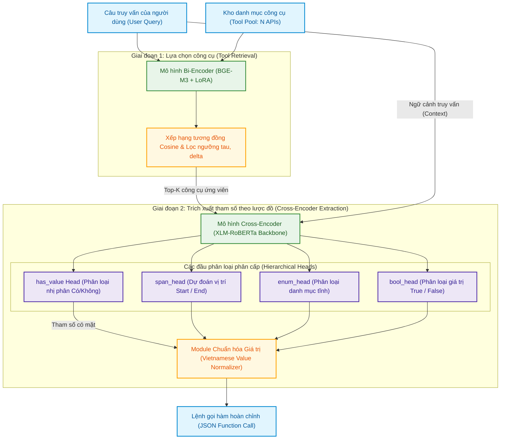
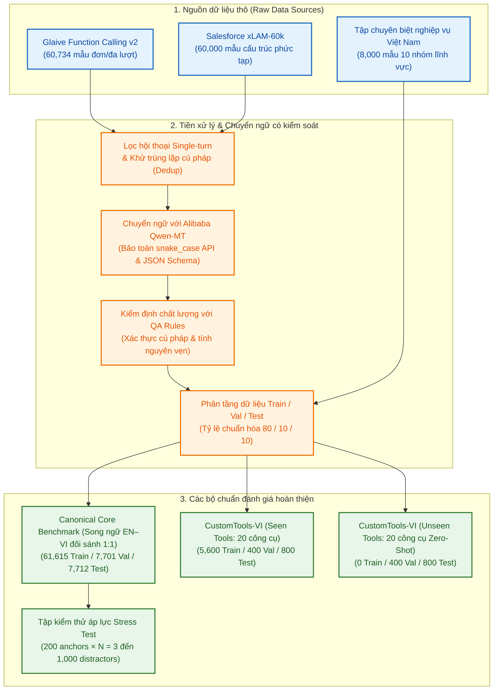
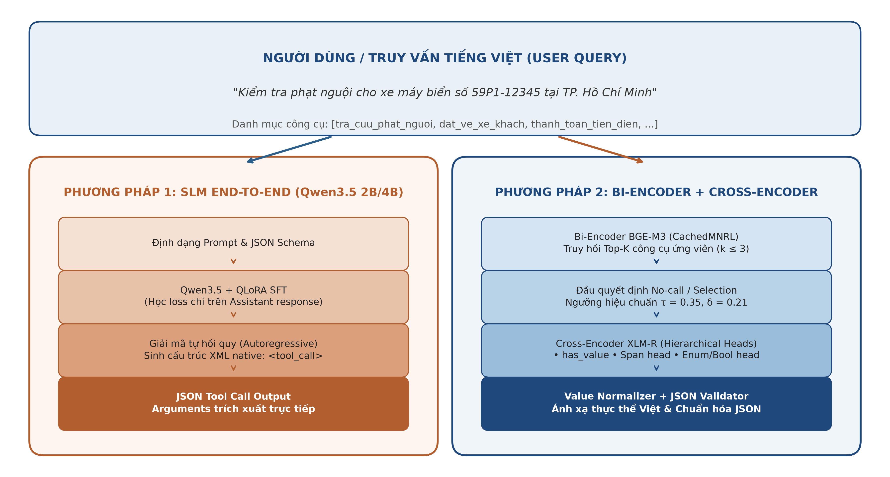
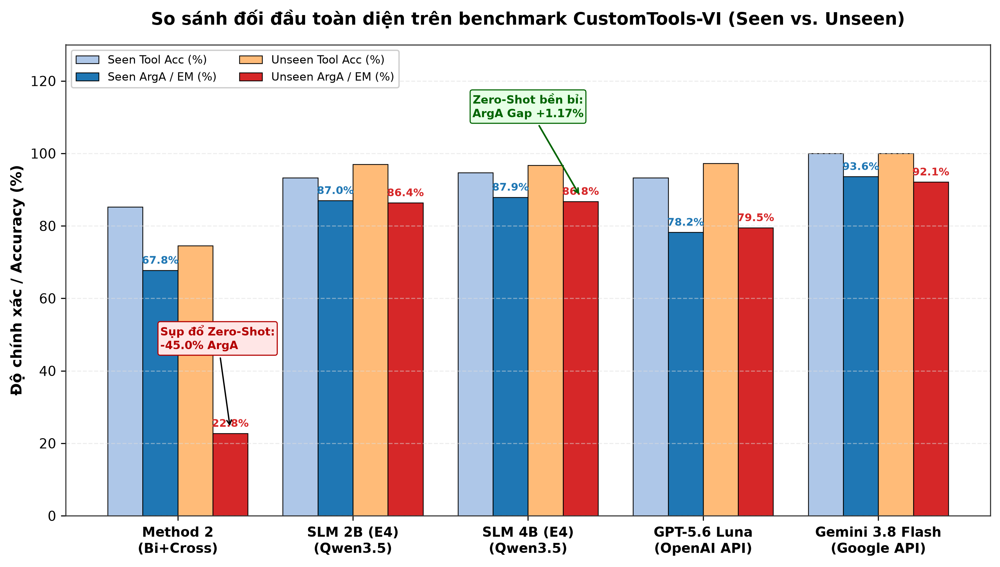
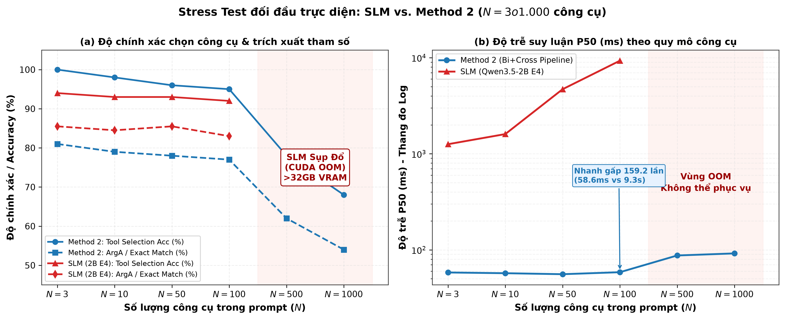
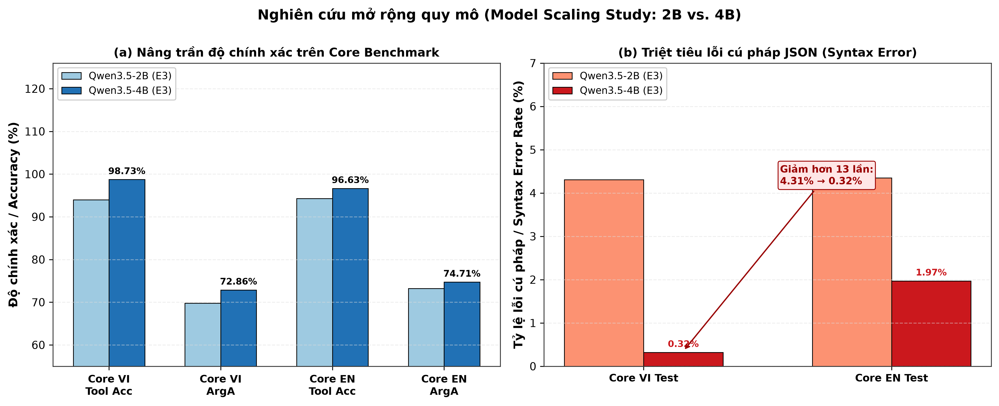

# ĐẠI HỌC QUỐC GIA THÀNH PHỐ HỒ CHÍ MINH
# TRƯỜNG ĐẠI HỌC CÔNG NGHỆ THÔNG TIN
## KHOA KHOA HỌC MÁY TÍNH
—————————— ❖ ——————————

<br><br>

### **ĐÀO PHƯỚC THỊNH**
### **HÀ QUANG ĐẠT**

<br>

# KHÓA LUẬN TỐT NGHIỆP

<br>

### **NGHIÊN CỨU PHƯƠNG PHÁP TOOL CALLING DỰA TRÊN TRUY HỒI NGỮ NGHĨA VÀ TRÍCH XUẤT THAM SỐ THEO TOOL SCHEMA**

<br>

### **RESEARCH ON TOOL CALLING USING SEMANTIC RETRIEVAL AND SCHEMA-AWARE PARAMETER EXTRACTION**

<br>

**CỬ NHÂN NGÀNH TRÍ TUỆ NHÂN TẠO**

<br><br><br>

### **TP. HỒ CHÍ MINH, NĂM 2026**

---

<div style="page-break-after: always;"></div>

# ĐẠI HỌC QUỐC GIA THÀNH PHỐ HỒ CHÍ MINH
# TRƯỜNG ĐẠI HỌC CÔNG NGHỆ THÔNG TIN
## KHOA KHOA HỌC MÁY TÍNH
—————————— ❖ ——————————

<br><br>

### **ĐÀO PHƯỚC THỊNH - 25210038**
### **HÀ QUANG ĐẠT - 25210008**

<br>

# KHÓA LUẬN TỐT NGHIỆP

<br>

### **NGHIÊN CỨU PHƯƠNG PHÁP TOOL CALLING DỰA TRÊN TRUY HỒI NGỮ NGHĨA VÀ TRÍCH XUẤT THAM SỐ THEO TOOL SCHEMA**

<br>

### **RESEARCH ON TOOL CALLING USING SEMANTIC RETRIEVAL AND SCHEMA-AWARE PARAMETER EXTRACTION**

<br>

**CỬ NHÂN NGÀNH TRÍ TUỆ NHÂN TẠO**

<br>

**GIẢNG VIÊN HƯỚNG DẪN:**
### **TS. ĐẶNG VĂN THÌN**

<br><br><br>

### **TP. HỒ CHÍ MINH, NĂM 2026**

---

<div style="page-break-after: always;"></div>

## THÔNG TIN HỘI ĐỒNG CHẤM KHÓA LUẬN TỐT NGHIỆP

Hội đồng chấm khóa luận tốt nghiệp, thành lập theo Quyết định số: ............................................ ngày ...... tháng ...... năm 2026 của Hiệu trưởng Trường Đại học Công nghệ Thông tin, Đại học Quốc gia TP. Hồ Chí Minh.

**Thành viên Hội đồng gồm:**

1. ....................................................................................... — Chủ tịch Hội đồng
2. ....................................................................................... — Thư ký Hội đồng
3. ....................................................................................... — Ủy viên phản biện 1
4. ....................................................................................... — Ủy viên phản biện 2
5. ....................................................................................... — Ủy viên

Khóa luận tốt nghiệp được bảo vệ và đánh giá tại Hội đồng chấm khóa luận tốt nghiệp, Trường Đại học Công nghệ Thông tin, Đại học Quốc gia TP. Hồ Chí Minh vào ngày ...... tháng ...... năm 2026.

<br><br>

**XÁC NHẬN CỦA CHỦ TỊCH HỘI ĐỒNG** &nbsp;&nbsp;&nbsp;&nbsp;&nbsp;&nbsp;&nbsp;&nbsp;&nbsp;&nbsp;&nbsp;&nbsp;&nbsp;&nbsp;&nbsp;&nbsp;&nbsp;&nbsp;&nbsp;&nbsp; **GIẢNG VIÊN HƯỚNG DẪN**

---

<div style="page-break-after: always;"></div>

## LỜI CẢM ƠN

Để hoàn thành khóa luận tốt nghiệp và chương trình đào tạo cử nhân ngành Trí tuệ Nhân tạo, chúng em xin bày tỏ lòng biết ơn chân thành đến quý Thầy Cô cùng gia đình đã luôn đồng hành, động viên và tạo điều kiện thuận lợi nhất cho chúng em trong suốt thời gian học tập và nghiên cứu.

Trước hết, chúng em xin gửi lời cảm ơn sâu sắc nhất tới **TS. Đặng Văn Thìn**, giảng viên trực tiếp hướng dẫn đề tài. Trong suốt quá trình thực hiện khóa luận, Thầy đã luôn dành nhiều thời gian tận tâm định hướng học thuật, đưa ra những chỉ dẫn chuyên môn sâu sắc và kiên nhẫn định hướng phương pháp tiếp cận khoa học chuẩn mực cho nhóm nghiên cứu từ những bước đầu tiên cho đến khi hoàn thành đề tài.

Chúng em xin trân trọng cảm ơn quý Thầy Cô thuộc **Khoa Khoa học Máy tính**, **Trường Đại học Công nghệ Thông tin – ĐHQG-HCM**, những người đã tận tình giảng dạy, truyền đạt nền tảng tri thức chuyên môn vững chắc và phương pháp tư duy khoa học trong suốt những năm tháng đại học.

Chúng em cũng xin gửi lời cảm ơn chân thành đến gia đình — những người đã luôn là hậu phương vững chắc, động viên và tạo mọi điều kiện tốt nhất để chúng em yên tâm học tập, nghiên cứu. Khóa luận này là thành quả từ sự nỗ lực không ngừng nghỉ, tinh thần chủ động tự nghiên cứu độc lập cùng sự phối hợp đồng lòng, chặt chẽ giữa hai thành viên trong nhóm dưới sự dẫn dắt khoa học của Thầy hướng dẫn.

Dù đã nỗ lực hết mình để hoàn thành đề tài một cách chỉn chu và chặt chẽ nhất, khóa luận khó tránh khỏi những hạn chế nhất định. Chúng em rất mong nhận được những nhận xét, đóng góp quý báu từ quý Thầy Cô trong Hội đồng để nghiên cứu được hoàn thiện hơn nữa.

*TP. Hồ Chí Minh, tháng 09 năm 2026*  
**Nhóm sinh viên thực hiện**  
*Đào Phước Thịnh & Hà Quang Đạt*

---

<div style="page-break-after: always;"></div>

## MỤC LỤC

- [LỜI CẢM ƠN](#lời-cảm-ơn)
- [DANH MỤC HÌNH VẼ](#danh-mục-hình-vẽ)
- [DANH MỤC BẢNG BIỂU](#danh-mục-bảng-biểu)
- [DANH MỤC TỪ VIẾT TẮT](#danh-mục-từ-viết-tắt)
- [TÓM TẮT KHÓA LUẬN](#tóm-tắt-khóa-luận)
- [MỞ ĐẦU](#mở-đầu)
- [Chương 1. TỔNG QUAN VỀ ĐỀ TÀI](#chương-1-tổng-quan-về-đề-tài)
  - [1.1. Mô tả đề tài và tính cấp thiết của nghiên cứu](#11-mô-tả-đề-tài-và-tính-cấp-thiết-của-nghiên-cứu)
  - [1.2. Mục tiêu của đề tài](#12-mục-tiêu-của-đề-tài)
  - [1.3. Đối tượng và phạm vi nghiên cứu](#13-đối-tượng-và-phạm-vi-nghiên-cứu)
  - [1.4. Phương pháp thực hiện](#14-phương-pháp-thực-hiện)
  - [1.5. Kết quả mong đợi và đóng góp khoa học của đề tài](#15-kết-quả-mong-đợi-và-đóng-góp-khoa-học-của-đề-tài)
  - [1.6. Bố cục của khóa luận](#16-bố-cục-của-khóa-luận)
- [Chương 2. CƠ SỞ LÝ THUYẾT VÀ CÁC CÔNG TRÌNH LIÊN QUAN](#chương-2-cơ-sở-lý-thuyết-và-các-công-trình-liên-quan)
  - [2.1. Cơ chế gọi công cụ (Tool Calling / Function Calling) trong Mô hình Ngôn ngữ](#21-cơ-chế-gọi-công-cụ-tool-calling--function-calling-trong-mô-hình-ngôn-ngữ)
  - [2.2. Các công trình và bộ chuẩn đánh giá Tool Calling trong và ngoài nước](#22-các-công-trình-và-bộ-chuẩn-đánh-giá-tool-calling-trong-và-ngoài-nước)
  - [2.3. Mô hình Ngôn ngữ Nhỏ (SLMs) và Kỹ thuật Tinh chỉnh Tham số Hiệu quả (PEFT/QLoRA)](#23-mô-hình-ngôn-ngữ-nhỏ-slms-và-kỹ-thuật-tinh-chỉnh-tham-số-hiệu-quả-peftqlora)
  - [2.4. Kiến trúc Phân tách: Truy hồi Ngữ nghĩa Dày (Bi-Encoder) và Trích xuất Tham số (Cross-Encoder)](#24-kiến-trúc-phân-tách-truy-hồi-ngữ-nghĩa-dày-bi-encoder-và-trích-xuất-tham-số-cross-encoder)
    - [2.4.1. Giai đoạn 1: Truy hồi công cụ ngữ nghĩa dày (Bi-Encoder Retrieval)](#241-giai-đoạn-1-truy-hồi-công-cụ-ngữ-nghĩa-dày-bi-encoder-retrieval)
    - [2.4.2. Giai đoạn 2: Trích xuất tham số theo lược đồ (Cross-Encoder Extraction)](#242-giai-đoạn-2-trích-xuất-tham-số-theo-lược-đồ-cross-encoder-extraction)
  - [2.5. Những thách thức đặc thù của ngôn ngữ tiếng Việt trong bài toán Tool Calling](#25-những-thách-thức-đặc-thù-của-ngôn-ngữ-tiếng-việt-trong-bài-toán-tool-calling)
- [Chương 3. XÂY DỰNG BỘ TIÊU CHUẨN ĐÁNH GIÁ (BENCHMARK) CHO TIẾNG VIỆT](#chương-3-xây-dựng-bộ-tiêu-chuẩn-đánh-giá-benchmark-cho-tiếng-việt)
  - [3.1. Thiết kế Schema Chuẩn hóa Dữ liệu (Master Canonical Schema)](#31-thiết-kế-schema-chuẩn-hóa-dữ-liệu-master-canonical-schema)
  - [3.2. Bộ chuẩn quy mô lớn Canonical Core Benchmark](#32-bộ-chuẩn-quy-mô-lớn-canonical-core-benchmark)
  - [3.3. Bộ chuẩn miền thực tế bản địa hóa CustomTools-VI](#33-bộ-chuẩn-miền-thực-tế-bản-địa-hóa-customtools-vi)
  - [3.4. Chiến lược tạo lập và kiểm soát dữ liệu âm tính (Negative Samples)](#34-chiến-lược-tạo-lập-và-kiểm-soát-dữ-liệu-âm-tính-negative-samples)
  - [3.5. Quy trình xây dựng tập kiểm thử áp lực (Stress Test Benchmark)](#35-quy-trình-xây-dựng-tập-kiểm-thử-áp-lực-stress-test-benchmark)
- [Chương 4. PHƯƠNG PHÁP ĐỀ XUẤT VÀ THIẾT KẾ KIẾN TRÚC HỆ THỐNG](#chương-4-phương-pháp-đề-xuất-và-thiết-kế-kiến-trúc-hệ-thống)
  - [4.1. Kiến trúc tổng quan của hai trường phái kỹ thuật](#41-kiến-trúc-tổng-quan-của-hai-trường-phái-kỹ-thuật)
  - [4.2. Phương pháp 1: SLM End-to-End dựa trên Qwen3.5 (2B và 4B)](#42-phương-pháp-1-slm-end-to-end-dựa-trên-qwen35-2b-và-4b)
  - [4.3. Phương pháp 2: Kiến trúc Phân tách Bi-Encoder + Cross-Encoder](#43-phương-pháp-2-kiến-trúc-phân-tách-bi-encoder--cross-encoder)
    - [4.3.1. Module Truy hồi Công cụ Ngữ nghĩa (Semantic Tool Retriever)](#431-module-truy-hồi-công-cụ-ngữ-nghĩa-semantic-tool-retriever)
    - [4.3.2. Module Trích xuất Tham số Phân cấp (Hierarchical Parameter Extractor)](#432-module-trích-xuất-tham-số-phân-cấp-hierarchical-parameter-extractor)
  - [4.4. Cơ chế chuẩn hóa giá trị thực thể tiếng Việt (Vietnamese Value Normalizer)](#44-cơ-chế-chuẩn-hóa-giá-trị-thực-thể-tiếng-việt-vietnamese-value-normalizer)
- [Chương 5. THỰC NGHIỆM, ĐÁNH GIÁ VÀ BÀN LUẬN KẾT QUẢ](#chương-5-thực-nghiệm-đánh-giá-và-bàn-luận-kết-quả)
  - [5.1. Thiết lập thực nghiệm và hạ tầng phần cứng](#51-thiết-lập-thực-nghiệm-và-hạ-tầng-phần-cứng)
  - [5.2. Hệ thống độ đo đánh giá (Evaluation Metrics)](#52-hệ-thống-độ-đo-đánh-giá-evaluation-metrics)
  - [5.3. Kết quả tổng thể và giải đáp 5 câu hỏi nghiên cứu](#53-kết-quả-tổng-thể-và-giải-đáp-5-câu-hỏi-nghiên-cứu)
    - [5.3.1. RQ1: Năng lực chuyển giao tri thức ngôn ngữ chéo (Cross-Lingual Transfer)](#531-rq1-năng-lực-chuyển-giao-tri-thức-ngôn-ngữ-chéo-cross-lingual-transfer)
    - [5.3.2. RQ2: Hiện tượng kích hoạt công cụ quá mức và vai trò của dữ liệu âm tính](#532-rq2-hiện-tượng-kích-hoạt-công-cụ-quá-mức-và-vai-trò-của-dữ-liệu-âm-tính)
    - [5.3.3. RQ3: Khả năng tổng quát hóa Zero-Shot trên công cụ chưa từng gặp](#533-rq3-khả-năng-tổng-quát-hóa-zero-shot-trên-công-cụ-chưa-từng-gặp)
    - [5.3.4. RQ4: Đánh đổi Pareto giữa độ chính xác, độ trễ và chi phí tính toán](#534-rq4-đánh-đổi-pareto-giữa-độ-chính-xác-độ-trễ-và-chi-phí-tính-toán)
    - [5.3.5. RQ5: Kiểm thử áp lực quy mô lớn và giới hạn vật lý của mô hình tạo sinh](#535-rq5-kiểm-thử-áp-lực-quy-mô-lớn-và-giới-hạn-vật-lý-của-mô-hình-tạo-sinh)
  - [5.4. Nghiên cứu mở rộng quy mô mô hình: Qwen3.5-2B vs. Qwen3.5-4B](#54-nghiên-cứu-mở-rộng-quy-mô-mô-hình-qwen35-2b-vs-qwen35-4b)
  - [5.5. So sánh đối đầu với các Frontier API thương mại đóng (GPT-5.6 Luna, Gemini 3.8 Flash)](#55-so-sánh-đối-đầu-với-các-frontier-api-thương-mại-đóng-gpt-56-luna-gemini-38-flash)
    - [5.5.1. Thông tin tái lập phép đánh giá Frontier API](#551-thông-tin-tái-lập-phép-đánh-giá-frontier-api)
- [Chương 6. PHÂN TÍCH LỖI VÀ THẢO LUẬN GIỚI HẠN](#chương-6-phân-tích-lỗi-và-thảo-luận-giới-hạn)
  - [6.1. Phân loại các dạng lỗi phổ biến trong trích xuất tham số tiếng Việt](#61-phân-loại-các-dạng-lỗi-phổ-biến-trong-trích-xuất-tham-số-tiếng-việt)
  - [6.2. Phân tích nguyên nhân suy giảm zero-shot của Method 2](#62-phân-tích-nguyên-nhân-suy-giảm-zero-shot-của-method-2)
  - [6.3. Giới hạn của đề tài và các thách thức mở](#63-giới-hạn-của-đề-tài-và-các-thách-thức-mở)
- [KẾT LUẬN VÀ HƯỚNG PHÁT TRIỂN](#kết-luận-và-hướng-phát-triển)
  - [Kết luận](#kết-luận)
  - [Hướng phát triển trong tương lai](#hướng-phát-triển-trong-tương-lai)
- [TÀI LIỆU THAM KHẢO](#tài-liệu-tham-khảo)
- [PHỤ LỤC A. TÀI NGUYÊN TÁI LẬP THỰC NGHIỆM](#phụ-lục-a-tài-nguyên-tái-lập-thực-nghiệm)

---

<div style="page-break-after: always;"></div>

## DANH MỤC HÌNH VẼ

| Ký hiệu hình | Tên hình vẽ | Trang |
| :---: | :--- | :---: |
| **Hình 2.1** | Sơ đồ nguyên lý kiến trúc phân tách hai giai đoạn (Method 2) | 16 |
| **Hình 3.1** | Quy trình xử lý dữ liệu và xây dựng bộ Benchmark Tool Calling | 24 |
| **Hình 4.1** | Sơ đồ kiến trúc đối chiếu giữa Phương pháp 1 và Phương pháp 2 | 28 |
| **Hình 4.2** | Quy trình bốn giai đoạn của module Chuẩn hóa Giá trị tiếng Việt | 38 |
| **Hình 5.1** | So sánh hiệu năng các phương pháp trên benchmark CustomTools-VI | 42 |
| **Hình 5.2** | Kết quả Stress Test đối đầu trực diện khi mở rộng quy mô công cụ ($N = 3 \to 1000$) | 49 |
| **Hình 5.3** | Nghiên cứu mở rộng quy mô tham số mô hình SLM (2B vs. 4B) | 54 |

---

<div style="page-break-after: always;"></div>

## DANH MỤC BẢNG BIỂU

| Ký hiệu bảng | Tên bảng biểu | Trang |
| :---: | :--- | :---: |
| **Bảng 3.1** | Thống kê định lượng các bộ dữ liệu trong Benchmark Tool Calling Tiếng Việt | 22 |
| **Bảng 4.1** | Thiết lập siêu tham số huấn luyện mô hình SLM Qwen3.5 (2B và 4B) | 33 |
| **Bảng 4.2** | Thiết lập siêu tham số huấn luyện Phương pháp 2 (BGE-M3 và XLM-R) | 36 |
| **Bảng 5.1a** | Kết quả thực nghiệm trên tập kiểm thử CustomTools-VI Seen | 40 |
| **Bảng 5.1b** | Kết quả thực nghiệm trên tập kiểm thử CustomTools-VI Unseen | 41 |
| **Bảng 5.2** | Kết quả thực nghiệm trên Canonical Core Benchmark (7,712 mẫu) | 44 |
| **Bảng 5.3** | Đối chiếu chỉ số và điều kiện vận hành của bốn phương pháp | 46 |
| **Bảng 5.4a** | Độ chính xác trong Stress Test theo quy mô danh mục công cụ | 48 |
| **Bảng 5.4b** | Độ trễ và bộ nhớ trong Stress Test theo quy mô danh mục công cụ | 48 |
| **Bảng 5.5** | Nghiên cứu mở rộng quy mô tham số mô hình (Qwen3.5-2B vs. 4B) | 52 |
| **Bảng 5.6** | Hiệu năng đối đầu của mô hình Qwen3.5-4B (E3 vs. E4) trên Core Benchmark | 53 |
| **Bảng 6.1** | Các ví dụ thực tế minh họa 4 dạng sai lệch trích xuất tham số điển hình | 58 |
| **Bảng 6.2** | Đánh giá chất lượng độc lập của các đầu phân cấp trong Cross-Encoder | 60 |
| **Bảng 6.3** | Đối chứng chẩn đoán Oracle giữa lỗi truy hồi và trích xuất tham số | 62 |

---

<div style="page-break-after: always;"></div>

## DANH MỤC TỪ VIẾT TẮT

| Từ viết tắt | Thuật ngữ tiếng Anh | Ý nghĩa tiếng Việt |
| :--- | :--- | :--- |
| **API** | Application Programming Interface | Giao diện lập trình ứng dụng |
| **ArgA** | Argument Accuracy | Độ chính xác trích xuất toàn bộ tham số (Exact Match) |
| **BFCL** | Berkeley Function-Calling Leaderboard | Bảng xếp hạng gọi hàm của Đại học UC Berkeley |
| **DDP** | Distributed Data Parallel | Kỹ thuật huấn luyện phân tán dữ liệu song song |
| **EM** | Exact Match | Khớp chính xác tuyệt đối 100% |
| **FC** | Function Calling / Tool Calling | Kỹ thuật gọi hàm / gọi công cụ của mô hình ngôn ngữ |
| **JSON** | JavaScript Object Notation | Định dạng trao đổi dữ liệu dạng chuỗi tiêu chuẩn |
| **LLM** | Large Language Model | Mô hình ngôn ngữ lớn |
| **MNRL** | Multiple Negatives Ranking Loss | Hàm mất mát xếp hạng đa mẫu âm tính |
| **Non-FC** | Non-Function Calling | Các truy vấn thông thường không yêu cầu gọi công cụ |
| **OOM** | Out Of Memory | Hiện tượng tràn bộ nhớ phần cứng (CUDA VRAM) |
| **PEFT** | Parameter-Efficient Fine-Tuning | Kỹ thuật tinh chỉnh tham số hiệu quả |
| **QLoRA** | Quantized Low-Rank Adaptation | Kỹ thuật thích ứng hạng thấp lượng tử hóa 4-bit |
| **RAG** | Retrieval-Augmented Generation | Kỹ thuật sinh văn bản tăng cường bằng truy hồi |
| **RoBERTa** | Robustly Optimized BERT Approach | Mô hình ngôn ngữ tiền huấn luyện tối ưu hóa từ BERT |
| **RQ** | Research Question | Câu hỏi nghiên cứu khoa học |
| **SFT** | Supervised Fine-Tuning | Kỹ thuật tinh chỉnh có giám sát |
| **SLM** | Small Language Model | Mô hình ngôn ngữ quy mô nhỏ (dưới 7B tham số) |
| **SOTA** | State Of The Art | Đỉnh cao hiệu năng công nghệ hiện tại |
| **Tool Acc** | Tool Selection Accuracy | Độ chính xác lựa chọn công cụ mục tiêu |
| **VRAM** | Video Random Access Memory | Bộ nhớ truy cập ngẫu nhiên đồ họa của GPU |
| **XML** | Extensible Markup Language | Ngôn ngữ đánh dấu mở rộng |

---

<div style="page-break-after: always;"></div>

## TÓM TẮT KHÓA LUẬN

Gọi công cụ (tool calling / function calling) cho phép mô hình ngôn ngữ tương tác với API, cơ sở dữ liệu và công cụ tính toán. Khi triển khai tại Việt Nam, các giải pháp thương mại đám mây cần được cân nhắc về chi phí, độ trễ, bảo vệ dữ liệu và khả năng tạo đầu ra phù hợp với schema. Độ trễ SLM trong khóa luận thay đổi theo mô hình và điều kiện đánh giá; do đó, các phép so sánh phải gắn với protocol đo cụ thể.

Trước bối cảnh đó, khóa luận tập trung nghiên cứu bài toán gọi công cụ tiếng Việt dựa trên truy hồi ngữ nghĩa và trích xuất tham số theo Tool Schema, đồng thời tiến hành so sánh đối đầu có hệ thống giữa hai trường phái kỹ thuật. Phương pháp 1 là mô hình ngôn ngữ nhỏ End-to-End, trong đó `Qwen3.5-2B` và `Qwen3.5-4B` được tinh chỉnh bằng QLoRA trên biểu diễn hội thoại có cấu trúc. Phương pháp 2 là kiến trúc phân tách phi tự hồi quy, kết hợp Bi-Encoder `BAAI/bge-m3` để xếp hạng các công cụ ứng viên với Cross-Encoder `xlm-roberta-base` có các đầu phân cấp để trích xuất tham số; bộ chuẩn hóa giá trị tiếng Việt được sử dụng ở bước hậu xử lý để ánh xạ các cách diễn đạt tự nhiên về kiểu dữ liệu trong schema.

Để bảo đảm phép đối sánh giữa hai phương pháp, nghiên cứu xây dựng `Canonical Core Benchmark` gồm 77,028 cặp bản ghi song ngữ trên 4,421 công cụ và `CustomTools-VI` gồm 8,000 mẫu nghiệp vụ đời sống Việt Nam thuộc 40 công cụ. Bộ dữ liệu thứ hai có 3,200 mẫu âm tính (40%) trên toàn bộ 8,000 mẫu. Riêng mỗi tập kiểm thử `test_seen` và `test_unseen` được cân bằng 50% mẫu âm tính để đo cả khả năng gọi đúng và khả năng từ chối gọi công cụ.

Các kết quả thực nghiệm cho thấy Qwen3.5-4B E4 đạt ArgA 87.92% trên tập seen và 86.75% trên tập unseen, cao hơn GPT-5.6 Luna lần lượt 9.67 và 7.25 điểm phần trăm trong protocol CustomTools-VI. Cấu hình E3 ghi nhận Non-FC Recall 2.0%–3.0%; E4 đạt 100.0% trên hai tập kiểm thử sau khi bổ sung dữ liệu bản địa. Kết quả phản ánh các cấu hình và lần chạy được khảo sát, chưa xác định riêng tác động của mẫu âm tính.

Trong stress test, Method 2 ghi nhận P50 từ 55.05 đến 61.01 ms ở dải $N \le 100$, PyTorch allocated VRAM xấp xỉ 3.21 GiB và Syntax Error 0.00% theo định nghĩa structured-output. Các số đo độ trễ được thu thập theo quy cách riêng (đơn truy vấn ở Method 2 và xử lý theo batch ở SLM), nên chỉ phản ánh đặc tính vận hành của từng pipeline mà không quy đổi thành hệ số tăng tốc trực tiếp. Khi danh mục mở rộng từ $N=3$ đến $N=1000$, SLM phát sinh CUDA Out of Memory tại $N \ge 500$ trên GPU 16GB trong bài stress test, trong khi Method 2 tiếp tục đạt ArgA 84.00% và P50 107.68 ms ở $N=1000$.

Công trình cung cấp một bức tranh đối chiếu giữa độ chính xác, khả năng từ chối, độ trễ và tài nguyên tính toán trong các protocol đã thực hiện. Kết quả có thể được sử dụng như cơ sở tham khảo khi lựa chọn kiến trúc gọi công cụ tiếng Việt theo miền dữ liệu, quy mô danh mục API và điều kiện hạ tầng cụ thể.

---

<div style="page-break-after: always;"></div>

## MỞ ĐẦU

Các mô hình ngôn ngữ có thể tương tác với hệ thống bên ngoài thông qua cơ chế gọi công cụ (tool calling / function calling). Từ yêu cầu bằng ngôn ngữ tự nhiên, mô hình lựa chọn công cụ và tạo tham số để truy vấn dữ liệu, thực hiện phép tính hoặc gửi yêu cầu tới dịch vụ phần mềm. Năng lực này là một thành phần quan trọng của các hệ thống tác tử AI.

Các dịch vụ mô hình thương mại đã cung cấp giao diện gọi hàm, nhưng việc sử dụng chúng trong một số ứng dụng tại Việt Nam cần cân nhắc chi phí, độ trễ, yêu cầu bảo vệ dữ liệu và khả năng xử lý cách diễn đạt tiếng Việt. Những yếu tố này tạo động lực khảo sát các phương án có thể triển khai trên hạ tầng cục bộ.

Khóa luận đặt câu hỏi về khả năng xây dựng giải pháp gọi công cụ tiếng Việt chính xác, có thể triển khai độc lập và đáp ứng yêu cầu bảo vệ dữ liệu, đồng thời cân bằng độ trễ với nhu cầu tài nguyên. Nghiên cứu hiện thực hóa và đối chiếu mô hình ngôn ngữ nhỏ tự hồi quy end-to-end (SLM) với hệ thống phân tách Bi-Encoder và Cross-Encoder trong các điều kiện đánh giá đã thiết lập.

Đối tượng nghiên cứu là quá trình lựa chọn công cụ và trích xuất tham số theo lược đồ từ truy vấn tiếng Việt. Phạm vi thực nghiệm gồm tương tác đơn lượt, kể cả trường hợp gọi nhiều công cụ hoặc không gọi công cụ, trên Core Benchmark, CustomTools-VI và tập kiểm thử áp lực theo quy mô danh mục. Nghiên cứu đánh giá lời gọi có cấu trúc trước khi thực thi API; tương tác đa lượt và vận hành công cụ thực tế nằm ngoài phạm vi khóa luận.

---

<div style="page-break-after: always;"></div>

## Chương 1. TỔNG QUAN VỀ ĐỀ TÀI

### 1.1. Mô tả đề tài và tính cấp thiết của nghiên cứu
Các mô hình ngôn ngữ lớn (Large Language Models – LLMs) được sử dụng trong những hệ thống cần tương tác với dữ liệu và dịch vụ bên ngoài. Cơ chế gọi công cụ (Tool Calling / Function Calling) cho phép mô hình chuyển yêu cầu của người dùng thành lời gọi API có cấu trúc, chẳng hạn để truy vấn thông tin thời gian thực hoặc khai thác cơ sở dữ liệu nghiệp vụ.

Các nền tảng OpenAI Function Calling và Google Gemini Function Calling cung cấp giao diện gọi hàm cho mô hình API [18], [19]. Các công trình Toolformer [2], Gorilla [3], ToolLLM [5], BFCL [4], APIGen [11] và ToolACE [12] lần lượt nghiên cứu huấn luyện, dữ liệu hoặc đánh giá năng lực sử dụng công cụ. Trong khóa luận, một hướng tiếp cận để đối chiếu là dùng SLM sinh lời gọi hàm, bao gồm lựa chọn công cụ và tham số.

Với SLM tự hồi quy, độ trễ và bộ nhớ phụ thuộc vào độ dài đầu vào, số token đầu ra, mô hình và phần cứng. Trên Core VI, độ trễ mean của các checkpoint được khảo sát là 0.71–2.49 giây; Core EN của 4B đạt 3.31 giây. SLM còn có thể sinh lời gọi sai cú pháp hoặc sai tham số. Trong stress test trên T4 16GB, mô hình gặp CUDA Out of Memory khi $N \ge 500$. Vì Qwen3.5 xen kẽ linear attention và full attention [17], kết quả này không thể quy riêng cho độ phức tạp $\mathcal{O}(L^2)$ của full attention.

Các bộ chuẩn như BFCL và ToolBench chủ yếu sử dụng tiếng Anh, trong khi truy vấn tiếng Việt có những biến thể khẩu ngữ, địa danh và đơn vị định lượng cần được khảo sát riêng. Vì vậy, nghiên cứu xây dựng bộ dữ liệu đánh giá tiếng Việt và đối chiếu phương pháp SLM với kiến trúc kết hợp truy hồi ngữ nghĩa (Semantic Tool Retrieval) và trích xuất tham số theo lược đồ (Schema-aware Parameter Extraction).

### 1.2. Mục tiêu của đề tài
Mục tiêu của khóa luận là hiện thực hóa và đánh giá hai phương pháp gọi công cụ tiếng Việt: SLM tạo sinh end-to-end và kiến trúc phân tách Bi-Encoder + Cross-Encoder. Phép đối chiếu tập trung vào độ chính xác, khả năng từ chối gọi công cụ, độ trễ và nhu cầu tài nguyên trong từng điều kiện thực nghiệm.

Để thực hiện mục tiêu này, nghiên cứu tổng hợp các công trình và bộ chuẩn gọi công cụ liên quan, sau đó xây dựng hai tập dữ liệu đánh giá: Canonical Core Benchmark và CustomTools-VI. Dữ liệu được chuẩn hóa theo một lược đồ chung để phục vụ huấn luyện và so sánh kết quả.

Nghiên cứu hiện thực hóa pipeline gồm Bi-Encoder truy hồi công cụ và Cross-Encoder trích xuất tham số, kèm bước chuẩn hóa giá trị tiếng Việt. Hai mô hình Qwen3.5 2B và 4B được tinh chỉnh theo các cấu hình dữ liệu E0–E4. Các phương pháp được đánh giá về độ chính xác trên hai benchmark; độ trễ, bộ nhớ và khả năng chịu tải được báo cáo cùng điều kiện đo riêng của từng run.

### 1.3. Đối tượng và phạm vi nghiên cứu
Đối tượng nghiên cứu là cơ chế lựa chọn công cụ và trích xuất tham số theo lược đồ trong bài toán gọi công cụ. Dữ liệu khảo sát gồm ngữ liệu gọi hàm quốc tế và các tình huống nghiệp vụ tại Việt Nam, được chuẩn hóa theo Master Canonical Schema. Về kỹ thuật, khóa luận đánh giá SLM tạo sinh, Bi-Encoder truy hồi công cụ và Cross-Encoder trích xuất tham số.

Phạm vi nghiên cứu dừng ở bước tạo lời gọi có cấu trúc từ truy vấn người dùng, trước khi API được thực thi. Khóa luận xét tương tác đơn lượt, gồm cả trường hợp gọi một hoặc nhiều công cụ. Việc thực thi công cụ, lập kế hoạch qua nhiều lượt, điều phối đa tác tử và cập nhật danh mục công cụ theo thời gian thực nằm ngoài phạm vi. Kết luận được giới hạn theo dữ liệu và các điều kiện đo đã báo cáo.

### 1.4. Phương pháp thực hiện
Khóa luận được triển khai theo phương pháp luận nghiên cứu thực nghiệm (Empirical Research) kết hợp với kỹ nghệ phát triển hệ thống (System Engineering). Nghiên cứu khảo cứu các kiến trúc gọi công cụ, xác định những rào cản đối với tiếng Việt, rồi thiết lập Master Canonical Schema và quy trình dịch thuật có kiểm soát chất lượng để tạo lập `Canonical Core Benchmark` ($77{,}028$ bản ghi trên $4{,}421$ APIs). Tập dữ liệu nghiệp vụ bản địa `CustomTools-VI` gồm $8{,}000$ mẫu trên $40$ công cụ, trong đó có $3{,}200$ mẫu âm tính (40%); riêng mỗi tập kiểm thử `test_seen` và `test_unseen` được cân bằng 50% mẫu âm tính.

Trên cơ sở dữ liệu đã chuẩn hóa, nghiên cứu huấn luyện Bi-Encoder `BAAI/bge-m3` với `CachedMNRL` và mẫu âm khó, kết hợp Cross-Encoder `xlm-roberta-base` cùng module Value Normalizer để trích xuất tham số. Song song, các mô hình SLM Qwen3.5 2B và 4B được tinh chỉnh bằng QLoRA. Phần thực nghiệm báo cáo độ chính xác trên hai benchmark và stress test tới $1{,}000$ công cụ; độ trễ mean hoặc P50/P95 và bộ nhớ được trình bày theo định nghĩa, phần cứng và protocol của từng phép đo. GPT-5.6 Luna và Gemini 3.8 Flash chỉ tham gia phép đánh giá CustomTools-VI.

### 1.5. Kết quả mong đợi và đóng góp khoa học của đề tài
Công trình đóng góp hai bộ dữ liệu đánh giá tiếng Việt gồm `Canonical Core Benchmark` và `CustomTools-VI`. Bộ thứ hai phân tách công cụ đã học và chưa từng gặp; mỗi tập kiểm thử có 50% mẫu âm tính. Trên các tập này, kết quả E3 và E4 ghi nhận sự khác biệt lớn về thiên kiến kích hoạt công cụ quá mức (over-triggering). Sau khi bổ sung dữ liệu bản địa ở E4, Non-FC Recall đạt 100.0% trên hai tập kiểm thử CustomTools-VI; quan sát từ một cấu hình huấn luyện chưa đủ để xác định riêng tác động nhân quả của từng thành phần dữ liệu.

Trên CustomTools-VI, Qwen3.5-4B E4 đạt ArgA 87.92% ở seen và 86.75% ở unseen, cao hơn GPT-5.6 Luna trong lần đánh giá này. Trong stress test, Method 2 ghi nhận P50 khoảng 55–61 ms ở $N \le 100$ và tiếp tục chạy tới $N=1000$; SLM gặp OOM tại $N \ge 500$ trên GPU 16GB. Các phép đo độ trễ có quy cách đo lường riêng (đơn truy vấn đối với Method 2 và xử lý theo batch đối với SLM), nên kết quả mô tả hành vi vận hành trong điều kiện thử nghiệm tương ứng. Mã nguồn nghiên cứu được lưu tại [kho dự án](https://github.com/TristanDao/tool_calling_with_retrieval_extraction); khả năng tái lập còn phụ thuộc vào dữ liệu, checkpoint và thiết lập dịch vụ được công bố kèm.

### 1.6. Bố cục của khóa luận
Khóa luận gồm sáu chương và phần kết luận.

Chương 1 giới thiệu bài toán, mục tiêu và phạm vi nghiên cứu. Chương 2 trình bày cơ sở lý thuyết, các công trình liên quan và thách thức của tiếng Việt. Chương 3 mô tả lược đồ dữ liệu, hai bộ chuẩn đánh giá và tập kiểm thử áp lực.

Chương 4 mô tả hai kiến trúc và bộ chuẩn hóa giá trị tiếng Việt. Chương 5 trình bày kết quả thực nghiệm, năm câu hỏi nghiên cứu, đối sánh API và stress test. Chương 6 phân tích lỗi, khả năng khái quát hóa trên công cụ mới và giới hạn của nghiên cứu. Phần cuối tổng kết kết quả và đề xuất hướng phát triển.

---

<div style="page-break-after: always;"></div>

## Chương 2. CƠ SỞ LÝ THUYẾT VÀ CÁC CÔNG TRÌNH LIÊN QUAN

### 2.1. Cơ chế gọi công cụ (Tool Calling / Function Calling) trong Mô hình Ngôn ngữ

Các công trình về mô hình ngôn ngữ sử dụng công cụ phát triển theo nhiều hướng. Toolformer [2] khảo sát cách mô hình tự học vị trí gọi API; Gorilla [3] tập trung vào khả năng sử dụng số lượng lớn API; Berkeley Function-Calling Leaderboard (BFCL) [4] cung cấp các tình huống và thước đo đánh giá lời gọi hàm. Các công trình này đặt nền tảng cho việc phân tích cả lựa chọn công cụ lẫn tham số trong khóa luận.

Gọi $X = (x_1, x_2, \dots, x_{|X|})$ là truy vấn và $\mathcal{T} = \{t_1, t_2, \dots, t_N\}$ là danh mục $N$ công cụ. Mỗi công cụ $t_i = (n_i, d_i, \mathcal{S}_i)$ có tên $n_i$, mô tả $d_i$ và lược đồ tham số $\mathcal{S}_i$ theo JSON Schema. Hệ thống ánh xạ $(X, \mathcal{T})$ thành chuỗi lời gọi $\mathcal{Y} = [(t^*_1, \mathcal{A}_1), \dots, (t^*_K, \mathcal{A}_K)]$, với $K=0$ khi không cần gọi công cụ. Ở mỗi lời gọi, $t^*_k \in \mathcal{T}$ và $\mathcal{A}_k = \{(p_{k,j}, v_{k,j})\}_{j=1}^{M_k}$ là các cặp tên–giá trị tham số phù hợp với $\mathcal{S}_{t^*_k}$.

Trong cách tiếp cận tạo sinh, mô tả các công cụ khả dụng được đưa vào ngữ cảnh đầu vào. Gọi $y_1,\dots,y_L$ là dãy token thu được khi tuần tự hóa danh sách lời gọi $\mathcal{Y}$; mô hình sinh lời gọi theo phân phối có điều kiện:
$$P(\mathcal{Y} \mid X, \mathcal{T}) = \prod_{\ell=1}^{L} P(y_{\ell} \mid y_{<\ell}, X, \mathcal{T})$$
Khi số công cụ tăng, việc đưa toàn bộ schema vào prompt làm dài chuỗi đầu vào, tăng nhu cầu bộ nhớ và có thể gây khó khăn cho việc phân biệt các công cụ tương đồng. Chi phí chú ý toàn phần tăng theo $\mathcal{O}(L^2)$ với độ dài chuỗi $L$, nhưng không đại diện cho toàn bộ các lớp của kiến trúc Qwen3.5 [17]. Tác động thực tế lên độ chính xác và bộ nhớ được kiểm tra bằng stress test ở Chương 5.

### 2.2. Các công trình và bộ chuẩn đánh giá Tool Calling trong và ngoài nước

Các tập dữ liệu huấn luyện và đánh giá công cụ có nguồn gốc khác nhau. Glaive Function Calling v2 [7] cung cấp các lượt đối thoại tổng hợp có lời gọi hàm và phản hồi trò chuyện thông thường; khóa luận sử dụng nguồn này sau các bước lọc, chuẩn hóa và dịch thuật được trình bày ở Chương 3.

Salesforce công bố bộ dữ liệu xLAM-60k được tạo bằng quy trình APIGen, trong đó có các truy vấn gọi nhiều hàm và các kiểu tham số phức tạp [11]. ToolLLM và ToolBench [5] khai thác danh mục API lớn cho huấn luyện và đánh giá; BFCL [4] đánh giá các năng lực gọi hàm qua nhiều dạng tình huống. Các nguồn này làm rõ bài toán lựa chọn công cụ và điền tham số, nhưng khác nhau về tập công cụ, cấu trúc truy vấn và cách tính độ đo; vì vậy, điểm số giữa các bộ chuẩn không thể đối chiếu trực tiếp.

Phần lớn các nguồn dữ liệu trên thiên về tiếng Anh. Ersoy và cộng sự [1] khảo sát dịch dữ liệu gọi công cụ sang tiếng Ả Rập và tinh chỉnh mô hình nhỏ, cho thấy hướng bản địa hóa cần được kiểm chứng trên từng ngôn ngữ thay vì suy từ kết quả tiếng Anh.

Đối với tiếng Việt, bộ *Vietnamese Function Calling Benchmark* do phamhai công bố [23] gồm 2,899 truy vấn đơn lượt trên 159 hàm thuộc nhiều lĩnh vực và báo cáo cả độ chính xác tên hàm lẫn độ khớp toàn bộ lời gọi. Nguồn này cung cấp một điểm tham chiếu cho đánh giá gọi công cụ tiếng Việt. Tuy nhiên, tập kiểm thử và giao thức của nguồn này khác với các bộ chuẩn trong khóa luận; các điểm số đã công bố không được dùng để so sánh trực tiếp. Thẻ dữ liệu không trình bày phép đối chiếu giữa kiến trúc tạo sinh và kiến trúc phân tách dưới cùng một giao thức, cũng không báo cáo stress test khi số công cụ tăng đến hàng nghìn.

Từ các công trình được khảo cứu, khóa luận tập trung vào ba khoảng trống trong phạm vi thực nghiệm của mình: đánh giá cùng một lược đồ dữ liệu cho hai kiến trúc gọi công cụ tiếng Việt; kiểm tra khả năng từ chối và xử lý công cụ chưa từng gặp trên dữ liệu bản địa; và đo độ bền khi danh mục công cụ mở rộng từ $N=3$ đến $N=1{,}000$. Các phép đối chiếu được giới hạn trong bộ dữ liệu và giao thức đã thiết lập, không hàm ý rằng nghiên cứu đã bao quát mọi công trình tiếng Việt hiện có.

### 2.3. Mô hình Ngôn ngữ Nhỏ (SLMs) và Kỹ thuật Tinh chỉnh Tham số Hiệu quả (PEFT/QLoRA)

Trong bối cảnh bài toán triển khai thực tế đòi hỏi tối ưu hóa tài nguyên phần cứng và bảo vệ dữ liệu doanh nghiệp, các Mô hình Ngôn ngữ Nhỏ (Small Language Models - SLMs) với số lượng tham số từ 1 tỷ đến 4 tỷ là một hướng tiếp cận đáng khảo sát. Khóa luận sử dụng Qwen3.5 ở hai cấu hình 2B và 4B; năng lực của các cấu hình này được đánh giá trực tiếp trên benchmark thay vì suy ra chỉ từ quy mô tiền huấn luyện.

Theo cấu hình công bố của Qwen3.5-2B và Qwen3.5-4B [17], mô hình xen kẽ các lớp linear attention và full attention. Ở các lớp full attention, số đầu truy vấn và số đầu khóa–giá trị khác nhau, phù hợp với cơ chế Grouped-Query Attention (GQA) [13]; cấu hình cũng khai báo tham số Rotary Position Embedding (RoPE) [14]. Vì vậy, không nên áp dụng độ phức tạp của full attention cho toàn bộ các lớp. RoPE biểu diễn thông tin vị trí qua phép quay trên các chiều đặc trưng:
$$\mathbf{R}_{\Theta, m}^d = \text{diag}\left(\mathbf{R}_{\theta_1, m}, \mathbf{R}_{\theta_2, m}, \dots, \mathbf{R}_{\theta_{d/2}, m}\right)$$
Đối với mạng truyền thẳng, SwiGLU là một biến thể cổng dùng hàm SiLU/Swish [15]. Cấu hình text của Qwen3.5 khai báo hàm kích hoạt SiLU [17]; biểu thức dưới đây mô tả họ cơ chế cổng, không tự nó xác nhận tốc độ hội tụ của các checkpoint trong nghiên cứu:
$$\text{SwiGLU}(x) = \left(x W_{gate} \cdot \sigma(x W_{gate})\right) \otimes (x W_{up})$$

Để tinh chỉnh các mô hình SLM trong giới hạn bộ nhớ, nghiên cứu áp dụng QLoRA [6] qua Unsloth [16]. QLoRA kết hợp lượng tử hóa NF4, lượng tử hóa kép và tối ưu hóa bộ nhớ; trọng số gốc $W_0 \in \mathbb{R}^{d_{out} \times d_{in}}$ được giữ cố định ở dạng lượng tử hóa, còn các ma trận thích ứng hạng thấp $A \in \mathbb{R}^{r \times d_{in}}$ và $B \in \mathbb{R}^{d_{out} \times r}$ được cập nhật:
$$W = W_0 + \Delta W = W_0 + \frac{\alpha}{r} (B \cdot A)$$
với hạng ma trận $r \ll \min(d_{in}, d_{out})$ và hệ số co giãn siêu tham số $\alpha$. Cơ chế này làm giảm số lượng tham số cần cập nhật so với tinh chỉnh toàn bộ; mức tiết kiệm bộ nhớ và khả năng chạy trên một GPU cụ thể phụ thuộc vào kích thước mô hình, độ dài ngữ cảnh và cấu hình huấn luyện.

### 2.4. Kiến trúc Phân tách: Truy hồi Ngữ nghĩa Dày (Bi-Encoder) và Trích xuất Tham số (Cross-Encoder)

Nhằm giảm ảnh hưởng của quá tải ngữ cảnh và độ trễ sinh từ tự hồi quy, hướng tiếp cận phân tách (Method 2) chia bài toán Tool Calling thành hai khối thành phần chuyên biệt và xử lý tuần tự theo mô hình suy luận phân biệt (Discriminative Pipeline):



*Hình 2.1: Sơ đồ nguyên lý kiến trúc phân tách hai giai đoạn (Method 2).*


#### 2.4.1. Giai đoạn 1: Truy hồi công cụ ngữ nghĩa dày (Bi-Encoder Retrieval)

Giai đoạn đầu định vị các công cụ $t^* \in \mathcal{T}$ có khả năng đáp ứng truy vấn. Nhóm nghiên cứu dùng Bi-Encoder dựa trên BGE-M3 [10] để mã hóa truy vấn $q$ và mô tả công cụ $t$ thành các vector nhúng $u, v \in \mathbb{R}^d$ thông qua phép gom trung bình có trọng số (Mean Pooling):
$$u = \text{BiEncoder}(q), \quad v = \text{BiEncoder}(t)$$
Mức độ phù hợp giữa truy vấn và công cụ được xác định qua hàm khoảng cách Cosine Similarity:
$$s(q, t) = \frac{u^\top v}{\|u\|_2 \|v\|_2}$$

Để học biểu diễn ngữ nghĩa của công cụ tiếng Việt, mô hình sử dụng Multiple Negatives Ranking Loss (MNRL) kết hợp kỹ thuật đệm gradient cho lô lớn [22]. Hàm mất mát cho một lô gồm $B$ cặp dương $(q_i, t_i^+)$ được định nghĩa như sau:
$$\mathcal{L}_{\text{MNRL}} = -\frac{1}{B} \sum_{i=1}^B \log \frac{\exp\left(s(q_i, t_i^+) / T\right)}{\exp\left(s(q_i, t_i^+) / T\right) + \sum_{j \neq i} \exp\left(s(q_i, t_j^+) / T\right) + \sum_{k=1}^{M} \exp\left(s(q_i, n_{i,k}^-) / T\right)}$$
trong đó $T>0$ là siêu tham số nhiệt độ (temperature scaling), phân biệt với ngưỡng kích hoạt $\tau$ ở Chương 4; $t_j^+$ là các mẫu âm nội lô (in-batch negatives) đối với truy vấn $q_i$, và $n_{i,k}^-$ là các mẫu âm tính khó (hard negatives) được khai phá thông qua mô hình giáo viên ở vòng huấn luyện đầu tiên. Chiến lược này giúp mô hình phân biệt các công cụ có chức năng tương đồng trong cùng một lĩnh vực nghiệp vụ.

#### 2.4.2. Giai đoạn 2: Trích xuất tham số theo lược đồ (Cross-Encoder Extraction)

Sau khi truy xuất Top-$K$ công cụ ứng viên, giai đoạn thứ hai trích xuất giá trị cho từng thuộc tính trong lược đồ $\mathcal{S}$. Thiết kế tham khảo bài toán hỏi đáp trích xuất trên BERT [8] và sử dụng backbone đa ngôn ngữ XLM-RoBERTa [9]. Với mỗi tham số $p_j$, đầu vào ghép truy vấn người dùng làm ngữ cảnh (Context) và mô tả tham số làm câu hỏi (Question):
$$\mathbf{X}_{\text{input}} = \text{[CLS]} \circ \text{Query} \circ \text{[SEP]} \circ \text{Parameter Prompt}(p_j, \mathcal{S}) \circ \text{[SEP]}$$

Biểu diễn ngữ cảnh tương tác sâu giữa truy vấn và câu hỏi tại đầu ra của mô hình được định tuyến qua hệ thống các đầu phân loại phân cấp chuyên biệt. Đầu phân loại nhị phân hiện diện (`has_value_head`) áp dụng hàm kích hoạt Sigmoid lên biểu diễn ẩn của token `[CLS]` để xác định xem tham số $p_j$ có thực sự xuất hiện và cần được gán giá trị trong truy vấn hay không:
$$\hat{y}_{\text{exist}} = \sigma\left(\mathbf{w}_{\text{exist}}^\top \mathbf{h}_{\text{[CLS]}} + b_{\text{exist}}\right)$$
với hàm mất mát tương ứng là entropy chéo nhị phân $\mathcal{L}_{\text{exist}} = \text{BCE}(\hat{y}_{\text{exist}}, y_{\text{exist}})$.

Khi tham số được xác nhận tồn tại, biểu diễn ẩn được định tuyến tới các nhánh chuyên biệt tùy theo kiểu dữ liệu. Đối với các tham số dạng chuỗi tự do, số thực hoặc số nguyên, đầu trích xuất đoạn văn bản (`span_head`) dự đoán phân phối xác suất của vị trí bắt đầu $i$ và kết thúc $j$ trên chuỗi token truy vấn:
$$P_{\text{start}}(i) = \frac{\exp(\mathbf{w}_s^\top \mathbf{h}_i)}{\sum_k \exp(\mathbf{w}_s^\top \mathbf{h}_k)}, \quad P_{\text{end}}(j) = \frac{\exp(\mathbf{w}_e^\top \mathbf{h}_j)}{\sum_k \exp(\mathbf{w}_e^\top \mathbf{h}_k)}$$
Hàm mất mát span là tổng entropy chéo phân loại: $\mathcal{L}_{\text{span}} = \text{CE}(P_{\text{start}}, y_s) + \text{CE}(P_{\text{end}}, y_e)$. Với các tham số có miền giá trị hữu hạn, `enum_head` và `bool_head` dự đoán nhãn trong danh mục schema. Cơ chế này giới hạn định dạng và miền giá trị có thể xuất ra, nhưng vẫn có thể chọn sai nhãn.

Gọi $g(p_j)\in\{\text{span},\text{enum},\text{bool}\}$ là nhánh được chọn theo kiểu dữ liệu của tham số $p_j$. Tổng hàm mất mát liên hợp của mô hình Cross-Encoder cho một tham số được viết gọn như sau:
$$\mathcal{L}_{\text{total}} = \lambda_{\text{exist}}\mathcal{L}_{\text{exist}} + \mathbb{I}(y_{\text{exist}}=1)\lambda_{g(p_j)}\mathcal{L}_{g(p_j)}$$
Kiến trúc này cho phép suy luận độc lập cho từng tham số; bước hậu xử lý theo schema giúp đầu ra tuân thủ ràng buộc cú pháp trong protocol structured-output được sử dụng.

### 2.5. Những thách thức đặc thù của ngôn ngữ tiếng Việt trong bài toán Tool Calling

Bài toán gọi công cụ tiếng Việt cần xử lý đồng thời ranh giới thực thể, cách diễn đạt khẩu ngữ và biến thể chính tả.

Tiếng Việt là ngôn ngữ đơn lập; khoảng trắng thường ngăn cách âm tiết nhưng không luôn đánh dấu ranh giới từ. Chẳng hạn, “máy tính xách tay” gồm nhiều âm tiết tạo thành một đơn vị nghĩa. Khi kết hợp với tách từ phụ (subword tokenization), đặc điểm này có thể làm mô hình dự đoán span cắt cụt hoặc lấy thừa phần biên của giá trị tham số.

Các biểu thức như “hai củ rưỡi” ($2{,}500{,}000$ đồng), “năm xị” ($500{,}000$ đồng) hay “thứ Năm tuần tới” đòi hỏi chuyển đổi từ chuỗi bề mặt sang giá trị phù hợp với schema. Nếu chỉ chép nguyên văn, lời gọi có thể sai kiểu `integer`, `number` hoặc định dạng ngày. Vì vậy, phương pháp trích xuất cần thêm bước chuẩn hóa giá trị (Value Normalizer).

Hệ thống thanh điệu và các biến thể phương ngữ cũng đặt ra yêu cầu đối với bộ truy hồi. Sai dấu hoặc thiếu dấu khi nhập liệu có thể làm thay đổi thực thể địa danh; các cách viết tắt như “TP.HCM”, “HN” hoặc những từ gần nghĩa theo vùng miền như “xe gắn máy”, “xe honda”, “xe máy” cần được xử lý nhất quán trong biểu diễn ngữ nghĩa. Đây là các nguồn biến thiên cần khảo sát khi đánh giá khả năng truy hồi công cụ tiếng Việt.

---

<div style="page-break-after: always;"></div>

## Chương 3. XÂY DỰNG BỘ TIÊU CHUẨN ĐÁNH GIÁ (BENCHMARK) CHO TIẾNG VIỆT

### 3.1. Thiết kế Schema Chuẩn hóa Dữ liệu (Master Canonical Schema)
Hai phương pháp sử dụng biểu diễn huấn luyện và đầu ra khác nhau. Để chuẩn hóa dữ liệu gốc cho cả hai, nghiên cứu dùng một cấu trúc JSON chung mang tên *Master Canonical Schema*. Lược đồ này lưu truy vấn, danh mục công cụ và danh sách lời gọi chuẩn, gồm cả trường hợp đơn lệnh và đa lệnh. Từ đó, dữ liệu được chuyển thành tin nhắn hội thoại của SLM hoặc các cặp truy vấn–lược đồ cho kiến trúc phân tách:

```json
{
  "id": "custom_vi_00128",
  "source": "custom_tools_vi",
  "query": "Kiểm tra phạt nguội cho xe ô tô biển số 30A-999.88 giùm tôi.",
  "function_calls": [
    {
      "name": "tra_cuu_phat_nguoi",
      "arguments": {
        "bien_so": "30A-999.88",
        "loai_phuong_tien": "o_to"
      }
    }
  ],
  "tools": [
    {
      "name": "tra_cuu_phat_nguoi",
      "description": "Tra cứu lỗi vi phạm giao thông phạt nguội theo biển số xe và loại phương tiện.",
      "parameters": {
        "type": "object",
        "properties": {
          "bien_so": {"type": "string", "description": "Biển số xe cần kiểm tra"},
          "loai_phuong_tien": {"type": "string", "enum": ["o_to", "xe_may", "xe_dien"], "description": "Loại phương tiện"}
        },
        "required": ["bien_so", "loai_phuong_tien"]
      }
    }
  ]
}
```

Trong cấu trúc quy chuẩn trên, mỗi bản ghi có bốn thành phần: `id` định danh mẫu; `query` ghi câu truy vấn; `function_calls` chứa nhãn công cụ và tham số; `tools` mô tả lược đồ JSON Schema, gồm tên hàm, mô tả, kiểu dữ liệu, `enum` và `required`. Schema chung giúp hai phương pháp nhận cùng thông tin đầu vào ở cấp bản ghi, dù cách mã hóa và xử lý thông tin khác nhau.

### 3.2. Bộ chuẩn quy mô lớn Canonical Core Benchmark
Canonical Core Benchmark được xây dựng từ Glaive Function Calling v2 và Salesforce xLAM-60k. Glaive cung cấp các lượt gọi đơn và mẫu không gọi công cụ; xLAM bổ sung những truy vấn gọi nhiều công cụ và tham số lồng ghép. Quy trình tiền xử lý chỉ giữ lượt tương tác đầu tiên, loại $42{,}762$ bản ghi trùng lặp cấu trúc và $944$ mẫu sai cú pháp.

Sau khi lọc, truy vấn và mô tả công cụ được dịch sang tiếng Việt bằng `Qwen-MT` của Alibaba. Các luật kiểm định giữ nguyên tên hàm, tên tham số snake_case, cấu trúc JSON và các định danh như UUID, mã bưu chính, biển số xe. Bộ dữ liệu cuối cùng gồm **$77{,}028$ cặp bản ghi song ngữ** tương ứng 1:1 trên **$4{,}421$ công cụ**, chia thành tập huấn luyện ($61{,}615$ mẫu), xác thực ($7{,}701$ mẫu) và kiểm thử ($7{,}712$ mẫu) cho mỗi ngôn ngữ.

### 3.3. Bộ chuẩn miền thực tế bản địa hóa CustomTools-VI
`CustomTools-VI` bổ sung các tình huống nghiệp vụ tại Việt Nam vào bộ chuẩn dịch từ nguồn quốc tế. Tập dữ liệu gồm **$8{,}000$ mẫu** trên 40 công cụ thuộc 10 nhóm lĩnh vực, bao quát dịch vụ công, tài chính, thương mại, giao thông, du lịch, y tế và giáo dục. Truy vấn có từ ngữ địa phương, viết tắt và biến thể chính tả thường gặp trong giao tiếp tiếng Việt.

Để đánh giá công cụ mới, 40 công cụ được chia đều thành nhóm `seen` và `unseen`. Nhóm `seen` có $5{,}600$ mẫu huấn luyện, $400$ mẫu xác thực và $800$ mẫu kiểm thử; nhóm `unseen` không có mẫu huấn luyện, nhưng có $400$ mẫu xác thực và $800$ mẫu kiểm thử. Phép chia này kiểm tra khả năng xử lý schema mới trong điều kiện đã nêu, song không tự nó loại trừ mọi khả năng rò rỉ thông tin hoặc ghi nhớ mẫu.

### 3.4. Chiến lược tạo lập và kiểm soát dữ liệu âm tính (Negative Samples)
Trong môi trường vận hành thực tế, người tương tác không chỉ đưa ra các mệnh lệnh điều khiển mà còn thường xuyên gửi các câu hỏi giao tiếp xã giao hoặc các yêu cầu nằm hoàn toàn ngoài phạm vi hỗ trợ của hệ thống API hiện có. Nếu mô hình chỉ được rèn luyện trên các mẫu dữ liệu luôn luôn có lời gọi công cụ, nó sẽ hình thành thiên kiến kích hoạt quá mức (over-triggering bias) – xu hướng gượng ép ánh xạ mọi truy vấn của người dùng vào một API bất kỳ ngay cả khi không có công cụ nào phù hợp.

Để đo khả năng từ chối gọi công cụ, CustomTools-VI bố trí mẫu âm tính có kiểm soát. Mỗi tập `test_seen` và `test_unseen` gồm $800$ mẫu, trong đó có $400$ mẫu dương tính và $400$ mẫu âm tính (50%). Mẫu âm tính bao gồm hội thoại xã giao và truy vấn ngoài phạm vi danh mục API; hệ thống được kỳ vọng không gọi hàm trong các trường hợp này. Cấu trúc cân bằng giúp diễn giải riêng chỉ số từ chối trên từng tập kiểm thử, nhưng không phản ánh phân bố truy vấn khi triển khai thực tế.

### 3.5. Quy trình xây dựng tập kiểm thử áp lực (Stress Test Benchmark)
Để khảo sát ảnh hưởng của quy mô danh mục công cụ, nghiên cứu xây dựng stress test lấy cảm hứng từ RAG-MCP. Tập kiểm thử gồm **$200$ truy vấn mỏ neo (anchor queries)** tiếng Việt có công cụ mục tiêu. Với mỗi truy vấn, các công cụ gây nhiễu được lấy từ kho $4{,}421$ công cụ của Core Benchmark để tạo sáu mức danh mục $N \in \{3, 10, 50, 100, 500, 1{,}000\}$.

Hai chiến lược gây nhiễu được sử dụng: chọn ngẫu nhiên công cụ từ nhiều miền (Random Distractors) và chọn công cụ có mô tả gần với công cụ mục tiêu (Same-Domain Distractors). Với $200$ truy vấn, sáu mức $N$ và hai chiến lược, tập kiểm thử có $200 \times 6 \times 2 = 2{,}400$ kịch bản. Kết quả cho phép theo dõi độ chính xác và độ trễ khi danh mục công cụ mở rộng.



*Hình 3.1: Quy trình xử lý dữ liệu và xây dựng bộ Benchmark Tool Calling.*

Canonical Core Benchmark gồm các mẫu Glaive thiên về đơn lệnh và câu không gọi công cụ, cùng các mẫu xLAM có cấu trúc phức tạp và đa lệnh gọi; mỗi bản ghi tiếng Anh có một bản dịch tiếng Việt tương ứng. CustomTools-VI là dữ liệu tiếng Việt theo miền nghiệp vụ, gồm 20 công cụ đã thấy trong huấn luyện (`seen`) và 20 công cụ chưa thấy (`unseen`); cả hai tập kiểm thử đều có 50% mẫu không gọi công cụ. Bảng 3.1 tập trung vào số lượng mẫu và công cụ; các đặc tính ngôn ngữ và kiểu lời gọi được mô tả ở đoạn này để bảng dễ đọc trên khổ A4.

**Bảng 3.1: Thống kê định lượng các bộ dữ liệu trong Benchmark Tool Calling Tiếng Việt**

| Bộ dữ liệu | FC | Non-FC | Train | Val | Test | Công cụ |
| :--- | ---: | ---: | ---: | ---: | ---: | ---: |
| Core: Glaive | 13,393 | 4,817 | 14,561 | 1,819 | 1,830 | 864 |
| Core: xLAM | 58,818 | 0 | 47,054 | 5,882 | 5,882 | 3,602 |
| **Core: Tổng** | **72,211 (×2)** | **4,817 (×2)** | **61,615 (×2)** | **7,701 (×2)** | **7,712 (×2)** | **4,421** |
| Custom: Seen | 4,200 | 2,600 | 5,600 | 400 | 800 | 20 |
| Custom: Unseen | 600 | 600 | 0 | 400 | 800 | 20 |
| **Custom: Tổng** | **4,800** | **3,200** | **5,600** | **800** | **1,600** | **40** |

*Ghi chú: Số mẫu Core ở từng hàng được tính cho mỗi ngôn ngữ; ký hiệu (×2) ở hàng tổng biểu thị cặp EN–VI đối sánh 1:1. Các tập Train, Val và Test của Core lần lượt có 61,615, 7,701 và 7,712 bản ghi cho mỗi ngôn ngữ. CustomTools-VI có 5,600 mẫu Train, 800 mẫu Val và 1,600 mẫu Test; mỗi tập `test_seen` và `test_unseen` gồm 400 mẫu dương tính và 400 mẫu âm tính.*

*(Ghi chú chuyển đổi biểu diễn dữ liệu (Data Representation Mapping): Số liệu trong Bảng 3.1 thể hiện số lượng bản ghi hội thoại gốc (Master Conversational Records). Khi đưa vào huấn luyện đường ống phân biệt Method 2 Shared E4, các bản ghi này được trích xuất thành $70{,}988$ cặp dương tính (query, tool_description) cho bộ truy hồi Bi-Encoder (loại trừ hoàn toàn định danh của 20 công cụ unseen để bảo toàn tính nghiêm ngặt zero-shot) và $135{,}617$ cặp (query, param_schema) phân cấp cho bộ trích xuất Cross-Encoder. Trên Core Benchmark, Method 2 được kiểm định đồng bộ trên toàn bộ $7{,}712$ mẫu kiểm thử tiếng Việt (VI Test) và $7{,}712$ mẫu kiểm thử tiếng Anh (EN Test) chuẩn hóa).*

---

<div style="page-break-after: always;"></div>

## Chương 4. PHƯƠNG PHÁP ĐỀ XUẤT VÀ THIẾT KẾ KIẾN TRÚC HỆ THỐNG

### 4.1. Kiến trúc tổng quan của hai trường phái kỹ thuật
Khóa luận đối chiếu hai kiến trúc gọi công cụ tiếng Việt: SLM tạo sinh end-to-end và pipeline phân tách Bi-Encoder + Cross-Encoder. Hình 4.1 trình bày các thành phần và luồng dữ liệu của mỗi phương pháp.



*Hình 4.1: Sơ đồ kiến trúc đối chiếu giữa Phương pháp 1 (SLM End-to-End) và Phương pháp 2 (Bi-Encoder + Cross-Encoder).*

### 4.2. Phương pháp 1: SLM End-to-End dựa trên Qwen3.5 (2B và 4B)
Phương pháp 1 tiếp cận bài toán theo trường phái tạo sinh nguyên khối (End-to-End Generative Approach). Trong mô hình này, mạng nơ-ron tiếp nhận toàn bộ định nghĩa các công cụ khả dụng cùng câu truy vấn của người dùng trong cùng một cửa sổ ngữ cảnh duy nhất. Cơ chế tự chú ý (Self-Attention) cho phép mô hình liên kết trực tiếp các điều kiện ràng buộc trong mô tả API với các thực thể trong câu hỏi, từ đó tự hồi quy sinh ra cấu trúc lệnh gọi công cụ theo định dạng XML chuẩn của họ mô hình Qwen3.5:

```xml
<tool_call>
<function=tra_cuu_phat_nguoi>
<parameter=bien_so>30A-999.88</parameter>
<parameter=loai_phuong_tien>o_to</parameter>
</function>
</tool_call>
```
Khi câu truy vấn chỉ mang tính giao tiếp thông thường hoặc không có công cụ nào trong hệ thống đáp ứng được yêu cầu, mô hình sẽ trực tiếp sản sinh câu trả lời bằng ngôn ngữ tự nhiên và từ chối tạo lập thẻ `<tool_call>`. Cơ chế này giúp hợp nhất năng lực đàm thoại tự nhiên và khả năng gọi hàm vào một mô hình thống nhất.

**Quy trình huấn luyện và thiết lập siêu tham số**:
Mô hình được tinh chỉnh trên hạ tầng GPU NVIDIA A100-40GB thông qua thư viện Unsloth và chuẩn kỹ thuật QLoRA 4-bit với các siêu tham số được mô tả chi tiết tại Bảng 4.1.

**Bảng 4.1: Thiết lập siêu tham số huấn luyện mô hình SLM Qwen3.5 (2B và 4B)**

| Siêu tham số (Hyperparameter) | Qwen3.5-2B | Qwen3.5-4B |
| :--- | :---: | :---: |
| **Kỹ thuật lượng tử hóa (Quantization)** | 4-bit NormalFloat (NF4) | 4-bit NormalFloat (NF4) |
| **Hạng thích ứng LoRA ($r$)** | 16 | 16 |
| **Hệ số tỷ lệ LoRA ($\alpha$)** | 16 | 16 |
| **Target Modules** | Toàn bộ Q, K, V, O, Gate, Up, Down Proj | Toàn bộ Q, K, V, O, Gate, Up, Down Proj |
| **Tốc độ học (Learning Rate)** | $5 \times 10^{-7}$ | $5 \times 10^{-7}$ |
| **Bộ lập lịch tốc độ học (Scheduler)** | Cosine decay | Cosine decay |
| **Batch Size cấu hình** | $64 \times 1$ (Per-device: 64, Accum: 1) | $32 \times 2$ (Per-device: 32, Accum: 2) |
| **Batch Size hiệu dụng (Effective BS)** | **64** (Đồng nhất 100%) | **64** (Đồng nhất 100%) |
| **Thuật toán tối ưu (Optimizer)** | AdamW 8-bit (`adamw_8bit`) | AdamW 8-bit (`adamw_8bit`) |
| **Tỷ lệ khởi động ấm (Warmup Ratio)** | $0.05$ ($5\%$) | $0.05$ ($5\%$) |
| **Hệ số tắt dần LoRA (Dropout)** | $0.0$ | $0.0$ |
| **Độ dài ngữ cảnh tối đa (Max Length)** | $2{,}048$ tokens | $2{,}048$ tokens |
| **Định dạng dữ liệu tính toán** | bfloat16 (BF16) | bfloat16 (BF16) |
| **Kỹ thuật Gradient Checkpointing** | Kích hoạt (Unsloth Fast Gradient) | Kích hoạt (Unsloth Fast Gradient) |
| **Tính toán hàm mất mát (Loss Masking)**| Chỉ tính trên phản hồi của Assistant | Chỉ tính trên phản hồi của Assistant |

Hệ thống siêu tham số trên được áp dụng đồng bộ và nhất quán xuyên suốt các chu trình huấn luyện (từ các cấu hình thực nghiệm đơn ngữ E1, E2 đến cấu hình song ngữ E3 và thích ứng miền chuyên biệt E4), bảo đảm tính kiểm soát biến số và khả năng đối sánh khách quan giữa các giai đoạn nghiên cứu.

### 4.3. Phương pháp 2: Kiến trúc Phân tách Bi-Encoder + Cross-Encoder

Phương pháp 2 chia bài toán thành hai giai đoạn: Bi-Encoder truy hồi công cụ theo ngữ nghĩa và Cross-Encoder trích xuất tham số theo lược đồ. Thiết kế mô-đun cho phép đánh giá riêng từng thành phần. Đầu ra được kiến tạo từ schema nên không ghi nhận lỗi cú pháp trong protocol hiện tại; độ trễ P50 tăng từ 55.13 ms tại $N=3$ lên 107.68 ms tại $N=1000$ trong stress test.

#### 4.3.1. Module Truy hồi Công cụ Ngữ nghĩa (Semantic Tool Retriever)
Module đầu tiên chịu trách nhiệm thu hẹp không gian tìm kiếm từ kho hàng nghìn công cụ xuống một tập ứng viên rút gọn. Nhóm nghiên cứu sử dụng kiến trúc mạng hai tháp (Bi-Encoder) dựa trên nền tảng mô hình nhúng đa ngôn ngữ `BAAI/bge-m3`. Quá trình tối ưu hóa mô hình được triển khai thông qua quy trình huấn luyện hai vòng (two-round training): vòng thứ nhất huấn luyện mô hình cơ sở (teacher model) với hàm mất mát xếp hạng đa mẫu âm tính có bộ đệm (`CachedMNRL`); vòng thứ hai thực hiện khai thác các mẫu âm tính khó (hard negative mining) từ chính các dự đoán sai lệch của vòng 1 để tái huấn luyện mô hình cuối cùng.

Nhằm kiểm soát khả năng từ chối gọi công cụ đối với các câu hội thoại thông thường, hệ thống tích hợp cơ chế hiệu chuẩn ngưỡng kép (dual-threshold calibration) dựa trên điểm tương đồng ngữ nghĩa. Trong run Shared E4, ngưỡng tuyệt đối được hiệu chuẩn là $\tau = 0.35$ và ngưỡng biên tương đối là $\delta = 0.21$. Một công cụ mục tiêu chỉ được chấp thuận kích hoạt khi điểm tương đồng cao nhất thỏa mãn $s_{\max} \ge \tau$ và khoảng cách giữa điểm tương đồng Top-1 so với Top-2 đạt $s_{\text{top1}} - s_{\text{top2}} \ge \delta$. Các trường hợp không thỏa điều kiện được dự đoán là No-call.

#### 4.3.2. Module Trích xuất Tham số Phân cấp (Hierarchical Parameter Extractor)
Sau khi công cụ mục tiêu được xác định, module thứ hai tiếp nhận chuỗi truy vấn của người dùng cùng với lược đồ thuộc tính (Tool Schema) của công cụ đó để trích xuất các giá trị tham số tương ứng. Module được xây dựng trên nền tảng mô hình biến đổi đa ngôn ngữ `xlm-roberta-base` với kiến trúc đầu ra phân cấp theo định hướng schema (Schema-driven routing).

Hệ thống sử dụng metadata của schema để định tuyến theo kiểu tham số. Đầu `has_value` dự đoán tham số có xuất hiện hay không; nếu có, `span_head`, `enum_head` hoặc `bool_head` xử lý theo kiểu dữ liệu tương ứng. Cơ chế giới hạn miền đầu ra cho enum và boolean, nhưng lỗi định tuyến hoặc dự đoán vẫn có thể khiến giá trị cuối cùng sai so với nhãn chuẩn.

**Quy chuẩn dữ liệu huấn luyện và hiệu chuẩn Method 2 (Shared E4)**:
Phương pháp 2 dùng cùng nguồn ngữ liệu hội thoại Shared E4 với SLM, gồm $65{,}600$ bản ghi gốc ($30{,}000$ EN, $30{,}000$ VI và $5{,}600$ CustomTools-VI Seen). Hai kiến trúc chuyển đổi bản ghi thành ví dụ huấn luyện khác nhau, nên việc dùng chung nguồn dữ liệu không bảo đảm mọi điều kiện huấn luyện và đo lường tương đương.

Trong khâu huấn luyện Bi-Encoder (`BAAI/bge-m3` tích hợp LoRA $r=16, \alpha=32$), hệ thống trích xuất chính xác $70{,}988$ cặp dương tính `(query, tool_description)` để lan truyền gradient tối ưu hóa hàm mất mát `CachedMNRL`. Toàn bộ 20 công cụ thuộc tập `unseen` bị loại trừ nghiêm ngặt khỏi dữ liệu huấn luyện dương tính, âm tính ngẫu nhiên cũng như quy trình khai thác mẫu âm khó nhằm duy trì tính độc lập hoàn toàn của miền zero-shot (*Strict Zero-Shot Isolation*). Các mẫu không kích hoạt công cụ (no-call) không tham gia tính toán gradient thứ hạng mà được bảo lưu độc lập phục vụ cho việc hiệu chuẩn bộ tham số ngưỡng quyết định ($\tau = 0.35, \delta = 0.21$) trên tập kiểm định.

Đối với khâu huấn luyện Cross-Encoder (`xlm-roberta-base` với kiến trúc Hierarchical Heads), ngữ liệu được phân rã thành $135{,}617$ cặp `(query, param_schema)` gióng hàng trực tiếp, phục vụ huấn luyện liên hợp đầu nhị phân `has_value` và ba nhánh phân cấp chuyên biệt. Quy trình kiểm thử đối chuẩn sau đó được triển khai đồng bộ trên toàn bộ $7{,}712$ mẫu kiểm thử Core tiếng Việt (gồm $7{,}221$ mẫu có lệnh gọi và $491$ mẫu âm tính), $7{,}712$ mẫu Core tiếng Anh và hai tập kiểm thử `CustomTools-VI` Seen/Unseen với mỗi tập $800$ mẫu cân bằng 50% âm tính.

Chi tiết toàn bộ cấu hình siêu tham số và tài nguyên tính toán của Phương pháp 2 được tổng hợp tại Bảng 4.2.

**Bảng 4.2: Thiết lập siêu tham số huấn luyện Phương pháp 2 (BGE-M3 và XLM-R)**

| Thành phần kỹ thuật | Bộ truy hồi Bi-Encoder (BGE-M3) | Bộ trích xuất Cross-Encoder (XLM-R) |
| :--- | :--- | :--- |
| **Kiến trúc mô hình gốc** | `BAAI/bge-m3` (Dense Bi-Encoder) | `xlm-roberta-base` (Hierarchical Cross-Encoder) |
| **Kỹ thuật thích ứng (PEFT)** | LoRA ($r=16, \alpha=32$, dropout $0.05$) | Huấn luyện liên hợp toàn diện (End-to-End Head Tuning) |
| **Target Modules (LoRA)** | `query`, `key`, `value`, `dense` | — |
| **Chiều dài chuỗi tối đa** | 192 tokens | 256 tokens (Question: 96, Context: 160) |
| **Kích thước Batch (Batch size)**| 256 (Mini-batch: 32) | 32 (Gradient Accumulation Steps: 2 $\to$ 64) |
| **Tốc độ học (Learning Rate)** | $2 \times 10^{-5}$ | Core: $3 \times 10^{-5}$, Custom: $1 \times 10^{-5}$, Heads: $1 \times 10^{-4}$ |
| **Chiến lược huấn luyện** | 2 Rounds (Round 1 Teacher $\to$ Hard Negative Mining) | Curriculum Learning (2 Epochs Core $\to$ 2 Epochs Custom) |
| **Hàm mất mát (Loss function)**| `CachedMultipleNegativesRankingLoss` | Binary Cross-Entropy (`has_value`, `bool`) + Cross-Entropy (`span`, `enum`) |
| **Quy chuẩn quyết định (Policy)**| Gap selection: $\tau = 0.35, \delta = 0.21, k_{\max} = 3$ | Schema-driven routing + Regex Value Normalizer |
| **Thời gian huấn luyện (Tesla T4)**| 6.15 giờ (Round 2 trên $70{,}988$ cặp dương tính) | 0.72 giờ ($4{,}240$ bước tối ưu hóa trên $135{,}617$ cặp) |
| **Đỉnh chiếm dụng VRAM huấn luyện**| $10{,}888$ MB | $7{,}693$ MB |

### 4.4. Cơ chế chuẩn hóa giá trị thực thể tiếng Việt (Vietnamese Value Normalizer)

Đầu `span_head` của Cross-Encoder trích chuỗi xuất hiện trong truy vấn, còn API yêu cầu giá trị đúng kiểu và định dạng theo JSON Schema. Chẳng hạn, chuỗi `"hai triệu rưỡi"` không thể dùng trực tiếp cho tham số kiểu số. Vì vậy, Method 2 cần bước chuyển đổi giá trị trước khi tạo lời gọi.

Module Chuẩn hóa Giá trị tiếng Việt (Vietnamese Value Normalizer) sử dụng các quy tắc xác định qua bốn giai đoạn:

Giai đoạn 1 tách các biểu thức định lượng và ánh xạ từ lóng tiền tệ: “củ”, “chai” tương ứng $10^6$ đồng; “lít”, “xị”, “loét” tương ứng $10^5$ đồng; “cành”, “k” tương ứng $10^3$ đồng. Từ “rưỡi” biểu thị nửa đơn vị đứng trước, nên “hai củ rưỡi” được chuẩn hóa thành $2{,}500{,}000$ đồng.

Giai đoạn 2 phân tích số viết bằng chữ tiếng Việt theo thứ bậc tỷ, triệu, nghìn, trăm và hàng chục. Bộ phân tích cũng xử lý các biến thể như “lăm”, “nhăm”, “mươi” và “chục” để trả về giá trị số.

Giai đoạn 3 chuẩn hóa ngày tháng và mã định danh có cấu trúc. Các biểu thức thời gian được quy về ngày tuyệt đối theo thời điểm neo của hệ thống và định dạng ISO-8601 (`YYYY-MM-DD`). Với biển số và mã giao dịch, các quy tắc biểu thức chính quy xử lý khoảng trắng, dấu gạch ngang và chữ hoa; ví dụ, `"59 x1 999.88"` thành `"59X1-999.88"`.

Giai đoạn 4 ép giá trị theo kiểu khai báo tại `tools[].parameters.properties[key].type`, gồm `int`, `float`, `bool` hoặc chuỗi đã làm sạch. Đầu ra vẫn cần được xác thực theo JSON Schema trước khi thực thi; tỷ lệ lỗi cú pháp 0% không có nghĩa là mọi tham số đều đúng nhãn chuẩn.

Hình 4.2 tóm tắt bốn giai đoạn xử lý.

```mermaid
graph LR
    classDef io fill:#e1f5fe,stroke:#0288d1,stroke-width:2px,color:#01579b;
    classDef step fill:#f3e5f5,stroke:#7b1fa2,stroke-width:2px,color:#4a148c;

    Raw["Chuỗi văn bản thô trích xuất từ span_head"]:::io
    S1["Bước 1: Phân đoạn từ vựng & Ánh xạ từ lóng<br/>('hai củ rưỡi' -> 2,500,000, 'năm xị' -> 500,000)"]:::step
    S2["Bước 2: Phân tích cú pháp số chữ tiếng Việt<br/>(Giải mã đệ quy hàng đơn vị, chục, trăm, triệu)"]:::step
    S3["Bước 3: Chuẩn hóa Regex có cấu trúc<br/>(Định dạng biển số xe, ngày tháng ISO-8601)"]:::step
    S4["Bước 4: Áp đặt kiểu dữ liệu theo Schema<br/>(Ép kiểu nguyên thủy integer, float, bool, string)"]:::step
    Clean["Giá trị tham số chuẩn hóa (JSON Compliant)"]:::io

    Raw --> S1
    S1 --> S2
    S2 --> S3
    S3 --> S4
    S4 --> Clean
```



*Hình 4.2: Quy trình bốn giai đoạn của module Chuẩn hóa Giá trị tiếng Việt (Vietnamese Value Normalizer).*

---

<div style="page-break-after: always;"></div>

## Chương 5. THỰC NGHIỆM, ĐÁNH GIÁ VÀ BÀN LUẬN KẾT QUẢ

### 5.1. Thiết lập thực nghiệm và hạ tầng phần cứng

Các mô hình SLM của Phương pháp 1 (`Qwen3.5-2B` và `Qwen3.5-4B`) được huấn luyện trên Google Colab Pro với một GPU NVIDIA A100-SXM4-40GB (bộ nhớ khả dụng 39.49 GB), RAM 83.5 GB, Ubuntu 22.04 LTS, CUDA 12.4 và PyTorch 2.5. Nhóm sử dụng Unsloth [16] và QLoRA 4-bit NF4 [6]. Hai thành phần Bi-Encoder (`BGE-M3`) và Cross-Encoder (`xlm-roberta-base`) của Phương pháp 2 được huấn luyện độc lập trên GPU NVIDIA Tesla T4 16GB thuộc Kaggle. Do phần cứng và quy trình khác nhau, các số đo vận hành của hai phương pháp cần được diễn giải theo từng protocol.

Khi đánh giá, Method 1 chia dữ liệu thành hai phần và suy luận độc lập trên 2× NVIDIA Tesla T4 của Kaggle. Cách chia này rút ngắn thời gian chạy toàn tập, nhưng không giảm độ trễ của một truy vấn. Method 2 được đo trên 1× T4, batch size 1, có cache embedding công cụ và đồng bộ CUDA quanh từng truy vấn; phép đo Core dùng ba lượt warm-up cho mỗi tập.

Bảng 5.2 báo cáo độ trễ mean trên Core VI. Trong stress test, số đo của SLM là thời gian batch chia theo số mẫu, còn Method 2 báo cáo P50/P95 theo từng truy vấn. Các bước có ngẫu nhiên dùng seed 42; nghiên cứu chưa lặp nhiều seed để ước lượng độ lệch chuẩn hoặc khoảng tin cậy.

Đường dẫn tới mã nguồn, dữ liệu và các checkpoint được tập hợp tại Phụ lục A để đối chiếu từng cấu hình thực nghiệm.

### 5.2. Hệ thống độ đo đánh giá (Evaluation Metrics)

Tham khảo BFCL [4] và nghiên cứu của Ersoy và cộng sự [1], khóa luận sử dụng năm độ đo định lượng cho độ chính xác nội dung, khả năng từ chối, tính hợp lệ định dạng và độ trễ. Định nghĩa cụ thể dưới đây áp dụng cho protocol của khóa luận, không đồng nhất với toàn bộ thước đo ở các công trình nguồn.

Độ chính xác lựa chọn công cụ (Tool Selection Accuracy - $\text{Tool Acc}$, %) phản ánh khả năng định tuyến đúng công cụ mục tiêu từ yêu cầu của người dùng. Chỉ số này được tính toán trên tập các câu truy vấn dương tính, đòi hỏi danh sách công cụ dự đoán phải trùng khớp chính xác với nhãn tham chiếu cả về định danh lẫn thứ tự xuất hiện đối với các trường hợp đa lệnh gọi (multi-call):
$$\text{Tool Acc} = \frac{N_{\text{tool-exact, positive}}}{N_{\text{positive}}}$$

Độ chính xác khớp toàn bộ đầu ra (Argument Population Accuracy - $\text{ArgA}$, %) là tiêu chuẩn đánh giá khắt khe nhất trong bài toán gọi công cụ, đại diện cho tỷ lệ các trường hợp mô hình thực hiện thành công trọn vẹn tác vụ. Một dự đoán chỉ được công nhận là chính xác khi mô hình chọn đúng công cụ đồng thời trích xuất hoàn hảo toàn bộ các cặp khóa–giá trị tham số mà không có bất kỳ sai lệch nào sau bước chuẩn hóa. Chỉ số báo cáo mặc định trên toàn bộ tập kiểm thử ($\text{ArgA}_{\text{all}}$) bao gồm cả các trường hợp nhận diện chính xác câu truy vấn không gọi hàm:
$$\text{ArgA}_{\text{all}} = \frac{N_{\text{exact, all}}}{N_{\text{all}}}$$
Bên cạnh đó, khi cần phân tích chuyên biệt trên nhóm câu hỏi đòi hỏi kích hoạt công cụ, độ chính xác tham số trên tập dương tính ($\text{ArgA}_{\text{positive}}$) được xác định bởi:
$$\text{ArgA}_{\text{positive}} = \frac{N_{\text{exact, positive}}}{N_{\text{positive}}}$$
Trong toàn bộ khóa luận, ký hiệu $\text{ArgA}$ được quy ước đại diện cho $\text{ArgA}_{\text{all}}$ trừ khi có diễn giải riêng.

Độ thu hồi từ chối gọi hàm (Non-Function-Calling Recall - $\text{Non-FC Recall}$, %) đo lường năng lực nhận diện các câu thoại giao tiếp thông thường không chứa ý định kích hoạt API. Đây là thước đo mang tính quyết định nhằm phát hiện và kiểm soát hiện tượng thiên kiến kích hoạt quá mức (over-triggering pathology) trong các hệ thống tác tử thực tế:
$$\text{Non-FC Recall} = \frac{N_{\text{true negative}}}{N_{\text{negative}}}$$

Tỷ lệ lỗi cú pháp (Syntax Error Rate, %) xác định tỷ lệ đầu ra không thể được bộ phân tích cú pháp xử lý theo định dạng đánh giá. Với Method 2, đầu ra được kiến tạo từ schema nên protocol hiện tại không ghi nhận lỗi cú pháp; kết quả 0% chỉ phản ánh tính hợp lệ về định dạng, không chứng tỏ chọn đúng công cụ hay điền đúng tham số và không thay thế chỉ số ArgA.

Cuối cùng, độ trễ suy luận (Wall-clock Latency, ms) lượng hóa thời gian từ khi tiếp nhận truy vấn đến khi tạo xong đầu ra. Khóa luận ghi rõ mean hoặc phân vị P50/P95, tập mẫu, phần cứng và phạm vi tính thời gian cho từng phép đo; những số liệu từ các protocol khác nhau chỉ dùng để mô tả, không tạo thành phép đo tốc độ đối chứng đồng nhất.

### 5.3. Kết quả tổng thể và giải đáp 5 câu hỏi nghiên cứu

Kết quả trên `CustomTools-VI` gồm 1,600 mẫu seen/unseen được trình bày ở Bảng 5.1a và 5.1b. Bảng 5.2 báo cáo kết quả trên 7,712 mẫu kiểm thử của mỗi ngôn ngữ trong `Canonical Core Benchmark`. Các bảng này là cơ sở phân tích năm câu hỏi nghiên cứu RQ1–RQ5.

**Bảng 5.1a: Kết quả thực nghiệm trên tập kiểm thử CustomTools-VI Seen**

| Mô hình | Cấu hình huấn luyện | Tool Acc (%) | ArgA (%) | Non-FC Recall (%) | Syntax Error (%) |
| :--- | :--- | :---: | :---: | :---: | :---: |
| **Nhóm SLM cục bộ** | | | | | |
| **Qwen3.5-2B** | E0 (Zero-shot) | 39.25% | 56.75% | 97.75% | 11.00% |
| **Qwen3.5-2B** | E1 (Đơn ngữ EN 60k) | 91.50% | 63.12% | 75.25% | 4.50% |
| **Qwen3.5-2B** | E2 (Đơn ngữ VI 60k) | 91.00% | 51.50% | 67.50% | 7.18% |
| **Qwen3.5-2B** | E3 (Song ngữ 60k) | 92.25% | 19.38% | 3.00% | 4.31% |
| **Qwen3.5-2B** | E4 (Song ngữ + Miền VI) | 93.25% | 87.00% | **100.00%** | 2.44% |
| **Qwen3.5-4B** | E3 (Song ngữ 60k) | 92.00% | 62.00% | 71.25% | 12.00% |
| **Qwen3.5-4B** | **E4 (Song ngữ + Miền VI)** | **94.66%** | **87.92%** | **100.00%** | 2.90% |
| **Nhóm Method 2 phân tách** | | | | | |
| **Method 2** | Bi-Encoder + Cross-Encoder | 92.25% | 85.38% | 92.75% | **0.00%** |
| **Nhóm Frontier API đám mây** | | | | | |
| **GPT-5.6 Luna** | OpenAI API (không truyền tham số nhiệt độ) | 93.25% | 78.25% | 100.00% | 0.00% |
| **Gemini 3.8 Flash** | Google API (không truyền tham số nhiệt độ) | **100.00%** | **93.62%** | 100.00% | 0.06% |

*Ghi chú Bảng 5.1a: Các chỉ số được tính trên tập `test_seen` gồm 800 mẫu, với 400 mẫu dương tính và 400 mẫu âm tính. Tool Acc tính trên mẫu dương tính; ArgA tính trên toàn bộ mẫu; Non-FC Recall tính trên mẫu âm tính. Với Method 2, 0% lỗi cú pháp là hệ quả của việc kiến tạo đầu ra theo schema, không đồng nghĩa với ArgA đạt 100%. Mã benchmark API không truyền `temperature`; không thể quy kết kết quả cho cấu hình $T=0$.*

**Bảng 5.1b: Kết quả thực nghiệm trên tập kiểm thử CustomTools-VI Unseen**

| Mô hình | Cấu hình huấn luyện | Tool Acc (%) | ArgA (%) | Non-FC Recall (%) | Syntax Error (%) |
| :--- | :--- | :---: | :---: | :---: | :---: |
| **Nhóm SLM cục bộ** | | | | | |
| **Qwen3.5-2B** | E0 (Zero-shot) | 40.75% | 62.50% | 97.25% | 11.00% |
| **Qwen3.5-2B** | E1 (Đơn ngữ EN 60k) | 96.50% | 70.50% | 74.50% | 4.50% |
| **Qwen3.5-2B** | E2 (Đơn ngữ VI 60k) | 96.25% | 59.62% | 67.75% | 7.18% |
| **Qwen3.5-2B** | E3 (Song ngữ 60k) | 96.00% | 27.88% | 2.00% | 4.31% |
| **Qwen3.5-2B** | E4 (Song ngữ + Miền VI) | 97.00% | 86.38% | **100.00%** | 2.44% |
| **Qwen3.5-4B** | E3 (Song ngữ 60k) | 97.50% | 69.75% | 74.50% | 12.00% |
| **Qwen3.5-4B** | **E4 (Song ngữ + Miền VI)** | 96.75% | **86.75%** | **100.00%** | 2.90% |
| **Nhóm Method 2 phân tách** | | | | | |
| **Method 2** | Bi-Encoder + Cross-Encoder | 79.50% | 60.25% | 93.75% | **0.00%** |
| **Nhóm Frontier API đám mây** | | | | | |
| **GPT-5.6 Luna** | OpenAI API (không truyền tham số nhiệt độ) | 97.25% | 79.50% | 100.00% | 0.00% |
| **Gemini 3.8 Flash** | Google API (không truyền tham số nhiệt độ) | **100.00%** | **92.12%** | 99.75% | 0.06% |

*Ghi chú Bảng 5.1b: Các chỉ số được tính trên tập `test_unseen` gồm 800 mẫu, với 400 mẫu dương tính và 400 mẫu âm tính. Tool Acc tính trên mẫu dương tính; ArgA tính trên toàn bộ mẫu; Non-FC Recall tính trên mẫu âm tính. Với Method 2, 0% lỗi cú pháp là hệ quả của việc kiến tạo đầu ra theo schema, không đồng nghĩa với ArgA đạt 100%. Mã benchmark API không truyền `temperature`; không thể quy kết kết quả cho cấu hình $T=0$.*



*Hình 5.1: So sánh hiệu năng các phương pháp trên benchmark CustomTools-VI (Seen vs. Unseen).*

---

**Bảng 5.2: Kết quả thực nghiệm trên Canonical Core Benchmark (7,712 mẫu)**

| Mô hình | Cấu hình huấn luyện | VI Test: Tool Acc (%) | VI Test: ArgA (%) | VI Test: Non-FC (%) | EN Test: Tool Acc (%) | EN Test: ArgA (%) | EN Test: Non-FC (%) | Độ trễ VI mean (ms) |
|---|---|:---:|:---:|:---:|:---:|:---:|:---:|:---:|
| **Qwen3.5-2B** | E0 (Zero-Shot) | 56.34% | 40.48% | 96.33% | 85.18% | 60.63% | 94.50% | 707 ms |
| **Qwen3.5-2B** | E1 (Đơn ngữ EN 60k) | 93.67% | 65.57% | 94.30% | 94.07% | **73.66%** | 94.30% | 878 ms |
| **Qwen3.5-2B** | E2 (Đơn ngữ VI 60k) | 90.25% | 64.90% | 94.30% | 93.45% | 71.36% | 93.08% | 872 ms |
| **Qwen3.5-2B** | E3 (Song ngữ 60k) | 94.00% | 69.76% | 94.30% | 94.27% | 73.22% | 94.30% | 864 ms |
| **Qwen3.5-2B** | E4 (Song ngữ + Miền VI) | 93.92% | 69.75% | 94.30% | 94.17% | 73.15% | 94.30% | 970 ms |
| **Qwen3.5-4B** | E3 (Song ngữ 60k) | **98.73%** | **72.86%** | 94.30% | **96.63%** | **74.71%** | 94.30% | 2,432 ms |
| **Qwen3.5-4B** | E4 (Song ngữ + Miền VI) | 86.22% | 64.94% | 94.30% | 85.03% | 66.66% | 94.30% | 2,485 ms |
| **Method 2** | Shared E4 (Bi+Cross) | 59.20% | 30.26% | 94.09% | 62.60% | 35.52% | 94.30% | **61.50 ms** |

*Ghi chú: Cột độ trễ báo cáo mean trên Core VI. SLM chia dữ liệu trên 2× T4 và suy luận độc lập từng phần, không tăng tốc một truy vấn; Method 2 đo trên 1× T4, batch 1, có cache embedding công cụ và đồng bộ CUDA quanh từng truy vấn (P50 = 59.55 ms). Method 2 được đánh giá trên đủ 7,712 mẫu của mỗi ngôn ngữ. Do phạm vi xử lý và protocol đo khác nhau, không tính tỷ lệ tăng tốc trực tiếp từ cột này.*

---

#### 5.3.1. RQ1: Năng lực chuyển giao tri thức ngôn ngữ chéo (Cross-Lingual Transfer)

Trên Core VI (Bảng 5.2), E1 chỉ huấn luyện bằng tiếng Anh đạt **65.57%** ArgA, cao hơn E2 chỉ huấn luyện bằng tiếng Việt (**64.90%**). Trên CustomTools-VI Unseen, hai cấu hình lần lượt đạt **70.50%** và **59.62%**. Những kết quả này cho thấy E1 vẫn xử lý được truy vấn tiếng Việt trong hai tập đánh giá.

Hiện tượng thực nghiệm này phù hợp với giả thuyết rằng Qwen3.5 chuyển giao được một phần năng lực phân tích schema từ tiếng Anh sang tiếng Việt. Tuy nhiên, thiết kế hiện tại chưa tách riêng tác động của tiền huấn luyện đa ngôn ngữ và dữ liệu tinh chỉnh. Ở chiều đánh giá ngược trên Core EN, E2 đạt 71.36% so với 73.66% của E1; E3 đạt ArgA 69.76% trên Core VI ở mô hình 2B và 72.86% ở mô hình 4B. Các kết quả cho thấy sự khác biệt giữa cấu hình dữ liệu trong những lần chạy này, chưa chứng minh E3 giải quyết hoàn toàn mất cân bằng ngôn ngữ.

#### 5.3.2. RQ2: Hiện tượng kích hoạt công cụ quá mức và vai trò của dữ liệu âm tính

Trên CustomTools-VI, E3 được huấn luyện bằng 60,000 mẫu song ngữ nhưng không có dữ liệu âm tính đặc thù miền. Non-FC Recall chỉ đạt **2.00%–3.00%**, nghĩa là mô hình gọi công cụ nhầm ở hơn 97% truy vấn âm tính trong hai tập kiểm thử. Đây là biểu hiện của thiên kiến kích hoạt công cụ quá mức (over-triggering) trong điều kiện đánh giá này.

Trên CustomTools-VI, ArgA-all của SLM 2B E3 đạt **19.38%** ở seen và **27.88%** ở unseen. Sau khi bổ sung 5,600 mẫu bản địa ở E4, trong đó có mẫu âm tính, Non-FC Recall đạt **100.00%** trên cả hai tập kiểm thử; ArgA-all tăng lên **87.00%** và **86.38%**. Chênh lệch phù hợp với giả thuyết dữ liệu bản địa hỗ trợ nhận diện truy vấn không gọi hàm, nhưng E3 và E4 khác nhau ở nhiều khía cạnh dữ liệu nên chưa xác định riêng tác động của mẫu âm tính.

#### 5.3.3. RQ3: Khả năng tổng quát hóa Zero-Shot trên công cụ chưa từng gặp

Trên `test_unseen`, SLM E4 và Method 2 có mức suy giảm ArgA khác nhau so với `test_seen`.

SLM E4 đạt ArgA **86.38%** ở bản 2B và **86.75%** ở bản 4B trên tập unseen, chênh lần lượt $-0.62$ và $-1.17$ điểm phần trăm so với tập seen. Kết quả phù hợp với khả năng sử dụng mô tả công cụ và schema trong prompt để xử lý công cụ mới; phép đánh giá hiện tại chưa tách riêng tác động của từng thành phần này.

Method 2 đạt ArgA **85.38%** trên `test_seen` và **60.25%** trên `test_unseen`; ArgA của riêng truy vấn dương tính unseen là 26.75%. Tool Acc giảm từ 92.25% xuống 79.50%. Các số liệu cho thấy cả việc chọn công cụ lẫn hoàn thiện lời gọi đều khó hơn trên tập unseen. Đối chứng Oracle ở Chương 6 giúp phân tích thêm vai trò của từng giai đoạn, nhưng chưa xác định nguyên nhân duy nhất của mức suy giảm.

#### 5.3.4. RQ4: Đánh đổi Pareto giữa độ chính xác, độ trễ và chi phí tính toán

Nhằm cung cấp cơ sở khoa học phục vụ việc lựa chọn kiến trúc trong các kịch bản triển khai thực tế, Bảng 5.3 tổng hợp đường biên đánh đổi đa chiều giữa các phương pháp đại diện trên toàn bộ các trục tiêu chí kỹ thuật cốt lõi.

**Bảng 5.3: Đối chiếu chỉ số và điều kiện vận hành của bốn phương pháp**

| Trục đánh giá kỹ thuật | Method 1: SLM Qwen3.5-2B (E4) | Method 1: SLM Qwen3.5-4B (E4) | Method 2: Bi+Cross (BGE-M3 + XLM-R) | Frontier Closed: GPT-5.6 Luna | Khuyến nghị lựa chọn kỹ thuật |
| :--- | :---: | :---: | :---: | :---: | :--- |
| **Kiến trúc mô hình** | Tự hồi quy (Decoder-only) | Tự hồi quy (Decoder-only) | Phân tách phân biệt (Encoders) | Mô hình đám mây (Cloud API) | Tùy biến theo năng lực hạ tầng |
| **Quy mô tham số** | 2.22 tỷ (QLoRA 10.9M) | 4.56 tỷ (QLoRA 21.2M) | 567M (Bi) + 278M (Cross) | Không công bố trong log đánh giá | Phụ thuộc kiến trúc và triển khai |
| **Custom Seen ArgA** | 87.00% | **87.92%** | 85.38% | 78.25% | SLM E4 cao hơn Luna trên tập này |
| **Custom Unseen ArgA** | 86.38% | **86.75%** | 60.25% | 79.50% | SLM E4 cao hơn trên tập này |
| **Lỗi cú pháp CustomTools-VI** | 2.44% | 2.90% | **0.00% (đầu ra kiến tạo từ schema)** | 0.00% | Chỉ phản ánh định dạng; xem ArgA để đánh giá nội dung |
| **Độ trễ Core VI mean (ms)\*** | 970 ms | 2,485 ms | **61.50 ms** | Không đo trên Core VI | Chỉ đối chiếu mô tả do protocol khác nhau |
| **Mức tiêu thụ VRAM (đo đạc)\*** | ~4.8–5.5 GB VRAM | ~9.5 GB VRAM | **3,283 MiB allocated; 3,772 MiB reserved** | Không tiêu tốn VRAM cục bộ | Số liệu phụ thuộc protocol và công cụ đo |
| **Khả năng mở rộng danh mục** | Giới hạn bởi cửa sổ ngữ cảnh | Giới hạn bởi cửa sổ ngữ cảnh | Đã kiểm thử với $N \le 1000$ | Chưa kiểm thử stress test | Cần đánh giá theo quy mô danh mục thực tế |
| **Phạm vi quan sát** | Core VI và CustomTools-VI | Core VI và CustomTools-VI | Core VI, CustomTools-VI và stress test | CustomTools-VI | Chọn theo miền dữ liệu và điều kiện triển khai |

*Ghi chú: SLM dùng hai T4 để chia dữ liệu và suy luận độc lập; một truy vấn chạy trên một GPU. Method 2 dùng một T4, batch 1 và cache embedding. Các số trong hàng độ trễ là mean Core VI của cấu hình E4, không phải P50; P50 từng truy vấn của Method 2 trong stress test nằm ở Bảng 5.4b. Hàng VRAM kết hợp số đo từ các run và cách ghi nhận khác nhau; riêng Method 2 là bộ nhớ PyTorch allocated/reserved tại $N=1000$. Protocol đo và phạm vi xử lý khác nhau nên các hàng này không chứng minh tỷ lệ tăng tốc hay mức tiết kiệm VRAM trực tiếp. API chỉ được kiểm thử trên CustomTools-VI.*

Các kết quả gợi ý hai lựa chọn kiến trúc theo yêu cầu triển khai. Trên CustomTools-VI unseen, SLM E4 đạt ArgA cao hơn Method 2, phù hợp với bài toán thường xuyên tiếp nhận schema mới. Trong protocol stress test với danh mục xác định trước, Method 2 ghi nhận P50 dưới 100 ms ở $N \le 500$, tiếp tục xử lý được $N=1000$ và không có lỗi cú pháp theo định nghĩa đầu ra kiến tạo từ schema. Khả năng áp dụng cho thiết bị biên và mục tiêu độ trễ sản xuất vẫn cần đo trên phần cứng, tải và quy trình phục vụ tương ứng.

#### 5.3.5. RQ5: Kiểm thử áp lực quy mô lớn và giới hạn vật lý của mô hình tạo sinh

Để kiểm chứng tính bền bỉ của hai trường phái kiến trúc khi quy mô danh mục công cụ mở rộng từ dải nhỏ ($N = 3$) đến quy mô thực tế của các nền tảng doanh nghiệp ($N = 1000$ công cụ), nghiên cứu tiến hành bài kiểm thử áp lực (**Stress Test**) đối đầu trực diện giữa đại diện tiêu biểu của Method 1 (`Qwen3.5-2B` E4) và Method 2 trên cùng 200 truy vấn Custom Seen (1,200 mẫu thử nghiệm lồng nhau). Độ chính xác được báo cáo ở Bảng 5.4a, độ trễ và bộ nhớ ở Bảng 5.4b; Hình 5.2 trực quan hóa xu hướng theo $N$.

**Bảng 5.4a: Độ chính xác trong Stress Test theo quy mô danh mục công cụ ($N = 3 \to 1000$)**

| Số công cụ ($N$) | SLM Tool Acc (%) | M2 Tool Acc (%) | SLM ArgA (%) | M2 ArgA (%) |
| :---: | ---: | ---: | ---: | ---: |
| **3** | **94.0%** | 89.0% | 85.5% | **87.5%** |
| **10** | **93.0%** | 89.0% | 84.5% | **87.5%** |
| **50** | **93.0%** | 89.0% | 85.5% | **87.5%** |
| **100** | **92.0%** | 89.0% | 83.0% | **87.0%** |
| **500** | *OOM* | **87.0%** | *OOM* | **85.0%** |
| **1000** | *OOM* | **87.0%** | *OOM* | **84.0%** |

**Bảng 5.4b: Độ trễ và bộ nhớ trong Stress Test theo quy mô danh mục công cụ**

| Số công cụ ($N$) | Độ trễ SLM (ms)* | M2 P50 (ms) | M2 P95 (ms) | M2 VRAM cấp phát (MiB) |
| :---: | ---: | ---: | ---: | ---: |
| **3** | 1,258.94 | **55.13** | 84.92 | 3,277 |
| **10** | 1,604.68 | **55.05** | 84.74 | 3,282 |
| **50** | 4,703.39 | **56.07** | 86.46 | 3,278 |
| **100** | 9,318.21 | **61.01** | 85.09 | 3,283 |
| **500** | *OOM* | **92.27** | 128.82 | 3,283 |
| **1000** | *OOM* | **107.68** | 148.21 | 3,283 |

*Ghi chú Bảng 5.4b: Độ trễ SLM là thời gian sinh của batch chia cho số mẫu trong batch, với batch size thay đổi theo $N$; đây không phải P50 wall-clock từng truy vấn. Method 2 đo từng truy vấn ở batch 1, có đồng bộ CUDA và cache embedding. Hai phép đo khác giao thức, nên không quy đổi thành hệ số tăng tốc. VRAM của Method 2 là bộ nhớ PyTorch allocated.*



*Hình 5.2: Kết quả Stress Test đối đầu trực diện ($N = 3 \to 1000$): (a) Độ chính xác và ranh giới CUDA OOM của SLM tại $N \ge 500$; (b) Độ trễ suy luận trên thang log (P50 đơn truy vấn ở Method 2 và thời gian batch chia đều ở SLM).*

Thực nghiệm kiểm thử áp lực đã làm sáng tỏ những khác biệt mang tính bản chất trong cơ chế vận hành của hai mô thức thiết kế:

Trong stress test giữ nguyên tập truy vấn mỏ neo, ArgA của Method 2 giảm từ 87.50% ở $N=3$ xuống 84.00% ở $N=1000$, tức 3.50 điểm phần trăm. Ở $N \le 100$, ArgA của Method 2 cao hơn SLM từ 2.0 đến 4.0 điểm phần trăm; tại $N=1000$, Non-FC Recall của Method 2 là 95.00%. Quan sát cho thấy cơ chế lọc ngưỡng ($\tau=0.35$, $\delta=0.21$) vẫn hoạt động trong protocol này, nhưng chưa tách riêng đóng góp của nó khỏi các thành phần khác.

Trong protocol stress test, P50 từng truy vấn của Method 2 nằm trong khoảng 55.05–61.01 ms ở $N \le 100$ và đạt 107.68 ms tại $N=1000$. Việc phải đối chiếu với nhiều vector công cụ hơn có thể góp phần làm tăng thời gian xử lý. Số đo SLM từ thời gian batch chia theo mẫu tăng từ 1,258.94 ms ($N=3$) lên 9,318.21 ms ($N=100$), phù hợp với việc prompt chứa thêm schema; hai chuỗi số liệu không cùng định nghĩa nên không dùng để tính hệ số tăng tốc.

Trong cấu hình stress test trên GPU 16GB, SLM gặp CUDA Out of Memory ở $N \ge 500$. Quan sát này phù hợp với giả thuyết rằng prompt dài làm tăng nhu cầu bộ nhớ ở các lớp attention toàn phần, song chưa đủ để tách riêng tác động của attention, KV cache, precision, batch và cách hiện thực kernel. Cấu hình Qwen3.5 được dùng còn xen kẽ các lớp linear attention và full attention [17], nên không thể dùng riêng độ phức tạp $\mathcal{O}(L^2)$ của full attention để giải thích toàn bộ hiện tượng. Method 2 tiếp tục chạy ở $N=1000$ và ghi nhận PyTorch allocated VRAM khoảng 3.21 GiB (3,283 MiB) trong protocol này.

### 5.4. Nghiên cứu mở rộng quy mô mô hình: Qwen3.5-2B vs. Qwen3.5-4B

Để làm sáng tỏ ảnh hưởng của dung lượng tham số đối với năng lực tiếp nhận schema phức tạp và tính ổn định cú pháp, quá trình huấn luyện được mở rộng lên mô hình `Qwen3.5-4B` (4.56 tỷ tham số). Kết quả đối chuẩn chi tiết được trình bày tại Bảng 5.5, Bảng 5.6 và minh họa tại Hình 5.3.

**Bảng 5.5: Nghiên cứu mở rộng quy mô tham số mô hình (Qwen3.5-2B vs. 4B)**

| Cấu hình | Backbone | Core VI ArgA (%) | Custom Seen ArgA (%) | Custom Unseen ArgA (%) | ArgA Gap | Cú pháp lỗi Core VI (%) | Độ trễ Core VI mean (ms) |
|---|---|:---:|:---:|:---:|:---:|:---:|:---:|
| **E3 (Song ngữ)** | Qwen3.5-2B | 69.76% | 19.38% | 27.88% | +8.50% | 4.31% | 864 ms |
| **E3 (Song ngữ)** | **Qwen3.5-4B** | **72.86%** | **62.00%** | **69.75%** | +7.75% | **0.32%** | 2,432 ms |
| **E4 (Đặc thù miền)** | Qwen3.5-2B | 69.75% | 87.00% | 86.38% | -0.62% | 4.67% | 970 ms |
| **E4 (Đặc thù miền)** | **Qwen3.5-4B** | 64.94% | **87.92%** | **86.75%** | **-1.17%** | 9.75% | 2,485 ms |

**Bảng 5.6: Hiệu năng đối đầu của mô hình Qwen3.5-4B (E3 vs. E4) trên Core Benchmark**

| Cấu hình | Tập kiểm thử | Số mẫu (Samples) | Tool Selection Acc (%) | ArgA / Exact Match (%) | Non-FC Recall (%) | Tỷ lệ lỗi cú pháp (%) | Độ trễ trung bình (ms) |
|---|---|:---:|:---:|:---:|:---:|:---:|:---:|
| **E3 (Song ngữ)** | Core VI Test | 7,712 (7,221 pos / 491 neg) | **98.73%** | **72.86%** | 94.30% | **0.32%** | 2,431.83 ms |
| **E3 (Song ngữ)** | Core EN Test | 7,712 (7,221 pos / 491 neg) | **96.63%** | **74.71%** | 94.30% | **1.97%** | 3,289.59 ms |
| **E4 (Đặc thù miền)** | Core VI Test | 7,712 (7,221 pos / 491 neg) | 86.22% | 64.94% | 94.30% | 9.75% | 2,485.12 ms |
| **E4 (Đặc thù miền)** | Core EN Test | 7,712 (7,221 pos / 491 neg) | 85.03% | 66.66% | 94.30% | 11.36% | 3,310.25 ms |



*Hình 5.3: So sánh mô hình 2B và 4B: (a) Độ chính xác chọn công cụ và trích xuất tham số trên Core Benchmark; (b) Tỷ lệ lỗi cú pháp JSON.*

Mục này so sánh kết quả của hai checkpoint Qwen3.5 có quy mô 2.22 tỷ và 4.56 tỷ tham số trong các cấu hình đã thử nghiệm.

Ở cấu hình song ngữ E3 trên Core VI, tỷ lệ vi phạm cú pháp giảm từ 4.31% ở mô hình 2B xuống **0.32%** ở mô hình 4B, tương đương mức giảm hơn 13 lần trong phép đo này. Chênh lệch phù hợp với giả thuyết mô hình lớn hơn tuân thủ định dạng tốt hơn, nhưng chưa chứng minh riêng quy mô tham số là nguyên nhân vì hai checkpoint có thể khác nhau ở nhiều yếu tố.

Trên Core VI, Qwen3.5-4B E3 đạt Tool Acc **98.73%** và ArgA **72.86%**, cao hơn bản 2B E3 lần lượt 4.73 và 3.10 điểm phần trăm. Phép so sánh này ghi nhận lợi thế của checkpoint 4B trong cấu hình E3, nhưng chưa tách riêng ảnh hưởng của quy mô tham số khỏi các khác biệt huấn luyện khác.

Trên CustomTools-VI, ArgA của 2B E3 là 19.38% ở seen và 27.88% ở unseen; 4B E3 lần lượt đạt 62.00% và 69.75%. Khoảng cách này cho thấy hai checkpoint phản ứng khác nhau với dữ liệu miền mới, song chưa đủ để quy toàn bộ khác biệt cho kích thước mô hình.

Sau khi bổ sung 5,600 mẫu nghiệp vụ Việt Nam ở E4, Qwen3.5-4B đạt ArgA **87.92%** trên seen và **86.75%** trên unseen của CustomTools-VI. Trên Core VI, ArgA của E4 còn 64.94% và tỷ lệ lỗi cú pháp là 9.75%. Vì vậy, lựa chọn giữa E3 và E4 cần dựa trên miền dữ liệu mục tiêu; kết quả hiện có không bảo đảm checkpoint nào tốt hơn trong mọi điều kiện triển khai.

### 5.5. So sánh đối đầu với các Frontier API thương mại đóng (GPT-5.6 Luna, Gemini 3.8 Flash)

Nghiên cứu đánh giá các mô hình đề xuất cùng hai mô hình API là GPT-5.6 Luna và Gemini 3.8 Flash trên 1,600 mẫu CustomTools-VI. Benchmark dùng cùng câu lệnh hệ thống, truy vấn và danh mục JSON Schema cho hai API qua Kaggle Benchmark SDK. Mã đánh giá không truyền tham số `temperature`, vì vậy không xác nhận được nhiệt độ thực tế hoặc loại trừ biến thiên ngẫu nhiên của dịch vụ [18], [19].

Trên CustomTools-VI (Bảng 5.1a và Bảng 5.1b), Qwen3.5-4B E4 đạt ArgA **87.92%** trên seen và **86.75%** trên unseen, cao hơn GPT-5.6 Luna (78.25% và 79.50%) lần lượt **9.67** và **7.25** điểm phần trăm. Qwen3.5-2B E4 cũng cao hơn lần lượt 8.75 và 6.88 điểm phần trăm. Kết quả gợi ý lợi ích của tinh chỉnh theo miền trên bộ dữ liệu này; một benchmark và một lần chạy không đủ để quy toàn bộ chênh lệch cho fine-tuning hoặc khái quát sang các miền khác.

Gemini 3.8 Flash đạt ArgA khoảng 92%–93% trên hai tập kiểm thử CustomTools-VI trong lần chạy này. Ngoài độ chính xác, việc lựa chọn giữa mô hình cục bộ và dịch vụ API cần xét thêm quản trị dữ liệu, chi phí và năng lực vận hành:

Triển khai cục bộ có thể giảm phụ thuộc vào việc truyền dữ liệu nghiệp vụ đến nhà cung cấp bên ngoài và tạo điều kiện kiểm soát luồng dữ liệu. Tuy nhiên, việc tuân thủ pháp luật bảo vệ dữ liệu cá nhân và an ninh mạng vẫn phụ thuộc vào mục đích xử lý, phân quyền, lưu log và vận hành hạ tầng; mô hình cục bộ không loại bỏ nguy cơ rò rỉ. Tại thời điểm khóa luận, các văn bản cần xem xét bao gồm Luật Bảo vệ dữ liệu cá nhân số 91/2025/QH15 và Luật An ninh mạng số 116/2025/QH15 [20], [21].

Chi phí triển khai cục bộ gồm đầu tư phần cứng và chi phí vận hành, bảo trì, điện năng; chi phí API thường phụ thuộc vào mức sử dụng. Khóa luận chưa đo tổng chi phí sở hữu theo lưu lượng nên không kết luận phương án nào rẻ hơn trong dài hạn.

Triển khai cục bộ cũng cho phép chủ động quản lý đường ống suy luận. Mức độ sẵn sàng thực tế vẫn phụ thuộc vào năng lực vận hành, phần cứng và cơ chế dự phòng của từng tổ chức.

#### 5.5.1. Thông tin tái lập phép đánh giá Frontier API

Hai run đầy đủ trên CustomTools-VI bắt đầu ngày 16/09/2026 (UTC), sử dụng task Kaggle Benchmark `tool-calling-vi-full` phiên bản 1 và agent `kaggle-benchmarks` 0.6.1. Model slug trong log lần lượt là `openai/gpt-5.6-luna` và `google/gemini-3.8-flash`; model ID tương ứng được nhà cung cấp công bố là `gpt-5.6-luna` [18] và `gemini-3.8-flash` [19]. Mã task gọi giao diện `llm.client.chat.completions.create`, truyền `model=llm.model`, `tool_choice="auto"` và danh sách công cụ lấy từ `tools` của từng mẫu. Riêng GPT-5.6 Luna được truyền `reasoning_effort="none"`. Tám worker xử lý các mẫu song song, nên độ trễ API nếu được báo cáo là thời gian wall-clock từng lời gọi trong điều kiện có đồng thời nhiều request, bao gồm cả mạng và dịch vụ.

Prompt hệ thống dùng cho cả hai API là: “Bạn là trợ lý AI hữu ích. Nếu người dùng yêu cầu hành động cần công cụ, hãy gọi đúng các hàm và truyền tham số chính xác. Nếu yêu cầu không liên quan đến công cụ nào được cung cấp, TUYỆT ĐỐI KHÔNG gọi công cụ nào.” Prompt người dùng lấy từ `query`; định nghĩa function gồm `name`, `description` và `parameters` được chuyển từ trường `tools`.

Mã task không truyền `temperature`, giới hạn output token hoặc tham số retry tường minh. Log có model slug và thời điểm chạy, nhưng không có snapshot dịch vụ, endpoint thực tế, region hoặc chính sách retry của SDK. Vì vậy, các điều kiện này có thể khác khi chạy lại.

---

<div style="page-break-after: always;"></div>

## Chương 6. PHÂN TÍCH LỖI VÀ THẢO LUẬN GIỚI HẠN

### 6.1. Phân loại các dạng lỗi phổ biến trong trích xuất tham số tiếng Việt

Nghiên cứu khảo sát định tính 200 dự đoán sai từ hai phương pháp. Ba nhóm lỗi tham số được báo cáo với tỷ lệ 42%, 34% và 24% trong tập trường hợp khảo sát. Sai lệch thứ tự đa lệnh gọi được phân tích riêng như một lỗi cấu trúc đầu ra; tỷ lệ của nhóm này không nằm trong phép phân chia trên.

Lỗi ranh giới thực thể (Entity Boundary Ambiguity) chiếm 42% các trường hợp lỗi tham số được khảo sát. Địa chỉ nhiều cấp như “phường 12 quận Tân Bình” hoặc “xã Phước Kiển huyện Nhà Bè” dễ bị cắt mất tiền tố hay hậu tố. Việc tách từ phụ có thể chia số và tên riêng thành nhiều token, khiến đầu dự đoán span của Cross-Encoder lấy thiếu một phần thực thể. SLM cũng có thể sai khi tự thêm từ nối hoặc thay đổi cách viết so với truy vấn gốc.

Lỗi chuẩn hóa cách diễn đạt phi quy chuẩn chiếm 34%. Các cụm như “ba củ rưỡi”, “hai xị”, biển số viết liền hoặc ngày âm lịch cần được chuyển sang định dạng mà schema yêu cầu. Value Normalizer xử lý một số dạng phổ biến, nhưng vẫn có trường hợp không nhận diện được giá trị hoặc chuyển đổi sai kiểu dữ liệu.

Hiện tượng tự gán tham số ngầm định chiếm 24% số trường hợp lỗi được khảo sát. Khi truy vấn không cung cấp giá trị cho tham số tùy chọn, SLM đôi khi điền một giá trị phỏng đoán, chẳng hạn phương thức thanh toán “tiền mặt” hoặc thời gian giao hàng “sáng mai”. Method 2 dùng đầu `has_value` để kiểm tra sự hiện diện trước khi trích xuất; thiết kế này có thể hạn chế lỗi trên, nhưng số liệu hiện tại chưa định lượng riêng mức giảm.

Sai lệch thứ tự đa lệnh gọi (Call Order Misalignment) ảnh hưởng đến Tool Acc vì thước đo mặc định yêu cầu đúng cả tên và thứ tự công cụ (Ordered Match). Khi đánh giá theo tập hợp đa phần tử (Multiset Match), Tool Acc của Method 2 tăng từ 59.20% lên **65.79%** trên Core VI, từ 62.60% lên **69.98%** trên Core EN và từ 92.25% lên **98.00%** trên CustomTools-VI Seen. Chênh lệch cho thấy một phần lỗi đến từ thứ tự dự đoán, ngay cả khi tập công cụ được chọn đúng.

Các ví dụ ở Bảng 6.1 đối chiếu truy vấn, nhãn chuẩn và dự đoán của mô hình cho từng dạng sai lệch.

**Bảng 6.1: Các ví dụ thực tế minh họa 4 dạng sai lệch trích xuất tham số điển hình**

| Dạng lỗi | Câu truy vấn thực tế | Nhãn chuẩn (Gold Call) | Kết quả dự đoán (Predicted Call) | Phân tích nguyên nhân học thuật |
| :--- | :--- | :--- | :--- | :--- |
| **Nhập nhằng ranh giới thực thể** *(Entity Boundary Ambiguity)* | "Đặt lịch khám tại Bệnh viện Đại học Y Dược cơ sở 2 vào sáng thứ Hai." | `book_clinic(hospital="Bệnh viện Đại học Y Dược cơ sở 2", date="2026-09-21")` | *Cross-Encoder:* `book_clinic(hospital="Đại học Y Dược", date="2026-09-21")` | Thuật toán tách từ phụ phân rã danh từ riêng thành các mảnh token; đầu phân loại span cắt cụt tiền tố hành chính "Bệnh viện" và hậu tố định danh "cơ sở 2". |
| **Biểu đạt phi quy chuẩn / Từ lóng** *(Slang & Implicit Formatting)* | "Chuyển gấp cho mẹ hai củ rưỡi vào số tài khoản 1903338888." | `transfer_money(amount=2500000, account="1903338888")` | *SLM 2B (E1):* `transfer_money(amount=2.5, account="1903338888")` | Mô hình thiếu tri thức bản địa hóa về tiếng lóng tiền tệ ("củ rưỡi"), dẫn đến trích xuất giá trị literal $2.5$ thay vì đơn vị chuẩn $2{,}500{,}000$ đồng. |
| **Ảo giác tham số ngầm định** *(Implicit Default Hallucination)* | "Tìm quán cà phê yên tĩnh có wifi gần hồ Con Rùa." | `search_coffee(location="hồ Con Rùa", amenities=["wifi", "yên tĩnh"])` | *SLM 4B (E3):* `search_coffee(location="hồ Con Rùa", amenities=["wifi"], price_range="bình dân")` | Mô hình tạo sinh tự hồi quy tự ý bổ sung tham số tùy chọn `price_range="bình dân"` dựa trên phân phối xác suất tiên nghiệm của tập dữ liệu huấn luyện dù truy vấn không đề cập. |
| **Sai lệch thứ tự đa lệnh gọi** *(Call Order Misalignment)* | "Kiểm tra thời tiết Đà Nẵng và đặt vé xe đi Nha Trang vào ngày mai." | `[check_weather(city="Đà Nẵng"), book_bus(destination="Nha Trang")]` | *Method 2:* `[book_bus(destination="Nha Trang"), check_weather(city="Đà Nẵng")]` | Bi-Encoder gán điểm tương đồng cosine cho công cụ đặt xe nhỉnh hơn công cụ thời tiết, dẫn tới đảo ngược vị trí hai lệnh gọi dù đã nhận diện đúng 100% công cụ và tham số. |

### 6.2. Phân tích nguyên nhân suy giảm zero-shot của Method 2

ArgA của Method 2 giảm từ 85.38% trên `test_seen` xuống 60.25% trên `test_unseen`; riêng các truy vấn dương tính của tập unseen đạt 26.75%. Khoảng cách này cần được phân tích ở cả khâu truy hồi, trích xuất và cấu trúc nhãn.

Cross-Encoder dựa trên `xlm-roberta-base` dự đoán giá trị tham số từ tương tác giữa truy vấn và schema. Trên tập `seen`, mô hình đã học các tên tham số và cách diễn đạt quen thuộc. Với schema mới ở tập `unseen`, thay đổi về tên và mô tả tham số có thể làm suy giảm khả năng xác định span hoặc quyết định của đầu `has_value`. Đây là giả thuyết về dịch chuyển phân phối biểu diễn, chưa được tách khỏi các nguyên nhân khác bằng phép đo hiện tại.

Ngược lại, mô hình tạo sinh SLM (như Qwen3.5 2B và 4B) hoạt động theo cơ chế mô hình hóa ngôn ngữ tự hồi quy, nơi tri thức tiền huấn luyện về ngôn ngữ và thế giới thực được tích lũy trên quy mô lớn. Khi tiếp nhận một schema công cụ mới, cơ chế tự chú ý cho phép mô hình sử dụng thông tin trong mô tả công cụ và câu truy vấn để sinh lời gọi theo schema. Đây là một giả thuyết phù hợp với chênh lệch ArgA nhỏ giữa seen và unseen của SLM trong CustomTools-VI, từ -0.62 đến -1.17 điểm phần trăm. Tuy nhiên, nguyên nhân suy giảm zero-shot của Cross-Encoder cần được diễn giải thận trọng vì còn chịu ảnh hưởng của supervision alignment, repeated calls và giới hạn $k_{\max}=3$.

Một yếu tố khác là khoảng thiếu hụt gióng hàng nhãn (Supervision Alignment Gap). Khi chuyển dữ liệu Shared E4 thành cặp huấn luyện cho Cross-Encoder, **36,667 trong 156,966 tham số ứng viên (23.36%) bị loại** vì giá trị không khớp trực tiếp với một span trong truy vấn. Chúng thường là giá trị suy diễn, mặc định hoặc số đã đổi định dạng. Vì vậy, dù cùng sử dụng nguồn 65,600 mẫu, Cross-Encoder nhận ít tín hiệu huấn luyện hơn cho những trường hợp này, còn phép đánh giá vẫn chấm toàn bộ tham số nhãn chuẩn. Yếu tố đó có thể góp phần vào khoảng cách ArgA trên Core VI giữa Method 2 (30.26%) và SLM E4 2B (69.75%), nhưng không giải thích được toàn bộ chênh lệch.

Nhằm bóc tách chi tiết cơ chế hoạt động nội tại của từng thành phần trong Cross-Encoder, nghiên cứu tiến hành đánh giá độc lập năng lực dự đoán của từng nhánh đầu ra chuyên biệt trên tập dữ liệu kiểm định. Kết quả được tổng hợp tại Bảng 6.2.

**Bảng 6.2: Đánh giá chất lượng độc lập của các đầu phân cấp trong Cross-Encoder**

| Đầu ra chuyên biệt | Kiểu tham số phụ trách | Tiêu chí đánh giá | Kết quả đạt được | Ngưỡng kiểm định | Đánh giá chất lượng |
| :--- | :--- | :--- | :---: | :---: | :---: |
| **`has_value` Head** | Nhị phân phân biệt sự hiện diện | $F_1$-score | **97.45%** | $\ge 90.0\%$ | Đạt chuẩn xuất sắc |
| **`span_head`** | Chuỗi ký tự tự do / số lượng | Exact Match (EM) | **96.18%** | $\ge 80.0\%$ | Đạt chuẩn xuất sắc |
| **`bool_head`** | Cờ giá trị Đúng / Sai | Accuracy | **98.90%** | $\ge 85.0\%$ | Đạt chuẩn xuất sắc |
| **`enum_head`** | Tập hợp danh mục hữu hạn | Accuracy | **72.06%** | $\ge 90.0\%$ | *Chưa đạt ngưỡng* |
| **Tổng hợp Argument EM** | Toàn bộ tham số trong lệnh gọi | Exact Match | **65.65%** | $\ge 70.0\%$ | *Chưa đạt ngưỡng* |

Kết quả tại Bảng 6.2 cho thấy `has_value` (97.45%), `span_head` (96.18%) và `bool_head` (98.90%) hoạt động tốt hơn `enum_head` (72.06%). Chênh lệch này xác định enum là một nút thắt cần ưu tiên cải thiện trong Cross-Encoder, đặc biệt khi các giá trị danh mục có ngữ nghĩa gần nhau trong nghiệp vụ bản địa.

Bên cạnh đó, để trả lời câu hỏi thực nghiệm then chốt: *"Sự suy giảm hiệu năng của Method 2 trên các công cụ mới (Zero-Shot Unseen) chủ yếu bắt nguồn từ khâu truy hồi Bi-Encoder hay khâu trích xuất Cross-Encoder?"*, nghiên cứu đã thiết lập kịch bản đối chứng Oracle (giả định khâu truy hồi Bi-Encoder hoàn hảo, cung cấp chính xác 100% các công cụ mục tiêu cho Cross-Encoder). Kết quả phân tích đối chiếu được trình bày tại Bảng 6.3.

**Bảng 6.3: Đối chứng chẩn đoán Oracle giữa lỗi truy hồi và trích xuất tham số**

| Tập kiểm thử | Pipeline ArgA (Toàn bộ mẫu) | Oracle ArgA (Toàn bộ mẫu) | Chênh lệch điểm % | Pipeline ArgA (Mẫu có lệnh gọi) | Oracle ArgA (Mẫu có lệnh gọi) | Chênh lệch điểm % |
| :--- | :---: | :---: | :---: | :---: | :---: | :---: |
| **Core VI Test** | 30.26% | 36.81% | +6.55% | 25.92% | 32.52% | +6.60% |
| **Core EN Test** | 35.52% | 42.23% | +6.71% | 31.52% | 38.30% | +6.78% |
| **CustomTools-VI (Seen)** | 85.38% | 92.00% | +6.62% | 78.00% | 84.00% | +6.00% |
| **CustomTools-VI (Unseen)**| 60.25% | 64.25% | +4.00% | **26.75%** | **28.50%** | **+1.75%** |

Số liệu tại Bảng 6.3 cung cấp một chỉ dấu chẩn đoán. Trên tập `CustomTools-VI Seen`, khi được cấp đúng công cụ mục tiêu theo chế độ Oracle, ArgA tăng từ 85.38% lên 92.00% (+6.62 điểm phần trăm). Trên tập `CustomTools-VI Unseen`, ArgA-positive chỉ tăng từ 26.75% lên 28.50% (+1.75 điểm phần trăm). Kết quả nhất quán với giả thuyết rằng trích xuất tham số trên schema mới là một nút thắt quan trọng.

Tuy nhiên, Oracle hiện hành gộp các lần gọi lặp cùng tên công cụ và không phải upper bound hoàn hảo cho toàn bộ cấu trúc multi-call. Vì vậy, không thể quy toàn bộ chênh lệch cho Bi-Encoder hoặc Cross-Encoder; kết luận này cần được kiểm chứng bằng protocol hỗ trợ repeated calls.

### 6.3. Giới hạn của đề tài và các thách thức mở

Các kết quả trên cần được xem trong phạm vi các tập dữ liệu và protocol đã thực hiện. Khóa luận còn những giới hạn về phạm vi hội thoại, cấu trúc đa lệnh gọi, tài nguyên tính toán và khả năng tái lập phép đo.

Trước hết là phạm vi tương tác hội thoại đơn lượt (Single-turn Scope). Nghiên cứu hiện tại tập trung tối ưu hóa quy trình gọi công cụ trong một phát ngôn khép kín. Tuy nhiên, trong môi trường vận hành thực tế, tương tác giữa người dùng và tác tử AI thường diễn ra qua nhiều lượt đối thoại liên tiếp (Multi-turn Interaction). Trong bối cảnh đó, hệ thống đòi hỏi năng lực theo dõi trạng thái đối thoại (Dialogue State Tracking), khả năng duy trì bộ nhớ ngữ cảnh động và cơ chế chủ động đặt câu hỏi phản hồi để thu thập các tham số còn khuyết thiếu (Slot Filling) trước khi phát sinh lệnh gọi hàm.

Hạn chế thứ hai liên quan đến nhiều lời gọi cùng một công cụ (Homonymous Multi-call Limitation). Pipeline phân tách gắn mỗi tên công cụ do Bi-Encoder chọn với một tập tham số do Cross-Encoder trích xuất. Vì chưa đánh chỉ số cho từng lần gọi (Instance Indexing), hệ thống không biểu diễn được hai đối tượng tham số độc lập khi người dùng yêu cầu gọi cùng API nhiều lần, chẳng hạn đặt vé khứ hồi qua `book_ticket`.

Bên cạnh đó, nghiên cứu giới hạn phạm vi khảo sát ở các công đoạn tiền thực thi (Pre-execution Boundary), từ khâu tiếp nhận truy vấn ngôn ngữ tự nhiên đến khi xuất hoàn chỉnh đối tượng JSON Schema hợp lệ. Trong các ứng dụng sản phẩm thực tế, việc tương tác với các hệ thống bên ngoài luôn tiềm ẩn rủi ro phát sinh lỗi thời gian thực từ phía máy chủ (như lỗi xác thực token, mã lỗi HTTP 4xx/5xx hoặc xung đột dữ liệu nghiệp vụ). Việc xây dựng môi trường thực thi cô lập an toàn (Sandboxed Tool Execution) tích hợp cơ chế tự phục hồi và sửa sai tham số (Self-healing Reflection) là một yêu cầu kỹ thuật tất yếu để hoàn thiện một tác tử tự chủ.

Cuối cùng là giới hạn về hạ tầng và thiết kế thực nghiệm. Mô hình SLM lớn nhất được đánh giá có 4.56 tỷ tham số (Qwen3.5-4B); chưa khảo sát các quy mô lớn hơn hoặc tìm kiếm siêu tham số rộng. Các kết quả huấn luyện và đánh giá chủ yếu dựa trên một seed cố định (42), chưa có độ lệch chuẩn hay khoảng tin cậy qua nhiều seed. Phép đo latency của SLM, Method 2 và API dùng các protocol khác nhau; kết quả trên một cấu hình GPU không tự động phản ánh hiệu năng ở hạ tầng triển khai khác. Run API chưa lưu snapshot dịch vụ, region và các thiết lập mặc định của SDK.

---

<div style="page-break-after: always;"></div>

## KẾT LUẬN VÀ HƯỚNG PHÁT TRIỂN

### Kết luận

Khóa luận xây dựng hai bộ dữ liệu đánh giá và đối chiếu hai kiến trúc gọi công cụ tiếng Việt trên Core Benchmark, CustomTools-VI và stress test. Kết quả cho thấy sự đánh đổi giữa độ chính xác trích xuất, khả năng xử lý schema mới, độ trễ ghi nhận và bộ nhớ sử dụng trong các điều kiện thực nghiệm đã mô tả.

Về dữ liệu, Canonical Core Benchmark gồm 77,028 cặp bản ghi song ngữ trên 4,421 công cụ; CustomTools-VI gồm 8,000 mẫu, trong đó 3,200 mẫu âm tính (40%). Riêng mỗi tập kiểm thử `test_seen` và `test_unseen` cân bằng 50% mẫu âm tính. Trên hai tập kiểm thử này, SLM E3 cho thấy thiên kiến kích hoạt công cụ quá mức, còn E4 đạt Non-FC Recall 100.0%. Kết quả gợi ý dữ liệu bản địa có ích cho hành vi từ chối trong protocol hiện tại, song chưa xác định riêng đóng góp của từng thành phần huấn luyện.

Qwen3.5-4B E4 đạt ArgA 87.92% trên CustomTools-VI seen và 86.75% trên unseen, cao hơn GPT-5.6 Luna trong phép đánh giá này. Ở stress test, SLM gặp CUDA Out of Memory tại $N \ge 500$ trên GPU 16GB, còn Method 2 xử lý được $N=1000$ với ArgA 84.00%, P50 107.68 ms và PyTorch allocated VRAM khoảng 3.21 GiB. Các số đo độ trễ của hai phương pháp được thu thập theo quy cách riêng (đơn truy vấn và batch), vì vậy không quy đổi thành hệ số tăng tốc tương đối.

Đóng góp của khóa luận là bộ dữ liệu đánh giá tiếng Việt có tập công cụ mới và mẫu không gọi công cụ, cùng phép đối chiếu hai kiến trúc trên độ chính xác, khả năng từ chối và độ bền theo quy mô danh mục. Các kết quả chỉ có giá trị trong bộ dữ liệu, phần cứng và giao thức đo đã báo cáo.

### Hướng phát triển trong tương lai

Để kiểm tra khả năng khái quát của các kết quả, nghiên cứu tiếp theo cần lặp thực nghiệm qua nhiều seed, đo hai kiến trúc bằng cùng giao thức độ trễ và đánh giá chi phí trên các cấu hình triển khai thực tế.

Một hướng mở rộng là gọi công cụ trong hội thoại đa lượt. Hệ thống cần theo dõi trạng thái đối thoại, lưu các tham số đã được cung cấp và hỏi làm rõ khi thiếu thông tin trước khi tạo lời gọi. Hướng này cần bộ dữ liệu và độ đo riêng cho tính nhất quán của tham số qua nhiều lượt.

Kiến trúc lai cũng cần được kiểm chứng: Bi-Encoder chọn Top-$K$ công cụ, sau đó SLM sinh tham số trên tập ứng viên đã thu hẹp. Phép thử cần đo đồng thời độ chính xác, độ trễ và bộ nhớ theo cùng giao thức, đặc biệt trên công cụ chưa từng gặp và danh mục lớn.

Cuối cùng, nghiên cứu có thể mở rộng sang thực thi công cụ trong môi trường cô lập và xử lý phản hồi lỗi từ API. Khi đó, hiệu quả của cơ chế sửa tham số cần được đánh giá bằng tỷ lệ tác vụ hoàn tất, số lần gọi lại và khả năng kiểm soát lỗi, bên cạnh các độ đo tiền thực thi hiện có.

---

<div style="page-break-after: always;"></div>

## TÀI LIỆU THAM KHẢO

[1] O. Ersoy, E. Altinisik, H. T. Sencar, and K. Darwish, "Tool Calling for Arabic LLMs: Data Strategies and Instruction Tuning," in *Proceedings of the Third Arabic Natural Language Processing Conference (ArabicNLP 2025)*, pp. 347–358, 2025.

[2] T. Schick, J. Dwivedi-Yu, R. Dessì, R. Raileanu, M. Lomeli, L. Zettlemoyer, N. Cancedda, and T. Scialom, "Toolformer: Language Models Can Teach Themselves to Use Tools," in *Proceedings of the 37th Conference on Neural Information Processing Systems (NeurIPS)*, 2023.

[3] S. Patil, T. Zhang, X. Wang, and J. E. Gonzalez, "Gorilla: Large Language Model Connected with Massive APIs," *arXiv preprint arXiv:2305.15334*, 2023.

[4] UC Berkeley Gorilla Team, "Berkeley Function Calling Leaderboard," 2024. [Trực tuyến]. Có tại: https://gorilla.cs.berkeley.edu/blogs/8_berkeley_function_calling_leaderboard.html.

[5] Y. Qin et al., "ToolLLM: Facilitating Large Language Models to Master 16000+ Real-world APIs," in *Proceedings of the 12th International Conference on Learning Representations (ICLR)*, 2024. [Trực tuyến]. Có tại: https://openreview.net/forum?id=dHng2O0Jjr.

[6] T. Dettmers, A. Pagnoni, A. Holtzman, and L. Zettlemoyer, "QLoRA: Efficient Finetuning of Quantized LLMs," in *Advances in Neural Information Processing Systems (NeurIPS)*, vol. 36, 2023. [Trực tuyến]. Có tại: https://proceedings.neurips.cc/paper_files/paper/2023/hash/1feb87871436031bdc0f2beaa62a049b-Abstract.html.

[7] Glaive AI, "Glaive Function Calling v2," bộ dữ liệu, Hugging Face. [Trực tuyến]. Có tại: https://huggingface.co/datasets/glaiveai/glaive-function-calling-v2.

[8] J. Devlin, M.-W. Chang, K. Lee, and K. Toutanova, "BERT: Pre-training of Deep Bidirectional Transformers for Language Understanding," in *Proceedings of NAACL-HLT*, 2019, pp. 4171–4186.

[9] A. Conneau, K. Khandelwal, N. Goyal, V. Chaudhary, G. Wenzek, F. Guzmán, E. Grave, M. Ott, L. Zettlemoyer, and V. Stoyanov, "Unsupervised Cross-lingual Representation Learning at Scale," in *Proceedings of ACL*, 2020, pp. 8440–8451.

[10] J. Chen, S. Xiao, P. Zhang, K. Luo, D. Lian, and Z. Liu, "M3-Embedding: Multi-Linguality, Multi-Functionality, Multi-Granularity Text Embeddings Through Self-Knowledge Distillation," in *Findings of ACL*, pp. 2318–2335, 2024. [Trực tuyến]. Có tại: https://aclanthology.org/2024.findings-acl.137/.

[11] Z. Liu et al., "APIGen: Automated Pipeline for Generating Verifiable and Diverse Function-Calling Datasets," in *Advances in Neural Information Processing Systems (NeurIPS), Datasets and Benchmarks Track*, 2024. [Trực tuyến]. Có tại: https://proceedings.neurips.cc/paper_files/paper/2024/hash/61cce86d180b1184949e58939c4f983d-Abstract-Datasets_and_Benchmarks_Track.html.

[12] W. Liu, X. Huang, X. Zeng, X. Hao, et al., "ToolACE: Winning the Points of LLM Function Calling," *arXiv preprint arXiv:2409.00920*, 2024.

[13] J. Ainslie et al., "GQA: Training Generalized Multi-Query Transformer Models from Multi-Head Checkpoints," in *Proceedings of EMNLP*, pp. 4895–4901, 2023. [Trực tuyến]. Có tại: https://aclanthology.org/2023.emnlp-main.298/.

[14] J. Su et al., "RoFormer: Enhanced Transformer with Rotary Position Embedding," *arXiv preprint arXiv:2104.09864*, 2021. [Trực tuyến]. Có tại: https://arxiv.org/abs/2104.09864.

[15] N. Shazeer, "GLU Variants Improve Transformer," *arXiv preprint arXiv:2002.05202*, 2020. [Trực tuyến]. Có tại: https://arxiv.org/abs/2002.05202.

[16] Unsloth AI, "Qwen3.5 Fine-tuning Guide," tài liệu kỹ thuật. [Trực tuyến]. Có tại: https://unsloth.ai/docs/models/qwen3.5/fine-tune. Truy cập: 21/09/2026.

[17] Qwen, "Qwen3.5-2B và Qwen3.5-4B: cấu hình mô hình," Hugging Face. [Trực tuyến]. Có tại: https://huggingface.co/Qwen/Qwen3.5-2B/blob/main/config.json và https://huggingface.co/Qwen/Qwen3.5-4B/blob/main/config.json. Truy cập: 21/09/2026.

[18] OpenAI, "GPT-5.6 Luna Model," *OpenAI Docs*. [Trực tuyến]. Có tại: https://developers.openai.com/api/docs/models/gpt-5.6-luna. Truy cập: 21/09/2026.

[19] Google, "Gemini 3.8 Flash," *Google AI for Developers*. [Trực tuyến]. Có tại: https://ai.google.dev/gemini-api/docs/models/gemini-3.8-flash. Truy cập: 21/09/2026.

[20] Quốc hội, "Luật Bảo vệ dữ liệu cá nhân số 91/2025/QH15," 2025, hiệu lực 01/01/2026. [Trực tuyến]. Có tại: https://vanban.chinhphu.vn/?classid=1&docid=214590&pageid=27160&typegroup=.

[21] Quốc hội, "Luật An ninh mạng số 116/2025/QH15," 2025, hiệu lực 01/07/2026. [Trực tuyến]. Có tại: https://vanban.chinhphu.vn/?classid=1&docid=216499&orggroupid=1&pageid=27160.

[22] L. Gao, Y. Zhang, J. Han, and J. Callan, "Scaling Deep Contrastive Learning Batch Size under Memory Limited Setup," in *Proceedings of the 6th Workshop on Representation Learning for NLP*, 2021. [Trực tuyến]. Có tại: https://aclanthology.org/2021.repl4nlp-1.31/.

[23] phamhai, "Vietnamese Function Calling Benchmark," *Hugging Face Datasets*. [Trực tuyến]. Có tại: https://huggingface.co/datasets/phamhai/Vietnamese-Function-Calling-Test. Truy cập: 22/09/2026.

---

<div style="page-break-after: always;"></div>

## PHỤ LỤC A. TÀI NGUYÊN TÁI LẬP THỰC NGHIỆM

Phụ lục này tập hợp đường dẫn đến mã nguồn, hai bộ dữ liệu và các checkpoint đã được nhắc tới trong kết quả thực nghiệm. Các đường dẫn hiện trỏ tới trang kho lưu trữ hoặc nhánh `main`, chưa khóa theo commit/revision và chưa kèm checksum; vì vậy chúng xác định nơi truy cập hiện vật, không tự bảo đảm rằng phiên bản tải về sau này trùng với phiên bản đã dùng trong các run báo cáo.

| Hiện vật | Định danh kho lưu trữ và đường dẫn truy cập |
| :--- | :--- |
| **Mã nguồn dự án** | • **GitHub**: [TristanDao/tool_calling_with_retrieval_extraction](https://github.com/TristanDao/tool_calling_with_retrieval_extraction)<br>Toàn bộ pipeline huấn luyện SLM, mô hình phân tách Method 2 và kiểm thử stress test. |
| **Tập dữ liệu Benchmark** | • **Hugging Face Datasets**: [ThinhDao/tool-calling-vi-experiments](https://huggingface.co/datasets/ThinhDao/tool-calling-vi-experiments)<br>• **Bản sao Kaggle**: [phcthnho/tool-calling-vi-experiments](https://www.kaggle.com/datasets/phcthnho/tool-calling-vi-experiments)<br>*(Revision Canonical Core: `2026-09-02-full-dedup-seed42`, cần đối chiếu checksum khi tái lập).* |
| **Method 1: Qwen3.5-2B** | • [Checkpoint E1](https://huggingface.co/ThinhDao/Qwen3.5-2B_E1): Huấn luyện trên Core EN<br>• [Checkpoint E2](https://huggingface.co/ThinhDao/Qwen3.5-2B_E2): Huấn luyện trên Core VI<br>• [Checkpoint E3](https://huggingface.co/ThinhDao/Qwen3.5-2B_E3): Huấn luyện song ngữ EN + VI<br>• [Checkpoint E4](https://huggingface.co/ThinhDao/Qwen3.5-2B_E4): Huấn luyện toàn diện bổ sung CustomTools-VI<br>*(Cấu hình E0 sử dụng mô hình nền `unsloth/Qwen3.5-2B`).* |
| **Method 1: Qwen3.5-4B** | • [Checkpoint E3](https://huggingface.co/ThinhDao/Qwen3.5-4B_E3): Huấn luyện song ngữ EN + VI<br>• [Checkpoint E4](https://huggingface.co/ThinhDao/Qwen3.5-4B_E4): Huấn luyện toàn diện bổ sung CustomTools-VI |
| **Method 2: Bi-Encoder Truy hồi** | • **Hugging Face Hub**: [Dathq12/bge-m3-tool-retrieval-vi](https://huggingface.co/Dathq12/bge-m3-tool-retrieval-vi/tree/main)<br>Trọng số mô hình BGE-M3 tinh chỉnh CachedMNRL qua 2 rounds hard negatives. |
| **Method 2: Cross-Encoder Trích xuất** | • **Hugging Face Hub**: [Dathq12/xlmr-tool-extraction-vi](https://huggingface.co/Dathq12/xlmr-tool-extraction-vi/tree/main)<br>Trọng số mô hình XLM-RoBERTa phân cấp (has_value, span, enum, boolean). |

Để tái lập chính xác từng bảng kết quả, cần lưu thêm commit/revision bất biến của các kho trên, checksum của file dữ liệu và trọng số, cùng ánh xạ giữa checkpoint, split đánh giá và mã chạy tương ứng. Các thông tin chưa được xác minh từ hiện vật công bố không được suy đoán trong phụ lục này.
