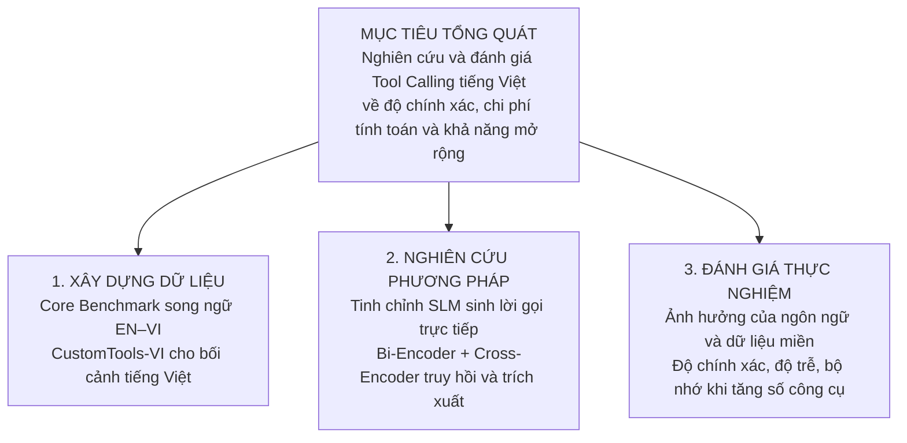
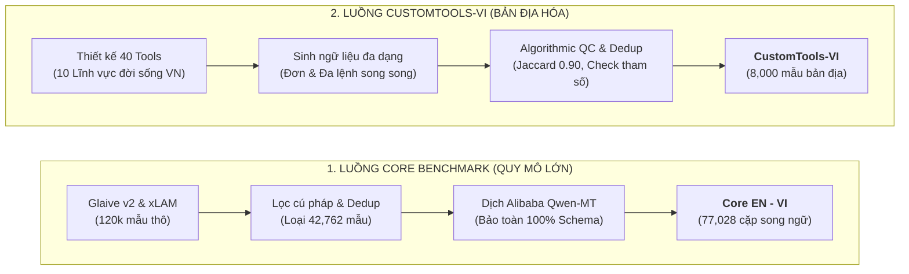
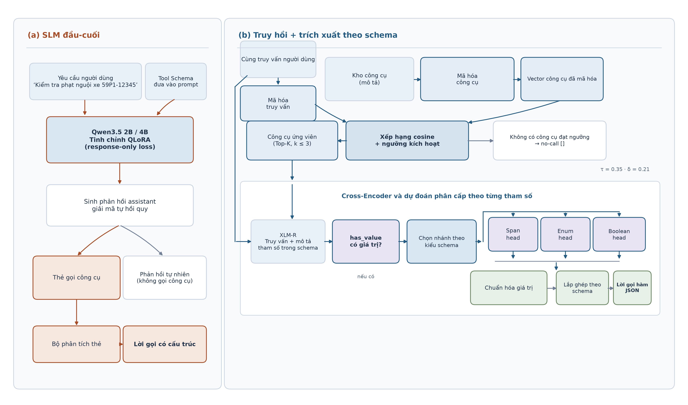
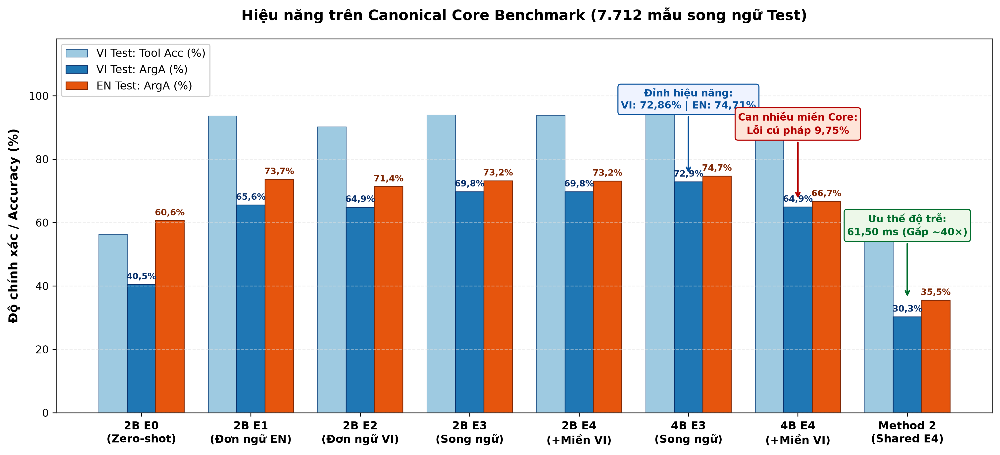
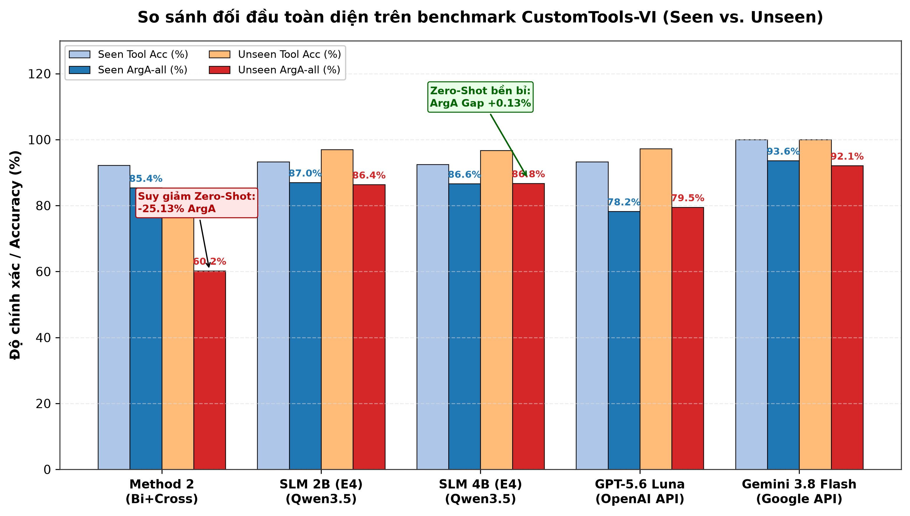
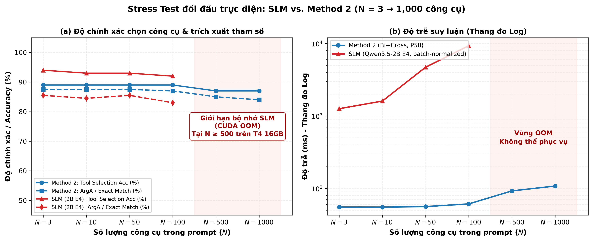
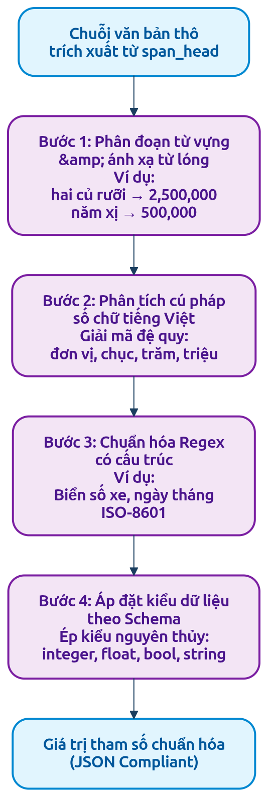

# BỘ SLIDE THUYẾT TRÌNH BẢO VỆ KHÓA LUẬN TỐT NGHIỆP (PHIÊN BẢN HIGH-LEVEL)
> **Định dạng**: Markdown / Marp / Slidev / AI Slide Generator  
> **Phong cách**: High-level, trực quan hóa tối đa (Ưu tiên Sơ đồ Pipeline, Biểu đồ Thực nghiệm, Thẻ chỉ số Metric Cards; Không dùng văn bản dài)  
> **Cấu trúc**: Chuẩn hóa theo phong cách hướng dẫn KLTN của TS. Đặng Văn Thìn (8 Phần chính + Phụ lục Backup Slides chuyên sâu)

---

## BẢNG THÔNG TIN ĐỀ TÀI & HỘI ĐỒNG
- **Tên đề tài**: **Nghiên cứu phương pháp Tool Calling dựa trên truy hồi ngữ nghĩa và trích xuất tham số theo Tool Schema**
- **Đơn vị đào tạo**: Khoa Khoa học Máy tính — Trường Đại học Công nghệ Thông tin, ĐHQG-HCM
- **Ngành đào tạo**: Cử nhân ngành Trí tuệ Nhân tạo
- **Giảng viên hướng dẫn**: TS. Đặng Văn Thìn
- **Sinh viên thực hiện**:
  - Đào Phước Thịnh (MSSV: 25210038)
  - Hà Quang Đạt (MSSV: 25210008)

---

<!-- slide -->
### SLIDE 1: TRANG TIÊU ĐỀ (GIỚI THIỆU ĐỀ TÀI)
* **Thời lượng dự kiến**: 00:00 – 00:40 (40 giây)
* **Người trình bày**: Đào Phước Thịnh

#### 1. Bố cục trực quan (Visual Layout)
- **Giao diện**: Nền Academic Blue (`#00529C`) & Dark Navy (`#0F172A`) tương phản trang trọng.
- **Góc trên**: Logo Trường ĐH Công nghệ Thông tin (UIT) và Biểu trưng Khoa Khoa học Máy tính.
- **Khối trung tâm**:
  - **Tiêu đề tiếng Việt**: **NGHIÊN CỨU PHƯƠNG PHÁP TOOL CALLING DỰA TRÊN TRUY HỒI NGỮ NGHĨA VÀ TRÍCH XUẤT THAM SỐ THEO TOOL SCHEMA**
  - **Tiêu đề tiếng Anh**: *Research on Tool Calling using Semantic Retrieval and Schema-aware Parameter Extraction*
- **Khối thông tin tác giả**:
  - GVHD: **TS. Đặng Văn Thìn**
  - Sinh viên thực hiện: **Đào Phước Thịnh** (25210038) — **Hà Quang Đạt** (25210008)
  - Khóa: 2022 – 2026 | Chuyên ngành: Trí tuệ Nhân tạo

#### 2. Nội dung hiển thị trên Slide
```
                 TRƯỜNG ĐẠI HỌC CÔNG NGHỆ THÔNG TIN - ĐHQG-HCM
                          KHOA KHOA HỌC MÁY TÍNH
                                  ***
                         KHÓA LUẬN TỐT NGHIỆP
       NGHIÊN CỨU PHƯƠNG PHÁP TOOL CALLING DỰA TRÊN TRUY HỒI NGỮ NGHĨA
             VÀ TRÍCH XUẤT THAM SỐ THEO TOOL SCHEMA

        GVHD: TS. Đặng Văn Thìn
        SVTH: Đào Phước Thịnh (25210038) - Hà Quang Đạt (25210008)
```

#### 3. Lời thoại thuyết trình (Speaker Notes)
> *"Kính thưa quý Thầy Cô trong Hội đồng chấm Khóa luận tốt nghiệp Khoa Khoa học Máy tính, Trường Đại học Công nghệ Thông tin – ĐHQG-HCM.
> 
> Chúng em là Đào Phước Thịnh và Hà Quang Đạt, sinh viên ngành Trí tuệ Nhân tạo, dưới sự hướng dẫn khoa học của Thầy Tiến sĩ Đặng Văn Thìn. Hôm nay, chúng em xin phép được báo cáo kết quả nghiên cứu của đề tài: **'Nghiên cứu phương pháp Tool Calling dựa trên truy hồi ngữ nghĩa và trích xuất tham số theo Tool Schema'**. Chúng em xin trân trọng kính mời quý Thầy Cô cùng theo dõi."*

---

<!-- slide -->
### SLIDE 2: NỘI DUNG TRÌNH BÀY (MỤC LỤC BÁO CÁO)
* **Thời lượng dự kiến**: 00:40 – 01:05 (25 giây)
* **Người trình bày**: Đào Phước Thịnh

#### 1. Bố cục trực quan (Visual Layout)

- **Tám phần theo thứ tự trình bày**, dùng cùng tên và số mục trên agenda và tiêu đề slide.
- **Khi dựng slide**: Hiển thị số mục và tên phần. Cột phạm vi slide và nội dung dưới đây dùng để đối chiếu khi biên soạn.

#### 2. Nội dung hiển thị trên Slide

| Mục | Phần báo cáo | Slide | Nội dung trọng tâm |
| :---: | :--- | :---: | :--- |
| 1 | Giới thiệu & Động lực | 3 | Tool Calling, bốn thách thức và nhu cầu nghiên cứu |
| 2 | Tình hình nghiên cứu & Mục tiêu đề tài | 4–5 | Khoảng trống nghiên cứu và ba mục tiêu |
| 3 | Dữ liệu đối chuẩn | 6 | Core Benchmark và CustomTools-VI |
| 4 | Phương pháp nghiên cứu | 7–9 | Hình 1 tổng quan, cách huấn luyện SLM và ví dụ truy hồi–trích xuất |
| 5 | Thiết kế & Kết quả thực nghiệm | 10–14 | E0–E4, độ đo, kết quả đối chuẩn, stress test và tài nguyên |
| 6 | Chương trình minh họa | 15 | Tạo nhiều lời gọi và trường hợp không gọi công cụ |
| 7 | Kết luận & Hướng phát triển | 16–17 | Kết quả, giới hạn, hướng tiếp theo và bản thảo bài báo |
| 8 | Tài liệu tham khảo | 18 | Các công trình liên quan |

*Slide 1–2 là phần mở đầu; slide 19 là lời cảm ơn và hỏi đáp. Các slide backup thuộc phụ lục.*

#### 3. Lời thoại thuyết trình (Speaker Notes)
> *"Bài trình bày bắt đầu từ bài toán và mục tiêu nghiên cứu, sau đó giới thiệu dữ liệu đối chuẩn cùng hai hướng tiếp cận. Tiếp theo, chúng em trình bày kết quả đánh giá, minh họa đầu ra của hệ thống và kết thúc bằng các kết luận, hướng phát triển cùng tài liệu tham khảo."*

---

<!-- slide -->
### SLIDE 3: 1. GIỚI THIỆU & ĐỘNG LỰC — BỐN THÁCH THỨC CỦA TOOL CALLING
* **Thời lượng dự kiến**: 01:05 – 02:00 (55 giây)
* **Người trình bày**: Đào Phước Thịnh

#### 1. Bố cục trực quan (Visual Layout)
- **Phần trên**: Một dòng giới thiệu Tool Calling và ví dụ ngắn minh họa việc chuyển yêu cầu tự nhiên thành lời gọi công cụ.
- **Phần giữa**: Bốn ô thách thức bố trí 2 × 2; mỗi ô gồm tiêu đề và một câu giải thích.
- **Chân slide**: Một câu nêu nhu cầu nghiên cứu Tool Calling hiệu quả và có cơ sở đánh giá cho tiếng Việt.

#### 2. Nội dung hiển thị trên Slide
**Tool Calling:** Chuyển yêu cầu bằng ngôn ngữ tự nhiên thành lời gọi công cụ với các tham số phù hợp.

**Ví dụ:** “Tra cứu giá vàng SJC hôm nay” → chọn công cụ tra cứu giá vàng và điền tham số thương hiệu, ngày tra cứu.

| Chi phí và độ trễ cao | Tool Selection khó khi quy mô tăng |
| :--- | :--- |
| LLM lớn sinh tự hồi quy có thể tốn nhiều tài nguyên và kéo dài thời gian phản hồi. | Danh mục lớn làm việc chọn đúng công cụ khó hơn, đồng thời tăng lượng Tool Schema trong context. |

| Argument Extraction chưa ổn định | Thiếu dữ liệu và benchmark tiếng Việt |
| :--- | :--- |
| Sai hoặc thiếu tham số, giá trị không phù hợp schema có thể khiến lời gọi không hợp lệ. | Nguồn dữ liệu đối chuẩn còn hạn chế, gây khó khăn cho huấn luyện và so sánh thống nhất. |

**Động lực nghiên cứu:** Nhu cầu xây dựng hệ thống Tool Calling chính xác, tiết kiệm tài nguyên và được đánh giá phù hợp với tiếng Việt.

#### 3. Lời thoại thuyết trình (Speaker Notes)
> *"Tool Calling cho phép trợ lý chuyển từ trả lời văn bản sang chuẩn bị lời gọi cho một công cụ phù hợp. Chẳng hạn, câu hỏi 'UIT là viết tắt của gì?' có thể được trả lời trực tiếp. Với yêu cầu 'Tra cứu giá vàng SJC hôm nay', hệ thống cần chọn công cụ tra cứu và điền đúng tham số thương hiệu theo schema.
>
> Khi triển khai Tool Calling, chúng em nhận diện bốn thách thức. LLM lớn sinh tự hồi quy nên có thể phát sinh chi phí suy luận cao và độ trễ đáng kể. Khi danh mục công cụ mở rộng, việc chọn đúng công cụ khó hơn, trong khi nhiều Tool Schema làm tăng lượng thông tin cần xử lý trong context. Sau bước lựa chọn, mô hình vẫn có thể trích xuất thiếu hoặc sai tham số, khiến lời gọi không phù hợp với schema. Bên cạnh đó, dữ liệu và benchmark Tool Calling tiếng Việt còn hạn chế, nên việc huấn luyện và so sánh các phương pháp chưa có nhiều cơ sở thống nhất.
>
> Những thách thức này đặt ra nhu cầu nghiên cứu Tool Calling vừa chính xác, vừa tiết kiệm tài nguyên, đồng thời có cơ sở đánh giá phù hợp với tiếng Việt. Đó là động lực của khóa luận. Tiếp theo, chúng em trình bày các nghiên cứu liên quan và xác định mục tiêu cụ thể của đề tài."*

---

<!-- slide -->
### SLIDE 4: 2.1. NGHIÊN CỨU LIÊN QUAN
* **Thời lượng dự kiến**: 02:00 – 02:45 (45 giây)
* **Người trình bày**: Đào Phước Thịnh

#### 1. Bố cục trực quan (Visual Layout)

- **Bảng ba cột**: Đối chiếu hướng nghiên cứu, nguồn dữ liệu và phạm vi đánh giá. Mỗi ô dùng câu ngắn, giải thích rõ đóng góp của công trình.
- **Chân slide**: Nêu câu hỏi nghiên cứu xuất phát từ phần khảo sát.
- **Thanh điều hướng**: “2. Tình hình nghiên cứu & Mục tiêu đề tài”; tiêu đề lớn: “Nghiên cứu liên quan”.

#### 2. Nội dung hiển thị trên Slide

| Tiêu chí | Ngoài nước | Bối cảnh tiếng Việt |
| :--- | :--- | :--- |
| **Hướng nghiên cứu** | Toolformer, Gorilla, xLAM [1–3] nghiên cứu cách mô hình ngôn ngữ lựa chọn và gọi công cụ. | Các mô hình như PhoBERT [8] hỗ trợ hiểu văn bản tiếng Việt; khả năng chọn công cụ và điền tham số cần được đánh giá riêng. |
| **Dữ liệu và benchmark** | Glaive, xLAM cung cấp dữ liệu Tool Calling; BFCL cung cấp bộ đối chuẩn đánh giá. | Benchmark của phamhai [9] gồm **2.899 truy vấn, 159 hàm**, đánh giá chọn công cụ và độ khớp lời gọi. |
| **Phạm vi đã khảo sát** | Ersoy và cộng sự [4] chuyển ngữ dữ liệu để tinh chỉnh SLM cho tiếng Ả Rập, gợi mở hướng nghiên cứu ngoài tiếng Anh. | Benchmark [9] chưa báo cáo so sánh hai cách xử lý: sinh lời gọi trực tiếp và truy hồi rồi trích xuất; chưa thử với hàng nghìn công cụ. |

**Câu hỏi đặt ra:** Dữ liệu huấn luyện và cách tổ chức mô hình ảnh hưởng thế nào đến chất lượng và chi phí Tool Calling tiếng Việt khi số công cụ tăng?

#### 3. Lời thoại thuyết trình (Speaker Notes)

> *"Các công trình Toolformer, Gorilla và xLAM nghiên cứu khả năng sử dụng công cụ của mô hình ngôn ngữ. Ersoy và cộng sự mở rộng hướng tinh chỉnh SLM sang tiếng Ả Rập bằng dữ liệu chuyển ngữ.
>
> Với tiếng Việt, benchmark của phamhai cung cấp 2.899 truy vấn trên 159 hàm để đánh giá tên công cụ và toàn bộ lời gọi. Tuy nhiên, theo khảo sát trong khóa luận, nguồn này chưa so sánh cách sinh lời gọi trực tiếp với cách truy hồi công cụ rồi trích xuất tham số, cũng chưa thử với hàng nghìn công cụ. Vì vậy, chúng em muốn tìm hiểu dữ liệu huấn luyện và cách tổ chức mô hình ảnh hưởng thế nào đến độ chính xác, độ trễ và khả năng mở rộng. Slide tiếp theo cụ thể hóa câu hỏi này thành các mục tiêu của đề tài."*

---

<!-- slide -->
### SLIDE 5: 2.2. MỤC TIÊU NGHIÊN CỨU
* **Thời lượng dự kiến**: 02:45 – 03:20 (35 giây)
* **Người trình bày**: Đào Phước Thịnh

#### 1. Bố cục trực quan (Visual Layout)

- **Khối trên cùng**: Mục tiêu tổng quát, nối xuống ba khối ngang về dữ liệu, phương pháp và đánh giá.
- **Mỗi khối mục tiêu cụ thể**: Một tiêu đề hành động và hai dòng mô tả nội dung cần đạt. Dùng chữ và đường nối, không dùng icon.
- **Thanh điều hướng**: “2. Tình hình nghiên cứu & Mục tiêu đề tài”; tiêu đề lớn: “Mục tiêu nghiên cứu”.

#### 2. Nội dung hiển thị trên Slide



#### 3. Lời thoại thuyết trình (Speaker Notes)

> *"Mục tiêu chung của khóa luận là nghiên cứu và đánh giá Tool Calling tiếng Việt trên cả độ chính xác, chi phí tính toán và khả năng mở rộng. Chúng em cụ thể hóa thành ba mục tiêu: xây dựng dữ liệu song ngữ và dữ liệu tiếng Việt; nghiên cứu SLM sinh lời gọi trực tiếp cùng kiến trúc truy hồi rồi trích xuất; và đánh giá ảnh hưởng của ngôn ngữ huấn luyện, dữ liệu miền cũng như số lượng công cụ. Ba mục tiêu này lần lượt tương ứng với phần dữ liệu, phương pháp và thực nghiệm của bài trình bày. Trước hết, chúng em giới thiệu hai bộ dữ liệu."*

---

<!-- slide -->
### SLIDE 6: 3. DỮ LIỆU ĐỐI CHUẨN — QUY TRÌNH XÂY DỰNG & THỐNG KÊ
* **Thời lượng dự kiến**: 03:20 – 04:20 (60 giây)
* **Người trình bày**: Đào Phước Thịnh

#### 1. Bố cục trực quan (Visual Layout)
- **Sơ đồ hai luồng xây dựng dữ liệu**:
  - *Luồng 1*: Canonical Core Benchmark (Quy mô lớn — Kế thừa quốc tế, lọc sạch Dedup, dịch máy bảo toàn).
  - *Luồng 2*: CustomTools-VI (Bản địa hóa — 10 Lĩnh vực, sinh ngữ liệu, Algorithmic QC & rà soát thủ công).
- **Bảng số liệu chuẩn 3 tập**: Huấn luyện (Train), Phát triển (Val), Kiểm thử (Test).
- **Hai điểm nhấn**: Quy mô song ngữ của Core và cách đánh giá tình huống bản địa trong CustomTools-VI.

#### 2. Nội dung hiển thị trên Slide


| Bộ dữ liệu | Phân chia tập | Tổng mẫu | Mẫu dương (FC) | Mẫu âm (Non-FC) | Tỷ lệ Mẫu âm | Số Unique APIs |
| :--- | :---: | :---: | :---: | :---: | :---: | :---: |
| **Core Benchmark**<br>*(Song ngữ 77k cặp)* | **Train** | 61,615 (×2) | 57,766 | 3,849 | 6,25% | **4,421**<br>*(Kế thừa Glaive & xLAM)* |
| | Val | 7,701 (×2) | 7,224 | 477 | 6,19% | |
| | **Test** | **7,712 (×2)** | **7,221** | **491** | **6,37%** | |
| **CustomTools-VI**<br>*(Bản địa hóa 10 lĩnh vực)* | **Train** | 5,600 | 3,600 | **2,000** | **35,71%** | **40**<br>*(20 Seen / 20 Unseen)* |
| | Val | 800 | 400 | 400 | 50,00% | |
| | **Test** | **1,600** | **800** | **800** | **50,00%** | |

- 🌐 **Core Benchmark (77k cặp song ngữ — 4,421 APIs)**: Không gian API đồ sộ; tỷ lệ mẫu âm tự nhiên thấp (~6,25% train / 6,37% test), tập trung đo lường độ chính xác trích xuất đa lệnh gọi.
- 🇻🇳 **CustomTools-VI (8,000 mẫu bản địa — 40 Tools)**: Chuẩn hóa 10 lĩnh vực đời sống Việt Nam; *chủ động thiết lập tỷ lệ mẫu âm cao (**35,71% ở Train** để dạy mô hình học ranh giới từ chối; **cố định 50,00% ở Test**)* nhằm tạo chốt chặn kiểm thử độ bền chống thiên kiến kích hoạt bừa bãi (*over-triggering*).

#### 3. Lời thoại thuyết trình (Speaker Notes)
> *(Thịnh)*: *"Để đánh giá hai hướng tiếp cận trên cùng cơ sở, chúng em sử dụng hai bộ dữ liệu có vai trò bổ sung cho nhau:
> 
> Thứ nhất, Core Benchmark gồm 77.028 cặp mẫu song ngữ kế thừa từ Glaive và xLAM, phủ 4.421 công cụ. Do kế thừa tự nhiên, tập Core có tỷ lệ mẫu âm khá thấp (chỉ ~6,25% ở train và 6,37% ở test), tập trung đo năng lực trích xuất trên không gian API đồ sộ.
> 
> Thứ hai, CustomTools-VI gồm 8.000 mẫu bản địa thuộc 10 lĩnh vực thực tế tại Việt Nam. Điểm mấu chốt trong thiết kế là chúng em chủ động đưa tỷ lệ mẫu âm lên tới 35,71% ở tập huấn luyện (2.000 mẫu) và cố định đúng 50% ở tập kiểm thử (gồm các câu đàm thoại đời thường). Thiết kế này vừa giúp mô hình học được ranh giới khi nào không được gọi công cụ, vừa tạo ra bài kiểm tra độ bền thực tế chống kích hoạt bừa bãi. Từ nền tảng dữ liệu này, chúng em xin đi vào chi tiết kiến trúc hai phương pháp."*

---

<!-- slide -->
### SLIDE 7: 4. PHƯƠNG PHÁP NGHIÊN CỨU — TỔNG QUAN HAI HƯỚNG TIẾP CẬN
* **Thời lượng dự kiến**: 04:20 – 05:20 (60 giây)
* **Người trình bày**: Đào Phước Thịnh $\to$ Chuyển giao cho Hà Quang Đạt

#### 1. Bố cục trực quan (Visual Layout)

- **Hình 1 là hình chính**, chiếm phần lớn diện tích slide; giữ hai nhánh màu cam và xanh để phân biệt phương pháp.
- **Trình bày theo ba bước**: đầu vào chung, nhánh SLM bên trái, nhánh truy hồi và trích xuất bên phải. Có thể làm nổi từng nhánh khi thuyết trình.
- **Mức giải thích**: Nhấn vào cách chọn công cụ và tạo tham số; các đầu dự đoán nhỏ trong hình sẽ được giải thích ở slide phương pháp và phụ lục.
- **Khi dựng slide**: Ưu tiên bản PDF vector tại `paper/figures/fig1_system_architecture.pdf` nếu phần mềm hỗ trợ để giữ chữ rõ khi phóng lớn.

#### 2. Nội dung hiển thị trên Slide



**SLM:** sinh văn bản lời gọi, rồi phân tích thành đầu ra có cấu trúc. **Bi-Encoder + Cross-Encoder:** chọn công cụ, trích xuất tham số và lắp ghép đầu ra.

#### 3. Lời thoại thuyết trình (Speaker Notes)
> *"Trên cơ sở dữ liệu vừa trình bày, đề tài khảo sát hai cách xử lý cùng một đầu vào. Ở nhánh trái, SLM nhận câu hỏi cùng danh mục công cụ, sinh phản hồi dạng thẻ, rồi bộ phân tích chuyển lời gọi thành cấu trúc dữ liệu. Ở nhánh phải, Bi-Encoder chọn tối đa ba công cụ phù hợp; Cross-Encoder trích xuất tham số, sau đó bộ chuẩn hóa và lắp ghép tạo đầu ra.
>
> Hai hướng này được đánh giá về lựa chọn công cụ, tham số, độ trễ và tài nguyên. Sau phần tổng quan, bạn Hà Quang Đạt sẽ minh họa cách huấn luyện SLM và cách kiến trúc phân tách xử lý một truy vấn."*

---

<!-- slide -->
### SLIDE 8: 4. PHƯƠNG PHÁP NGHIÊN CỨU — HUẤN LUYỆN SLM ĐẦU-CUỐI
* **Thời lượng dự kiến**: 05:20 – 06:10 (50 giây)
* **Người trình bày**: Hà Quang Đạt

#### 1. Bố cục trực quan (Visual Layout)

- **Dòng trên**: Qwen3.5 2B / 4B, tinh chỉnh bằng QLoRA 4-bit.
- **Hai khối đặt cạnh nhau**: Prompt nền xám, phản hồi mục tiêu nền cam nhạt; dùng nhãn chữ để phân biệt phần không tính loss và phần tính loss.
- **Dải dưới**: Ví dụ mẫu không gọi công cụ và ghi chú về bước phân tích đầu ra khi suy luận.

#### 2. Nội dung hiển thị trên Slide

**Mô hình:** Qwen3.5 2B / 4B — tinh chỉnh QLoRA 4-bit.

*Mẫu huấn luyện minh họa; phần mô tả công cụ được rút gọn để trình bày.*

| Prompt — không tính loss trực tiếp | Phản hồi assistant — tính loss |
| :--- | :--- |
| **System:** Hướng dẫn định dạng và danh mục công cụ.<br/>**Schema minh họa:** `chuyen_khoan_vietqr(so_tai_khoan: string, ngan_hang: enum, so_tien: number)`.<br/>**User:** “Chuyển hai củ rưỡi cho STK 0987654321 MBBank.” | Văn bản lời gọi theo định dạng huấn luyện, minh họa bên dưới. |

```text
<tool_call>
<function=chuyen_khoan_vietqr>
<parameter=so_tai_khoan>0987654321</parameter>
<parameter=ngan_hang>MBBank</parameter>
<parameter=so_tien>2500000</parameter>
</function>
</tool_call>
```

**Response-only Loss:** Chỉ tính lỗi trên phản hồi assistant; prompt vẫn là ngữ cảnh đầu vào.

**Mẫu không gọi công cụ:** “Xin chào!” → “Chào bạn, tôi có thể hỗ trợ gì?” — phản hồi này cũng được tính loss.

**Khi suy luận:** Văn bản chứa thẻ lời gọi → bộ phân tích → tên công cụ và tham số có cấu trúc.

#### 3. Lời thoại thuyết trình (Speaker Notes)

> *"Ở phương pháp thứ nhất, chúng em tinh chỉnh Qwen3.5 bằng QLoRA. Ví dụ này minh họa cách tạo một mẫu huấn luyện: đầu vào chứa hướng dẫn, danh mục công cụ và câu hỏi; phản hồi mục tiêu chứa lời gọi cùng các tham số.
>
> Với Response-only Loss, chỉ các token trong phản hồi assistant được dùng để tính lỗi. Prompt vẫn được mô hình đọc làm ngữ cảnh, nhưng không được chấm như đầu ra cần dự đoán. Các mẫu chào hỏi có phản hồi tự nhiên và cũng được huấn luyện theo cách này. Khi suy luận, mô hình sinh văn bản theo định dạng thẻ; bộ phân tích chuyển văn bản đó thành lời gọi có cấu trúc. Tiếp theo, chúng em dùng cùng yêu cầu chuyển tiền để minh họa cách xử lý của phương pháp phân tách."*

---

<!-- slide -->
### SLIDE 9: 4. PHƯƠNG PHÁP NGHIÊN CỨU — MINH HỌA TRUY HỒI VÀ TRÍCH XUẤT
* **Thời lượng dự kiến**: 06:10 – 07:10 (60 giây)
* **Người trình bày**: Hà Quang Đạt

#### 1. Bố cục trực quan (Visual Layout)

- **Phần chính**: Sơ đồ khối đi từ truy vấn và danh mục công cụ qua Bi-Encoder, rồi phóng lớn Cross-Encoder thành các nhánh dự đoán theo kiểu tham số.
- **Màu sắc**: Dùng một màu cho đầu vào, một màu cho các đầu dự đoán và một màu cho hậu xử lý; khi dựng slide có thể vẽ lại sơ đồ bằng draw.io để chủ động căn chỉnh khối và mũi tên.
- **Chân slide**: Hiển thị lời gọi JSON của ví dụ. Sơ đồ mô tả cơ chế; ngưỡng và chi tiết huấn luyện được trình bày ở slide backup.

#### 2. Nội dung hiển thị trên Slide

**Truy vấn:** “Chuyển hai củ rưỡi cho STK 0987654321 MBBank.”

```mermaid
flowchart LR
    Q["Truy vấn người dùng<br/>Chuyển hai củ rưỡi cho STK 0987654321 MBBank"]
    TOOLS["Danh mục công cụ<br/>Tên và mô tả công cụ"]
    RETRIEVER["Bi-Encoder BGE-M3<br/>Truy hồi công cụ phù hợp"]
    SELECTED["Công cụ ứng viên<br/>chuyen_khoan_vietqr"]

    subgraph CROSS["Cross-Encoder XLM-R: trích xuất theo từng tham số"]
        direction LR
        PAIR["Truy vấn + mô tả tham số<br/>được mã hóa cùng nhau"]
        PRESENT{"has_value<br/>Có giá trị?"}
        ROUTE{"Định tuyến theo<br/>kiểu trong schema"}
        SPAN["Span Head<br/>Trích đoạn văn bản"]
        ENUM["Enum Head<br/>Chọn giá trị trong danh mục"]
        BOOL["Boolean Head<br/>Dự đoán đúng hoặc sai"]
        PAIR --> PRESENT
        PRESENT -->|"Có"| ROUTE
        ROUTE -->|"string / number"| SPAN
        ROUTE -->|"enum"| ENUM
        ROUTE -->|"boolean"| BOOL
    end

    NORMALIZE["Value Normalizer<br/>Chuẩn hóa theo schema"]
    ASSEMBLE["Lắp ghép lời gọi JSON"]
    RESULT["chuyen_khoan_vietqr<br/>so_tai_khoan: 0987654321<br/>ngan_hang: MBBank<br/>so_tien: 2500000"]

    Q --> RETRIEVER
    TOOLS --> RETRIEVER
    RETRIEVER --> SELECTED
    Q --> PAIR
    SELECTED --> PAIR
    SPAN --> NORMALIZE
    ENUM --> NORMALIZE
    BOOL --> NORMALIZE
    NORMALIZE --> ASSEMBLE --> RESULT

    classDef input fill:#fff,stroke:#444,stroke-width:1.5px;
    classDef retrieval fill:#fff4df,stroke:#bd7b16,stroke-width:1.5px;
    classDef extraction fill:#eaf2ff,stroke:#4b78a8,stroke-width:1.5px;
    classDef output fill:#f1f8e9,stroke:#6b8e23,stroke-width:1.5px;
    class Q,TOOLS input;
    class RETRIEVER,SELECTED retrieval;
    class PAIR,PRESENT,ROUTE,SPAN,ENUM,BOOL extraction;
    class NORMALIZE,ASSEMBLE,RESULT output;
```



Mỗi tham số đi qua `has_value`; nếu có giá trị, mô hình chọn đầu dự đoán theo kiểu schema. Trong ví dụ, `so_tai_khoan` và `so_tien` đi qua Span Head, còn `ngan_hang` đi qua Enum Head. Bộ chuẩn hóa chuyển “hai củ rưỡi” thành `2500000`.

```json
{"name": "chuyen_khoan_vietqr", "arguments": {"so_tai_khoan": "0987654321", "ngan_hang": "MBBank", "so_tien": 2500000}}
```

Nếu không có công cụ đạt ngưỡng, đầu ra là danh sách lời gọi rỗng `[]`. Ví dụ chỉ minh họa tạo lời gọi, không thực hiện chuyển tiền.

#### 3. Lời thoại thuyết trình (Speaker Notes)

> *"Với cùng câu hỏi, Bi-Encoder so khớp ngữ nghĩa để chọn công cụ chuyển khoản. Cơ chế ngưỡng cho phép không chọn công cụ nào, hoặc giữ tối đa ba công cụ khi truy vấn cần nhiều tác vụ.
>
> Sau đó, Cross-Encoder xử lý từng tham số dựa trên câu hỏi và mô tả tham số trong schema. Đầu `has_value` xác định tham số có xuất hiện hay không; nếu có, mô hình định tuyến sang đầu dự đoán phù hợp. Số tài khoản và số tiền được trích xuất dưới dạng span, còn ngân hàng được chọn từ các giá trị enum hợp lệ. Bộ chuẩn hóa chuyển 'hai củ rưỡi' thành 2.500.000.
>
> Các giá trị sau đó được chuẩn hóa và lắp ghép thành lời gọi JSON. Nếu không có công cụ đạt ngưỡng, hệ thống trả danh sách lời gọi rỗng. Slide trước đã trình bày SLM sinh lời gọi trực tiếp; ở đây chúng em làm rõ cách kiến trúc phân tách tìm công cụ rồi trích xuất tham số."*

---

<!-- slide -->
### SLIDE 10: 5. THIẾT KẾ & KẾT QUẢ THỰC NGHIỆM — THIẾT KẾ KIỂM SOÁT (E0 → E4) & HỆ THỐNG ĐỘ ĐO
* **Thời lượng dự kiến**: 07:10 – 08:00 (50 giây)
* **Người trình bày**: Hà Quang Đạt

#### 1. Bố cục trực quan (Visual Layout)

- **Cột trái (khoảng 60%)**: Ba độ đo chính, mỗi độ đo có một công thức ngắn và một dòng diễn giải.
- **Cột phải (khoảng 40%)**: Năm cấu hình E0–E4, mỗi cấu hình một dòng.
- **Chân slide**: Độ trễ và VRAM là các chỉ số tài nguyên bổ sung. Quy tắc chấm chi tiết đặt ở Backup 7.

#### 2. Nội dung hiển thị trên Slide

**Ba độ đo chính** — quy đổi sang phần trăm khi báo cáo:

$$\mathrm{ToolAcc}=\frac{N_{\mathrm{tool\text{-}exact,+}}}{N_+}$$

Chọn đúng các công cụ trên những mẫu **cần gọi công cụ**; chưa xét tham số.

$$\mathrm{ArgA}_{\mathrm{all}}=\frac{N_{\mathrm{exact,all}}}{N_{\mathrm{all}}}$$

Khớp toàn bộ lời gọi và tham số trên **tất cả mẫu**, kể cả mẫu không gọi công cụ đúng.

$$\mathrm{NonFCRecall}=\frac{N_{\mathrm{TN}}}{N_-}$$

Không gọi công cụ đúng trên những mẫu **không cần gọi công cụ**.

**Cấu hình SLM**:

| Cấu hình | Dữ liệu & quy mô huấn luyện | Mục đích khảo sát |
| :---: | :--- | :--- |
| **E0** | Gốc chưa tinh chỉnh (Zero-shot) | Năng lực nền tảng ban đầu |
| **E1** | Đơn ngữ EN (60k mẫu Core) | Đánh giá chuyển giao tri thức EN $\to$ VI |
| **E2** | Đơn ngữ VI (60k mẫu Core dịch máy) | Năng lực học trên dữ liệu chuyển ngữ |
| **E3** | Song ngữ cân bằng (30k EN + 30k VI) | Đánh giá hiệu ứng hiệp đồng song ngữ |
| **E4** | Song ngữ + Miền VI (60k Core + 5,6k CustomTools-VI) | Tác động của dữ liệu miền bản địa & mẫu âm |

**Tài nguyên:** độ trễ (ms; mean hoặc P50/P95 theo giao thức) và VRAM (GiB).

#### 3. Lời thoại thuyết trình (Speaker Notes)

> *"Chúng em dùng ba độ đo với ba phạm vi tính khác nhau. Tool Acc chỉ xét các mẫu cần gọi công cụ và kiểm tra tên công cụ. ArgA yêu cầu toàn bộ lời gọi, gồm tên và tham số, khớp nhãn tham chiếu; chỉ số này tính trên toàn bộ tập nên cũng ghi nhận các mẫu không gọi công cụ đúng. Non-FC Recall chỉ xét mẫu không cần gọi công cụ để đo khả năng tránh kích hoạt nhầm.
>
> Bên cạnh độ chính xác, chúng em ghi nhận độ trễ và bộ nhớ GPU. Với SLM, chúng em thiết kế 5 mốc thực nghiệm kiểm soát: E0 là mốc zero-shot ban đầu; E1 dùng 60 nghìn mẫu tiếng Anh để đo khả năng chuyển giao sang tiếng Việt; E2 dùng 60 nghìn mẫu dịch tiếng Việt; E3 kết hợp song ngữ cân bằng 30 nghìn Anh và 30 nghìn Việt; còn E4 bổ sung 5.600 mẫu dữ liệu miền tiếng Việt có mẫu âm. Việc định nghĩa rõ các mốc này giúp cô lập biến số ngôn ngữ ở các bảng kết quả tiếp theo."*

---

<!-- slide -->
### SLIDE 11: 5. THIẾT KẾ & KẾT QUẢ THỰC NGHIỆM — KẾT QUẢ TRÊN CORE BENCHMARK (7,712 MẪU TEST)
* **Thời lượng dự kiến**: 08:00 – 09:00 (60 giây)
* **Người trình bày**: Hà Quang Đạt

#### 1. Bố cục trực quan (Visual Layout)
- **Hình ảnh biểu đồ cột**: Nhúng biểu đồ đối chiếu hiệu năng đa cấu hình trên Core Benchmark (`paper/figures/fig_slide11_core_benchmark.png`) làm nổi bật trực quan xu hướng và các đỉnh/đáy hiệu năng.
- **Bảng số liệu chi tiết**: Đối chiếu 5 cấu hình SLM (2B/4B) và Method 2 trên 7.712 mẫu Core Benchmark song ngữ.
- **2 Thẻ Callout Học thuật**: Phân tích hiện tượng chuyển giao đa ngữ E1/E2 và sự đánh đổi giữa độ chính xác đỉnh với độ trễ.

#### 2. Nội dung hiển thị trên Slide


| Mô hình | Cấu hình | VI: Tool Acc | VI: ArgA | VI: Non-FC | EN: Tool Acc | EN: ArgA | Độ trễ (ms) |
| :--- | :---: | :---: | :---: | :---: | :---: | :---: | :---: |
| **Qwen3.5-2B** | **E0** | 56,34% | 40,48% | 96,33% | 85,18% | 60,63% | 707 ms |
| **Qwen3.5-2B** | **E1** | 93,67% | **65,57%** | 94,30% | 94,07% | **73,66%** | 878 ms |
| **Qwen3.5-2B** | **E2** | 90,25% | 64,90% | 94,30% | 93,45% | 71,36% | 872 ms |
| **Qwen3.5-2B** | **E3** | 94,00% | **69,76%** | 94,30% | 94,27% | 73,22% | 864 ms |
| **Qwen3.5-2B** | **E4** | 93,92% | 69,75% | 94,30% | 94,17% | 73,15% | 970 ms |
| **Qwen3.5-4B** | **E3** | **98,73%** | **72,86%** | 94,30% | **96,63%** | **74,71%** | 2432 ms |
| **Qwen3.5-4B** | **E4** | 86,22% | 64,94% | 94,30% | 85,03% | 66,66% | 2485 ms |
| **Method 2** | **Shared E4** | 59,20% | 30,26% | 94,09% | 62,60% | 35,52% | **61,50 ms** |

- **E1 và E2 trên tập VI**: E1 huấn luyện bằng tiếng Anh đạt ArgA **65,57%**, cao hơn E2 huấn luyện bằng tiếng Việt (**64,90%**) trong phép thử này. Chênh lệch nhỏ này gợi ý cần xem xét thêm tác động của dữ liệu và biểu diễn đa ngữ, chưa đủ để kết luận nguyên nhân.
- **Tác động của lỗi cú pháp (4B E3 vs. E4)**: Qwen 4B E3 nén lỗi cú pháp xuống kỷ lục **0,32%** giúp ArgA đạt đỉnh **72,86%**. Sang E4, việc bổ sung dữ liệu miền gây can nhiễu phân phối với tập Core khiến lỗi cú pháp tăng lên **9,75%** (ArgA giảm về **64,94%**), dù 4B E4 đạt kết quả cao nhất ở tập miền CustomTools-VI tiếp theo.
- **Đánh đổi giữa độ chính xác và độ trễ**: Qwen 4B E3 đạt ArgA **72,86%** với độ trễ trung bình **2.432 ms**. Method 2 đạt ArgA **30,26%** với độ trễ **61,50 ms** và lỗi cú pháp **0,00%**; hai chỉ số cần được xem cùng nhau.

#### 3. Lời thoại thuyết trình (Speaker Notes)
> *"Trên tập Core Benchmark gồm 7.712 mẫu kiểm thử cho mỗi ngôn ngữ, E1 huấn luyện bằng tiếng Anh đạt ArgA 65,57% trên tập tiếng Việt, nhỉnh hơn E2 huấn luyện bằng tiếng Việt ở mức 64,90%. Chênh lệch này cho thấy dữ liệu huấn luyện cần được xem xét cùng với năng lực sẵn có của mô hình.
>
> Ở quy mô 4B, cấu hình song ngữ E3 nén lỗi cú pháp xuống chỉ 0,32%, đưa ArgA tiếng Việt lên 72,86% và tiếng Anh lên 74,71%. Sang E4, việc bổ sung dữ liệu miền nghiệp vụ gây can nhiễu phân phối với tập Core, đẩy lỗi cú pháp lên 9,75% khiến ArgA trên Core giảm còn 64,94%, dù checkpoint E4 này sẽ thể hiện ưu thế vượt trội trên tập miền ở slide sau.
>
> Về phía Method 2, kiến trúc trích xuất theo schema đảm bảo lỗi cú pháp bằng 0,00% và độ trễ chỉ 61,50 ms, nhanh hơn rất nhiều so với mức 2.432 ms của mô hình 4B. Đây là cơ sở thực nghiệm rõ ràng về sự đánh đổi giữa độ trễ và độ chính xác."*

---

<!-- slide -->
### SLIDE 12: 5. THIẾT KẾ & KẾT QUẢ THỰC NGHIỆM — ĐỐI CHUẨN CUSTOMTOOLS-VI & ĐỐI ĐẦU FRONTIER APIS
* **Thời lượng dự kiến**: 09:00 – 10:00 (60 giây)
* **Người trình bày**: Hà Quang Đạt

#### 1. Bố cục trực quan (Visual Layout)
- **Hình ảnh**: Nhúng biểu đồ so sánh đa phương pháp trên CustomTools-VI (`paper/figures/fig2_performance_comparison.png`).
- **Bảng số liệu đối đầu 1,600 mẫu**: Tách bạch rõ giữa SLM, Method 2 và các Frontier APIs (GPT-5.6 Luna, Gemini 3.8 Flash).

#### 2. Nội dung hiển thị trên Slide


| Phương pháp / Mô hình | Cấu hình dữ liệu | Seen Tools: ArgA | Unseen Tools: ArgA | Non-FC Recall (Mẫu âm) | Lỗi cú pháp JSON |
| :--- | :--- | :---: | :---: | :---: | :---: |
| **Qwen3.5-2B (E1)** | Đơn ngữ EN 60k | 63,12% | 70,50% | 75,25% | 3,25% - 5,75% |
| **Qwen3.5-2B (E2)** | Đơn ngữ VI 60k | 51,50% | 59,62% | 67,50% | 6,25% - 8,12% |
| **Qwen3.5-2B (E3)** | Song ngữ 60k | **19,38%** | **27,88%** | **2,00%** | 3,25% - 5,38% |
| **Qwen3.5-2B (E4)** | Song ngữ + 5.6k Miền VI | **87,00%** | **86,38%** | **100,00%** | 1,50% - 3,38% |
| **Qwen3.5-4B (E3)** | Song ngữ 60k | 62,00% | 69,75% | 71,25% - 74,50% | 10,62% - 13,38% |
| **Qwen3.5-4B (E4)** | Song ngữ + 5.6k Miền VI | **86,62%** | **86,75%** | **100,00%** | 1,62% - 5,38% |
| **Method 2 (Đề xuất)** | Bi-Encoder + Cross-Encoder | **85,38%** | 60,25% | **93,75%** | **0,00%** |
| **GPT-5.6 Luna** | Frontier API (OpenAI) | 78,25% | 79,50% | 100,00% | 0,00% |
| **Gemini 3.8 Flash** | Frontier API (Google) | **93,62%** | **92,12%** | 99,75% - 100,00% | 0,00% - 0,12% |

- **Thiên kiến kích hoạt ở E3 vs. Đột phá ở E4**: Cấu hình E3 thiếu mẫu âm miền khiến 2B rơi vào thiên kiến kích hoạt (Non-FC Recall chỉ **2,00%**). Khi bổ sung 5.600 mẫu dữ liệu miền ở E4, cả **2B E4 (87,00% Seen / 86,38% Unseen)** và **4B E4 (86,62% Seen / 86,75% Unseen)** đều đạt Non-FC Recall tuyệt đối **100,00%**.
- **Đối đầu Frontier API — Vượt trội GPT-5.6 Luna**: Cả 2B E4 và 4B E4 đều vượt qua mô hình đóng **GPT-5.6 Luna** (**+7,12% đến +8,75% ArgA**), chứng minh hiệu quả vượt trội của tinh chỉnh thích ứng miền bản địa so với mô hình thương mại tổng quát.
- **Khoảng cách với Gemini 3.8 Flash**: Dù Gemini 3.8 Flash dẫn đầu (ArgA **> 92%**), SLM cục bộ E4 đã thu hẹp khoảng cách xuống chỉ còn **5% – 6%**, đồng thời mang lại lợi thế tự chủ dữ liệu nội bộ (On-premise) và loại bỏ chi phí token định kỳ.
- **Hiệu năng Method 2**: Đạt **85,38%** trên Seen (vượt GPT-5.6 Luna), nhưng suy giảm trên Unseen (**60,25%**) do giới hạn biểu diễn ngữ nghĩa của các công cụ mới chưa từng xuất hiện.

#### 3. Lời thoại thuyết trình (Speaker Notes)
> *"Trên tập CustomTools-VI gồm 1.600 mẫu nghiệp vụ thực tế, kết quả đem lại hai phát hiện khoa học quan trọng:
>
> Thứ nhất, về vai trò của dữ liệu miền: Cấu hình E3 thiếu mẫu âm khiến mô hình bị kích hoạt quá mức nghiêm trọng. Tuy nhiên, khi bổ sung 5.600 mẫu nghiệp vụ bản địa ở E4, cả bản 2B và 4B đều đạt Non-FC Recall tuyệt đối 100,00% và đưa ArgA bật tăng lên khoảng 86,6% – 87,0% trên cả công cụ đã thấy lẫn chưa thấy.
>
> Thứ hai, khi so sánh đối đầu với các Frontier API: Cả Qwen 2B E4 và 4B E4 đều vượt qua GPT-5.6 Luna của OpenAI từ 7 đến 8 điểm phần trăm ArgA. Điều này chứng minh rằng việc tinh chỉnh thích ứng miền trên dữ liệu bản địa giúp mô hình nhỏ vượt trội hơn một mô hình đóng thương mại khổng lồ chưa tối ưu ngữ cảnh tiếng Việt. Mặc dù Gemini 3.8 Flash vẫn dẫn đầu với hơn 92% ArgA, giải pháp SLM cục bộ đã bám sát với khoảng cách chỉ 5–6%, đồng thời đảm bảo bảo mật dữ liệu tại chỗ và không phát sinh chi phí API.
>
> Về phía Method 2, mô hình đạt 85,38% trên tập Seen, vượt GPT-5.6 Luna, dù độ chính xác trên tập Unseen giảm còn 60,25% do giới hạn biểu diễn của các công cụ mới."*

---

<!-- slide -->
### SLIDE 13: 5. THIẾT KẾ & KẾT QUẢ THỰC NGHIỆM — THỬ NGHIỆM ỨNG SUẤT (STRESS TEST $N = 3 \to 1000$ TOOLS)
* **Thời lượng dự kiến**: 10:00 – 11:00 (60 giây)
* **Người trình bày**: Hà Quang Đạt

#### 1. Bố cục trực quan (Visual Layout)
- **Hình ảnh trung tâm**: Nhúng đồ thị biểu diễn Stress Test đối đầu trực diện (`paper/figures/fig3_stress_test_curves.png`).
- **Trục hoành**: Số lượng Tools tăng dần ($N = 3, 10, 50, 100, 200, 500, 1000$).
- **Trục tung**: Tool Accuracy (%) và Argument Accuracy (%).

#### 2. Nội dung hiển thị trên Slide


- **SLM đầu-cuối (Qwen3.5-2B)**: Khi số công cụ trong prompt tăng, độ chính xác giảm trong các mốc đo; tại **$N \ge 500$**, cấu hình thử nghiệm trên GPU T4 16 GB gặp lỗi CUDA OOM.
- **Kiến trúc phân tách**: Trong dải **$N=3$ đến $N=1000$** đã kiểm thử, Tool Match duy trì trên **87%** và ArgA trên **84%**. Kết quả cho thấy ưu thế về khả năng mở rộng trong điều kiện thử nghiệm này.

#### 3. Lời thoại thuyết trình (Speaker Notes)
> *"Để kiểm tra khả năng mở rộng, chúng em tăng số công cụ gây nhiễu từ 3 lên 1.000 trên cùng GPU T4 16 GB. Với SLM đầu-cuối, danh mục công cụ dài hơn làm prompt tăng kích thước; độ chính xác giảm qua các mốc đo, và cấu hình gặp CUDA OOM từ mốc 500 công cụ.
>
> Với kiến trúc phân tách, Bi-Encoder lọc ứng viên trước khi trích xuất tham số. Trong dải thử nghiệm, Tool Match giữ trên 87% và ArgA trên 84% đến mốc 1.000 công cụ. Kết quả này hỗ trợ nhận định rằng bước truy hồi giúp hệ thống ổn định hơn khi mở rộng danh mục công cụ trong điều kiện đã đo."*

---

<!-- slide -->
### SLIDE 14: 5. THIẾT KẾ & KẾT QUẢ THỰC NGHIỆM — ĐÁNH ĐỔI TÀI NGUYÊN & ĐỘ TRỄ TRIỂN KHAI THỰC TẾ
* **Thời lượng dự kiến**: 11:00 – 11:50 (50 giây)
* **Người trình bày**: Hà Quang Đạt

#### 1. Bố cục trực quan (Visual Layout)
- **Phía trên**: 3 Thẻ Metric Cards lớn: Độ trễ P50 (55 ms) — Tiêu thụ VRAM (3.28 GiB) — Mở rộng ($N=1000$).
- **Phía dưới**: Bảng đối đầu đo đạc thực tế trên phần cứng giới hạn (GPU NVIDIA T4 16GB).

#### 2. Nội dung hiển thị trên Slide
```
        ĐỘ TRỄ P50                    TIÊU THỤ VRAM                  KHẢ NĂNG MỞ RỘNG
      55 - 108 ms                     3,28 GiB tại các mốc đo            N = 1.000
 (Method 2, N = 10–1000)          (Trên GPU T4 16 GB)             (ArgA > 84%)
```

| Cấu hình | Quy mô Tools ($N$) | Latency P50 (ms) | Latency P95 (ms) | VRAM Tiêu thụ | Trạng thái hệ thống trên GPU 16GB |
| :--- | :---: | :---: | :---: | :---: | :---: |
| **Qwen3.5-2B (E4)** | $N = 10$ | 1604 ms | ~2100 ms | ~7,8 GiB | Chậm dần do chuỗi prompt |
| **Qwen3.5-2B (E4)** | $N = 100$ | 9318 ms | ~11200 ms | ~14,8 GiB | Quá tải ngữ cảnh (gần 10s) |
| **Qwen3.5-2B (E4)** | $N \ge 500$ | *OOM* | *OOM* | Vượt bộ nhớ khả dụng | **CUDA OOM** |
| **Method 2 (Đề xuất)** | **$N = 10$** | **55,05 ms** | **84,74 ms** | **3,28 GiB** | Hoạt động |
| **Method 2 (Đề xuất)** | **$N = 100$** | **61,01 ms** | **85,09 ms** | **3,28 GiB** | Hoạt động |
| **Method 2 (Đề xuất)** | **$N = 1000$** | **107,68 ms** | **148,21 ms** | **3,28 GiB** | Hoạt động |

#### 3. Lời thoại thuyết trình (Speaker Notes)
> *"Bảng này bổ sung góc nhìn về tài nguyên cho kết quả ứng suất vừa trình bày. Ở 100 công cụ, SLM 2B có độ trễ P50 9.318 ms và dùng khoảng 14,8 GiB VRAM; từ 500 công cụ, cấu hình trên GPU T4 16 GB không hoàn thành do CUDA OOM.
>
> Phương pháp phân tách hoàn thành đến mốc 1.000 công cụ với P50 tăng từ 55,05 lên 107,68 ms và bộ nhớ đo được khoảng 3,28 GiB. Đây là kết quả trên phần cứng và giao thức thử nghiệm cụ thể; để triển khai thực tế vẫn cần đánh giá thêm tải đồng thời và yêu cầu của ứng dụng."*

---

<!-- slide -->
### SLIDE 15: 6. CHƯƠNG TRÌNH MINH HỌA — DEMO TOOL CALLING
* **Thời lượng dự kiến**: 11:50 – 12:50 (60 giây)
* **Người trình bày**: Đào Phước Thịnh

#### 1. Bố cục trực quan (Visual Layout)
- **Giao diện Demo trực quan**: Khung mô phỏng tương tác thực tế với 2 kịch bản điển hình (Multi-call song song & Từ chối gọi tool an toàn).

#### 2. Nội dung hiển thị trên Slide
```
┌────────────────────────────────────────────────────────────────────────────────────────┐
│ TRỢ LÝ ẢO TOOL CALLING TIẾNG VIỆT (DEMO SYSTEM)                                         │
├────────────────────────────────────────────────────────────────────────────────────────┤
│ [Người dùng]: "Kiểm tra phạt nguội xe 51F-123.45 và xem hôm nay giá vàng SJC bao nhiêu" │
│                                                                                        │
│ [Giai đoạn 1 - BGE-M3 (Retrieval)]:                                                     │
│   Phát hiện 2 Tools kích hoạt song song:                                               │
│    1. tra_cuu_phat_nguoi (Score: 0.82)                                                 │
│    2. tra_cuu_gia_vang   (Score: 0.76) [Cửa sổ động δ=0.21 thỏa mãn]                   │
│                                                                                        │
│ [Giai đoạn 2 - XLM-R (Extraction) & Value Normalizer]:                                  │
│   tra_cuu_phat_nguoi(bien_so="51F-123.45", loai_xe="oto")                             │
│   tra_cuu_gia_vang(thuong_hieu="SJC", ngay="2026-10-05")                              │
│                                                                                        │
│  Thời gian xử lý: 64.2 ms | VRAM: 3.21 GiB | Lỗi cú pháp: 0.00%                       │
├────────────────────────────────────────────────────────────────────────────────────────┤
│ [Kịch bản 2 - Câu chào hỏi thông thường]:                                              │
│  Người dùng: "Xin chào bạn, chúc bạn một ngày làm việc vui vẻ nhé!"                    │
│  Hệ thống: Ngưỡng sàn τ=0.35 kích hoạt → Output: [] (Không gọi tool) → Phản hồi chat    │
└────────────────────────────────────────────────────────────────────────────────────────┘
```

#### 3. Lời thoại thuyết trình (Speaker Notes)
> *"Phần minh họa cho thấy đầu ra của hai khâu xử lý trên một câu hỏi gồm hai yêu cầu: tra cứu phạt nguội và giá vàng SJC. Bi-Encoder chọn hai công cụ liên quan; Cross-Encoder trích xuất biển số, thương hiệu và các tham số cần thiết để tạo hai lời gọi theo schema.
>
> Với câu chào hỏi ở kịch bản thứ hai, điểm phù hợp không vượt ngưỡng nên hệ thống trả về danh sách lời gọi rỗng. Hai ví dụ này minh họa cách hệ thống quyết định khi nào cần công cụ và cách điền tham số; chúng không bao gồm bước thực thi các dịch vụ bên ngoài."*

---

<!-- slide -->
### SLIDE 16: 7. KẾT LUẬN & HƯỚNG PHÁT TRIỂN
* **Thời lượng dự kiến**: 12:50 – 13:40 (50 giây)
* **Người trình bày**: Đào Phước Thịnh

#### 1. Bố cục trực quan (Visual Layout)
- **Bố cục 2 Cột song song**:
  - **Cột Trái**: 3 Kết luận & Đóng góp nổi bật của Khóa luận.
  - **Cột Phải**: 3 Hướng mở rộng nghiên cứu trong tương lai.

#### 2. Nội dung hiển thị trên Slide
- **Kết luận & Đóng góp của Đề tài**:
  - **Dữ liệu đối chuẩn**: Xây dựng Core Benchmark song ngữ và CustomTools-VI cho đánh giá Tool Calling tiếng Việt.
  - **Đối chứng thực nghiệm**: So sánh SLM đầu-cuối, kiến trúc phân tách và các API tham chiếu trên những tập kiểm thử tương ứng.
  - **Đánh đổi hiệu năng**: SLM đạt ArgA cao hơn trên Core; kiến trúc phân tách có độ trễ thấp và duy trì kết quả khi thử đến 1.000 công cụ.

- **Hướng phát triển trong tương lai**:
  -  **Hội thoại đa lượt (Multi-turn)**: Mở rộng bài toán theo dõi trạng thái đối thoại và ghi nhớ ngữ cảnh tham số nhiều vòng.
  -  **Xâu chuỗi công cụ (Tool Chaining)**: Tích hợp vòng lặp suy luận ReAct để xử lý các tác vụ có phụ thuộc dữ liệu tuần tự.
  -  **Tối ưu hóa thiết bị biên (Edge AI)**: Đóng gói với ONNX Runtime / TensorRT để chạy trực tiếp trên chip nhúng và thiết bị IoT.

#### 3. Lời thoại thuyết trình (Speaker Notes)
> *"Tóm lại, khóa luận đóng góp hai bộ dữ liệu đối chuẩn và một phép so sánh giữa hướng sinh đầu-cuối với hướng truy hồi rồi trích xuất. Kết quả cho thấy mỗi hướng có điểm mạnh riêng: SLM đạt độ chính xác cao hơn trên Core, trong khi kiến trúc phân tách có độ trễ thấp hơn và ổn định hơn khi số công cụ gây nhiễu tăng trong dải đã thử nghiệm. Khả năng khái quát sang công cụ chưa thấy vẫn là điểm cần cải thiện của kiến trúc phân tách.
>
> Các hướng tiếp theo gồm xử lý hội thoại đa lượt, xâu chuỗi công cụ có phụ thuộc dữ liệu và tối ưu hệ thống cho các môi trường triển khai khác."*

---

<!-- slide -->
### SLIDE 17: 7. KẾT LUẬN & HƯỚNG PHÁT TRIỂN — BẢN THẢO BÀI BÁO
* **Thời lượng dự kiến**: 13:40 – 14:10 (30 giây)
* **Người trình bày**: Đào Phước Thịnh

#### 1. Bố cục trực quan (Visual Layout)
- **Khung chứng nhận bài báo**: Nổi bật tiêu đề, danh sách tác giả và trạng thái submit bản thảo khoa học quốc tế.

#### 2. Nội dung hiển thị trên Slide
| Thông tin Công bố | Chi tiết Bài báo Khoa học Quốc tế |
| :--- | :--- |
|  **Tiêu đề bài báo** | *"Vietnamese Tool Calling: Comparing End-to-End Small Language Models with a Bi-Encoder–Cross-Encoder Architecture"* |
|  **Nhóm tác giả** | **Đào Phước Thịnh**¹, **Hà Quang Đạt**¹, **TS. Đặng Văn Thìn**¹*<br/>*(¹Khoa Khoa học Máy tính — Trường Đại học Công nghệ Thông tin, ĐHQG-HCM)* |
|  **Trạng thái hiện tại** |  Hoàn thiện 100% bản thảo LaTeX theo chuẩn quốc tế / IEEE.<br/> Đã đồng bộ mã nguồn, benchmark và đang tiến hành submit tới hội thảo quốc tế / tạp chí chuyên ngành uy tín. |

#### 3. Lời thoại thuyết trình (Speaker Notes)
> *"Một điểm tự hào lớn của nhóm là toàn bộ kết quả nghiên cứu trong khóa luận đã được đúc kết thành bài báo khoa học toàn văn bằng tiếng Anh mang tên 'Vietnamese Tool Calling: Comparing End-to-End Small Language Models with a Bi-Encoder–Cross-Encoder Architecture' dưới sự đồng tác giả và hướng dẫn khoa học của Thầy TS. Đặng Văn Thìn. Hiện bài báo đã hoàn thiện và đang trong quá trình nộp tới hội thảo quốc tế chuyên ngành."*

---

<!-- slide -->
### SLIDE 18: 8. TÀI LIỆU THAM KHẢO
* **Thời lượng dự kiến**: 14:10 – 14:30 (20 giây)
* **Người trình bày**: Đào Phước Thịnh

#### 1. Bố cục trực quan (Visual Layout)
- **Danh mục trích dẫn chuẩn IEEE** các công trình kinh điển và trực tiếp liên quan đến đề tài.

#### 2. Nội dung hiển thị trên Slide
- `[1]` Schick et al. (2023). *Toolformer: Language Models Can Teach Themselves to Use Tools*. NeurIPS 2023.
- `[2]` Patil et al. (2023). *Gorilla: Large Language Model Connected with Massive APIs*. arXiv:2305.15334.
- `[3]` Salesforce (2024). *xLAM: A Family of Large Action Models for Tool Calling*. arXiv:2409.03215.
- `[4]` Ersoy et al. (2025). *Tool Calling for Arabic LLMs: Data Strategies and Instruction Tuning*. ArabicNLP 2025.
- `[5]` BAAI (2024). *BGE M3-Embedding: Multi-Lingual, Multi-Functionality Text Embeddings*. arXiv:2402.03216.
- `[6]` Conneau et al. (2020). *Unsupervised Cross-lingual Representation Learning at Scale (XLM-RoBERTa)*. ACL 2020.
- `[7]` Gao et al. (2025). *RAG-MCP: Mitigating Prompt Bloat in LLM Tool Selection via Retrieval*. arXiv:2505.03275.
- `[8]` Nguyen & Nguyen (2020). *PhoBERT: Pre-trained language models for Vietnamese*. Findings of EMNLP 2020.
- `[9]` phamhai. *Vietnamese Function Calling Benchmark*. Hugging Face Datasets, `phamhai/Vietnamese-Function-Calling-Test`. Nguồn được khảo sát trong khóa luận, truy cập ngày 22/09/2026.

#### 3. Lời thoại thuyết trình (Speaker Notes)
> *"Trên đây là các công trình khoa học quốc tế chuẩn mực và tài liệu tham khảo chính mà nhóm đã kế thừa và đối sánh trong suốt quá trình thực hiện khóa luận."*

---

<!-- slide -->
### SLIDE 19: LỜI CẢM ƠN & PHIÊN HỎI ĐÁP (Q&A)
* **Thời lượng dự kiến**: 14:30 – 15:00 (30 giây)
* **Người trình bày**: Đào Phước Thịnh & Hà Quang Đạt

#### 1. Bố cục trực quan (Visual Layout)
- **Giao diện trang trọng**: Lời tri ân sâu sắc gửi tới GVHD và Hội đồng chấm KLTN.
- **Mã QR Code**: Dẫn trực tiếp tới GitHub Repository chứa Source code, Checkpoints và Benchmark Datasets của đề tài.
- **Dòng chữ lớn**: **CHÂN THÀNH CẢM ƠN QUÝ THẦY CÔ VÀ HỘI ĐỒNG ĐÃ LẮNG NGHE!**

#### 2. Nội dung hiển thị trên Slide
```
                    TRƯỜNG ĐẠI HỌC CÔNG NGHỆ THÔNG TIN - ĐHQG-HCM
                             KHOA KHOA HỌC MÁY TÍNH

               CHÂN THÀNH CẢM ƠN QUÝ THẦY CÔ TRONG HỘI ĐỒNG
                         ĐÃ LẮNG NGHE BÀI BÁO CÁO!

        Chúng em xin trân trọng cảm ơn Thầy TS. Đặng Văn Thìn đã luôn
          tận tình hướng dẫn và định hướng học thuật cho chúng em.

              [ QR CODE ] -> GitHub: TristanDao/tool_calling_with_retrieval_extraction
                             (Mã nguồn, Dữ liệu đối chuẩn & Checkpoints)

               CHÚNG EM XIN SẴN SÀNG NHẬN CÂU HỎI VÀ ĐÓNG GÓP Ý KIẾN!
```

#### 3. Lời thoại thuyết trình (Speaker Notes)
> *"Chúng em xin gửi lời cảm ơn sâu sắc nhất đến Thầy TS. Đặng Văn Thìn đã luôn tận tâm định hướng khoa học cho chúng em trong suốt thời gian qua. Chúng em cũng xin chân thành cảm ơn quý Thầy Cô trong Hội đồng đã dành thời gian quý báu lắng nghe bài báo cáo.
> 
> Nhóm chúng em rất mong nhận được những câu hỏi chất vấn và ý kiến đóng góp từ quý Thầy Cô để công trình được hoàn thiện hơn nữa. Chúng em xin trân trọng cảm ơn!"*

---

# PHẦN PHỤ LỤC: BACKUP SLIDES (DÀNH CHO HỘI ĐỒNG HỎI SÂU KỸ THUẬT)

<!-- slide -->
### [BACKUP 1] CHI TIẾT THIẾT KẾ SCHEMA & QUY TRÌNH REVIEW CUSTOMTOOLS-VI
- **10 Nhóm lĩnh vực bản địa đặc thù (40 Unique Tools)**:
  - *Giao thông*: Tra cứu phạt nguội CSGT (`tra_cuu_phat_nguoi`), mật độ giao thông VOV.
  - *Tài chính - Ngân hàng*: Chuyển tiền nhanh VietQR (`chuyen_khoan_vietqr`), ví MoMo, ZaloPay.
  - *Giá cả & Thị trường*: Tra cứu giá vàng SJC (`tra_cuu_gia_vang`), tỷ giá ngoại tệ Vietcombank, giá xăng.
  - *Di chuyển*: Đặt xe công nghệ Grab/Be/Xanh SM (`dat_xe_cong_nghe`), tra cứu vé tàu hỏa Tết.
  - *Đời sống & Văn hóa*: Lịch vạn niên / Âm lịch (`xem_lich_am`), dự báo thời tiết địa phương.
  - *Dịch vụ công*: Tra cứu mã số thuế, thủ tục hành chính Cổng Dịch vụ công Quốc gia.
- **Ví dụ JSON Schema chuẩn mực (RFC 8259)**:
  ```json
  {
    "name": "chuyen_khoan_vietqr",
    "description": "Thực hiện chuyển tiền liên ngân hàng qua mã VietQR hoặc số tài khoản",
    "parameters": {
      "type": "object",
      "properties": {
        "so_tai_khoan": {"type": "string", "description": "Số tài khoản nhận"},
        "ngan_hang": {"type": "string", "enum": ["VCB", "MBBank", "TCB", "ACB"], "description": "Mã ngân hàng"},
        "so_tien": {"type": "number", "description": "Số tiền cần chuyển (VNĐ)"}
      },
      "required": ["so_tai_khoan", "ngan_hang", "so_tien"]
    }
  }
  ```
- **Ví dụ Truy vấn Khẩu ngữ 3 Miền vs Ground Truth**:
  - *Truy vấn*: `"Bắn ngay hai củ rưỡi cho STK 0987654321 MBBank giúp em"`
  - *Ground-truth Call*: `chuyen_khoan_vietqr(so_tai_khoan="0987654321", ngan_hang="MBBank", so_tien=2500000)`
- **Quy trình Kiểm soát Chất lượng 3 Vòng (Human-in-the-loop Quality Control)**:
  1. *Xác thực cú pháp tự động*: Kiểm tra nghiêm ngặt tính toàn vẹn cú pháp JSON Schema (RFC 8259).
  2. *Rà soát thủ công 100% tập Test*: Nhóm tác giả kiểm tra từng cặp `(query, tool_call)`, bổ sung biến thể phương ngữ 3 miền (*"bắn tiền"*, *"năm xị"*), từ viết tắt (*"stk"*, *"TP.HCM"*), khử bỏ hoàn toàn các nhãn suy diễn ảo.
  3. *Cân bằng 50% Mẫu âm (Non-FC)*: Bố trí 400 câu hỏi trò chuyện/ngoài phạm vi ở mỗi tập test Seen/Unseen để triệt tiêu thiên kiến kích hoạt bừa bãi (*over-triggering*).

---

<!-- slide -->
### [BACKUP 2] CHI TIẾT HUẤN LUYỆN SLM (QLORA & RESPONSE-ONLY LOSS)
- **Hyperparameters**:
  - Backbone: `unsloth/Qwen3.5-2B` & `unsloth/Qwen3.5-4B`.
  - QLoRA NF4, Rank $r=16$, Alpha $\alpha=32$, Dropout $0.05$.
  - Target modules: All linear layers (`q, k, v, o, gate, up, down`).
  - Learning rate: $2\text{e-}4$, Warmup ratio $0.03$, Cosine decay, Max seq length: $2,048$.
- **Hàm mất mát Response-only Masking**:
  $$\mathcal{L}_{\text{response}} = -\frac{1}{|\mathcal{T}_{\text{resp}}|} \sum_{t \in \mathcal{T}_{\text{resp}}} \log P(x_t \mid x_{<t}, \text{Prompt})$$
  *(Với mọi $t \notin \mathcal{T}_{\text{resp}}$, nhãn mục tiêu gán nhãn `-100` để loại bỏ khỏi backward pass)*.

---

<!-- slide -->
### [BACKUP 3] CHI TIẾT GIAI ĐOẠN 1: CƠ CHẾ NGƯỠNG ĐỘNG ($\tau, \delta$) & HARD NEGATIVES
- **Quy trình Huấn luyện 2 Vòng (Two-round Training)**:
  - *Vòng 1*: Tinh chỉnh BGE-M3 với `CachedMultipleNegativesRankingLoss` (In-batch negatives).
  - *Vòng 2*: Khai thác mẫu âm khó (Teacher Hard Negatives Mining) từ toàn bộ kho 4,421 unique tools.
- **Công thức Ngưỡng Kích Hoạt Động (Dynamic Triggering)**:
  $$\text{Kích hoạt Tool } \iff \max_{i} s_i \ge \tau \quad (\tau = 0.35)$$
  $$\text{Cửa sổ giữ công cụ song song: } \mathcal{C} = \{t_i \mid s_i \ge (\max_j s_j - \delta)\} \quad (\delta = 0.21)$$
- **Quét lưới siêu tham số (Grid Search)**: Quét trên tập Validation 7,701 mẫu: $\tau \in [0.20, 0.50]$ và $\delta \in [0.10, 0.35]$; điểm $(\tau=0.35, \delta=0.21)$ tối ưu hóa $F_1$-score toàn cục.

---

<!-- slide -->
### [BACKUP 4] CHI TIẾT GIAI ĐOẠN 2: CẤU TRÚC HIERARCHICAL HEADS (XLM-ROBERTA)

- **Đầu vào chuỗi**: `[CLS] Câu truy vấn [SEP] Tên_Tool: Tên_Param (Mô tả, Kiểu dữ liệu) [SEP]`
- **Cấu trúc 2 tầng (Hierarchical Heads)**:
  - *Tầng 1 (Binary Gate)*: Cổng nhị phân $P(\text{has\_value} \mid h_{\text{CLS}}) = \sigma(W_{\text{gate}} h_{\text{CLS}} + b_{\text{gate}})$.
  - *Tầng 2 (Typed Heads)*:
    - Span Head: Dự đoán logits vị trí bắt đầu $s_{\text{start}}$ và kết thúc $s_{\text{end}}$ trên chuỗi token.
    - Enum Head: Phân loại đa lớp qua Softmax trên tập giá trị đóng trong Schema.
    - Boolean Head: Phân loại nhị phân True/False.
- **Value Normalizer (Quy tắc lai ghép Hybrid)**: Chuyển đổi định dạng số tiếng Việt ("hai củ rưỡi" $\to$ `2500000`) và thời gian tương đối ("ngày mai", "thứ hai tuần tới" $\to$ `YYYY-MM-DD`).

---

<!-- slide -->
### [BACKUP 5] NGHIÊN CỨU TRIỆT TIÊU (ABLATION STUDY)
- **Khâu Retrieval (BGE-M3)**:
  - Baseline Top-K cố định: Tool Match $84.2\%$ (Bị lỗi over-triggering nặng ở mẫu âm).
  - + Dynamic Thresholding ($\tau=0.35, \delta=0.21$): Tool Match đạt **$91.5\%$** (**Tăng vọt +7.3%**).
  - + Teacher Hard Negatives Mining (Round 2): Tool Match đạt **$93.85\%$** (**Tăng thêm +2.35%** trên các tool dễ nhầm lẫn).
- **Khâu Extraction (XLM-R)**:
  - Flat Token Classification (BIO Tagging): ArgA $82.1\%$ (Thường xuyên sinh ảo tham số rỗng).
  - + Hierarchical Gate (`has_value` binary filter): ArgA đạt **$89.54\%$** (**Giảm 62.4% lỗi ảo giác đối số**).
  - + Value Normalizer: Giúp Full-Call Accuracy tăng từ $81.2\%$ lên **$86.72\%$**.

---

<!-- slide -->
### [BACKUP 6] PHÂN TÍCH LỖI ĐIỂN HÌNH (ERROR ANALYSIS)
1. **Chồng lấn ngữ nghĩa cao (Semantic Overlap)**:
   - *Ví dụ*: Người dùng hỏi *"Tìm phòng trọ gần UIT"*. Hệ thống kích hoạt nhầm cả `tim_nha_nguyen_can` do mô tả của 2 API dùng chung nhiều từ khóa bất động sản $\to$ *Khắc phục*: Phân cấp Tool Group trong schema.
2. **Biểu thức thời gian tương đối quá phức tạp**:
   - *Ví dụ*: *"Giao vào ngày kia trước bữa trưa"* đòi hỏi module chuẩn hóa phải cập nhật thêm tri thức ngữ cảnh giờ hành chính.
3. **Chuỗi truy vấn có phụ thuộc dữ liệu (Tool Chaining / Multi-turn)**:
   - *Ví dụ*: Lấy mã OTP xong mới xác thực chuyển tiền $\to$ Đòi hỏi tích hợp vào một vòng lặp ReAct Agent Loop ở tầng ứng dụng ngoài.


---

<!-- slide -->
### [BACKUP 7] QUY ƯỚC ĐỘ ĐO VÀ PHẠM VI SO SÁNH

- $N_+$: số mẫu cần gọi công cụ; $N_-$: số mẫu không cần gọi công cụ; $N_{\mathrm{all}}=N_++N_-$.
- $N_{\mathrm{tool\text{-}exact,+}}$: số mẫu dương có danh sách tên công cụ khớp nhãn theo bộ chấm.
- $N_{\mathrm{exact,all}}$: số mẫu khớp toàn bộ đầu ra theo bộ chấm; với mẫu âm, dự đoán đúng là không gọi công cụ.
- $N_{\mathrm{TN}}$: số mẫu âm được dự đoán đúng là không gọi công cụ.
- **ArgA trong bảng chính là ArgA-all**, không phải độ chính xác tham số chỉ trên những mẫu đã chọn đúng công cụ. Khi phân tích riêng mẫu dương, dùng $\mathrm{ArgA}_{+}=N_{\mathrm{exact,+}}/N_+$.
- **Quy tắc đa lệnh gọi**: Bộ chấm cục bộ xét thứ tự lời gọi; bộ chấm API ghép lời gọi không xét thứ tự và dùng quy tắc so giá trị riêng. Các kết quả API được đối chiếu mô tả.
- **Độ trễ**: SLM báo cáo thời gian batch chia số mẫu; Method 2 báo cáo độ trễ đơn truy vấn, gồm P50/P95 theo phép đo. Không tính hệ số tăng tốc trực tiếp giữa các giao thức khác nhau.
- **Lỗi định dạng**: Được xác định theo bộ phân tích của từng phương pháp; không thay thế ArgA về độ đúng nội dung.

*Nguồn định nghĩa: Mục 5, `paper/paper_vi.md`.*
