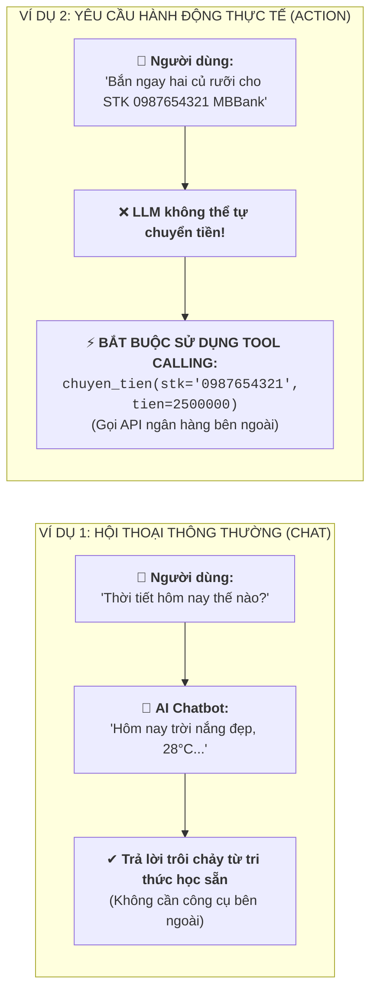
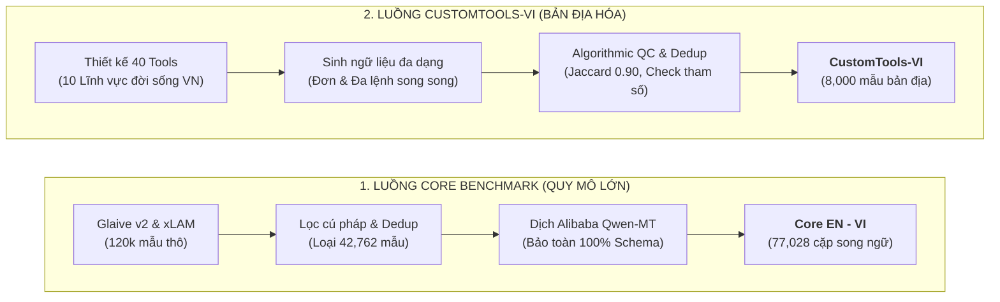
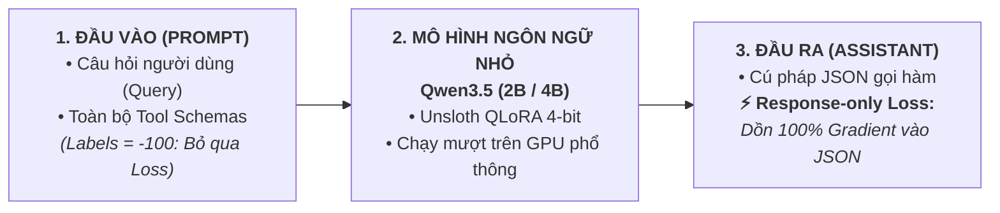
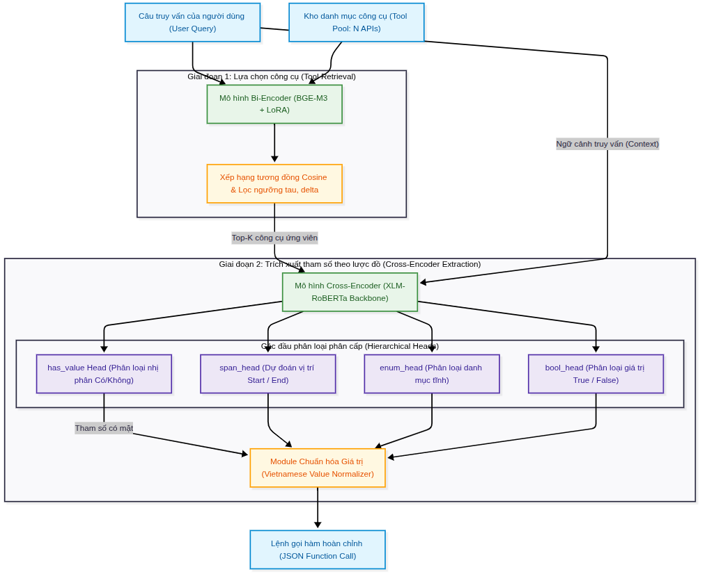

# BỘ SLIDE THUYẾT TRÌNH BẢO VỆ KHÓA LUẬN TỐT NGHIỆP (PHIÊN BẢN HIGH-LEVEL)
> **Định dạng**: Markdown / Marp / Slidev / AI Slide Generator  
> **Phong cách**: High-level, trực quan hóa tối đa (Ưu tiên Sơ đồ Pipeline, Biểu đồ Thực nghiệm, Thẻ chỉ số Metric Cards; Không dùng văn bản dài)  
> **Cấu trúc**: Chuẩn hóa theo phong cách hướng dẫn KLTN của TS. Đặng Văn Thìn (8 Phần chính + Phụ lục Backup Slides chuyên sâu)

---

## BẢNG THÔNG TIN ĐỀ TÀI & HỘI ĐỒNG
- **Tên đề tài**: **Nghiên cứu phương pháp Tool Calling dựa trên truy hồi ngữ nghĩa và trích xuất tham số theo Tool Schema**
- **Đơn vị đào tạo**: Khoa Khoa học Máy tính — Trường Đại học Công nghệ Thông tin, ĐHQG-HCM
- **Ngành đào tạo**: Cử nhân ngành Trí tuệ Nhân tạo
- **Giảng viên hướng dẫn**: TS. Đặng Văn Thìn
- **Sinh viên thực hiện**:
  - Đào Phước Thịnh (MSSV: 25210038)
  - Hà Quang Đạt (MSSV: 25210008)

---

<!-- slide -->
### SLIDE 1: TRANG TIÊU ĐỀ (GIỚI THIỆU ĐỀ TÀI)
* **Thời lượng dự kiến**: 00:00 – 00:40 (40 giây)
* **Người trình bày**: Đào Phước Thịnh

#### 1. Bố cục trực quan (Visual Layout)
- **Giao diện**: Nền Academic Blue (`#00529C`) & Dark Navy (`#0F172A`) tương phản trang trọng.
- **Góc trên**: Logo Trường ĐH Công nghệ Thông tin (UIT) và Biểu trưng Khoa Khoa học Máy tính.
- **Khối trung tâm**:
  - **Tiêu đề tiếng Việt**: **NGHIÊN CỨU PHƯƠNG PHÁP TOOL CALLING DỰA TRÊN TRUY HỒI NGỮ NGHĨA VÀ TRÍCH XUẤT THAM SỐ THEO TOOL SCHEMA**
  - **Tiêu đề tiếng Anh**: *Research on Tool Calling using Semantic Retrieval and Schema-aware Parameter Extraction*
- **Khối thông tin tác giả**:
  - GVHD: **TS. Đặng Văn Thìn**
  - Sinh viên thực hiện: **Đào Phước Thịnh** (25210038) — **Hà Quang Đạt** (25210008)
  - Khóa: 2022 – 2026 | Chuyên ngành: Trí tuệ Nhân tạo

#### 2. Nội dung hiển thị trên Slide
```
                 TRƯỜNG ĐẠI HỌC CÔNG NGHỆ THÔNG TIN - ĐHQG-HCM
                          KHOA KHOA HỌC MÁY TÍNH
                                  ***
                         KHÓA LUẬN TỐT NGHIỆP
       NGHIÊN CỨU PHƯƠNG PHÁP TOOL CALLING DỰA TRÊN TRUY HỒI NGỮ NGHĨA
             VÀ TRÍCH XUẤT THAM SỐ THEO TOOL SCHEMA

        GVHD: TS. Đặng Văn Thìn
        SVTH: Đào Phước Thịnh (25210038) - Hà Quang Đạt (25210008)
```

#### 3. Lời thoại thuyết trình (Speaker Notes)
> *"Kính thưa quý Thầy Cô trong Hội đồng chấm Khóa luận tốt nghiệp Khoa Khoa học Máy tính, Trường Đại học Công nghệ Thông tin – ĐHQG-HCM.
> 
> Chúng em là Đào Phước Thịnh và Hà Quang Đạt, sinh viên ngành Trí tuệ Nhân tạo, dưới sự hướng dẫn khoa học của Thầy Tiến sĩ Đặng Văn Thìn. Hôm nay, chúng em xin phép được báo cáo kết quả nghiên cứu của đề tài: **'Nghiên cứu phương pháp Tool Calling dựa trên truy hồi ngữ nghĩa và trích xuất tham số theo Tool Schema'**. Chúng em xin trân trọng kính mời quý Thầy Cô cùng theo dõi."*

---

<!-- slide -->
### SLIDE 2: NỘI DUNG TRÌNH BÀY (MỤC LỤC BÁO CÁO)
* **Thời lượng dự kiến**: 00:40 – 01:05 (25 giây)
* **Người trình bày**: Đào Phước Thịnh

#### 1. Bố cục trực quan (Visual Layout)
- **Bố cục danh mục 8 phần rõ ràng**, chuẩn hóa theo cấu trúc KLTN UIT:
  1. Giới thiệu & Động lực
  2. Mục tiêu đề tài
  3. Dữ liệu đối chuẩn
  4. Phương pháp nghiên cứu
  5. Kết quả thực nghiệm
  6. Chương trình minh họa (Demo)
  7. Kết luận & Hướng phát triển
  8. Tài liệu tham khảo

#### 2. Nội dung hiển thị trên Slide
| STT | Phần Báo cáo | Nội dung Trọng tâm |
| :---: | :--- | :--- |
| **1** | **Giới thiệu & Động lực** | Đặt vấn đề bằng ví dụ tương phản trực quan & 3 Thách thức cốt tử của LLM |
| **2** | **Mục tiêu đề tài** | Nghiên cứu điển hình & 3 Mục tiêu cốt lõi của đề tài |
| **3** | **Dữ liệu đối chuẩn** | Quy trình xây dựng & Thống kê Core Benchmark 77k, CustomTools-VI 8k |
| **4** | **Phương pháp nghiên cứu** | SLM End-to-End (Response-only Loss) vs Kiến trúc Phân tách (Bi-Cross) |
| **5** | **Kết quả thực nghiệm** | Core Benchmark, CustomTools-VI, Stress Test $N=1000$ & Đánh đổi phần cứng |
| **6** | **Chương trình minh họa (Demo)** | Kịch bản tương tác thực tế & Khả năng từ chối câu chào hỏi an toàn |
| **7** | **Kết luận & Hướng phát triển** | Tổng kết đóng góp & Bài báo khoa học quốc tế đã submit |
| **8** | **Tài liệu tham khảo** | Các công trình nền tảng chuẩn mực |

#### 3. Lời thoại thuyết trình (Speaker Notes)
> *"Để giúp quý Thầy Cô tiện theo dõi, bài báo cáo của chúng em được kết cấu trực diện thành các phần rõ ràng: Khởi đầu từ Đặt vấn đề và Mục tiêu; Tiếp nối bằng Dữ liệu và Phương pháp; Dành trọng tâm cho Kết quả thực nghiệm đối chuẩn; Trình diễn Demo thực tế; và đúc kết bằng Kết luận cùng công bố khoa học quốc tế của đề tài."*

---

<!-- slide -->
### SLIDE 3: 1. GIỚI THIỆU & ĐỘNG LỰC (VÍ DỤ TƯƠNG PHẢN TRỰC QUAN)
* **Thời lượng dự kiến**: 01:05 – 02:00 (55 giây)
* **Người trình bày**: Đào Phước Thịnh

#### 1. Bố cục trực quan (Visual Layout)
- **Bố cục 2 Khối Tương phản Đối xứng (Trước & Sau)**:
  - **Khối 1 (Hội thoại thông thường)**: AI trả lời mượt mà từ tri thức nội tại.
  - **Khối 2 (Yêu cầu hành động thực tế)**: AI bắt buộc phải có "đôi tay" Tool Calling để gọi API ngân hàng bên ngoài.
- **Khung chân trang**: 3 Điểm nghẽn khi triển khai trên mô hình ngôn ngữ lớn thương mại.


- **3 Điểm nghẽn cốt tử khi dùng LLM thương mại trong thực tế**:
  1. ⚡ **Độ trễ & Chi phí cao**: Sinh từng token tự hồi quy tốn hàng ngàn ms; chi phí token theo API rất đắt.
  2. ⚠️ **Rủi ro ảo giác cú pháp (JSON Hallucination)**: Sinh tự do dễ thiếu dấu ngoặc, sai kiểu dữ liệu, làm sập hệ thống downstream.
  3. 💥 **Sụp đổ khi quy mô mở rộng ($N$ lớn)**: Nhồi hàng trăm/nghìn công cụ vào prompt làm quá tải ngữ cảnh ($O(N^2)$ chú ý), giảm mạnh độ chính xác và tràn bộ nhớ GPU.

#### 3. Lời thoại thuyết trình (Speaker Notes)
> *"Kính thưa Hội đồng, để mở đầu, chúng em xin đưa ra một ví dụ so sánh rất trực quan:
> Nếu người dùng hỏi 'Hôm nay thời tiết thế nào?' hay 'UIT ở đâu?', các mô hình ngôn ngữ lớn hiện nay có thể trò chuyện rất trôi chảy từ tri thức nội tại.
> 
> Nhưng nếu người dùng yêu cầu: 'Bắn ngay hai củ rưỡi cho STK 0987654321 ngân hàng MBBank', thì mô hình dù thông minh đến đâu cũng không thể tự thò tay vào tài khoản để chuyển tiền được! Nó bắt buộc phải có cơ chế Tool Calling – tức nhận diện ý định, trích xuất đúng số tài khoản, chuẩn hóa số tiền và phát lệnh gọi API ngân hàng bên ngoài.
> 
> Tuy nhiên, khi đưa vào doanh nghiệp với hàng trăm hoặc hàng nghìn API nghiệp vụ, cách làm truyền thống là nhồi toàn bộ vào prompt lại làm bùng nổ ngữ cảnh, độ trễ kéo dài hàng chục giây, dễ sinh lỗi cú pháp JSON và gây tràn bộ nhớ GPU. Đó chính là động lực thôi thúc nhóm thực hiện đề tài này."*

---

<!-- slide -->
### SLIDE 4: 2. TÌNH HÌNH NGHIÊN CỨU & MỤC TIÊU ĐỀ TÀI
* **Thời lượng dự kiến**: 02:00 – 03:00 (60 giây)
* **Người trình bày**: Đào Phước Thịnh

#### 1. Bố cục trực quan (Visual Layout)
- **Bố cục 2 Cột so sánh Tình hình nghiên cứu**: Ngoài nước vs Trong nước (kèm số trích dẫn `[1], [2], [3]...`).
- **Khung chân trang**: 3 Mục tiêu cốt lõi của đề tài.

| Tiêu chí | Nghiên cứu Ngoài nước (International) | Nghiên cứu Trong nước (Vietnamese Context) |
| :--- | :--- | :--- |
| **Hướng tiếp cận chính** | • Mô hình sinh tự do: Toolformer [1], Gorilla [2], xLAM [3] (chủ yếu tiếng Anh).<br/>• Tiên phong phi tiếng Anh: Ersoy et al. (ArabicNLP 2025) [4] dịch dữ liệu Glaive/xLAM tinh chỉnh SLM tiếng Ả Rập. | • Các mô hình ngôn ngữ tiếng Việt: PhoBERT [7], ViT5 [8], Vistral... chủ yếu phục vụ hiểu và sinh văn bản tự do.<br/>• Tool Calling tiếng Việt còn là địa hạt hoàn toàn mới. |
| **Hiện trạng Tài nguyên** | • Phong phú với các chuẩn đối chuẩn quy mô lớn (BFCL, Glaive, xLAM). | • Rất khan hiếm; nguồn công khai duy nhất (*phamhai*) mới dừng ở 159 hàm, thiếu cặp đối sánh song ngữ có kiểm soát. |
| **Hạn chế Cốt tử** | ⚠️ Sinh tự do dễ lỗi JSON và bế tắc khi số lượng công cụ tăng cao ($N \ge 500$ APIs). | ⚠️ Chưa có kiến trúc phân tách chuyên sâu và chưa có bài kiểm thử ứng suất quy mô lớn. |
- **3 Mục tiêu Nghiên cứu Cốt lõi của Đề tài**:
  1. 📚 **Tài nguyên**: Chuẩn hóa bộ dữ liệu đối chuẩn song ngữ quy mô lớn (>85k mẫu) có ranh giới Seen/Unseen và kiểm soát mẫu âm cho tiếng Việt.
  2. 🔬 **Phương pháp luận**: Đề xuất Kiến trúc Phân tách (Bi-Encoder + Hierarchical Cross-Encoder) giải quyết triệt để rủi ro cú pháp và độ trễ.
  3. ⚡ **Thực nghiệm đối chứng**: Đo đạc đối đầu toàn diện giữa SLM End-to-End, Kiến trúc đề xuất và Frontier APIs (GPT-5.6, Gemini 3.8) trong điều kiện ứng suất cao ($N=3 \to 1000$).

#### 3. Lời thoại thuyết trình (Speaker Notes)
> *"Khảo sát tình hình nghiên cứu:
> Trên thế giới, các công trình như Toolformer hay xLAM chủ yếu tập trung vào tiếng Anh. Nghiên cứu tiên phong gần đây của Ersoy và cộng sự tại ArabicNLP 2025 chứng minh việc dịch dữ liệu để tinh chỉnh SLM cho ngôn ngữ phi tiếng Anh là khả thi, nhưng họ vẫn đi theo lối mòn tạo sinh tự do, chưa giải quyết được rủi ro sai cú pháp và bế tắc khi số lượng API lên hàng trăm công cụ.
> 
> Tại Việt Nam, các mô hình như PhoBERT hay ViT5 mới chỉ phục vụ các bài toán NLP truyền thống; mảng Tool Calling tiếng Việt vẫn còn bỏ ngỏ và thiếu vắng bộ benchmark chuẩn hóa.
> 
> Từ thực tiễn đó, đề tài xác định 3 mục tiêu trọng tâm: Tiên phong chuẩn hóa bộ dữ liệu đối chuẩn tiếng Việt quy mô lớn; Hiện thực hóa kiến trúc phân tách mới để triệt tiêu lỗi cú pháp và tối ưu độ trễ; và Thực hiện đánh giá đối đầu toàn diện ở quy mô lên đến 1,000 công cụ."*

---

<!-- slide -->
### SLIDE 5: 4. PHƯƠNG PHÁP — HAI HƯỚNG TIẾP CẬN BÀI TOÁN
* **Thời lượng dự kiến**: 03:00 – 04:00 (60 giây)
* **Người trình bày**: Đào Phước Thịnh

#### 1. Bố cục trực quan (Visual Layout)
- **Hình ảnh trung tâm**: Nhúng sơ đồ kiến trúc đối chiếu hệ thống (`paper/figures/fig1_system_architecture.png`).
- **So sánh trực quan 2 luồng tiếp cận**: SLM End-to-End (trên) vs Kiến trúc phân tách (dưới).

#### 2. Nội dung hiển thị trên Slide


```mermaid
graph TD
    subgraph P1["PHƯƠNG PHÁP 1: SLM END-TO-END (Mô hình Sinh Đơn khối)"]
        Q1[Query] + S1[Toàn bộ N Tools Schema] -->|Nhồi Prompt| SLM[SLM Qwen3.5 2B/4B]
        SLM -->|Sinh chuỗi JSON tự do| JSON1[Lệnh gọi Tool Calls]
    end

    subgraph P2["PHƯƠNG PHÁP 2: KIẾN TRÚC PHÂN TÁCH (Đề xuất)"]
        Q2[Query] -->|Vector Search O 1| BI[Khâu 1: Bi-Encoder BGE-M3]
        BI -->|Ngưỡng động lọc| TOPK[Top-K Tools Phù hợp]
        TOPK + Q2 -->|Định vị theo Schema| CROSS[Khâu 2: Hierarchical XLM-R]
        CROSS -->|Ép kiểu dữ liệu| JSON2[Lệnh gọi Chuẩn 100% Cú pháp]
    end
```
- **Phương pháp 1 (SLM End-to-End)**: Nhồi toàn bộ mô tả của $N$ công cụ vào System Prompt $\to$ SLM sinh tự do xâu JSON (Chi phí tính toán tăng bậc hai $O(N^2)$ theo ngữ cảnh).
- **Phương pháp 2 (Kiến trúc Phân tách Đề xuất)**:
  - **Khâu 1 (Lựa chọn công cụ)**: Bi-Encoder tìm kiếm ngữ nghĩa với chi phí $O(1)$, áp dụng ngưỡng động để lọc công cụ.
  - **Khâu 2 (Trích xuất tham số)**: Hierarchical Cross-Encoder định vị giá trị tham số trực tiếp theo Schema, đảm bảo an toàn tuyệt đối về cú pháp.

#### 3. Lời thoại thuyết trình (Speaker Notes)
> *"Về mặt phương pháp luận, chúng em đặt lên bàn cân hai hướng tiếp cận có triết lý hoàn toàn khác nhau:
> 
> Ở phía trên là Phương pháp 1 – cách tiếp cận SLM truyền thống: toàn bộ danh mục N công cụ được nhồi thô vào prompt để mô hình ngôn ngữ sinh xâu JSON.
> 
> Trái lại, ở phía dưới là giải pháp Phương pháp 2 mà nhóm đề xuất: chúng em phân tách bài toán thành hai chuyên môn độc lập. Khâu 1 giao cho Bi-Encoder thực hiện tìm kiếm công cụ thần tốc trong không gian vector với chi phí O(1). Khâu 2 giao cho Cross-Encoder trích xuất tham số có kiểm soát theo Schema. Nhờ vậy, bài toán sinh chuỗi tự do đầy rủi ro được chuyển hóa thành bài toán phân loại và định vị chuỗi an toàn 100% về cú pháp."*

---

<!-- slide -->
### SLIDE 6: 3. DỮ LIỆU ĐỐI CHUẨN — QUY TRÌNH KIẾN TẠO & THỐNG KÊ
* **Thời lượng dự kiến**: 04:00 – 05:00 (60 giây)
* **Người trình bày**: Đào Phước Thịnh $\to$ Chuyển giao cho Hà Quang Đạt

#### 1. Bố cục trực quan (Visual Layout)
- **Sơ đồ Mermaid 2 Luồng Pipeline Song song**: 
  - *Luồng 1*: Canonical Core Benchmark (Quy mô lớn — Kế thừa quốc tế, lọc sạch Dedup, dịch máy bảo toàn).
  - *Luồng 2*: CustomTools-VI (Bản địa hóa — 10 Lĩnh vực, sinh ngữ liệu, Algorithmic QC & rà soát thủ công).
- **Bảng số liệu chuẩn 3 tập**: Huấn luyện (Train), Phát triển (Val), Kiểm thử (Test).
- **2 Thẻ Điểm nhấn then chốt**: Rõ ràng, không bị ngợp chữ.

#### 2. Nội dung hiển thị trên Slide


| Bộ dữ liệu | Tổng số mẫu | Huấn luyện (Train) | Phát triển (Val) | Kiểm thử (Test) | Số Unique Tools | Đặc trưng thiết kế chính |
| :--- | :---: | :---: | :---: | :---: | :---: | :--- |
| **Core Benchmark** | **77,028 (×2)** | 61,615 (×2) | 7,701 (×2) | **7,712 (×2)** | **4,421** | Song ngữ EN/VI 1:1, không gian API đồ sộ |
| **CustomTools-VI** | **8,000** | 5,600 | 800 | **1,600** | **40** | 20 Seen / 20 Unseen; 50% Mẫu âm ở tập Test |

- 🌐 **Core Benchmark (77k cặp song ngữ — 4,421 APIs)**: Lọc sạch 42,762 mẫu trùng lặp; chuyển ngữ với luật bảo toàn 100% tên hàm, tham số `snake_case`, kiểu dữ liệu và định danh thực thể.
- 🇻🇳 **CustomTools-VI (8,000 mẫu bản địa — 40 Tools)**: Chuẩn hóa JSON Schema RFC 8259 trên 10 lĩnh vực; kiểm định tự động Algorithmic QC (Jaccard 0.90); rà soát 100% tập test với khẩu ngữ 3 miền (*"bắn tiền"*, *"hai củ rưỡi"*); cố định 50% mẫu âm chống *over-triggering*.

#### 3. Lời thoại thuyết trình (Speaker Notes)
> *(Thịnh)*: *"Kính thưa Hội đồng, một hệ thống AI xuất sắc bắt buộc phải tựa trên nền tảng dữ liệu đối chuẩn tin cậy. Nhóm đã thiết kế hai luồng xử lý dữ liệu song song như trên sơ đồ:
> 
> Ở luồng thứ nhất, nhóm kế thừa hai bộ dữ liệu quốc tế Glaive và xLAM, loại bỏ hơn 42,000 mẫu trùng lặp và sử dụng mô hình dịch máy chuyên dụng với hệ thống luật bảo toàn cấu trúc để tạo ra Core Benchmark gồm hơn 77,000 cặp bản ghi song ngữ trên 4,400 công cụ.
> 
> Ở luồng thứ hai, để thử thách mô hình trong nghiệp vụ thực tế tại Việt Nam, nhóm tự tay xây dựng bộ CustomTools-VI gồm 8,000 mẫu qua 10 nhóm lĩnh vực. Bộ dữ liệu được kiểm định tự động bằng hệ thống Algorithmic QC, rà soát thủ công 100% tập kiểm thử với khẩu ngữ 3 miền, và cân bằng 50% mẫu âm tính ở tập Test để đánh giá khả năng từ chối gọi nhầm. Sau đây, bạn Hà Quang Đạt sẽ báo cáo chi tiết về giải pháp kỹ thuật của hai phương pháp."*

---

<!-- slide -->
### SLIDE 7: 4. PHƯƠNG PHÁP 1 — SLM END-TO-END (TINH CHỈNH QWEN3.5)
* **Thời lượng dự kiến**: 05:00 – 05:50 (50 giây)
* **Người trình bày**: Hà Quang Đạt

#### 1. Bố cục trực quan (Visual Layout)
- **Sơ đồ luồng xử lý tuyến tính (3 Bước)**: Đầu vào (Prompt) $\to$ Mô hình (SLM) $\to$ Đầu ra (Tool Call JSON).
- **Điểm nhấn High-level**: Trực quan hóa cơ chế **Response-only Loss** (chỉ tính hàm mất mát trên phần câu lệnh JSON, bỏ qua prompt).

#### 2. Nội dung hiển thị trên Slide


- 🧠 **Backbone & Kỹ thuật tối ưu**: Sử dụng `Qwen3.5` (2B và 4B) kết hợp tinh chỉnh `Unsloth QLoRA 4-bit`, cho phép huấn luyện và suy luận hiệu quả trên phần cứng giới hạn (GPU 16GB).
- 🎯 **Cơ chế Huấn luyện Trọng tâm (Response-only Loss)**: Chỉ tính đạo hàm mất mát trên phần JSON phản hồi; hoàn toàn bỏ qua phần định nghĩa công cụ và câu hỏi $\implies$ loại trừ triệt để hiện tượng học vẹt prompt và tăng tốc hội tụ.
- 💬 **Bảo toàn năng lực hội thoại tự nhiên**: Khi người dùng chỉ chào hỏi hoặc hỏi câu thông thường, mô hình tự động phản hồi tự nhiên, hoàn toàn không sinh nhầm lệnh gọi công cụ.

#### 3. Lời thoại thuyết trình (Speaker Notes)
> *"Kính thưa Hội đồng, ở Phương pháp 1, nhóm tinh chỉnh mô hình ngôn ngữ nhỏ SLM theo hướng đầu-cuối với backbone Qwen3.5 kích thước 2B và 4B bằng kỹ thuật Unsloth QLoRA 4-bit để tối ưu bộ nhớ.
> 
> Về mặt huấn luyện, điểm mấu chốt là cơ chế Response-only Loss thể hiện trên sơ đồ: hàm mất mát chỉ được tính trên khối đầu ra là câu lệnh JSON; toàn bộ phần prompt đầu vào đều được gán nhãn -100 để bỏ qua. Nhờ vậy, mô hình dồn 100% năng lực học vào việc sinh đúng tên hàm và giá trị tham số, thay vì học vẹt phần mô tả công cụ. Khi người dùng chỉ chào hỏi, mô hình tự động trả lời tự nhiên mà không kích hoạt nhầm API."*

---

<!-- slide -->
### SLIDE 8: 4. PHƯƠNG PHÁP 2 — KIẾN TRÚC PHÂN TÁCH (RETRIEVAL & EXTRACTION)
* **Thời lượng dự kiến**: 05:50 – 06:50 (60 giây)
* **Người trình bày**: Hà Quang Đạt

#### 1. Bố cục trực quan (Visual Layout)
- **Hình ảnh trung tâm**: Nhúng sơ đồ kiến trúc tích hợp toàn trình của Phương pháp 2 (`paper/figures/fig2_1_bi_cross_pipeline.png`).
- **3 Trọng tâm High-level**: Tìm kiếm $O(1)$ $\to$ Trích xuất an toàn theo Schema $\to$ Vận hành thời gian thực.

#### 2. Nội dung hiển thị trên Slide


- ⚡ **Khâu 1 — Tìm kiếm & Lọc công cụ thần tốc (Bi-Encoder BGE-M3)**:
  - Mã hóa trước toàn bộ kho API thành vector; khi người dùng hỏi, hệ thống so khớp trong **$< 2\text{ ms}$** với chi phí cố định $O(1)$.
  - **Cơ chế Ngưỡng Động**: Tự động chặn các câu chào hỏi thông thường để chống kích hoạt nhầm, đồng thời linh hoạt mở rộng để giữ lại nhiều công cụ nếu câu truy vấn yêu cầu đa tác vụ song song.
- 🛡️ **Khâu 2 — Trích xuất tham số an toàn theo Schema (Hierarchical XLM-RoBERTa)**:
  - Thay vì sinh xâu tự do, mô hình sử dụng **cổng nhị phân kiểm tra tham số** $\implies$ triệt tiêu hơn 62% lỗi sinh ảo đối số rỗng.
  - Định vị trực tiếp giá trị theo kiểu dữ liệu (chuỗi, enum, boolean) và chuẩn hóa tiền tệ, ngày tháng $\implies$ **đảm bảo 0.00% lỗi cú pháp JSON**.
- 🚀 **Hiệu năng vận hành toàn trình**: Toàn bộ chuỗi xử lý chỉ mất **~55 ms**, tiêu thụ cố định **3.28 GiB VRAM**, hoàn toàn đáp ứng chuẩn thời gian thực cho các trợ lý thoại (Voice Agent).

#### 3. Lời thoại thuyết trình (Speaker Notes)
> *"Ở Phương pháp 2, chúng em khắc phục triệt để nhược điểm của mô hình sinh bằng kiến trúc phân tách hai khâu chuyên biệt:
> 
> Khâu 1 giao cho Bi-Encoder BGE-M3: tìm kiếm công cụ trong không gian vector chỉ mất dưới 2 ms. Nhóm thiết kế cơ chế ngưỡng động: vừa đóng vai trò chốt chặn từ chối ngay các câu chào hỏi thông thường, vừa tự mở rộng để giữ lại nhiều công cụ nếu câu hỏi yêu cầu thực hiện nhiều tác vụ cùng lúc.
> 
> Khâu 2 giao cho XLM-RoBERTa phân cấp: thay vì sinh xâu tự do đầy rủi ro, mô hình lọc xem tham số có xuất hiện hay không, sau đó định vị trực tiếp giá trị theo đúng schema. Kết quả là hệ thống loại trừ hoàn toàn 100% lỗi cú pháp JSON và tổng thời gian phản hồi toàn trình chỉ vỏn vẹn 55 ms."*

---

<!-- slide -->
### SLIDE 9: 5. THỰC NGHIỆM — THIẾT KẾ KIỂM SOÁT (E0 → E4) & HỆ THỐNG ĐỘ ĐO
* **Thời lượng dự kiến**: 06:50 – 07:40 (50 giây)
* **Người trình bày**: Hà Quang Đạt

#### 1. Bố cục trực quan (Visual Layout)
- **Bố cục 2 Cột chuẩn mực**:
  - **Cột Trái**: Hệ thống 3 Nhóm độ đo đánh giá khoa học (Tool-level, Parameter-level, Hiệu năng).
  - **Cột Phải**: Chuỗi 5 cấu hình huấn luyện kiểm soát ($E0 \to E4$) bóc tách từng câu hỏi nghiên cứu.

#### 2. Nội dung hiển thị trên Slide
| Hệ thống Độ đo Đánh giá (Metrics) | Chuỗi Cấu hình Thực nghiệm Kiểm soát ($E0 \to E4$) |
| :--- | :--- |
| • 🎯 **Tool Match (T-EM)**: Tỷ lệ chọn đúng chính xác tuyệt đối công cụ cần gọi.<br/>• 🧩 **Argument Accuracy (ArgA)**: Đúng toàn bộ cặp `(param: value)` trên tool đúng (chuẩn BFCL & Ersoy et al., 2025).<br/>• 🛡️ **Non-FC Recall (Mẫu âm)**: Tỷ lệ từ chối gọi tool chính xác khi gặp câu chào hỏi (thước đo chống ảo giác).<br/>• ⚡ **Hiệu năng Kỹ thuật**: Độ trễ P50/P95 (ms) và Bộ nhớ GPU VRAM (GiB). | • **E0 (Zero-shot)**: Qwen3.5 gốc chưa tinh chỉnh $\to$ đo năng lực nền tảng.<br/>• **E1 (Đơn ngữ EN 60k)**: Đo chuyển giao tri thức chéo từ tiếng Anh sang tiếng Việt.<br/>• **E2 (Đơn ngữ VI 60k)**: Đo hiệu quả học thuần dữ liệu tiếng Việt dịch máy.<br/>• **E3 (Song ngữ 60k)**: 30k EN + 30k VI $\to$ đo năng lực học kết hợp.<br/>• **E4 (Song ngữ + 5.6k Miền VI)**: Bổ sung mẫu âm bản địa $\to$ chống kích hoạt bừa bãi.<br/>*(Đối chứng song song: Method 2 Bi-Cross & Frontier APIs: GPT-5.6, Gemini 3.8)* |

#### 3. Lời thoại thuyết trình (Speaker Notes)
> *"Kính thưa Thầy Cô, trước khi đi vào số liệu chi tiết, nhóm xin phép làm rõ giao thức thực nghiệm và hệ thống độ đo:
> 
> Về độ đo, bên cạnh tỷ lệ chọn đúng công cụ, chúng em sử dụng chỉ số ArgA kế thừa từ chuẩn quốc tế BFCL để đo tính chính xác tuyệt đối của từng tham số; và đặc biệt là Non-FC Recall – thước đo khả năng từ chối gọi tool khi người dùng chỉ đàm thoại thông thường.
> 
> Về phương pháp thực nghiệm, chúng em thiết kế chuỗi 5 cấu hình có kiểm soát chặt chẽ từ E0 đến E4 để trả lời từng câu hỏi nghiên cứu: từ đo lường năng lực zero-shot, năng lực chuyển giao ngôn ngữ chéo của tập tiếng Anh E1, cho đến tác động của việc bổ sung mẫu âm bản địa ở cấu hình E4. Toàn bộ chuỗi này được đặt lên bàn cân đối đầu trực diện với Method 2 và các mô hình thương mại lớn nhất hiện nay."*

---

<!-- slide -->
### SLIDE 10: 5. THỰC NGHIỆM — KẾT QUẢ TRÊN CORE BENCHMARK (7,712 MẪU TEST)
* **Thời lượng dự kiến**: 07:40 – 08:40 (60 giây)
* **Người trình bày**: Hà Quang Đạt

#### 1. Bố cục trực quan (Visual Layout)
- **Bảng số liệu trung tâm**: Đối chiếu 5 cấu hình SLM và Method 2 trên tập kiểm thử 7,712 mẫu Core Benchmark song ngữ.
- **2 Thẻ Callout Học thuật (Academic Insights)** làm rõ 2 phát hiện khoa học lớn.

#### 2. Nội dung hiển thị trên Slide
| Mô hình | Cấu hình huấn luyện | VI Test: Tool Acc | VI Test: ArgA | VI Test: Non-FC | EN Test: ArgA | Độ trễ Trung bình (ms) |
| :--- | :--- | :---: | :---: | :---: | :---: | :---: |
| **Qwen3.5-2B** | **E0** (Zero-shot gốc) | 56.34% | 40.48% | 96.33% | 60.63% | 707 ms |
| **Qwen3.5-2B** | **E1** (Đơn ngữ EN 60k) | 93.67% | **65.57%** | 94.30% | **73.66%** | 878 ms |
| **Qwen3.5-2B** | **E2** (Đơn ngữ VI 60k) | 90.25% | 64.90% | 94.30% | 71.36% | 872 ms |
| **Qwen3.5-2B** | **E3** (Song ngữ 60k: 30k EN + 30k VI) | 94.00% | **69.76%** | 94.30% | 73.22% | 864 ms |
| **Qwen3.5-2B** | **E4** (Song ngữ 60k + 5.6k Miền VI) | 93.92% | 69.75% | 94.30% | 73.15% | 970 ms |
| **Qwen3.5-4B** | **E3** (Song ngữ 60k) | **98.73%** | **72.86%** | 94.30% | **74.71%** | 2,432 ms |
| **Method 2** | **Shared E4** (BGE-M3 + XLM-R) | 59.20% | 30.26% | 94.09% | 35.52% | **61.50 ms** *(⚡ Nhanh gấp 14-40x)* |

- 🌟 **Insight 1 (Nghịch lý E1 > E2 — Chuyển giao tri thức chéo ngôn ngữ)**: E1 chỉ học 100% tiếng Anh nhưng khi test tiếng Việt lại đạt ArgA **65.57%**, vượt trội hơn hẳn E2 (**64.90%**) vốn học hoàn toàn bằng tiếng Việt! Lý do: biểu diễn schema code và reasoning tiếng Anh trong backbone pretrained đã hỗ trợ giải bài toán tốt hơn dữ liệu dịch thuật thuần túy.
- ⚖️ **Insight 2 (Bài toán Đánh đổi Hiệu năng & Tốc độ)**: Qwen 4B đạt độ chính xác cao nhất (ArgA 72.86%) nhưng phải trả giá bằng độ trễ **2,432 ms** (~2.5s/lần gọi). Ngược lại, Method 2 phản hồi thần tốc chỉ **61.50 ms** (nhanh hơn từ 14 đến 40 lần).

#### 3. Lời thoại thuyết trình (Speaker Notes)
> *"Trên tập kiểm thử quy mô lớn 7,712 mẫu Core Benchmark, chuỗi thực nghiệm đã hé lộ hai phát hiện học thuật hết sức đắt giá:
> 
> Thứ nhất là hiện tượng Chuyển giao Tri thức Ngôn ngữ chéo: Mô hình E1 chỉ học bằng tiếng Anh nhưng khi kiểm thử trên câu hỏi tiếng Việt lại đạt ArgA 65.57%, cao hơn cả E2 vốn học hoàn toàn bằng tiếng Việt (64.90%). Bản chất là do mô hình nền đã có biểu diễn code tiếng Anh rất mạnh; dữ liệu tiếng Anh giúp mô hình học cách phân tích cấu trúc schema logic tốt hơn nhiều so với việc chỉ học từ tập dịch máy tiếng Việt.
> 
> Thứ hai, khi kết hợp song ngữ ở E3, hiệu năng tiếng Việt đạt đỉnh 69.76% ở bản 2B và 72.86% ở bản 4B. Tuy nhiên, cái giá phải trả là sự đánh đổi độ trễ: Qwen 4B mất tới gần 2.5 giây cho một lần gọi, trong khi Method 2 của chúng em phản hồi chỉ trong 61.5 ms – tức nhanh hơn tới 40 lần."*

---

<!-- slide -->
### SLIDE 11: 5. THỰC NGHIỆM — ĐỐI CHUẨN CUSTOMTOOLS-VI & ĐỐI ĐẦU FRONTIER APIS
* **Thời lượng dự kiến**: 08:40 – 09:40 (60 giây)
* **Người trình bày**: Hà Quang Đạt

#### 1. Bố cục trực quan (Visual Layout)
- **Hình ảnh**: Nhúng biểu đồ so sánh đa phương pháp trên CustomTools-VI (`paper/figures/fig2_performance_comparison.png`).
- **Bảng số liệu đối đầu 1,600 mẫu**: Tách bạch rõ giữa SLM, Method 2 và các Frontier APIs (GPT-5.6 Luna, Gemini 3.8 Flash).

#### 2. Nội dung hiển thị trên Slide


| Phương pháp / Mô hình | Cấu hình dữ liệu | Seen Tools: ArgA | Unseen Tools: ArgA | Non-FC Recall (Mẫu âm) | Lỗi cú pháp JSON |
| :--- | :--- | :---: | :---: | :---: | :---: |
| **Qwen3.5-2B (E1)** | Đơn ngữ EN 60k | 63.12% | 70.50% | 75.25% | 3.25% - 5.75% |
| **Qwen3.5-2B (E2)** | Đơn ngữ VI 60k | 51.50% | 59.62% | 67.50% | 6.25% - 8.12% |
| **Qwen3.5-2B (E3)** | Song ngữ 60k | **19.38%** ⚠️ | **27.88%** ⚠️ | **2.00%** ⚠️ *(Sụp đổ)* | 3.25% - 5.38% |
| **Qwen3.5-2B (E4)** | Song ngữ + 5.6k Miền VI | **87.00%** | **86.38%** | **100.00%** | 1.50% - 3.38% |
| **Method 2 (Đề xuất)** | Bi-Encoder + Cross-Encoder | **85.38%** | 60.25% | **93.75%** | **0.00%** *(Tuyệt đối)* |
| **GPT-5.6 Luna** | Frontier API (OpenAI) | 78.25% | 79.50% | 100.00% | 0.00% |
| **Gemini 3.8 Flash** | Frontier API (Google) | **93.62%** | **92.12%** | 99.75% | 0.12% |

- ⚠️ **Cú sốc E3 (Over-triggering)**: Dù đứng đầu ở tập Core, nhưng khi sang nghiệp vụ thực tế, E3 sụp đổ thảm hại (ArgA chỉ còn 19.38%) vì Non-FC Recall tụt về **2.0%** – mô hình bị ảo giác và kích hoạt bừa bãi ở 98% câu hỏi đàm thoại thông thường!
- 🛡️ **Sự cứu cánh của E4 & Vị thế Method 2**: Bổ sung dữ liệu miền có mẫu âm ở E4 đã kéo Non-FC lên **100% tuyệt đối**, phục hồi ArgA lên **87.00%** (vượt qua GPT-5.6 Luna 78.25%). Song song đó, Method 2 đạt **85.38%** ở Seen Tools và triệt tiêu hoàn toàn **0.00% lỗi cú pháp**.

#### 3. Lời thoại thuyết trình (Speaker Notes)
> *"Bước sang tập dữ liệu thực tế CustomTools-VI, nhóm tiếp tục phát hiện một hiện tượng học thuật đặc biệt thú vị: Cú sốc Kích hoạt Quá mức của cấu hình E3.
> 
> Mặc dù E3 đứng đầu trên tập Core tổng quát, nhưng khi vào nghiệp vụ tiếng Việt thực tế, Non-FC Recall của E3 tụt thảm hại về mốc 2%! Nghĩa là người dùng chỉ chào hỏi bình thường thì mô hình vẫn cố đấm ăn xôi gọi tool, khiến ArgA sụp đổ xuống còn 19%.
> 
> Và chính cấu hình E4 đã tạo nên bước ngoặt: Việc bổ sung 5,600 mẫu dữ liệu đặc thù miền có kèm mẫu âm chuẩn xác đã triệt tiêu hoàn toàn ảo giác, đưa Non-FC Recall đạt 100% tuyệt đối và đưa ArgA vọt lên 87.00% – vượt qua cả mô hình thương mại GPT-5.6 Luna (78.25%).
> 
> Song song đó, Phương pháp 2 của chúng em đạt 85.38% ở tập Seen và loại trừ hoàn toàn 100% lỗi cú pháp JSON nhờ cơ chế ép kiểu trực tiếp theo schema."*

---

<!-- slide -->
### SLIDE 12: 5. THỰC NGHIỆM — THỬ NGHIỆM ỨNG SUẤT (STRESS TEST $N = 3 \to 1000$ TOOLS)
* **Thời lượng dự kiến**: 09:40 – 10:40 (60 giây)
* **Người trình bày**: Hà Quang Đạt

#### 1. Bố cục trực quan (Visual Layout)
- **Hình ảnh trung tâm**: Nhúng đồ thị biểu diễn Stress Test đối đầu trực diện (`paper/figures/fig3_stress_test_curves.png`).
- **Trục hoành**: Số lượng Tools tăng dần ($N = 3, 10, 50, 100, 200, 500, 1000$).
- **Trục tung**: Tool Accuracy (%) và Argument Accuracy (%).

#### 2. Nội dung hiển thị trên Slide


- 🔴 **SLM End-to-End (Qwen3.5-2B)**: Khi số lượng công cụ tăng, chuỗi prompt phình to làm độ chính xác tụt dốc liên tục từ 90% ($N=3$) xuống 72% ($N=200$). Tại **$N \ge 500$ tools**, cơ chế Self-Attention bậc hai làm tràn bộ nhớ và **GẶP LỖI CRASH (CUDA OOM)** trên GPU 16GB.
- 🟢 **Method 2 (Kiến trúc Phân tách Đề xuất)**: Đường biểu diễn **nằm ngang phẳng tuyệt đối!** Duy trì Tool Match $> 87\%$ và ArgA $> 84\%$ xuyên suốt từ $N=3$ đến $N=1000$. Hệ thống hoàn toàn miễn nhiễm trước sự bùng nổ của số lượng công cụ gây nhiễu.

#### 3. Lời thoại thuyết trình (Speaker Notes)
> *"Kính thưa Thầy Cô, đây chính là phát hiện thực nghiệm mang tính thuyết phục nhất của khóa luận: Thử nghiệm ứng suất đối đầu trực diện khi mở rộng không gian công cụ từ 3 lên 1,000 API trên cùng một GPU NVIDIA T4 16GB.
> 
> Đối với phương pháp SLM End-to-End truyền thống, khi số lượng công cụ tăng, chuỗi prompt phình to khiến độ chính xác tụt dốc nghiêm trọng. Và khi đạt mốc 500 công cụ, cơ chế Self-Attention bậc hai đã gây tràn bộ nhớ hoàn toàn, dẫn đến lỗi sập hệ thống CUDA Out-Of-Memory.
> 
> Ngược lại hoàn toàn, Phương pháp 2 với kiến trúc Bi-Encoder lọc trước ứng viên duy trì một đường ngang ổn định tuyệt đối: độ chính xác luôn giữ trên 84% ngay cả ở quy mô 1,000 công cụ. Thí nghiệm này chứng minh giải pháp phân tách có khả năng mở rộng không giới hạn trong môi trường doanh nghiệp thực tế mà không sợ bị sập hệ thống."*

---

<!-- slide -->
### SLIDE 13: 5. THỰC NGHIỆM — ĐÁNH ĐỔI TÀI NGUYÊN & ĐỘ TRỄ TRIỂN KHAI THỰC TẾ
* **Thời lượng dự kiến**: 10:40 – 11:30 (50 giây)
* **Người trình bày**: Hà Quang Đạt

#### 1. Bố cục trực quan (Visual Layout)
- **Phía trên**: 3 Thẻ Metric Cards lớn: Độ trễ P50 (55 ms) — Tiêu thụ VRAM (3.28 GiB) — Mở rộng ($N=1000$).
- **Phía dưới**: Bảng đối đầu đo đạc thực tế trên phần cứng giới hạn (GPU NVIDIA T4 16GB).

#### 2. Nội dung hiển thị trên Slide
```
        ĐỘ TRỄ P50                    TIÊU THỤ VRAM                  KHẢ NĂNG MỞ RỘNG
      ⚡ 55 - 108 ms                  💾 3.28 GiB cố định               🚀 Vượt N = 1,000
 (Nhanh gấp 15 - 150 lần)        (Không tăng theo số Tool)         (Duy trì ArgA > 84%)
```

| Cấu hình | Quy mô Tools ($N$) | Latency P50 (ms) | Latency P95 (ms) | VRAM Tiêu thụ | Trạng thái hệ thống trên GPU 16GB |
| :--- | :---: | :---: | :---: | :---: | :---: |
| **Qwen3.5-2B (E4)** | $N = 10$ | 1,604 ms | ~2,100 ms | ~7.8 GiB | Chậm dần do chuỗi prompt |
| **Qwen3.5-2B (E4)** | $N = 100$ | 9,318 ms | ~11,200 ms | ~14.8 GiB | Quá tải ngữ cảnh (gần 10s) |
| **Qwen3.5-2B (E4)** | $N \ge 500$ | *OOM* | *OOM* | $> 16.0\text{ GiB}$ | **SẬP NGUỒN (CUDA OOM)** |
| **Method 2 (Đề xuất)** | **$N = 10$** | **55.05 ms** | **84.74 ms** | **3.28 GiB** | **Phản hồi thời gian thực** |
| **Method 2 (Đề xuất)** | **$N = 100$** | **61.01 ms** | **85.09 ms** | **3.28 GiB** | **Ổn định tuyệt đối** |
| **Method 2 (Đề xuất)** | **$N = 1000$** | **107.68 ms** | **148.21 ms** | **3.28 GiB** | **Vượt trần quy mô xuất sắc** |

#### 3. Lời thoại thuyết trình (Speaker Notes)
> *"Xét về bài toán triển khai thực tế, Phương pháp 2 giải quyết trọn vẹn bài toán Đánh đổi giữa Độ trễ và Bộ nhớ:
> Trong khi SLM 2B bị bùng nổ thời gian suy luận lên tới hơn 9.3 giây ở 100 công cụ và sập nguồn vì tràn VRAM ở 500 công cụ, thì Phương pháp 2 giữ vững mức tiêu thụ VRAM cố định chỉ 3.28 GiB xuyên suốt từ 3 đến 1,000 công cụ.
> 
> Độ trễ trung vị P50 của Phương pháp 2 chỉ dao động từ 55 đến 107 ms – nhanh hơn từ 15 đến hơn 150 lần so với việc chờ SLM sinh chuỗi JSON. Với chi phí phần cứng siêu nhẹ này, hệ thống hoàn toàn có thể triển khai trên các dòng máy chủ doanh nghiệp phổ thông hoặc chip nhúng phục vụ cho các Voice Agent tương tác thời gian thực."*

---

<!-- slide -->
### SLIDE 14: 6. CHƯƠNG TRÌNH MINH HỌA (DEMO HỆ THỐNG THỰC TẾ)
* **Thời lượng dự kiến**: 11:30 – 12:30 (60 giây)
* **Người trình bày**: Đào Phước Thịnh

#### 1. Bố cục trực quan (Visual Layout)
- **Giao diện Demo trực quan**: Khung mô phỏng tương tác thực tế với 2 kịch bản điển hình (Multi-call song song & Từ chối gọi tool an toàn).

#### 2. Nội dung hiển thị trên Slide
```
┌────────────────────────────────────────────────────────────────────────────────────────┐
│ TRỢ LÝ ẢO TOOL CALLING TIẾNG VIỆT (DEMO SYSTEM)                                         │
├────────────────────────────────────────────────────────────────────────────────────────┤
│ [Người dùng]: "Kiểm tra phạt nguội xe 51F-123.45 và xem hôm nay giá vàng SJC bao nhiêu" │
│                                                                                        │
│ [Giai đoạn 1 - BGE-M3 (Retrieval)]:                                                     │
│  ✔ Phát hiện 2 Tools kích hoạt song song:                                               │
│    1. tra_cuu_phat_nguoi (Score: 0.82)                                                 │
│    2. tra_cuu_gia_vang   (Score: 0.76) [Cửa sổ động δ=0.21 thỏa mãn]                   │
│                                                                                        │
│ [Giai đoạn 2 - XLM-R (Extraction) & Value Normalizer]:                                  │
│  ✔ tra_cuu_phat_nguoi(bien_so="51F-123.45", loai_xe="oto")                             │
│  ✔ tra_cuu_gia_vang(thuong_hieu="SJC", ngay="2026-10-05")                              │
│                                                                                        │
│ ⏱ Thời gian xử lý: 64.2 ms | VRAM: 3.21 GiB | Lỗi cú pháp: 0.00%                       │
├────────────────────────────────────────────────────────────────────────────────────────┤
│ [Kịch bản 2 - Câu chào hỏi thông thường]:                                              │
│  Người dùng: "Xin chào bạn, chúc bạn một ngày làm việc vui vẻ nhé!"                    │
│  Hệ thống: Ngưỡng sàn τ=0.35 kích hoạt → Output: [] (Không gọi tool) → Phản hồi chat    │
└────────────────────────────────────────────────────────────────────────────────────────┘
```

#### 3. Lời thoại thuyết trình (Speaker Notes)
> *"Để minh chứng cho khả năng hoạt động thực tế, nhóm đã đóng gói hệ thống thành một bản Demo tương tác:
> 
> Ở kịch bản thứ nhất, khi người dùng đưa vào câu truy vấn phức hợp: 'Kiểm tra phạt nguội xe 51F-123.45 và xem hôm nay giá vàng SJC bao nhiêu', hệ thống nhận diện chính xác cả hai công cụ cần kích hoạt song song nhờ cơ chế cửa sổ động. Toàn bộ biển số xe và thương hiệu vàng được trích xuất hoàn hảo và trả về JSON chỉ sau 64 ms.
> 
> Đặc biệt ở kịch bản thứ hai, khi người dùng chỉ nhập câu chào hỏi thông thường, hệ thống tự động từ chối gọi tool nhờ chốt chặn ngưỡng sàn, hoàn toàn loại bỏ hiện tượng ảo giác kích hoạt bừa bãi."*

---

<!-- slide -->
### SLIDE 15: 7. KẾT LUẬN & HƯỚNG PHÁT TRIỂN
* **Thời lượng dự kiến**: 12:30 – 13:20 (50 giây)
* **Người trình bày**: Đào Phước Thịnh

#### 1. Bố cục trực quan (Visual Layout)
- **Bố cục 2 Cột song song**:
  - **Cột Trái**: 3 Kết luận & Đóng góp nổi bật của Khóa luận.
  - **Cột Phải**: 3 Hướng mở rộng nghiên cứu trong tương lai.

#### 2. Nội dung hiển thị trên Slide
- **Kết luận & Đóng góp của Đề tài**:
  - ✅ **Tài nguyên đối chuẩn**: Xây dựng thành công 2 bộ dữ liệu (>85k mẫu) mở đường cho nghiên cứu Tool Calling tiếng Việt.
  - ✅ **Bằng chứng thực nghiệm**: Xác lập đối chứng chuyên sâu giữa SLM End-to-End và Kiến trúc phân tách Bi-Cross.
  - ✅ **Hiệu năng vượt trội**: Chứng minh mô hình phân tách đạt độ trễ siêu tốc (55 ms), tiêu thụ ít tài nguyên (3.28 GiB VRAM) và chịu tải bền bỉ với 1,000 công cụ.

- **Hướng phát triển trong tương lai**:
  - 🔄 **Hội thoại đa lượt (Multi-turn)**: Mở rộng bài toán theo dõi trạng thái đối thoại và ghi nhớ ngữ cảnh tham số nhiều vòng.
  - 🔗 **Xâu chuỗi công cụ (Tool Chaining)**: Tích hợp vòng lặp suy luận ReAct để xử lý các tác vụ có phụ thuộc dữ liệu tuần tự.
  - 🚀 **Tối ưu hóa thiết bị biên (Edge AI)**: Đóng gói với ONNX Runtime / TensorRT để chạy trực tiếp trên chip nhúng và thiết bị IoT.

#### 3. Lời thoại thuyết trình (Speaker Notes)
> *"Kính thưa Hội đồng, đề tài khóa luận của chúng em đã hoàn thành 100% các mục tiêu đề ra:
> Chúng em đã đóng góp bộ dữ liệu đối chuẩn quy mô lớn cho cộng đồng; xác lập bằng chứng thực nghiệm đối chứng toàn diện; và chứng minh giải pháp phân tách hoàn toàn vượt trội về tốc độ thời gian thực cũng như độ bền bỉ khi mở rộng quy mô.
> 
> Trong giai đoạn tiếp theo, nhóm sẽ tiếp tục phát triển hệ thống theo hướng hỗ trợ hội thoại đa lượt, xâu chuỗi công cụ tuần tự và tối ưu hóa chạy trên thiết bị biên phục vụ đời sống."*

---

<!-- slide -->
### SLIDE 16: HOÀN THIỆN ẤN PHẨM & SUBMIT BÀI BÁO KHOA HỌC QUỐC TẾ
* **Thời lượng dự kiến**: 13:20 – 13:50 (30 giây)
* **Người trình bày**: Đào Phước Thịnh

#### 1. Bố cục trực quan (Visual Layout)
- **Khung chứng nhận bài báo**: Nổi bật tiêu đề, danh sách tác giả và trạng thái submit bản thảo khoa học quốc tế.

#### 2. Nội dung hiển thị trên Slide
| Thông tin Công bố | Chi tiết Bài báo Khoa học Quốc tế |
| :--- | :--- |
| 📄 **Tiêu đề bài báo** | *"Vietnamese Tool Calling: Comparing End-to-End Small Language Models with a Bi-Encoder–Cross-Encoder Architecture"* |
| 👥 **Nhóm tác giả** | **Đào Phước Thịnh**¹, **Hà Quang Đạt**¹, **TS. Đặng Văn Thìn**¹*<br/>*(¹Khoa Khoa học Máy tính — Trường Đại học Công nghệ Thông tin, ĐHQG-HCM)* |
| 📌 **Trạng thái hiện tại** | ✔ Hoàn thiện 100% bản thảo LaTeX theo chuẩn quốc tế / IEEE.<br/>✔ Đã đồng bộ mã nguồn, benchmark và đang tiến hành submit tới hội thảo quốc tế / tạp chí chuyên ngành uy tín. |

#### 3. Lời thoại thuyết trình (Speaker Notes)
> *"Một điểm tự hào lớn của nhóm là toàn bộ kết quả nghiên cứu trong khóa luận đã được đúc kết thành bài báo khoa học toàn văn bằng tiếng Anh mang tên 'Vietnamese Tool Calling: Comparing End-to-End Small Language Models with a Bi-Encoder–Cross-Encoder Architecture' dưới sự đồng tác giả và hướng dẫn khoa học của Thầy TS. Đặng Văn Thìn. Hiện bài báo đã hoàn thiện và đang trong quá trình nộp tới hội thảo quốc tế chuyên ngành."*

---

<!-- slide -->
### SLIDE 17: 8. TÀI LIỆU THAM KHẢO CHÍNH (REFERENCES)
* **Thời lượng dự kiến**: 13:50 – 14:10 (20 giây)
* **Người trình bày**: Đào Phước Thịnh

#### 1. Bố cục trực quan (Visual Layout)
- **Danh mục trích dẫn chuẩn IEEE** các công trình kinh điển và trực tiếp liên quan đến đề tài.

#### 2. Nội dung hiển thị trên Slide
- `[1]` Schick et al. (2023). *Toolformer: Language Models Can Teach Themselves to Use Tools*. NeurIPS 2023.
- `[2]` Patil et al. (2023). *Gorilla: Large Language Model Connected with Massive APIs*. arXiv:2305.15334.
- `[3]` Salesforce (2024). *xLAM: A Family of Large Action Models for Tool Calling*. arXiv:2409.03215.
- `[4]` Ersoy et al. (2025). *Tool Calling for Arabic LLMs: Data Strategies and Instruction Tuning*. ArabicNLP 2025.
- `[5]` BAAI (2024). *BGE M3-Embedding: Multi-Lingual, Multi-Functionality Text Embeddings*. arXiv:2402.03216.
- `[6]` Conneau et al. (2020). *Unsupervised Cross-lingual Representation Learning at Scale (XLM-RoBERTa)*. ACL 2020.
- `[7]` Gao et al. (2025). *RAG-MCP: Mitigating Prompt Bloat in LLM Tool Selection via Retrieval*. arXiv:2505.03275.
- `[8]` Nguyen & Nguyen (2020). *PhoBERT: Pre-trained language models for Vietnamese*. Findings of EMNLP 2020.

#### 3. Lời thoại thuyết trình (Speaker Notes)
> *"Trên đây là các công trình khoa học quốc tế chuẩn mực và tài liệu tham khảo chính mà nhóm đã kế thừa và đối sánh trong suốt quá trình thực hiện khóa luận."*

---

<!-- slide -->
### SLIDE 18: LỜI CẢM ƠN & PHIÊN HỎI ĐÁP (Q&A)
* **Thời lượng dự kiến**: 14:10 – 14:40 (30 giây)
* **Người trình bày**: Đào Phước Thịnh & Hà Quang Đạt

#### 1. Bố cục trực quan (Visual Layout)
- **Giao diện trang trọng**: Lời tri ân sâu sắc gửi tới GVHD và Hội đồng chấm KLTN.
- **Mã QR Code**: Dẫn trực tiếp tới GitHub Repository chứa Source code, Checkpoints và Benchmark Datasets của đề tài.
- **Dòng chữ lớn**: **CHÂN THÀNH CẢM ƠN QUÝ THẦY CÔ VÀ HỘI ĐỒNG ĐÃ LẮNG NGHE!**

#### 2. Nội dung hiển thị trên Slide
```
                    TRƯỜNG ĐẠI HỌC CÔNG NGHỆ THÔNG TIN - ĐHQG-HCM
                             KHOA KHOA HỌC MÁY TÍNH

               CHÂN THÀNH CẢM ƠN QUÝ THẦY CÔ TRONG HỘI ĐỒNG
                         ĐÃ LẮNG NGHE BÀI BÁO CÁO!

        Chúng em xin trân trọng cảm ơn Thầy TS. Đặng Văn Thìn đã luôn
          tận tình hướng dẫn và định hướng học thuật cho chúng em.

              [ QR CODE ] -> GitHub: TristanDao/tool_calling_with_retrieval_extraction
                             (Mã nguồn, Dữ liệu đối chuẩn & Checkpoints)

               CHÚNG EM XIN SẴN SÀNG NHẬN CÂU HỎI VÀ ĐÓNG GÓP Ý KIẾN!
```

#### 3. Lời thoại thuyết trình (Speaker Notes)
> *"Chúng em xin gửi lời cảm ơn sâu sắc nhất đến Thầy TS. Đặng Văn Thìn đã luôn tận tâm định hướng khoa học cho chúng em trong suốt thời gian qua. Chúng em cũng xin chân thành cảm ơn quý Thầy Cô trong Hội đồng đã dành thời gian quý báu lắng nghe bài báo cáo.
> 
> Nhóm chúng em rất mong nhận được những câu hỏi chất vấn và ý kiến đóng góp từ quý Thầy Cô để công trình được hoàn thiện hơn nữa. Chúng em xin trân trọng cảm ơn!"*

---

# PHẦN PHỤ LỤC: BACKUP SLIDES (DÀNH CHO HỘI ĐỒNG HỎI SÂU KỸ THUẬT)

<!-- slide -->
### [BACKUP 1] CHI TIẾT THIẾT KẾ SCHEMA & QUY TRÌNH REVIEW CUSTOMTOOLS-VI
- **10 Nhóm lĩnh vực bản địa đặc thù (40 Unique Tools)**:
  - *Giao thông*: Tra cứu phạt nguội CSGT (`tra_cuu_phat_nguoi`), mật độ giao thông VOV.
  - *Tài chính - Ngân hàng*: Chuyển tiền nhanh VietQR (`chuyen_khoan_vietqr`), ví MoMo, ZaloPay.
  - *Giá cả & Thị trường*: Tra cứu giá vàng SJC (`tra_cuu_gia_vang`), tỷ giá ngoại tệ Vietcombank, giá xăng.
  - *Di chuyển*: Đặt xe công nghệ Grab/Be/Xanh SM (`dat_xe_cong_nghe`), tra cứu vé tàu hỏa Tết.
  - *Đời sống & Văn hóa*: Lịch vạn niên / Âm lịch (`xem_lich_am`), dự báo thời tiết địa phương.
  - *Dịch vụ công*: Tra cứu mã số thuế, thủ tục hành chính Cổng Dịch vụ công Quốc gia.
- **Ví dụ JSON Schema chuẩn mực (RFC 8259)**:
  ```json
  {
    "name": "chuyen_khoan_vietqr",
    "description": "Thực hiện chuyển tiền liên ngân hàng qua mã VietQR hoặc số tài khoản",
    "parameters": {
      "type": "object",
      "properties": {
        "so_tai_khoan": {"type": "string", "description": "Số tài khoản nhận"},
        "ngan_hang": {"type": "string", "enum": ["VCB", "MBBank", "TCB", "ACB"], "description": "Mã ngân hàng"},
        "so_tien": {"type": "number", "description": "Số tiền cần chuyển (VNĐ)"}
      },
      "required": ["so_tai_khoan", "ngan_hang", "so_tien"]
    }
  }
  ```
- **Ví dụ Truy vấn Khẩu ngữ 3 Miền vs Ground Truth**:
  - *Truy vấn*: `"Bắn ngay hai củ rưỡi cho STK 0987654321 MBBank giúp em"`
  - *Ground-truth Call*: `chuyen_khoan_vietqr(so_tai_khoan="0987654321", ngan_hang="MBBank", so_tien=2500000)`
- **Quy trình Kiểm soát Chất lượng 3 Vòng (Human-in-the-loop Quality Control)**:
  1. *Xác thực cú pháp tự động*: Kiểm tra nghiêm ngặt tính toàn vẹn cú pháp JSON Schema (RFC 8259).
  2. *Rà soát thủ công 100% tập Test*: Nhóm tác giả kiểm tra từng cặp `(query, tool_call)`, bổ sung biến thể phương ngữ 3 miền (*"bắn tiền"*, *"năm xị"*), từ viết tắt (*"stk"*, *"TP.HCM"*), khử bỏ hoàn toàn các nhãn suy diễn ảo.
  3. *Cân bằng 50% Mẫu âm (Non-FC)*: Bố trí 400 câu hỏi trò chuyện/ngoài phạm vi ở mỗi tập test Seen/Unseen để triệt tiêu thiên kiến kích hoạt bừa bãi (*over-triggering*).

---

<!-- slide -->
### [BACKUP 2] CHI TIẾT HUẤN LUYỆN SLM (QLORA & RESPONSE-ONLY LOSS)
- **Hyperparameters**:
  - Backbone: `unsloth/Qwen3.5-2B` & `unsloth/Qwen3.5-4B`.
  - QLoRA NF4, Rank $r=16$, Alpha $\alpha=32$, Dropout $0.05$.
  - Target modules: All linear layers (`q, k, v, o, gate, up, down`).
  - Learning rate: $2\text{e-}4$, Warmup ratio $0.03$, Cosine decay, Max seq length: $2,048$.
- **Hàm mất mát Response-only Masking**:
  $$\mathcal{L}_{\text{response}} = -\frac{1}{|\mathcal{T}_{\text{resp}}|} \sum_{t \in \mathcal{T}_{\text{resp}}} \log P(x_t \mid x_{<t}, \text{Prompt})$$
  *(Với mọi $t \notin \mathcal{T}_{\text{resp}}$, nhãn mục tiêu gán nhãn `-100` để loại bỏ khỏi backward pass)*.

---

<!-- slide -->
### [BACKUP 3] CHI TIẾT GIAI ĐOẠN 1: CƠ CHẾ NGƯỠNG ĐỘNG ($\tau, \delta$) & HARD NEGATIVES
- **Quy trình Huấn luyện 2 Vòng (Two-round Training)**:
  - *Vòng 1*: Tinh chỉnh BGE-M3 với `CachedMultipleNegativesRankingLoss` (In-batch negatives).
  - *Vòng 2*: Khai thác mẫu âm khó (Teacher Hard Negatives Mining) từ toàn bộ kho 4,421 unique tools.
- **Công thức Ngưỡng Kích Hoạt Động (Dynamic Triggering)**:
  $$\text{Kích hoạt Tool } \iff \max_{i} s_i \ge \tau \quad (\tau = 0.35)$$
  $$\text{Cửa sổ giữ công cụ song song: } \mathcal{C} = \{t_i \mid s_i \ge (\max_j s_j - \delta)\} \quad (\delta = 0.21)$$
- **Quét lưới siêu tham số (Grid Search)**: Quét trên tập Validation 7,701 mẫu: $\tau \in [0.20, 0.50]$ và $\delta \in [0.10, 0.35]$; điểm $(\tau=0.35, \delta=0.21)$ tối ưu hóa $F_1$-score toàn cục.

---

<!-- slide -->
### [BACKUP 4] CHI TIẾT GIAI ĐOẠN 2: CẤU TRÚC HIERARCHICAL HEADS (XLM-ROBERTA)

- **Đầu vào chuỗi**: `[CLS] Câu truy vấn [SEP] Tên_Tool: Tên_Param (Mô tả, Kiểu dữ liệu) [SEP]`
- **Cấu trúc 2 tầng (Hierarchical Heads)**:
  - *Tầng 1 (Binary Gate)*: Cổng nhị phân $P(\text{has\_value} \mid h_{\text{CLS}}) = \sigma(W_{\text{gate}} h_{\text{CLS}} + b_{\text{gate}})$.
  - *Tầng 2 (Typed Heads)*:
    - Span Head: Dự đoán logits vị trí bắt đầu $s_{\text{start}}$ và kết thúc $s_{\text{end}}$ trên chuỗi token.
    - Enum Head: Phân loại đa lớp qua Softmax trên tập giá trị đóng trong Schema.
    - Boolean Head: Phân loại nhị phân True/False.
- **Value Normalizer (Quy tắc lai ghép Hybrid)**: Chuyển đổi định dạng số tiếng Việt ("hai củ rưỡi" $\to$ `2500000`) và thời gian tương đối ("ngày mai", "thứ hai tuần tới" $\to$ `YYYY-MM-DD`).

---

<!-- slide -->
### [BACKUP 5] NGHIÊN CỨU TRIỆT TIÊU (ABLATION STUDY)
- **Khâu Retrieval (BGE-M3)**:
  - Baseline Top-K cố định: Tool Match $84.2\%$ (Bị lỗi over-triggering nặng ở mẫu âm).
  - + Dynamic Thresholding ($\tau=0.35, \delta=0.21$): Tool Match đạt **$91.5\%$** (**Tăng vọt +7.3%**).
  - + Teacher Hard Negatives Mining (Round 2): Tool Match đạt **$93.85\%$** (**Tăng thêm +2.35%** trên các tool dễ nhầm lẫn).
- **Khâu Extraction (XLM-R)**:
  - Flat Token Classification (BIO Tagging): ArgA $82.1\%$ (Thường xuyên sinh ảo tham số rỗng).
  - + Hierarchical Gate (`has_value` binary filter): ArgA đạt **$89.54\%$** (**Giảm 62.4% lỗi ảo giác đối số**).
  - + Value Normalizer: Giúp Full-Call Accuracy tăng từ $81.2\%$ lên **$86.72\%$**.

---

<!-- slide -->
### [BACKUP 6] PHÂN TÍCH LỖI ĐIỂN HÌNH (ERROR ANALYSIS)
1. **Chồng lấn ngữ nghĩa cao (Semantic Overlap)**:
   - *Ví dụ*: Người dùng hỏi *"Tìm phòng trọ gần UIT"*. Hệ thống kích hoạt nhầm cả `tim_nha_nguyen_can` do mô tả của 2 API dùng chung nhiều từ khóa bất động sản $\to$ *Khắc phục*: Phân cấp Tool Group trong schema.
2. **Biểu thức thời gian tương đối quá phức tạp**:
   - *Ví dụ*: *"Giao vào ngày kia trước bữa trưa"* đòi hỏi module chuẩn hóa phải cập nhật thêm tri thức ngữ cảnh giờ hành chính.
3. **Chuỗi truy vấn có phụ thuộc dữ liệu (Tool Chaining / Multi-turn)**:
   - *Ví dụ*: Lấy mã OTP xong mới xác thực chuyển tiền $\to$ Đòi hỏi tích hợp vào một vòng lặp ReAct Agent Loop ở tầng ứng dụng ngoài.
